# Flow Diagrams: Account Code Mapping

## Module Information
- **Module**: Finance
- **Sub-Module**: Account Code Mapping
- **Version**: 2.0.0
- **Last Updated**: 2026-01-17
- **Status**: Active

## Document History
| Version | Date | Author | Changes |
|---------|------|--------|---------|
| 2.0.0 | 2026-01-17 | Documentation Team | Updated to reflect actual implementation |
| 1.1.0 | 2025-12-10 | Documentation Team | Standardized reference number format |
| 1.0.0 | 2025-11-12 | Documentation Team | Initial version |

---

## Overview

This document provides visual representations of the Account Code Mapping module workflows using Mermaid 8.8.2 compatible diagrams. The diagrams reflect the actual implementation which uses local state management for CRUD operations on AP and GL mapping records.

**Related Documents**:
- [Business Requirements](./BR-account-code-mapping.md)
- [Use Cases](./UC-account-code-mapping.md)
- [Technical Specification](./TS-account-code-mapping.md)
- [Data Dictionary](./DD-account-code-mapping.md)
- [Validations](./VAL-account-code-mapping.md)

---

## 1. Component Architecture

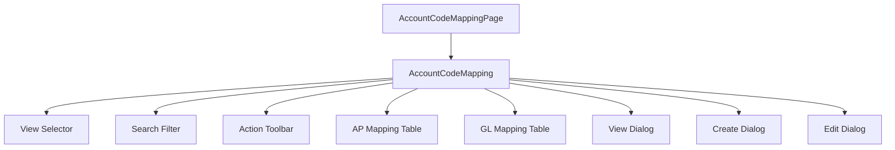

---

## 2. View Selection Flow

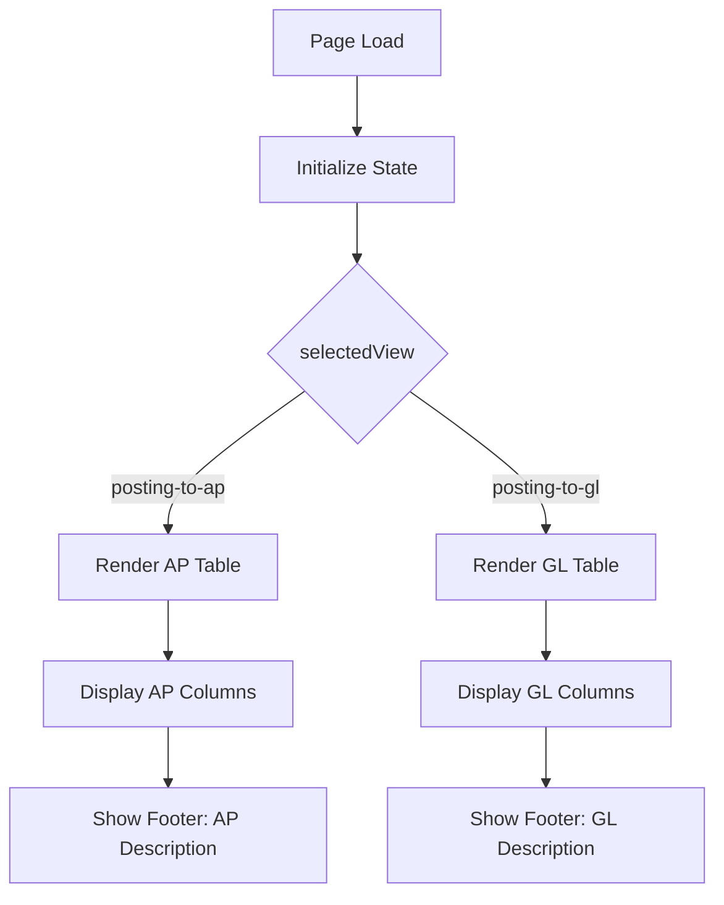

---

## 3. Search Filter Flow

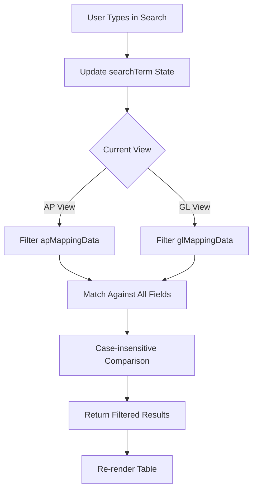

---

## 4. Create Mapping Flow

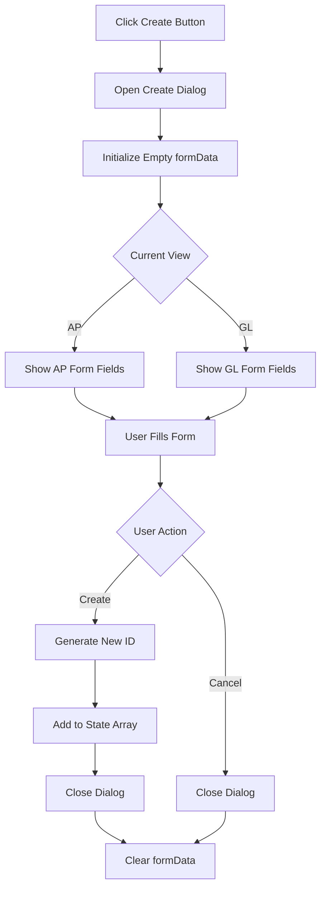

---

## 5. View Mapping Flow

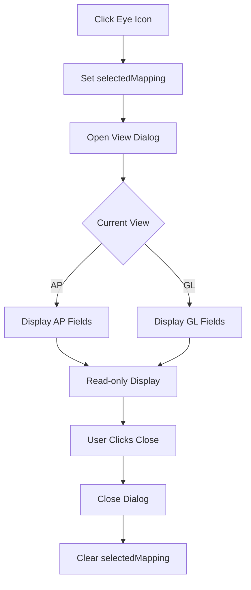

---

## 6. Edit Mapping Flow

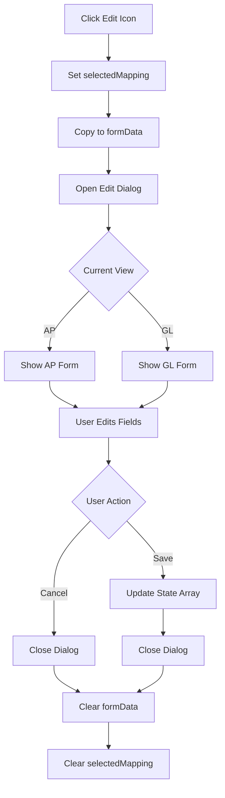

---

## 7. Delete Mapping Flow

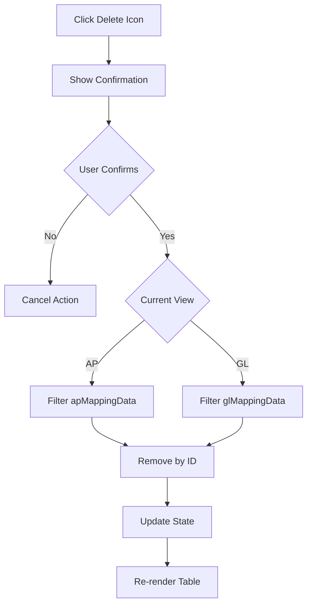

---

## 8. Duplicate Mapping Flow

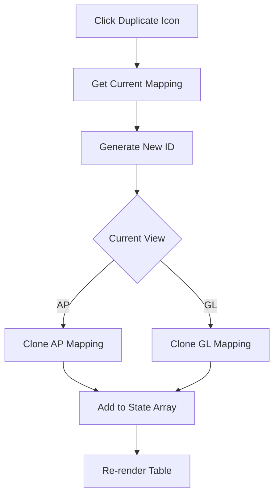

---

## 9. Action Toolbar Flow

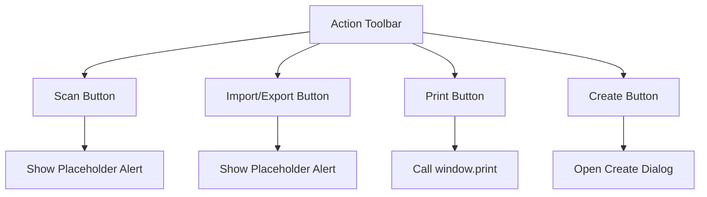

---

## 10. State Management Flow

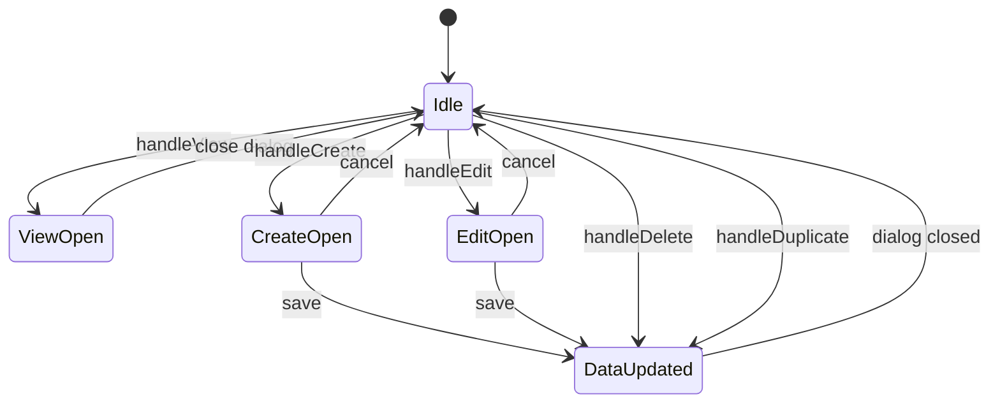

---

## 11. Dialog State Cleanup

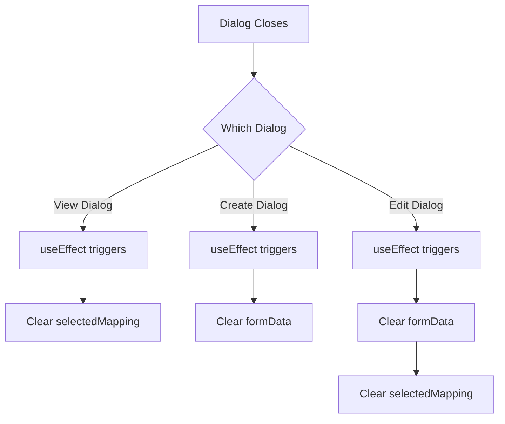

---

## 12. AP vs GL Table Comparison

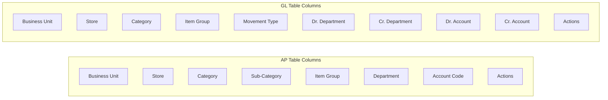

---

## 13. Data Flow Overview

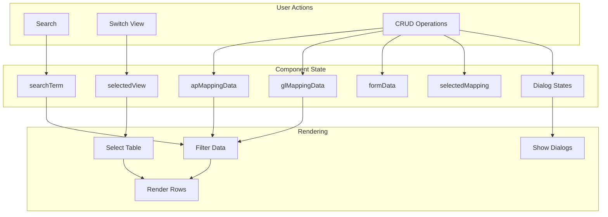

---

## 14. Page Layout Structure

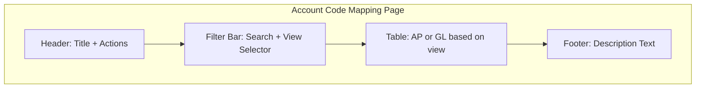

---

## 15. Row Actions Menu Flow

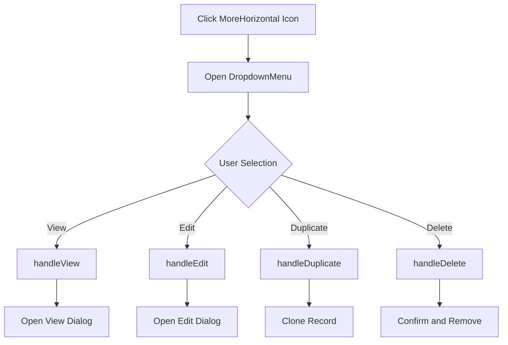

---

## Related Documents

- [Business Requirements](./BR-account-code-mapping.md)
- [Use Cases](./UC-account-code-mapping.md)
- [Technical Specification](./TS-account-code-mapping.md)
- [Data Dictionary](./DD-account-code-mapping.md)
- [Validations](./VAL-account-code-mapping.md)

---

**Document End**
