# Flow Diagrams: Currency Management

## Module Information
- **Module**: Finance
- **Sub-Module**: Currency Management
- **Version**: 2.0.0
- **Last Updated**: 2026-01-17
- **Owner**: Finance Team
- **Status**: Active

## Document History

| Version | Date | Author | Changes |
|---------|------|--------|---------|
| 2.0.0 | 2026-01-17 | Documentation Team | Updated to reflect actual implementation |
| 1.1.0 | 2025-12-10 | Documentation Team | Standardized reference number format |
| 1.0.0 | 2025-11-12 | Documentation Team | Initial version |

---

## Overview

This document provides visual representations of the Currency Management module's workflows. The current implementation covers basic CRUD operations for currency master data management.

**Related Documents**:
- [Business Requirements](./BR-currency-management.md)
- [Use Cases](./UC-currency-management.md)
- [Technical Specification](./TS-currency-management.md)
- [Data Dictionary](./DD-currency-management.md)
- [Validations](./VAL-currency-management.md)

---

## Diagram Index

| Diagram | Type | Purpose |
|---------|------|---------|
| [Main Page Flow](#main-page-flow) | Process | Currency list display and filtering |
| [Create Currency Flow](#create-currency-flow) | Process | Adding new currency |
| [Edit Currency Flow](#edit-currency-flow) | Process | Modifying existing currency |
| [Delete Currency Flow](#delete-currency-flow) | Process | Removing currencies |
| [Component Hierarchy](#component-hierarchy) | Structure | UI component structure |
| [State Management](#state-management-flow) | Data | State flow diagram |

---

## Main Page Flow

### FD-CUR-001: Currency List Display

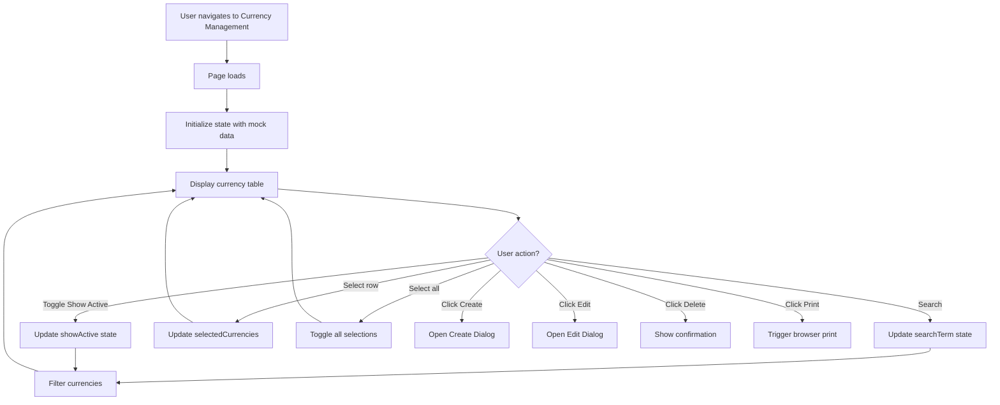

### FD-CUR-002: Filter Logic

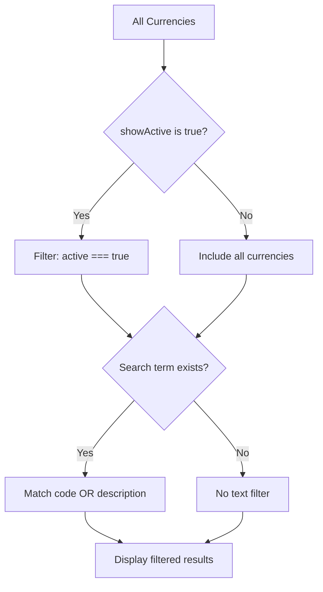

---

## Create Currency Flow

### FD-CUR-003: Create New Currency

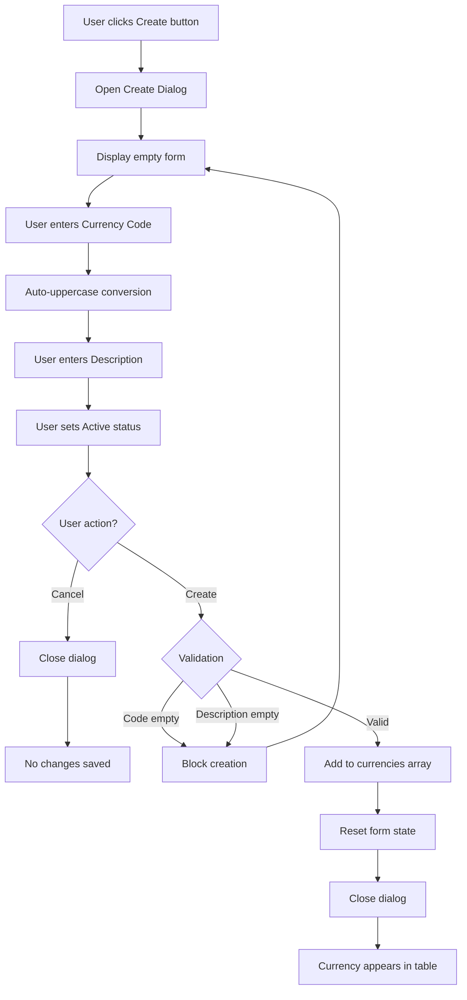

### FD-CUR-004: Create Dialog State Flow

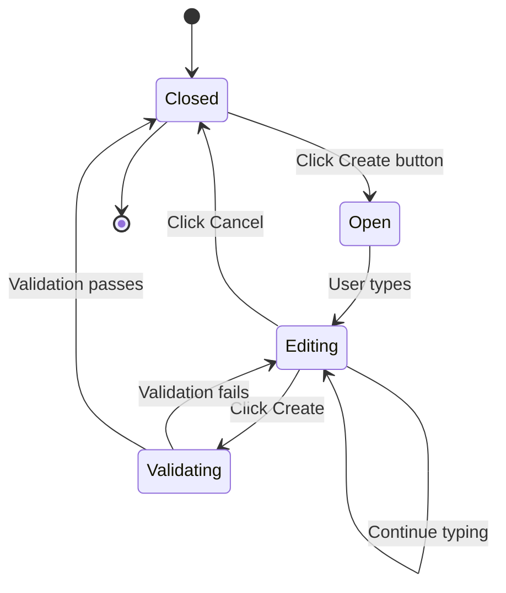

---

## Edit Currency Flow

### FD-CUR-005: Edit Existing Currency

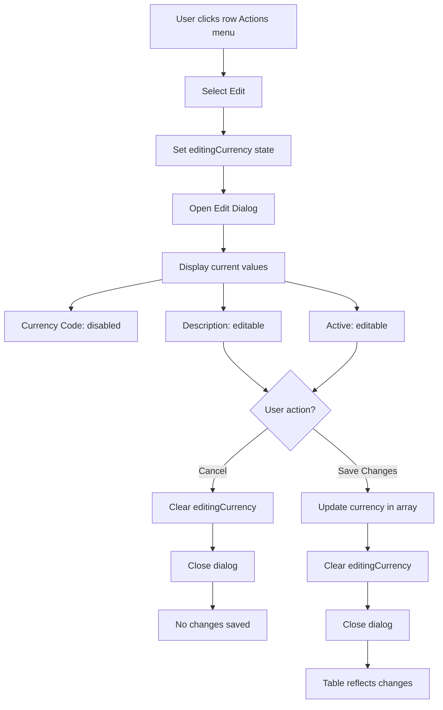

---

## Delete Currency Flow

### FD-CUR-006: Single Delete

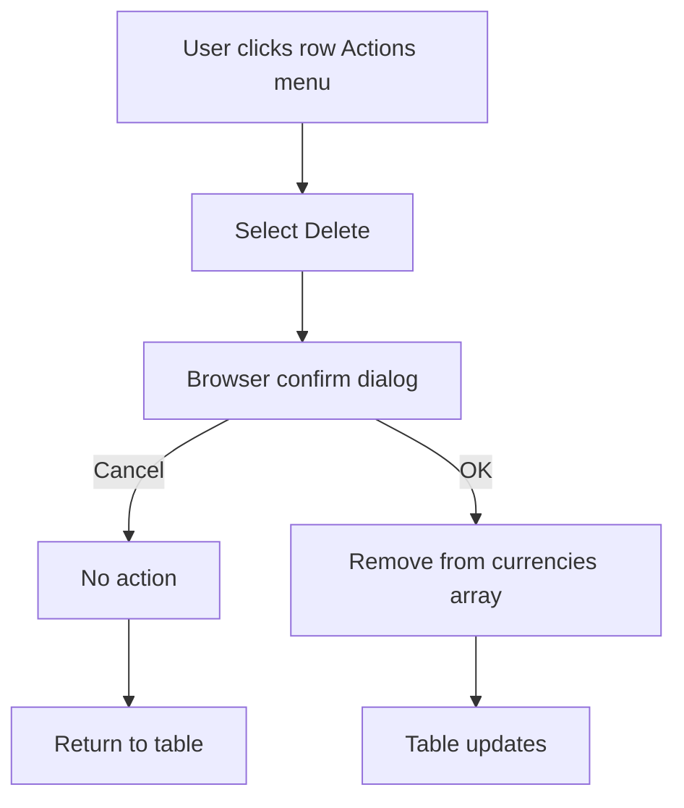

### FD-CUR-007: Bulk Delete

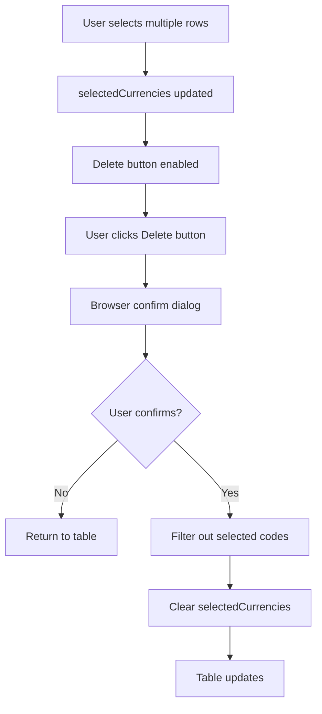

---

## Component Hierarchy

### FD-CUR-008: UI Component Structure

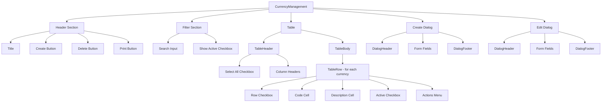

---

## State Management Flow

### FD-CUR-009: State Relationships

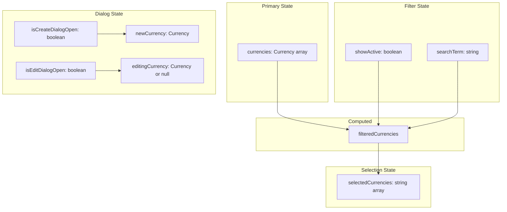

### FD-CUR-010: Data Flow

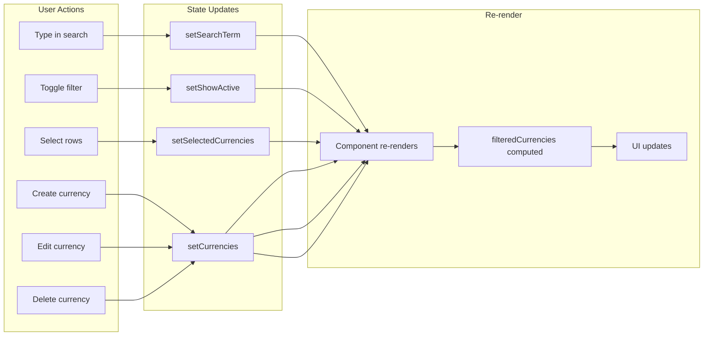

---

## User Interaction Flow

### FD-CUR-011: Complete User Journey

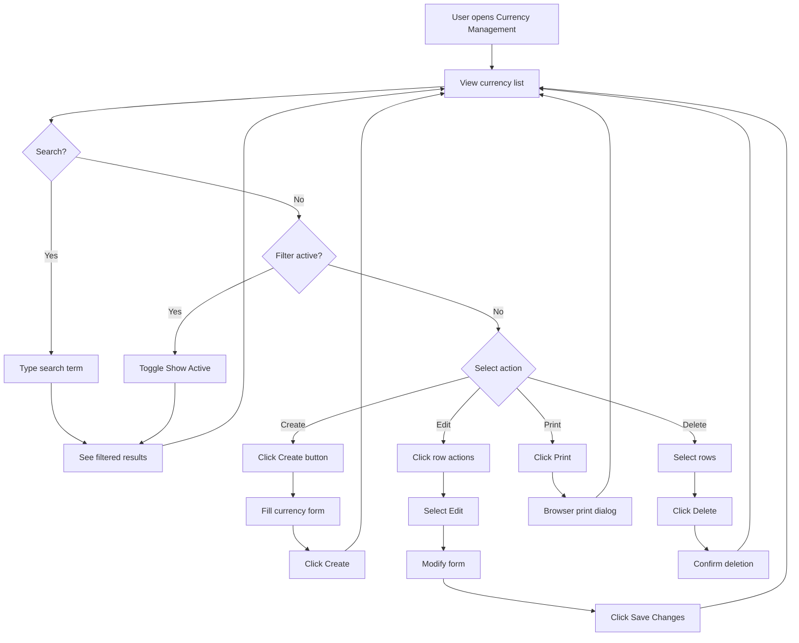

---

## Future Flow Diagrams (Planned)

The following diagrams are planned for future implementation phases:

| Diagram | Description | Phase |
|---------|-------------|-------|
| Exchange Rate Retrieval | Auto-fetch rates from APIs | Phase 3 |
| Manual Rate Entry | Manual rate with approval workflow | Phase 3 |
| Currency Conversion | Real-time conversion calculations | Phase 4 |
| Period-End Revaluation | Revalue foreign balances | Phase 4 |
| Exchange Gain/Loss | Calculate and post gains/losses | Phase 4 |

---

**Document End**
