# Flow Diagrams: Department Management

## Module Information
- **Module**: Finance
- **Sub-Module**: Department Management
- **Route**: `/finance/department-list`
- **Version**: 2.0.0
- **Last Updated**: 2026-01-17
- **Owner**: Finance Team
- **Status**: Active

## Document History

| Version | Date | Author | Changes |
|---------|------|--------|---------|
| 2.0.0 | 2026-01-17 | Documentation Team | Updated to reflect actual implementation |
| 1.1.0 | 2025-12-17 | Documentation Team | Added Location Assignment feature |
| 1.0.0 | 2025-12-01 | Documentation Team | Initial version |

---

## Overview

This document provides visual representations of the Department Management module's workflows. The current implementation covers CRUD operations for departments with user and location assignment capabilities.

**Related Documents**:
- [Business Requirements](./BR-department-management.md)
- [Use Cases](./UC-department-management.md)
- [Technical Specification](./TS-department-management.md)
- [Data Dictionary](./DD-department-management.md)
- [Validation Rules](./VAL-department-management.md)

---

## Diagram Index

| Diagram | Type | Purpose |
|---------|------|---------|
| [Main Navigation Flow](#main-navigation-flow) | Process | Overall module navigation |
| [Department List Flow](#department-list-flow) | Process | List page interactions |
| [Create Department Flow](#create-department-flow) | Process | New department workflow |
| [Edit Department Flow](#edit-department-flow) | Process | Department modification |
| [Delete Department Flow](#delete-department-flow) | Process | Department removal |
| [User Assignment Flow](#user-assignment-flow) | Process | Dual-pane user picker |
| [Location Assignment Flow](#location-assignment-flow) | Process | Dual-pane location picker |
| [Component State Flow](#component-state-flow) | Data | State management |

---

## Main Navigation Flow

### FD-DEPT-001: Module Navigation

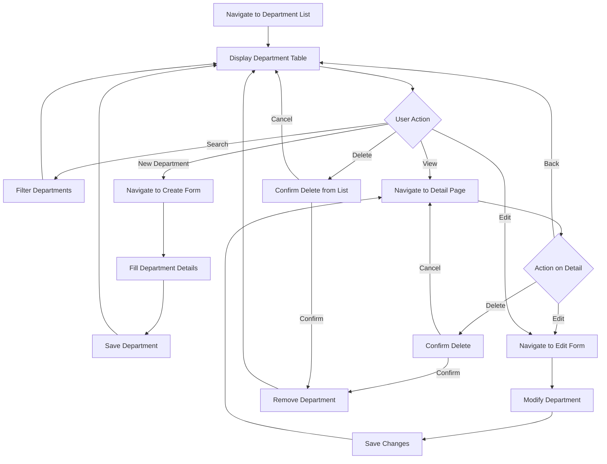

---

## Department List Flow

### FD-DEPT-002: List Page Display

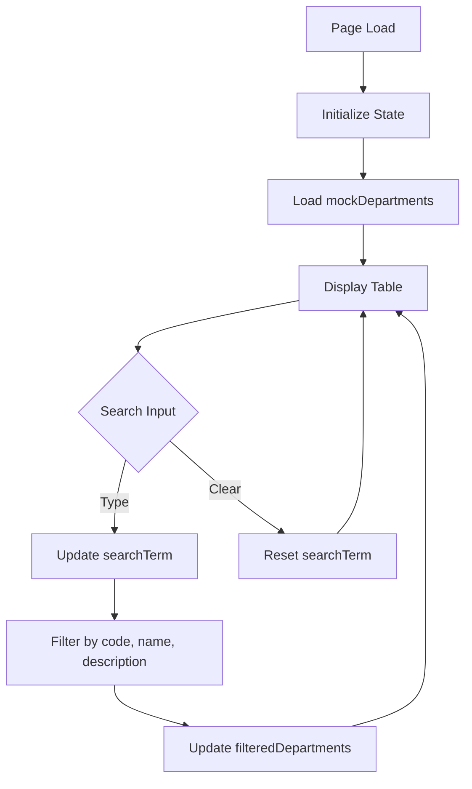

### FD-DEPT-003: List Actions

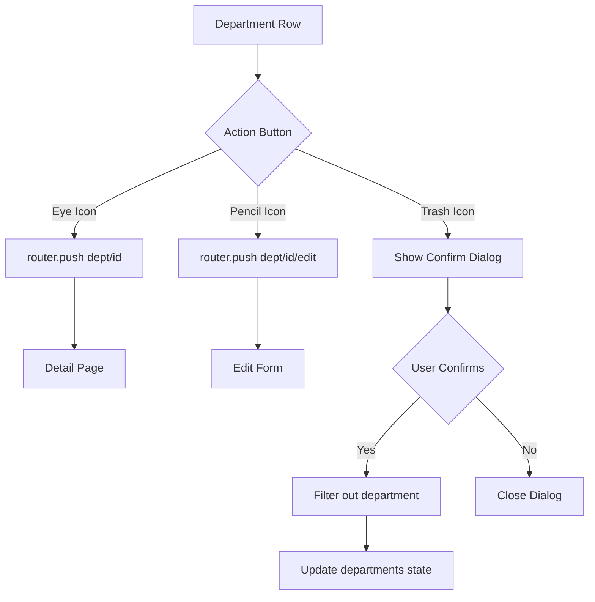

---

## Create Department Flow

### FD-DEPT-004: Create New Department

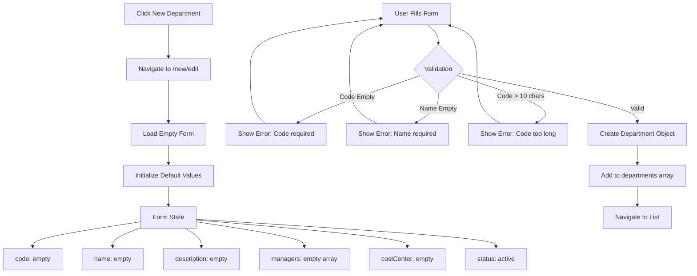

### FD-DEPT-005: Form Sections

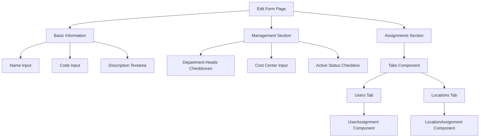

---

## Edit Department Flow

### FD-DEPT-006: Edit Existing Department

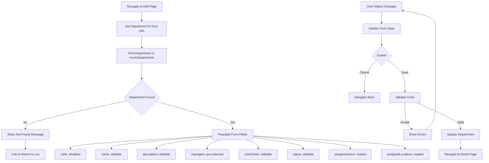

---

## Delete Department Flow

### FD-DEPT-007: Delete Confirmation

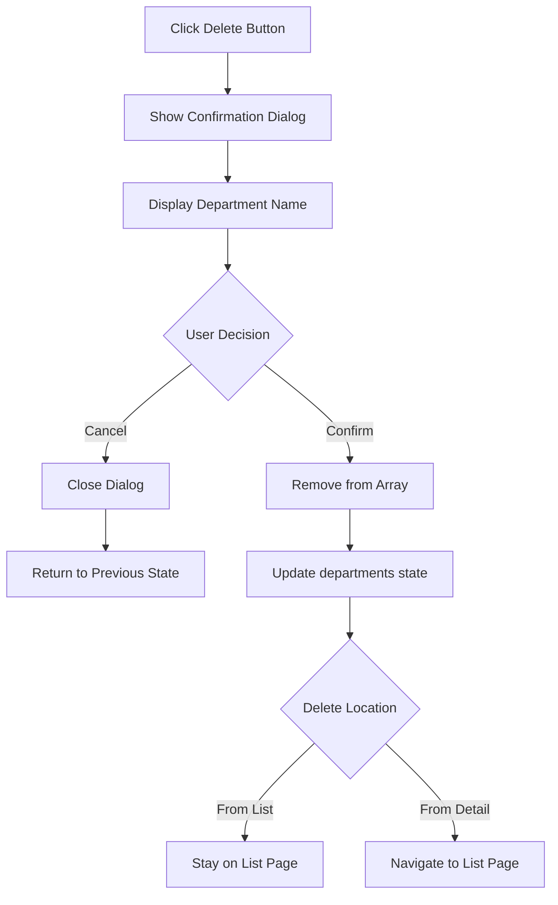

---

## User Assignment Flow

### FD-DEPT-008: Dual-Pane User Picker

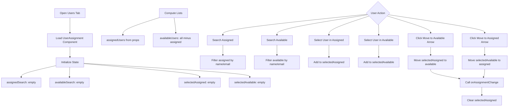

### FD-DEPT-009: User Selection State

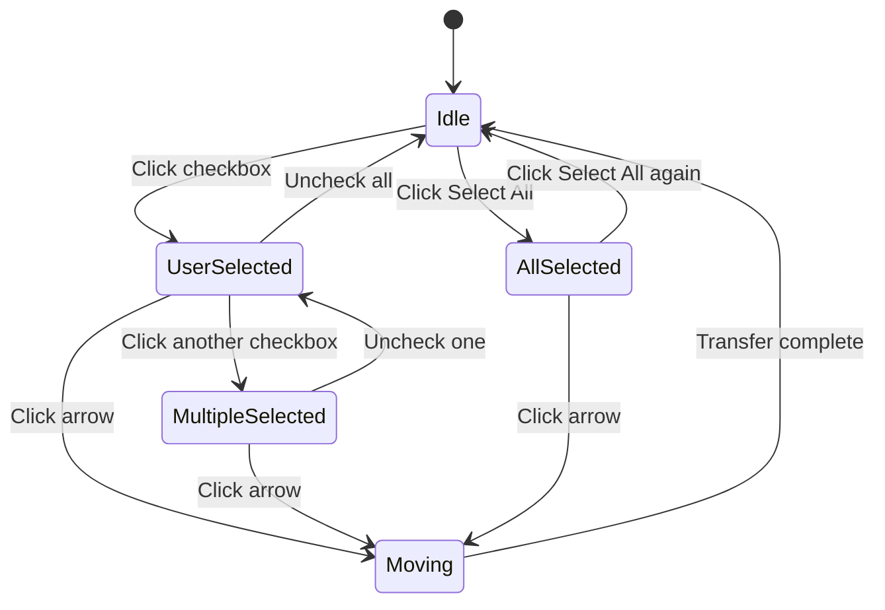

---

## Location Assignment Flow

### FD-DEPT-010: Dual-Pane Location Picker

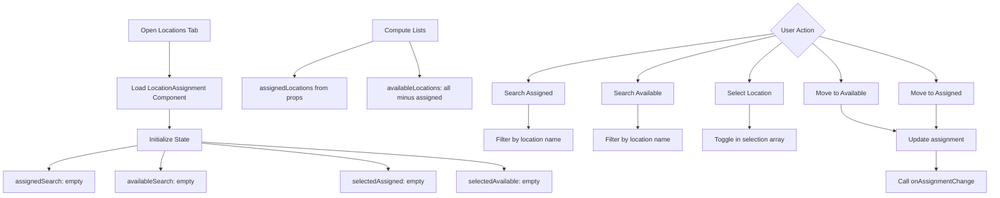

---

## Component State Flow

### FD-DEPT-011: State Management

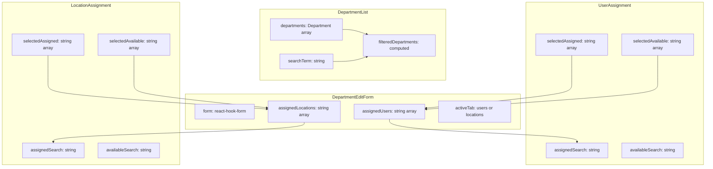

### FD-DEPT-012: Data Flow

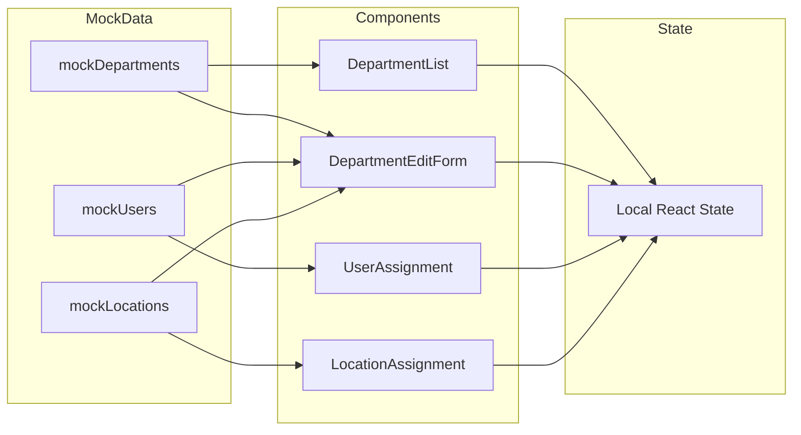

---

## User Interface Layouts

### FD-DEPT-013: List Page Layout

```
+------------------------------------------------------------------+
| Department List                                [+ New Department] |
+------------------------------------------------------------------+
| Manage organizational departments and user assignments            |
+------------------------------------------------------------------+
| [Search departments by name, code, or description...         ]    |
+------------------------------------------------------------------+
| Code     | Name            | Description    | Head    | Status |  |
+----------+-----------------+----------------+---------+--------+--+
| KITCHEN  | Kitchen Ops     | Main kitchen   | J.Smith | Active |[]|
| FB       | Food & Beverage | F&B service    | M.Doe   | Active |[]|
| HOUSEKP  | Housekeeping    | Room cleaning  | A.Brown | Active |[]|
+------------------------------------------------------------------+
| Showing 3 of 3 departments                                        |
+------------------------------------------------------------------+
```

### FD-DEPT-014: Edit Form Layout

```
+------------------------------------------------------------------+
| [< Back] Edit Kitchen Operations                                  |
|          Update department information and user assignments       |
+------------------------------------------------------------------+
|                                            [Cancel] [Save Dept]   |
+------------------------------------------------------------------+
| Basic Information                                                 |
| +--------------------------------------------------------------+ |
| | Department Name*  [Kitchen Operations________________]        | |
| | Department Code*  [KITCHEN___] (disabled)                     | |
| | Description       [Main kitchen production area_____]         | |
| +--------------------------------------------------------------+ |
+------------------------------------------------------------------+
| Management                                                        |
| +--------------------------------------------------------------+ |
| | Department Heads:                                             | |
| | [x] John Smith (john@example.com)                            | |
| | [ ] Mary Director (mary@example.com)                         | |
| | Cost Center: [CC-001______]                                   | |
| | [x] Active                                                    | |
| +--------------------------------------------------------------+ |
+------------------------------------------------------------------+
| Assignments                                                       |
| +--------------------------------------------------------------+ |
| | [Users (5)]  [Locations (2)]                                  | |
| | +------------------------+  +  +------------------------+     | |
| | | Assigned Users    (5)  |  |  | Available Users   (10) |     | |
| | | [Search...]            | [>] | [Search...]            |     | |
| | | [x] Select All         | [<] | [ ] Select All         |     | |
| | | +--------------------+ |  |  | +--------------------+ |     | |
| | | | [x] John Smith     | |  |  | | [ ] Jane Doe       | |     | |
| | | | [ ] Mike Johnson   | |  |  | | [ ] Bob Wilson     | |     | |
| | | +--------------------+ |  |  | +--------------------+ |     | |
| | +------------------------+  +  +------------------------+     | |
| +--------------------------------------------------------------+ |
+------------------------------------------------------------------+
```

---

## Future Flow Diagrams (Planned)

| Diagram | Description | Phase |
|---------|-------------|-------|
| Database Sync Flow | Server state synchronization | Phase 2 |
| Approval Workflow | Department creation approval | Phase 3 |
| Hierarchy Management | Parent-child relationships | Phase 3 |
| Budget Allocation | Department budget tracking | Phase 4 |
| Audit Trail | Change history tracking | Phase 4 |

---

**Document End**
