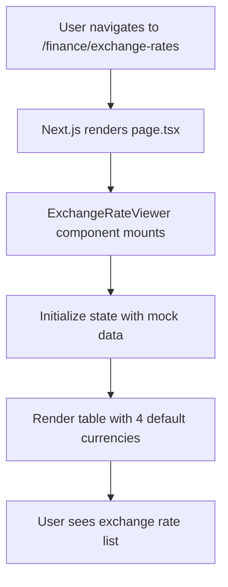
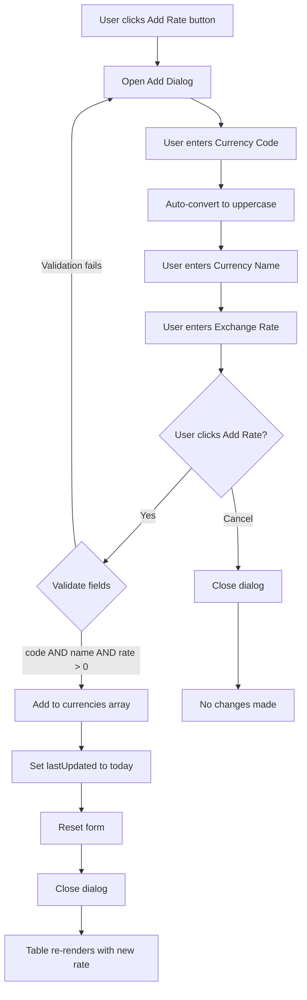
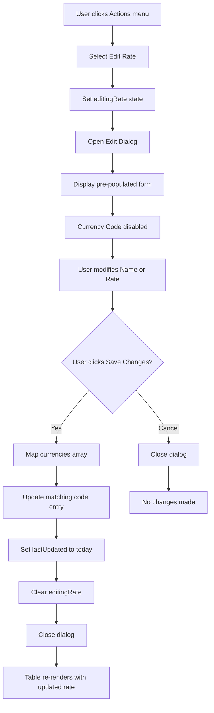
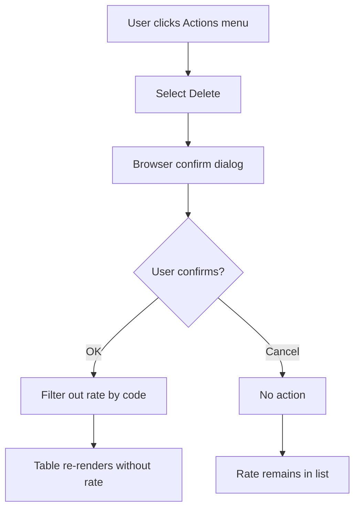
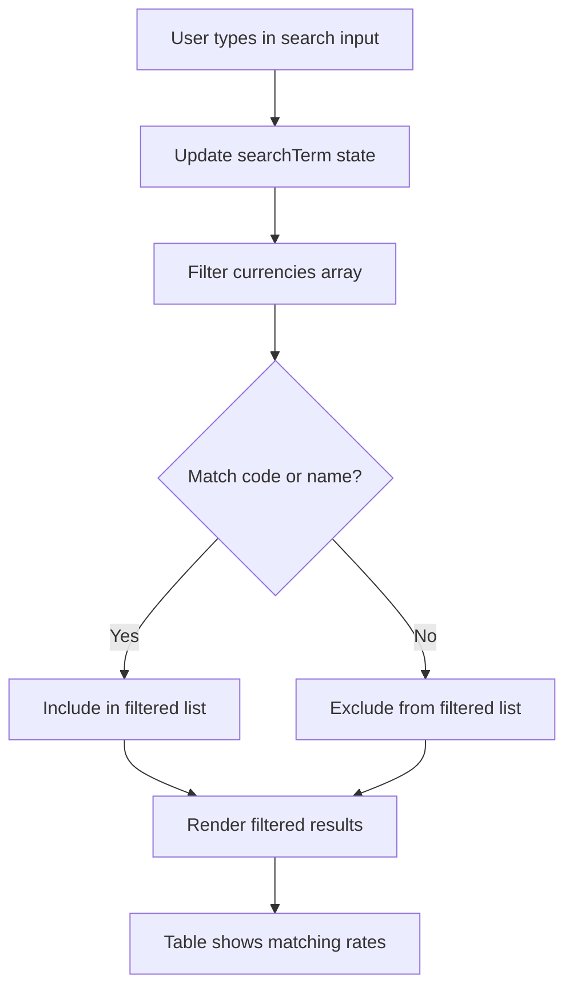
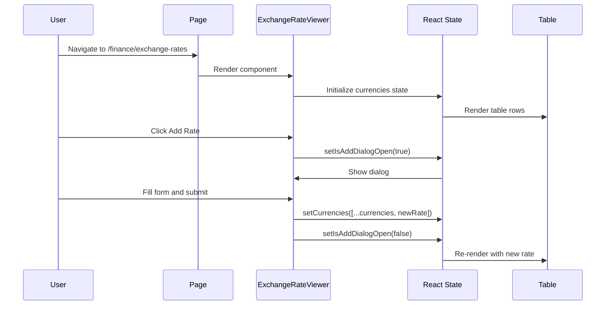
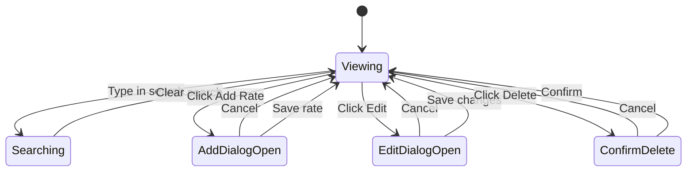
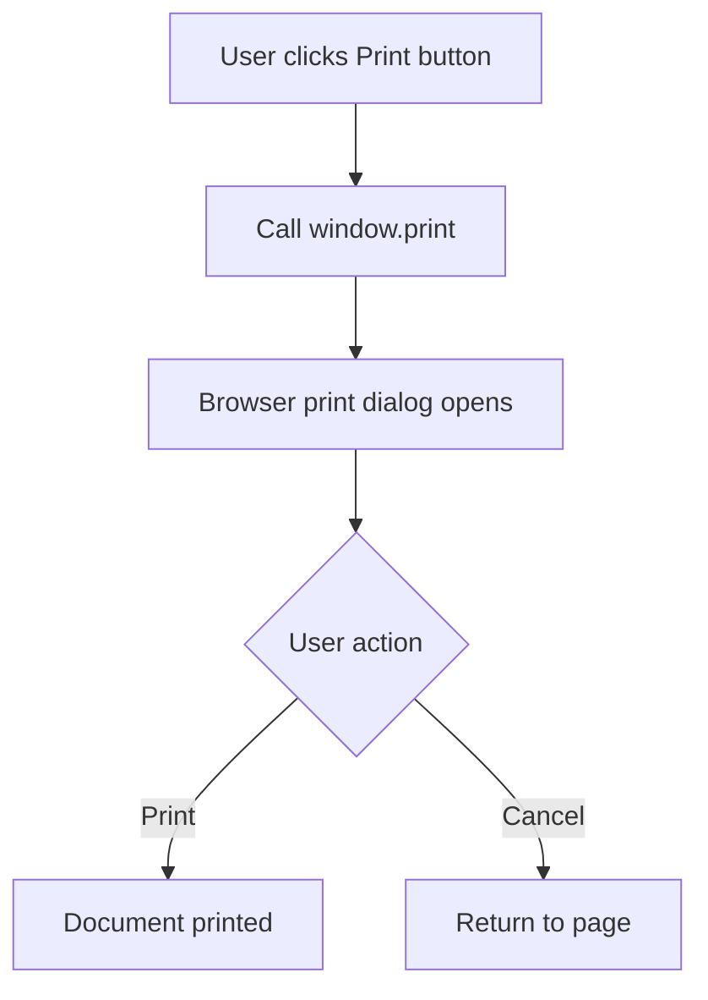

# Flow Diagrams: Exchange Rate Management

## Module Information
- **Module**: Finance
- **Sub-Module**: Exchange Rate Management
- **Route**: `/finance/exchange-rates`
- **Version**: 2.0.0
- **Last Updated**: 2026-01-17
- **Owner**: Finance Team
- **Status**: Active

## Document History

| Version | Date | Author | Changes |
|---------|------|--------|---------|
| 2.0.0 | 2026-01-17 | Documentation Team | Updated to reflect actual implementation |
| 1.1.0 | 2025-12-10 | Documentation Team | Standardized reference number format |
| 1.0.0 | 2025-01-13 | Documentation Team | Initial version |

---

## Overview

This document provides visual representations of the Exchange Rate Management module workflows. The current implementation supports basic CRUD operations using React local state.

**Related Documents**:
- [Business Requirements](./BR-exchange-rate-management.md)
- [Use Cases](./UC-exchange-rate-management.md)
- [Data Dictionary](./DD-exchange-rate-management.md)
- [Technical Specification](./TS-exchange-rate-management.md)
- [Validation Rules](./VAL-exchange-rate-management.md)

---

## Diagram Index

| Diagram | Type | Purpose |
|---------|------|---------|
| [Page Load Flow](#page-load-flow) | Process | Initial page rendering |
| [Add Rate Flow](#add-rate-flow) | Process | Create new exchange rate |
| [Edit Rate Flow](#edit-rate-flow) | Process | Modify existing rate |
| [Delete Rate Flow](#delete-rate-flow) | Process | Remove exchange rate |
| [Search Flow](#search-flow) | Process | Filter rate list |
| [Component Interaction](#component-interaction) | Sequence | UI component interactions |
| [State Transitions](#state-transitions) | State | Application state changes |

---

## Page Load Flow



**Description**: When a user navigates to the exchange rates page, the system loads the ExchangeRateViewer component which initializes with hardcoded mock data (USD, EUR, JPY, GBP).

---

## Add Rate Flow



**Validation Check**:
```
if (newRate.code && newRate.name && newRate.rate > 0) {
  // proceed with add
}
```

---

## Edit Rate Flow



**Update Logic**:
```
currencies.map(c =>
  c.code === editingRate.code
    ? { ...editingRate, lastUpdated: today }
    : c
)
```

---

## Delete Rate Flow



**Delete Logic**:
```
currencies.filter(c => c.code !== code)
```

**Confirmation Message**: "Are you sure you want to delete exchange rate for {code}?"

---

## Search Flow



**Filter Logic**:
```
currencies.filter(currency =>
  currency.code.toLowerCase().includes(searchTerm.toLowerCase()) ||
  currency.name.toLowerCase().includes(searchTerm.toLowerCase())
)
```

---

## Component Interaction



---

## State Transitions



---

## Print Flow



---

## Data Flow Summary

```
User Actions              State Updates           UI Updates
-----------              -------------           ----------
Navigate to page    -->  Initialize mock data --> Render table
Type in search      -->  setSearchTerm        --> Filter visible rows
Click Add Rate      -->  setIsAddDialogOpen   --> Show dialog
Submit add form     -->  setCurrencies        --> Add row to table
Click Edit          -->  setEditingRate       --> Show edit dialog
Submit edit form    -->  setCurrencies        --> Update row
Click Delete        -->  confirm()            --> Show browser dialog
Confirm delete      -->  setCurrencies        --> Remove row
Click Print         -->  window.print()       --> Open print dialog
```

---

## Future Enhancement Flows

### Phase 2: Database Integration

```
User submits form
    |
    v
Client-side validation
    |
    v
Server Action call
    |
    v
Prisma database operation
    |
    v
Return result
    |
    v
Update UI state
```

### Phase 3: External API Integration

```
Scheduled job triggers
    |
    v
Fetch rates from external API
    |
    v
Compare with existing rates
    |
    v
Update changed rates in database
    |
    v
Log rate changes
```

---

**Document End**
