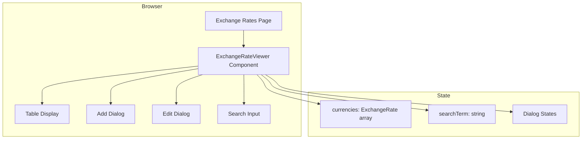
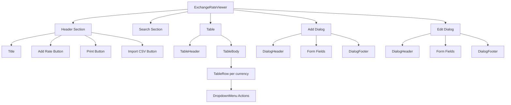
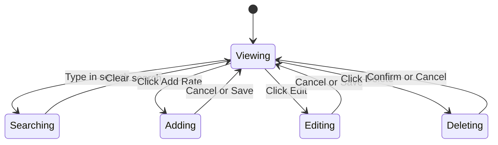

# Technical Specification: Exchange Rate Management

## Module Information
- **Module**: Finance
- **Sub-Module**: Exchange Rate Management
- **Route**: `/finance/exchange-rates`
- **Version**: 2.0.0
- **Last Updated**: 2026-01-17
- **Owner**: Finance Team
- **Status**: Active

## Document History

| Version | Date | Author | Changes |
|---------|------|--------|---------|
| 2.0.0 | 2026-01-17 | Documentation Team | Updated to reflect actual implementation |
| 1.1.0 | 2025-12-10 | Documentation Team | Standardized reference number format |
| 1.0.0 | 2025-01-13 | Documentation Team | Initial version |

---

## Overview

The Exchange Rate Management module provides a simple interface for managing currency exchange rates. The current implementation is a single-page application using React local state for data management.

**Related Documents**:
- [Business Requirements](./BR-exchange-rate-management.md)
- [Use Cases](./UC-exchange-rate-management.md)
- [Data Dictionary](./DD-exchange-rate-management.md)
- [Flow Diagrams](./FD-exchange-rate-management.md)
- [Validation Rules](./VAL-exchange-rate-management.md)

---

## Architecture

### System Architecture



### Technology Stack

| Layer | Technology | Purpose |
|-------|------------|---------|
| Framework | Next.js 14 (App Router) | Page routing |
| Language | TypeScript | Type safety |
| UI Library | shadcn/ui | UI components |
| Styling | Tailwind CSS | Component styling |
| State | React useState | Local state management |
| Icons | Lucide React | UI icons |

---

## Module Structure

### File Organization

```
app/(main)/finance/exchange-rates/
└── page.tsx                           # Route page (5 lines)

components/
└── exchange-rate-viewer.tsx           # Main component (250 lines)
```

### Page Component

**File**: `app/(main)/finance/exchange-rates/page.tsx`

**Purpose**: Route entry point that renders the ExchangeRateViewer component.

**Implementation**: Simple wrapper that imports and renders ExchangeRateViewer.

---

## Component Architecture

### ExchangeRateViewer

**File**: `components/exchange-rate-viewer.tsx`

**Purpose**: Main component handling all exchange rate functionality.

**Responsibilities**:
- Display exchange rate table
- Handle search filtering
- Manage add/edit dialogs
- Process CRUD operations
- Trigger print functionality

### Component Hierarchy



---

## State Management

### State Variables

| State | Type | Purpose |
|-------|------|---------|
| currencies | ExchangeRate[] | Exchange rate data |
| searchTerm | string | Search filter value |
| isAddDialogOpen | boolean | Add dialog visibility |
| isEditDialogOpen | boolean | Edit dialog visibility |
| editingRate | ExchangeRate \| null | Rate being edited |
| newRate | object | New rate form data |

### State Flow



---

## UI Components Used

### shadcn/ui Components

| Component | Usage |
|-----------|-------|
| Button | Action buttons (Add, Print, Import, Cancel, Save) |
| Input | Search input, form fields |
| Table, TableHeader, TableBody, TableRow, TableHead, TableCell | Rate table display |
| DropdownMenu, DropdownMenuContent, DropdownMenuItem, DropdownMenuTrigger | Row actions menu |
| Dialog, DialogContent, DialogDescription, DialogFooter, DialogHeader, DialogTitle | Add/Edit dialogs |
| Label | Form field labels |

### Lucide Icons

| Icon | Usage |
|------|-------|
| Plus | Add Rate button |
| Printer | Print button |
| Upload | Import CSV button |
| MoreVertical | Actions menu trigger |
| Edit | Edit menu item |
| Trash2 | Delete menu item |

---

## Event Handlers

### Handler Functions

| Function | Trigger | Action |
|----------|---------|--------|
| handleAddRate | Click Add Rate in dialog | Validate and add to currencies array |
| handleEditRate | Click Edit in dropdown | Set editing state and open dialog |
| handleUpdateRate | Click Save Changes | Update rate in currencies array |
| handleDeleteRate | Confirm delete | Filter out rate from currencies array |
| handlePrint | Click Print button | Call window.print() |
| handleImportCSV | Click Import CSV | Show placeholder alert |

---

## Data Flow

### Create Rate Flow

```
User clicks "Add Rate"
    ↓
Dialog opens (isAddDialogOpen = true)
    ↓
User fills form (newRate state updates)
    ↓
User clicks "Add Rate" button
    ↓
Validation: code && name && rate > 0
    ↓
Add to currencies array with current date
    ↓
Reset newRate, close dialog
    ↓
Table re-renders with new rate
```

### Edit Rate Flow

```
User clicks Actions menu → Edit
    ↓
Set editingRate to selected rate
Open edit dialog (isEditDialogOpen = true)
    ↓
User modifies fields
    ↓
User clicks "Save Changes"
    ↓
Map currencies: update matching code
Set lastUpdated to current date
    ↓
Clear editingRate, close dialog
    ↓
Table re-renders with updated rate
```

### Delete Rate Flow

```
User clicks Actions menu → Delete
    ↓
Browser confirm dialog shows
    ↓
User confirms
    ↓
Filter currencies: remove matching code
    ↓
Table re-renders without deleted rate
```

---

## Form Validation

### Add Rate Validation

```typescript
if (newRate.code && newRate.name && newRate.rate > 0) {
  // Proceed with creation
}
```

**Validated Fields**:
- code: Not empty
- name: Not empty
- rate: Greater than 0

### Edit Rate Validation

No explicit validation on edit (assumes existing data is valid).

---

## Routing

### Route Configuration

| Route | Page | Component |
|-------|------|-----------|
| `/finance/exchange-rates` | page.tsx | ExchangeRateViewer |

### Navigation

- No sub-routes (single page module)
- No dynamic routes
- Part of Finance module navigation

---

## Future Technical Enhancements

| Phase | Enhancement | Technical Approach |
|-------|-------------|-------------------|
| Phase 2 | Database Integration | Prisma ORM with PostgreSQL |
| Phase 2 | Server Actions | Next.js server actions for CRUD |
| Phase 2 | Import CSV | File upload with Papa Parse |
| Phase 3 | External API | Fetch rates from exchange rate API |
| Phase 3 | Rate History | Track historical rate changes |

---

## Performance Considerations

### Current Implementation

- **Rendering**: Entire table re-renders on any state change
- **Filtering**: Client-side filtering (suitable for small datasets)
- **Data Size**: Mock data with 4 currencies (scales well to ~100)

### Optimization Opportunities

- Add useMemo for filtered currencies
- Implement virtual scrolling for large datasets
- Add debounce to search input

---

**Document End**
