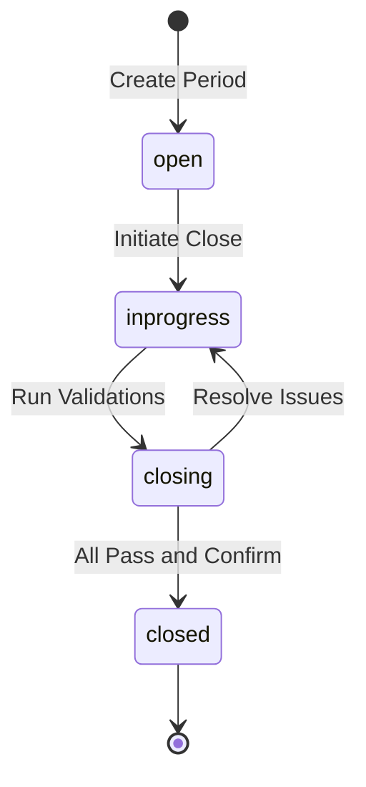
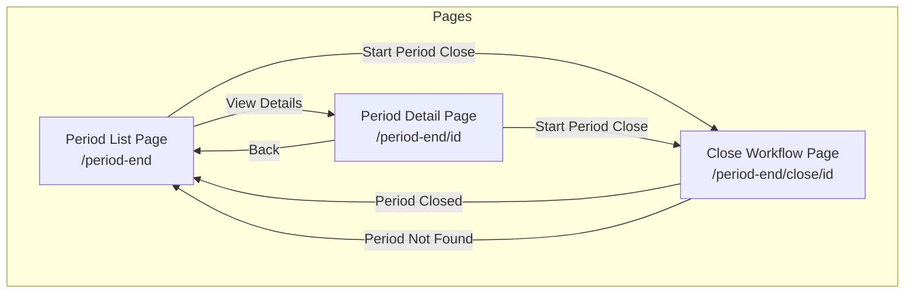
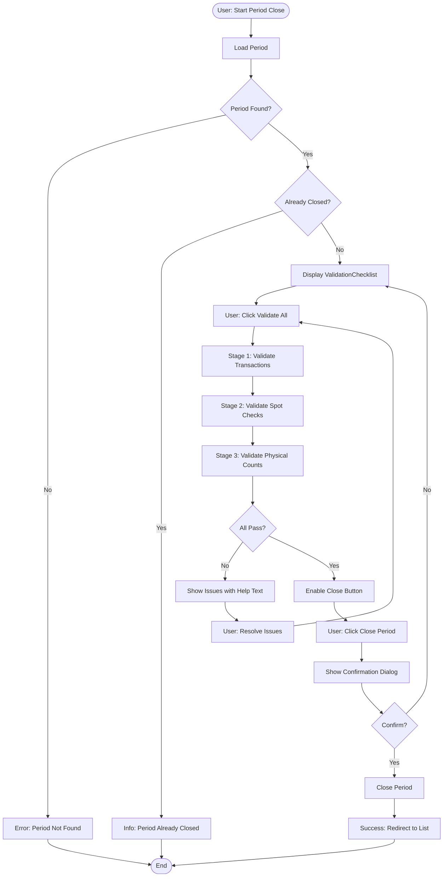
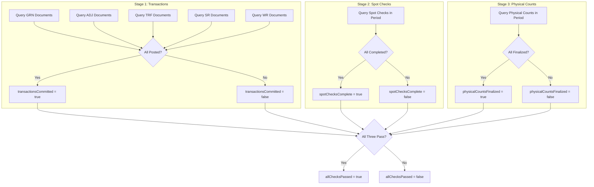
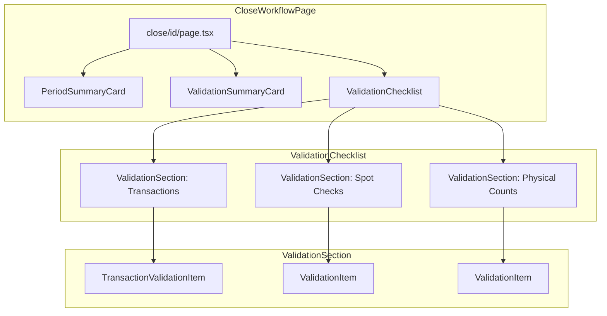
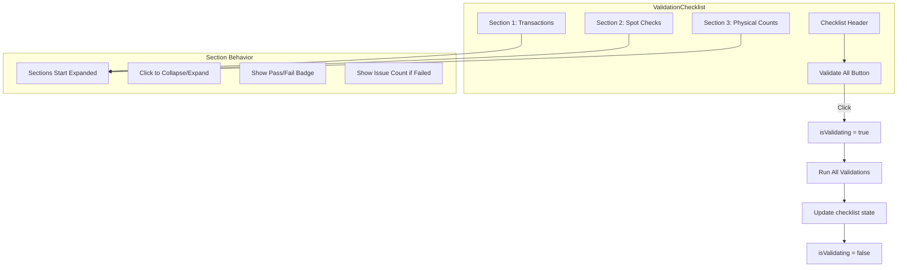
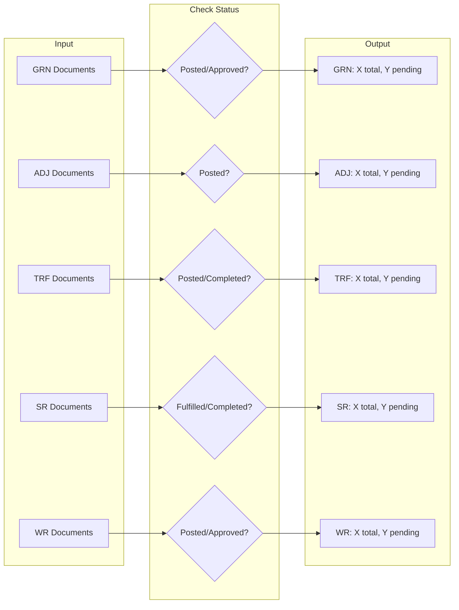
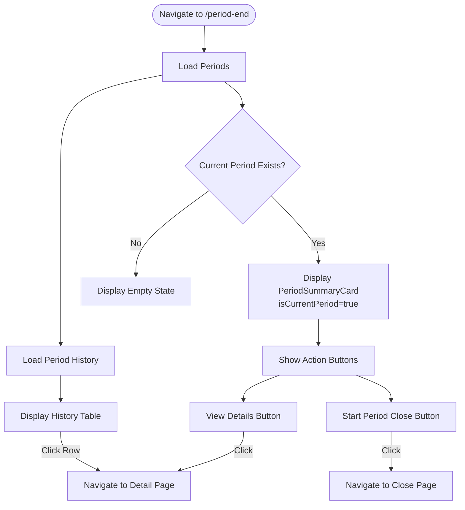
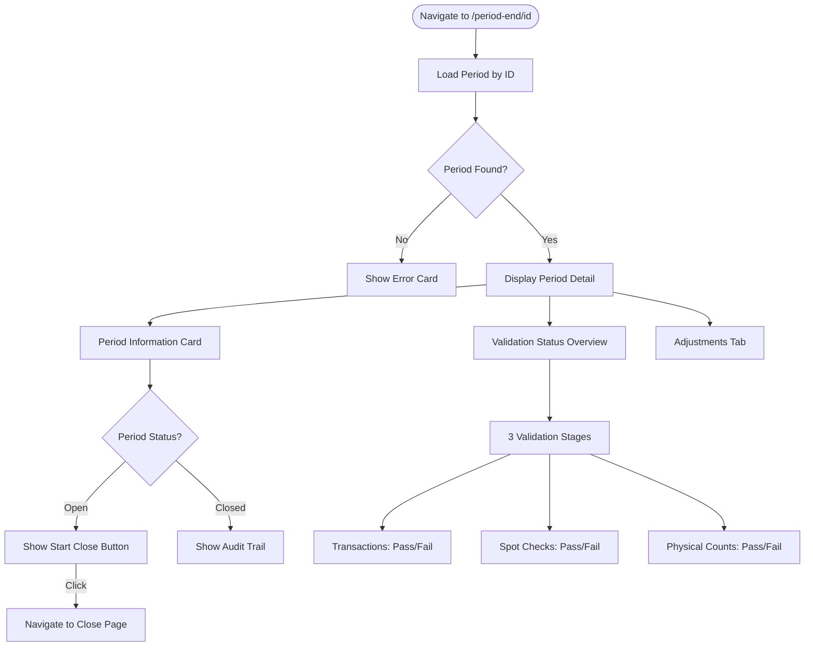
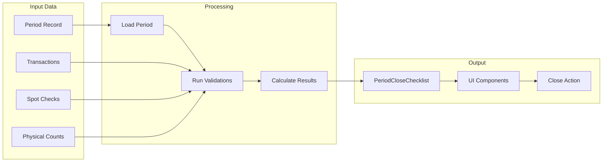

# Flow Diagrams: Period End

> Version: 2.0.0 | Status: Active | Last Updated: 2025-01-16

## 1. Document Control

| Field | Value |
|-------|-------|
| Module | Inventory Management |
| Feature | Period End |
| Document Type | Flow Diagrams |

## Document History

| Version | Date | Author | Changes |
|---------|------|--------|---------|
| 2.0.0 | 2025-01-16 | Development Team | Aligned with actual implementation: corrected status lifecycle (open, in_progress, closing, closed), 3-stage validation flow, actual page navigation |
| 1.1.0 | 2025-12-09 | Development Team | Updated state diagrams |
| 1.0.0 | 2025-11-19 | Documentation Team | Initial version |

---

## 2. Period Status Lifecycle

### Status Descriptions

| Status | Badge Color | Description |
|--------|-------------|-------------|
| open | Blue | Period created, accepting transactions |
| in_progress | Yellow | Close workflow initiated |
| closing | Orange | Validations being run |
| closed | Green | Period finalized, locked |

---

## 3. Page Navigation Flow

---

## 4. Period Close Workflow

---

## 5. 3-Stage Validation Flow

---

## 6. Component Hierarchy

---

## 7. Validation Checklist UI Flow

---

## 8. Transaction Validation Detail

---

## 9. Period List Page Flow

---

## 10. Period Detail Page Flow

---

## 11. Data Flow Summary

---

*Document Version: 2.0.0 | Carmen ERP Period End Module*
