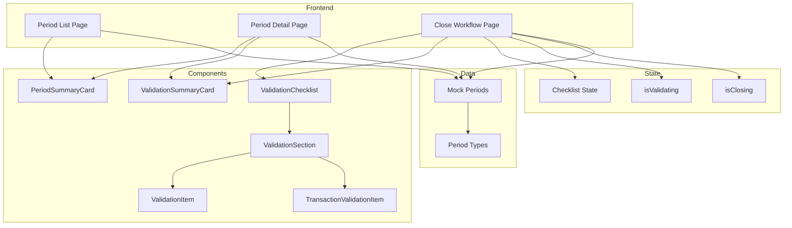
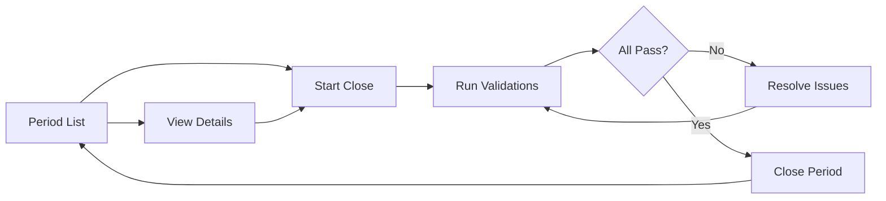
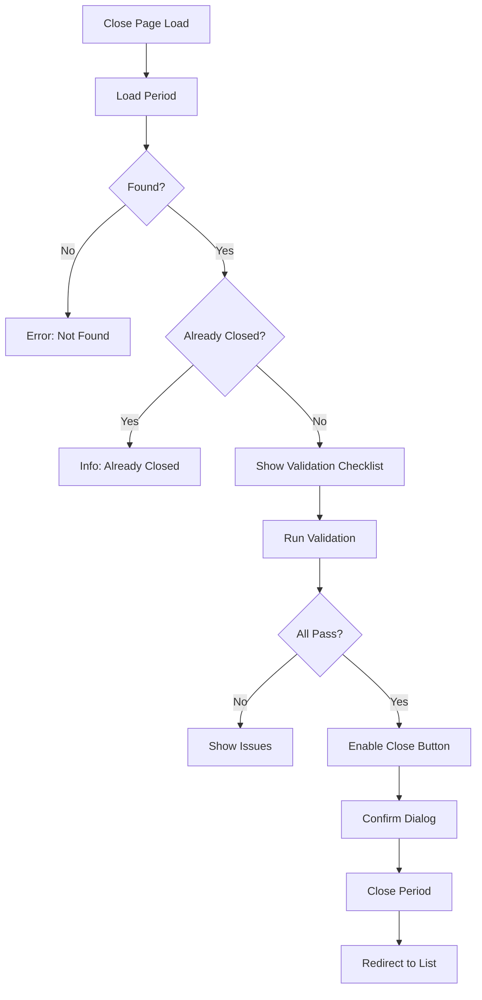
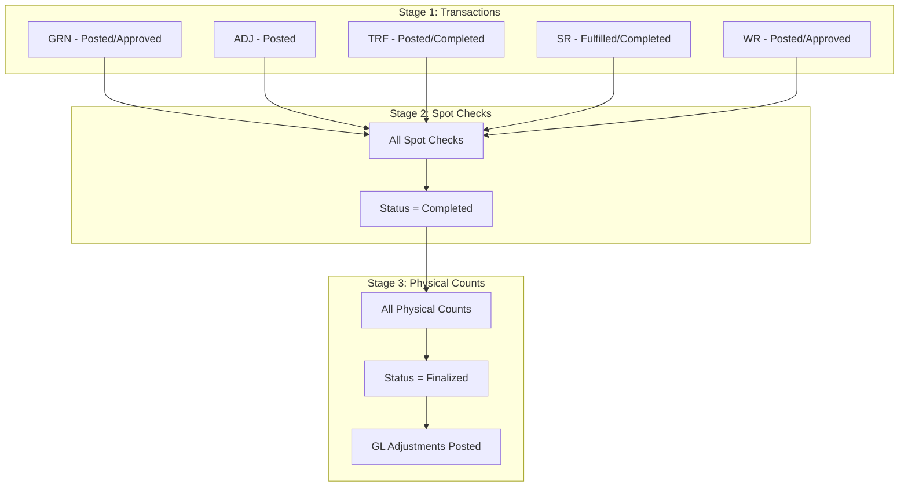

# Technical Specification: Period End

> Version: 2.0.0 | Status: Active | Last Updated: 2025-01-16

## 1. Document Control

| Field | Value |
|-------|-------|
| Module | Inventory Management |
| Feature | Period End |
| Document Type | Technical Specification |

## Document History

| Version | Date | Author | Changes |
|---------|------|--------|---------|
| 2.0.0 | 2025-01-16 | Development Team | Aligned with actual implementation: documented actual pages, components, validation architecture |
| 1.1.0 | 2025-12-09 | Development Team | Updated status values |
| 1.0.0 | 2025-11-19 | Documentation Team | Initial version |

## 2. System Architecture



## 3. Page Hierarchy

```mermaid
graph TB
    ROOT[/inventory-management/period-end]
    DETAIL[/id]
    CLOSE[/close/id]

    ROOT --> DETAIL
    ROOT --> CLOSE
```

### 3.1 Page Descriptions

| Route | Page | Purpose |
|-------|------|---------|
| `/period-end` | Period List | View current/historical periods |
| `/period-end/[id]` | Period Detail | View period info and validation overview |
| `/period-end/close/[id]` | Close Workflow | Run validations and close period |

## 4. Component Architecture

### 4.1 Page Components

| Page | File | Responsibilities |
|------|------|------------------|
| PeriodEndPage | `page.tsx` | Current period card, history table, info panel |
| PeriodEndDetailPage | `[id]/page.tsx` | Period info, validation overview, adjustments tab |
| PeriodClosePage | `close/[id]/page.tsx` | Validation workflow, close action |

### 4.2 Shared Components

| Component | File | Responsibility |
|-----------|------|----------------|
| PeriodSummaryCard | `period-summary-card.tsx` | Display period with featured or compact styling |
| ValidationSummaryCard | `period-summary-card.tsx` | Display overall validation pass/fail |
| ValidationChecklist | `validation-checklist.tsx` | 3-stage validation UI with collapsible sections |
| ValidationSection | `validation-checklist.tsx` | Single collapsible validation stage |
| ValidationItem | `validation-item.tsx` | Individual validation result (spot check, physical count) |
| TransactionValidationItem | `validation-item.tsx` | Transaction type validation result |

### 4.3 Component Details

**PeriodSummaryCard**
- Two variants: featured (isCurrentPeriod=true) and compact
- Featured: Large card with calendar icon, date range, status badge, action buttons
- Compact: Smaller card for history list with hover effect
- Shows audit trail (closedBy, closedAt) for closed periods

**ValidationChecklist**
- Manages expand/collapse state for all three sections
- "Validate All" button triggers parent callback
- Sections start expanded by default

**ValidationSection**
- Order number badge (1, 2, 3)
- Icon matching stage type (FileText, ClipboardCheck, Package)
- Pass/fail status with color coding
- Issue count for failing sections
- Collapsible content area

**ValidationItem**
- Two variants: default (detailed) and compact
- Pass/fail icon (CheckCircle2 / XCircle)
- Label, sublabel (location), status text
- Optional external link to source document

**TransactionValidationItem**
- Document type code and count display
- "All Posted" or "X pending" status
- Color-coded pass/fail styling

## 5. State Management

### 5.1 Close Page State

| State | Type | Purpose |
|-------|------|---------|
| isValidating | boolean | Loading state for validation button |
| isClosing | boolean | Loading state for close action |
| checklist | PeriodCloseChecklist | Validation results |

### 5.2 Validation Checklist Sections

| Section ID | Title | Description |
|------------|-------|-------------|
| transactions | Transactions | All documents must be posted/approved |
| spot-checks | Spot Checks | All spot checks must be completed |
| physical-counts | Physical Counts | All counts must be finalized |

## 6. Navigation Flows

### 6.1 Period Management Flow



### 6.2 Close Workflow Navigation



## 7. Validation Architecture

### 7.1 Validation Sequence



### 7.2 Validation Results Structure

| Field | Type | Description |
|-------|------|-------------|
| transactionsCommitted | boolean | All transactions posted |
| spotChecksComplete | boolean | All spot checks completed |
| physicalCountsFinalized | boolean | All counts finalized |
| allChecksPassed | boolean | All three stages pass |
| totalIssueCount | number | Sum of all issues |
| summaryMessages | string[] | Human-readable issue list |

## 8. Integration Points

### 8.1 Inbound Integrations

| Source | Data | Purpose |
|--------|------|---------|
| Transaction Module | Document posting status | Stage 1 validation |
| Spot Check Module | Completion status | Stage 2 validation |
| Physical Count Module | Finalization status | Stage 3 validation |

### 8.2 Outbound Integrations

| Destination | Data | Trigger |
|-------------|------|---------|
| General Ledger | Period lock flag | Period close |
| Transaction Modules | Period closed event | Reject new postings |
| Audit Log | Close action | All status changes |

## 9. Error Handling

| Scenario | Handling |
|----------|----------|
| Period not found | Display error card with navigation back |
| Period already closed | Display info card with link to detail |
| Validation timeout | Show error, allow retry |
| Close operation failure | Show error, stay on page |

## 10. Security

| Concern | Implementation |
|---------|----------------|
| Authorization | Period close permission required |
| Audit trail | closedBy, closedAt recorded |
| Irreversibility | Confirmation dialog, no undo |
| Data integrity | Server-side re-validation before close |

---
*Document Version: 2.0.0 | Carmen ERP Period End Module*
