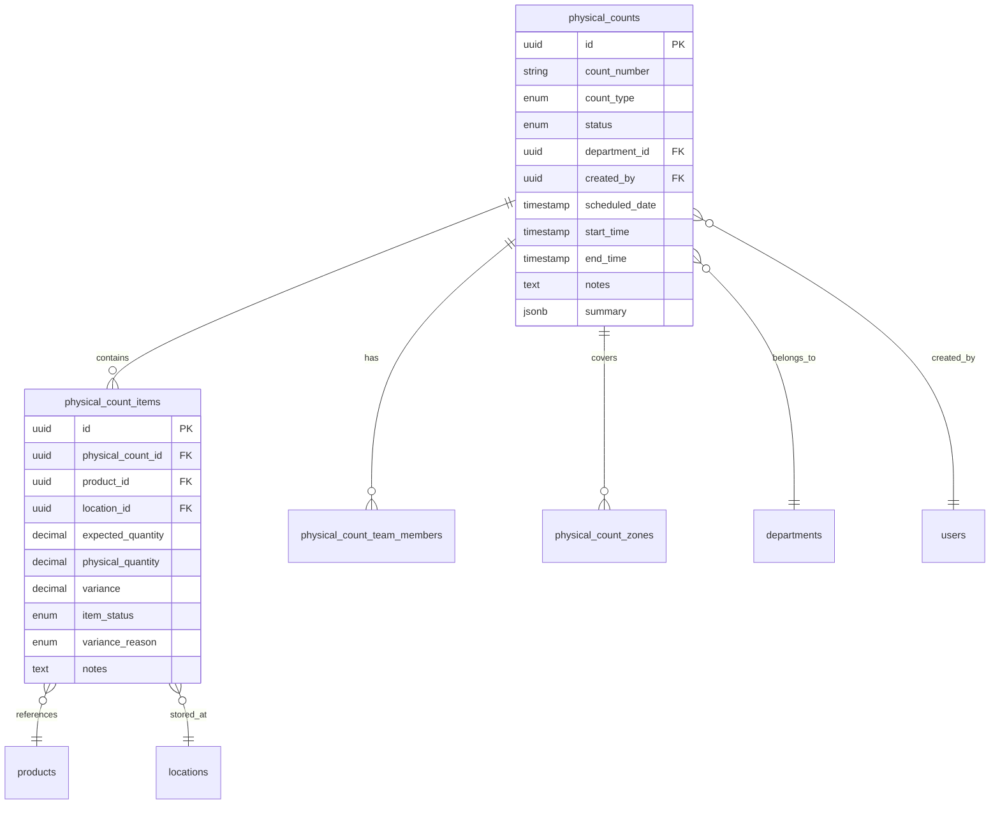

# Data Definition: Physical Count

> Version: 1.0.0 | Status: Active | Last Updated: 2025-01-16

## 1. Document Control

| Field | Value |
|-------|-------|
| Module | Inventory Management |
| Feature | Physical Count |
| Document Type | Data Definition |

## 2. Data Model Overview



## 3. Table Definitions

### 3.1 physical_counts

Primary table storing physical count records.

| Column | Type | Nullable | Default | Description |
|--------|------|----------|---------|-------------|
| id | uuid | NO | gen_random_uuid() | Primary key |
| count_number | varchar(50) | NO | - | Unique count identifier (e.g., PC-2025-001) |
| count_type | physical_count_type | NO | 'full' | Type of count |
| status | physical_count_status | NO | 'draft' | Current status |
| department_id | uuid | NO | - | FK to departments |
| created_by | uuid | NO | - | FK to users (counter) |
| scheduled_date | timestamp | YES | - | Planned count date |
| start_time | timestamp | YES | - | Actual start time |
| end_time | timestamp | YES | - | Completion time |
| notes | text | YES | - | Count instructions/notes |
| summary | jsonb | YES | - | Aggregated statistics |
| created_at | timestamp | NO | now() | Record creation |
| updated_at | timestamp | NO | now() | Last modification |

**Indexes**:
- `idx_physical_counts_count_number` on (count_number)
- `idx_physical_counts_status` on (status)
- `idx_physical_counts_department` on (department_id)
- `idx_physical_counts_created_by` on (created_by)
- `idx_physical_counts_scheduled_date` on (scheduled_date)

### 3.2 physical_count_items

Items within a physical count.

| Column | Type | Nullable | Default | Description |
|--------|------|----------|---------|-------------|
| id | uuid | NO | gen_random_uuid() | Primary key |
| physical_count_id | uuid | NO | - | FK to physical_counts |
| product_id | uuid | NO | - | FK to products |
| location_id | uuid | NO | - | FK to locations |
| expected_quantity | decimal(15,4) | NO | 0 | System expected quantity |
| physical_quantity | decimal(15,4) | YES | - | Actual counted quantity |
| variance | decimal(15,4) | YES | - | physical - expected |
| variance_percentage | decimal(5,2) | YES | - | Variance as percentage |
| item_status | item_count_status | NO | 'pending' | Count status for this item |
| item_condition | varchar(50) | YES | - | good, damaged, missing, expired |
| variance_reason | variance_reason | YES | - | Explanation for variance |
| notes | text | YES | - | Item-specific notes |
| counted_at | timestamp | YES | - | When item was counted |
| counted_by | uuid | YES | - | FK to users |

**Indexes**:
- `idx_physical_count_items_count` on (physical_count_id)
- `idx_physical_count_items_product` on (product_id)
- `idx_physical_count_items_status` on (item_status)

### 3.3 physical_count_team_members

Counter assignments for a physical count.

| Column | Type | Nullable | Default | Description |
|--------|------|----------|---------|-------------|
| id | uuid | NO | gen_random_uuid() | Primary key |
| physical_count_id | uuid | NO | - | FK to physical_counts |
| user_id | uuid | NO | - | FK to users |
| role | varchar(50) | NO | 'counter' | Team role (lead, counter, supervisor) |
| assigned_zones | uuid[] | YES | - | Zones assigned to this member |
| items_counted | integer | NO | 0 | Count of items completed |
| status | varchar(20) | NO | 'assigned' | active, completed, reassigned |

### 3.4 physical_count_zones

Location groupings for organized counting.

| Column | Type | Nullable | Default | Description |
|--------|------|----------|---------|-------------|
| id | uuid | NO | gen_random_uuid() | Primary key |
| physical_count_id | uuid | NO | - | FK to physical_counts |
| zone_name | varchar(100) | NO | - | Zone identifier |
| location_ids | uuid[] | NO | - | Locations in this zone |
| status | varchar(20) | NO | 'pending' | Zone counting status |
| assigned_to | uuid | YES | - | FK to users |
| started_at | timestamp | YES | - | Zone count start |
| completed_at | timestamp | YES | - | Zone count completion |

## 4. Enumeration Types

### 4.1 physical_count_type

```sql
CREATE TYPE physical_count_type AS ENUM (
    'full',       -- Complete inventory count
    'cycle',      -- Rotating partial count
    'annual',     -- Year-end verification
    'perpetual',  -- Continuous counting
    'partial'     -- Specific area/category count
);
```

### 4.2 physical_count_status

```sql
CREATE TYPE physical_count_status AS ENUM (
    'draft',       -- Initial creation
    'planning',    -- Setup in progress
    'pending',     -- Scheduled, not started
    'in-progress', -- Active counting
    'completed',   -- Counting finished
    'finalized',   -- Reviewed and closed
    'cancelled',   -- Abandoned
    'on-hold'      -- Paused
);
```

### 4.3 item_count_status

```sql
CREATE TYPE item_count_status AS ENUM (
    'pending',   -- Not yet counted
    'counted',   -- Count recorded
    'variance',  -- Variance detected
    'approved',  -- Variance approved
    'skipped',   -- Intentionally skipped
    'recount'    -- Needs recounting
);
```

### 4.4 variance_reason

```sql
CREATE TYPE variance_reason AS ENUM (
    'damage',            -- Physical damage
    'theft',             -- Suspected theft
    'spoilage',          -- Expired/spoiled
    'measurement-error', -- Counting mistake
    'system-error',      -- System data incorrect
    'receiving-error',   -- GRN discrepancy
    'issue-error',       -- Stock issue discrepancy
    'unknown',           -- Unexplained
    'other'              -- Other reason
);
```

## 5. TypeScript Interfaces

### 5.1 PhysicalCount

```typescript
interface PhysicalCount {
  id: string
  countNumber: string
  countType: PhysicalCountType
  status: PhysicalCountStatus
  departmentId: string
  departmentName: string
  locationIds: string[]
  locationNames: string[]
  scheduledDate: string
  startTime: string | null
  endTime: string | null
  createdBy: string
  createdByName: string
  notes: string
  summary: PhysicalCountSummary
  items: PhysicalCountItem[]
  teamMembers: PhysicalCountTeamMember[]
  zones: PhysicalCountZone[]
  createdAt: string
  updatedAt: string
}
```

### 5.2 PhysicalCountItem

```typescript
interface PhysicalCountItem {
  id: string
  physicalCountId: string
  productId: string
  productCode: string
  productName: string
  categoryId: string
  categoryName: string
  locationId: string
  locationName: string
  unitId: string
  unitName: string
  unitAbbreviation: string
  expectedQuantity: number
  physicalQuantity: number | null
  variance: number | null
  variancePercentage: number | null
  status: ItemCountStatus
  condition: 'good' | 'damaged' | 'missing' | 'expired' | null
  varianceReason: VarianceReason | null
  notes: string
  countedAt: string | null
  countedBy: string | null
}
```

### 5.3 PhysicalCountSummary

```typescript
interface PhysicalCountSummary {
  totalItems: number
  countedItems: number
  pendingItems: number
  itemsWithVariance: number
  totalExpectedValue: number
  totalPhysicalValue: number
  totalVarianceValue: number
  variancePercentage: number
  progress: number
  estimatedDuration: string
  actualDuration: string | null
  categories: CategorySummary[]
}
```

## 6. Sample Data

### 6.1 Physical Count Record

```json
{
  "id": "pc-001",
  "countNumber": "PC-2025-001",
  "countType": "full",
  "status": "in-progress",
  "departmentId": "dept-kitchen",
  "departmentName": "Main Kitchen",
  "locationIds": ["loc-001", "loc-002"],
  "locationNames": ["Dry Storage A", "Cold Storage"],
  "scheduledDate": "2025-01-16",
  "startTime": "2025-01-16T08:00:00Z",
  "endTime": null,
  "createdBy": "user-001",
  "createdByName": "John Smith",
  "notes": "Monthly inventory count",
  "summary": {
    "totalItems": 150,
    "countedItems": 45,
    "pendingItems": 105,
    "itemsWithVariance": 3,
    "progress": 30
  }
}
```

### 6.2 Physical Count Item

```json
{
  "id": "pci-001",
  "physicalCountId": "pc-001",
  "productId": "prod-001",
  "productCode": "FLR-001",
  "productName": "All-Purpose Flour",
  "categoryName": "Dry Goods",
  "locationName": "Dry Storage A",
  "unitName": "Kilogram",
  "unitAbbreviation": "kg",
  "expectedQuantity": 50,
  "physicalQuantity": 48,
  "variance": -2,
  "variancePercentage": -4.0,
  "status": "variance",
  "condition": "good",
  "varianceReason": "measurement-error",
  "countedAt": "2025-01-16T08:30:00Z"
}
```

## 7. Relationships

| Parent | Child | Relationship | Cascade |
|--------|-------|--------------|---------|
| physical_counts | physical_count_items | 1:N | Delete items |
| physical_counts | physical_count_team_members | 1:N | Delete members |
| physical_counts | physical_count_zones | 1:N | Delete zones |
| products | physical_count_items | 1:N | Restrict |
| locations | physical_count_items | 1:N | Restrict |
| departments | physical_counts | 1:N | Restrict |
| users | physical_counts | 1:N | Restrict |

## 8. Data Constraints

| Table | Constraint | Rule |
|-------|------------|------|
| physical_counts | count_number_unique | count_number must be unique |
| physical_counts | valid_dates | end_time >= start_time |
| physical_count_items | positive_expected | expected_quantity >= 0 |
| physical_count_items | positive_physical | physical_quantity >= 0 (when set) |
| physical_count_items | unique_item_per_count | (physical_count_id, product_id, location_id) unique |

---
*Document Version: 1.0.0 | Carmen ERP Physical Count Module*
