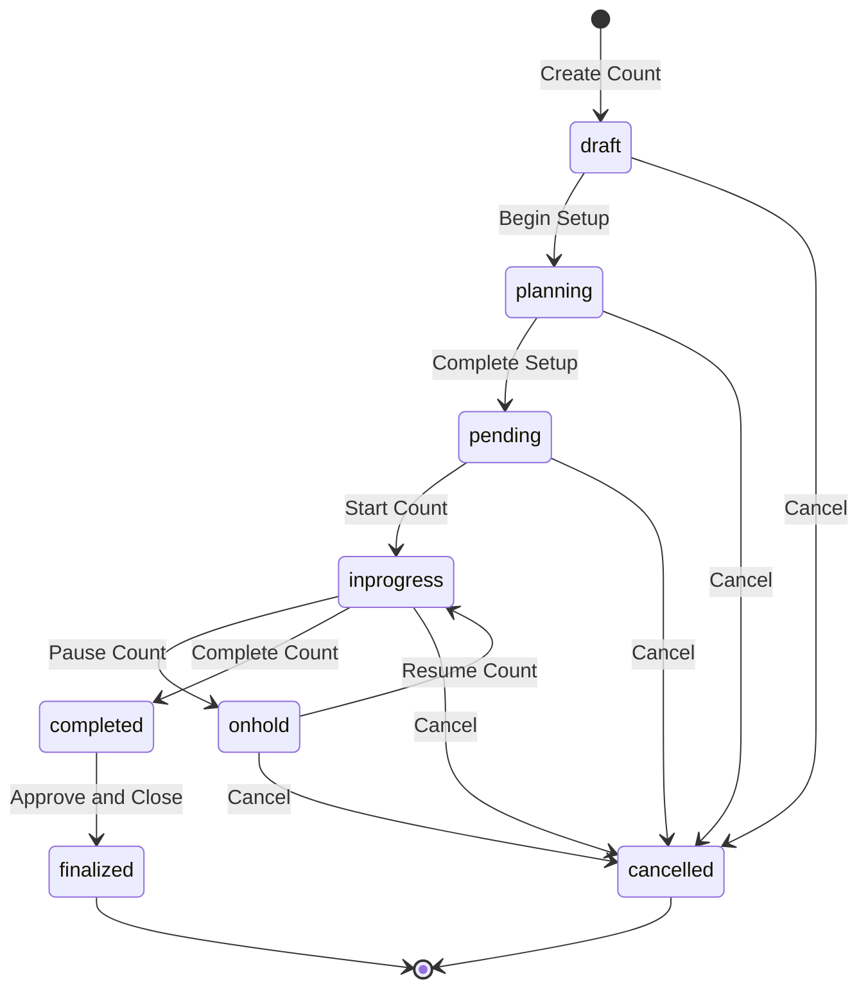
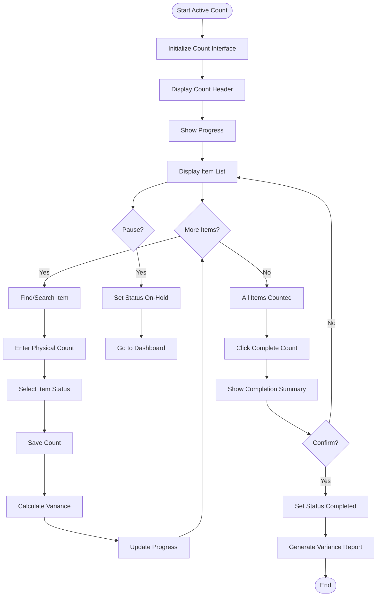
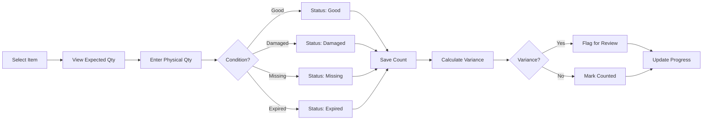
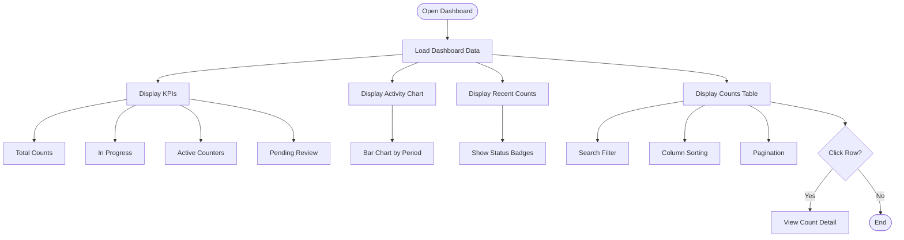
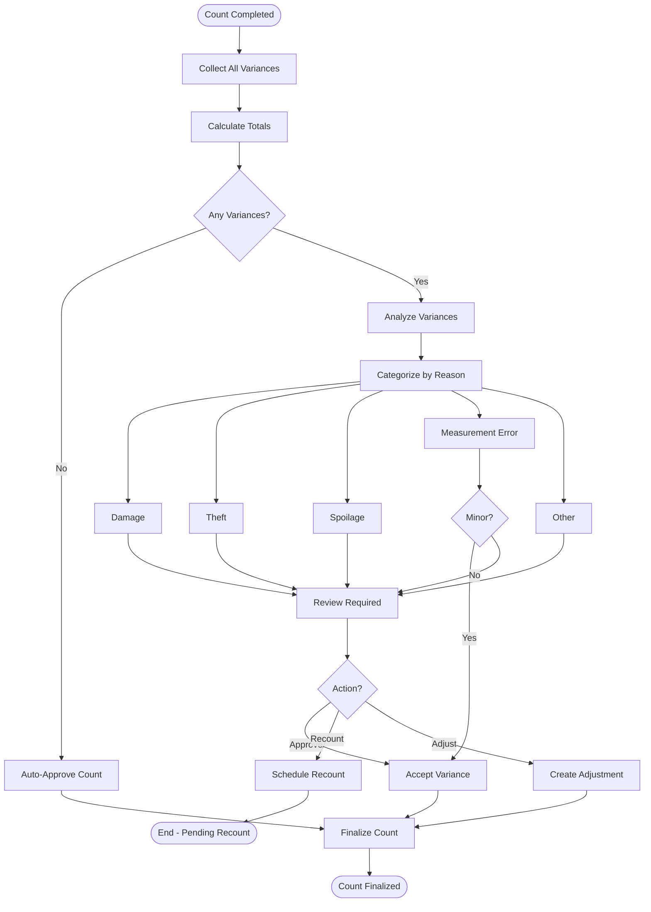
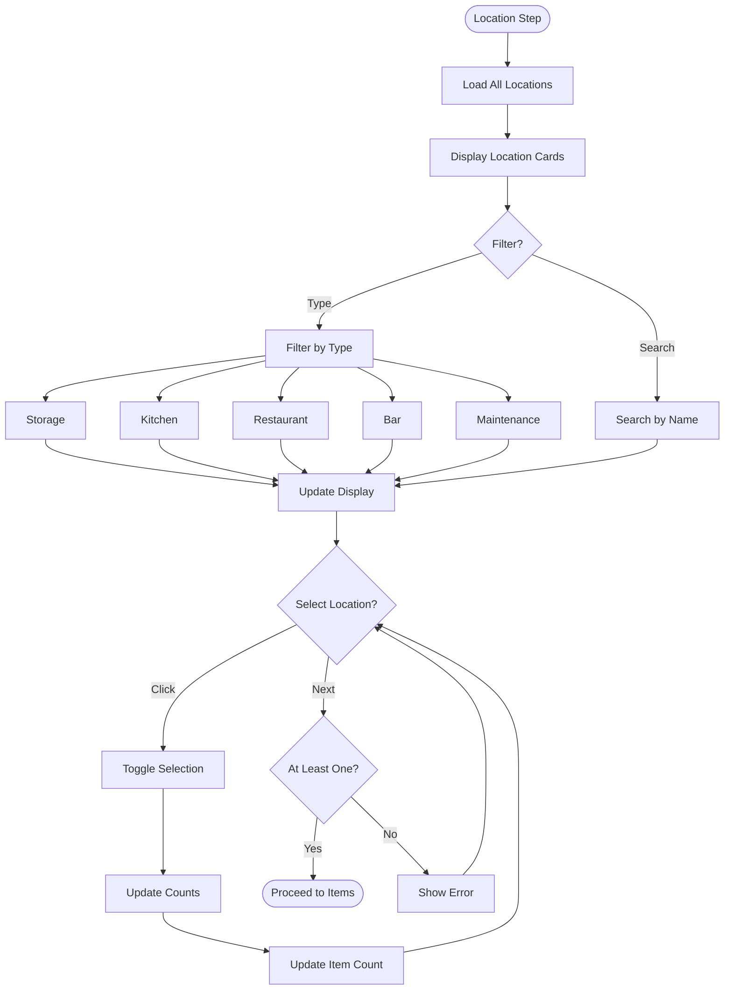
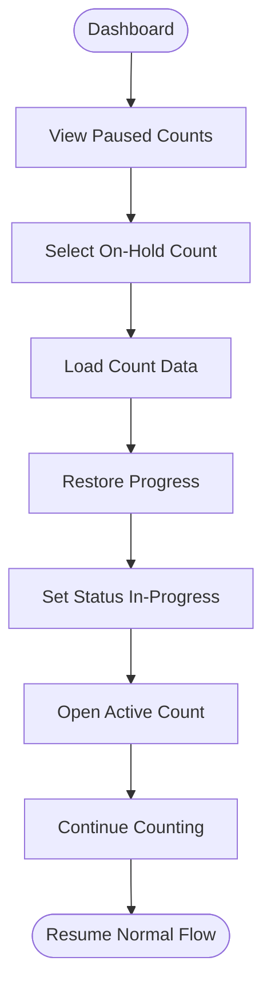
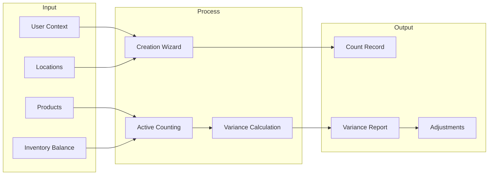

# Flow Diagrams: Physical Count

> Version: 1.0.0 | Status: Active | Last Updated: 2025-01-16

## 1. Document Control

| Field | Value |
|-------|-------|
| Module | Inventory Management |
| Feature | Physical Count |
| Document Type | Flow Diagrams |

## 2. Count Status Lifecycle

## 3. Creation Wizard Flow

```mermaid
graph TB
    START([Start]) --> STEP1[Step 1: Setup]

    subgraph Setup
        STEP1 --> AUTO[Auto-fill Counter Name]
        AUTO --> DEPT[Select Department]
        DEPT --> DATE[Select Date/Time]
        DATE --> NOTES[Enter Notes - Optional]
        NOTES --> VAL1{Valid?}
        VAL1 -->|No| DEPT
        VAL1 -->|Yes| NEXT1[Next]
    end

    NEXT1 --> STEP2[Step 2: Location Selection]

    subgraph Locations
        STEP2 --> FILTER[Filter by Type]
        FILTER --> SEARCH[Search Locations]
        SEARCH --> SELECT[Select Locations]
        SELECT --> VAL2{At Least One?}
        VAL2 -->|No| SELECT
        VAL2 -->|Yes| NEXT2[Next]
    end

    NEXT2 --> STEP3[Step 3: Item Review]

    subgraph Items
        STEP3 --> LOAD[Load Items from Locations]
        LOAD --> ISEARCH[Search Items]
        ISEARCH --> IFILTER[Filter by Category]
        IFILTER --> SORT[Sort Items]
        SORT --> REVIEW[Review List]
        REVIEW --> NEXT3[Next]
    end

    NEXT3 --> STEP4[Step 4: Final Review]

    subgraph FinalReview
        STEP4 --> SUMMARY[Display Summary]
        SUMMARY --> DURATION[Show Estimated Duration]
        DURATION --> CONFIRM{Confirm?}
        CONFIRM -->|Back| STEP3
        CONFIRM -->|Start| CREATE[Create Count Record]
    end

    CREATE --> ACTIVE[Navigate to Active Count]
    ACTIVE --> END([End])
```

## 4. Active Counting Flow

## 5. Item Counting Detail Flow

## 6. Dashboard View Flow

## 7. Variance Analysis Flow

## 8. Location Selection Detail

## 9. Resume Paused Count Flow

## 10. Data Flow Summary

---
*Document Version: 1.0.0 | Carmen ERP Physical Count Module*
