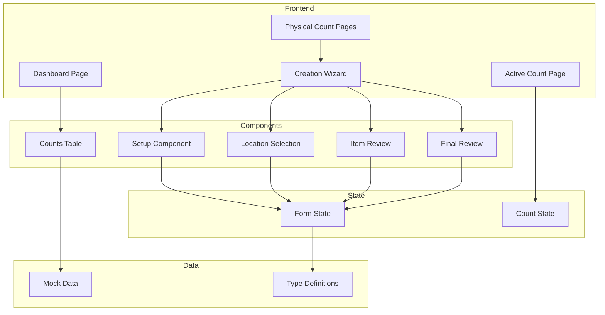
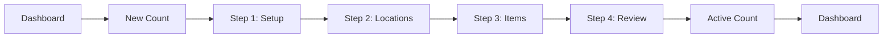
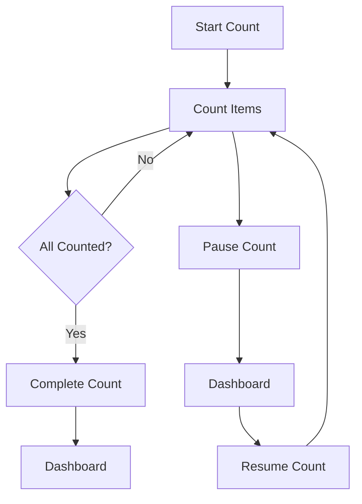
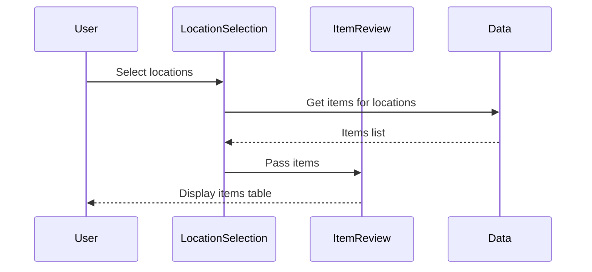
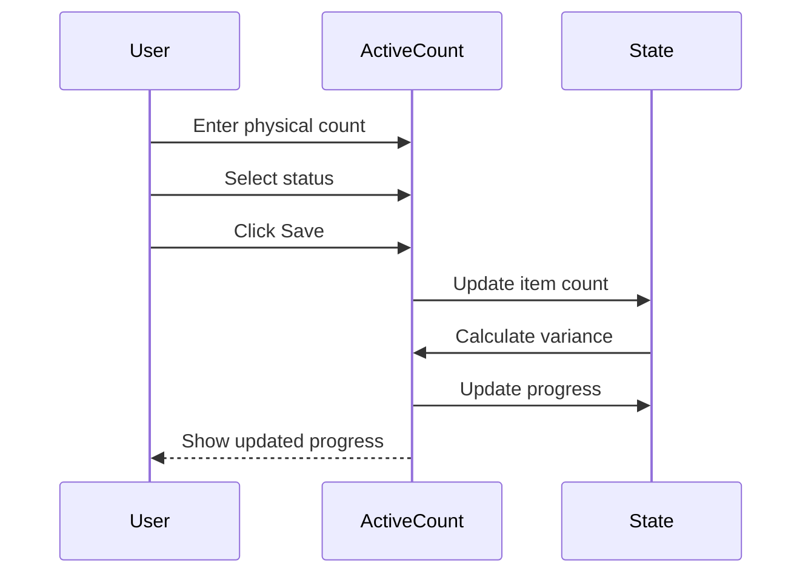

# Technical Specification: Physical Count

> Version: 1.0.0 | Status: Active | Last Updated: 2025-01-16

## 1. Document Control

| Field | Value |
|-------|-------|
| Module | Inventory Management |
| Feature | Physical Count |
| Document Type | Technical Specification |

## 2. System Architecture



## 3. Page Hierarchy

```mermaid
graph TB
    ROOT[/inventory-management/physical-count]
    DASH[/dashboard]
    ACTIVE[/active/id]

    ROOT --> DASH
    ROOT --> ACTIVE
```

### 3.1 Page Descriptions

| Route | Page | Purpose |
|-------|------|---------|
| `/physical-count` | Creation Wizard | 4-step wizard for creating new physical counts |
| `/physical-count/dashboard` | Dashboard | KPIs, charts, and counts management |
| `/physical-count/active/[id]` | Active Count | Real-time counting interface |

## 4. Component Architecture

### 4.1 Creation Wizard Components

| Component | File | Responsibility |
|-----------|------|----------------|
| SetupStep | `setup.tsx` | Captures counter info, department, date/time, notes |
| LocationSelection | `location-selection.tsx` | Multi-select locations with search and type filter |
| ItemReview | `item-review.tsx` | Display and filter items from selected locations |
| FinalReview | `final-review.tsx` | Summary display with Start Count action |

### 4.2 Dashboard Components

| Component | File | Responsibility |
|-----------|------|----------------|
| CountsTable | `counts-table.tsx` | Searchable, sortable, paginated table of all counts |

### 4.3 Component Details

**SetupStep**
- Auto-populates counter name from current user (read-only input)
- Department dropdown (required)
- Date/time picker (required)
- Notes textarea (optional)
- Validates completeness before allowing Next

**LocationSelection**
- Search input for location filtering
- Location type dropdown: all, storage, kitchen, restaurant, bar, maintenance
- Location cards with checkbox selection
- Selected count and item count display
- Multi-select support

**ItemReview**
- Search input for item filtering
- Category dropdown filter
- Sortable table columns: code, name, last purchase date
- Displays: item code, name, category, unit, expected quantity
- Total item count

**FinalReview**
- Counter information display
- Location count and item count summary
- Estimated duration calculation
- Category breakdown list
- Selected locations list
- Start Count button navigates to active page

**CountsTable**
- Search across department, location, counter
- Sortable columns: Department, Location, Counter, Start Time, Duration, Status, Items, Variance
- Status badges with colors: blue (in-progress), green (completed), yellow (pending), red (cancelled)
- Pagination controls

## 5. State Management

### 5.1 Wizard Form State

The creation wizard maintains form state across all steps:

| Field | Type | Source |
|-------|------|--------|
| counterName | string | Auto-populated from user context |
| department | string | User selection |
| dateTime | string | User input |
| notes | string | User input (optional) |
| selectedLocations | string[] | User multi-select |
| items | Item[] | Derived from location selection |

### 5.2 Active Count State

| Field | Type | Purpose |
|-------|------|---------|
| countId | string | Identifies current count |
| items | CountItem[] | Items to count with current values |
| progress | number | Items counted / total |
| startTime | Date | When count started |
| duration | string | Elapsed time display |

## 6. Navigation Flows

### 6.1 Count Creation Flow



### 6.2 Active Count Flow



## 7. Data Flow

### 7.1 Location to Items Flow



### 7.2 Item Counting Flow



## 8. Integration Points

### 8.1 Inbound Integrations

| Source | Data | Purpose |
|--------|------|---------|
| User Context | Current user | Auto-populate counter name |
| Location Service | Locations | Available locations for selection |
| Inventory Balance | Expected quantities | Variance calculation |
| Product Master | Item details | Item information display |

### 8.2 Outbound Integrations

| Destination | Data | Trigger |
|-------------|------|---------|
| Inventory Adjustments | Variance data | Count completion with variances |
| Audit Log | Count activities | All count operations |

## 9. Type Definitions

### 9.1 Physical Count Types

Located in `physical-count-management/types.ts`:

| Type | Values |
|------|--------|
| PhysicalCountType | 'full', 'cycle', 'annual', 'perpetual', 'partial' |
| PhysicalCountStatus | 'draft', 'planning', 'pending', 'in-progress', 'completed', 'finalized', 'cancelled', 'on-hold' |
| ItemCountStatus | 'pending', 'counted', 'variance', 'approved', 'skipped', 'recount' |
| VarianceReason | 'damage', 'theft', 'spoilage', 'measurement-error', 'system-error', 'receiving-error', 'issue-error', 'unknown', 'other' |

### 9.2 Key Interfaces

| Interface | Purpose |
|-----------|---------|
| PhysicalCount | Main count record with metadata |
| PhysicalCountItem | Individual item within a count |
| PhysicalCountSummary | Aggregated count statistics |
| PhysicalCountFilter | Dashboard filtering criteria |
| PhysicalCountTeamMember | Counter assignment |
| PhysicalCountZone | Location grouping |

## 10. Performance Considerations

| Aspect | Approach |
|--------|----------|
| Large item lists | Virtual scrolling, pagination |
| Real-time duration | Client-side timer, not polling |
| Search filtering | Debounced input, client-side filter |
| Progress tracking | Optimistic updates |

## 11. Security

| Concern | Implementation |
|---------|----------------|
| Authorization | User must have physical-count permission |
| Counter identity | Auto-populated from auth, read-only |
| Count ownership | Only assigned counter can modify active count |
| Audit trail | All count operations logged |

---
*Document Version: 1.0.0 | Carmen ERP Physical Count Module*
