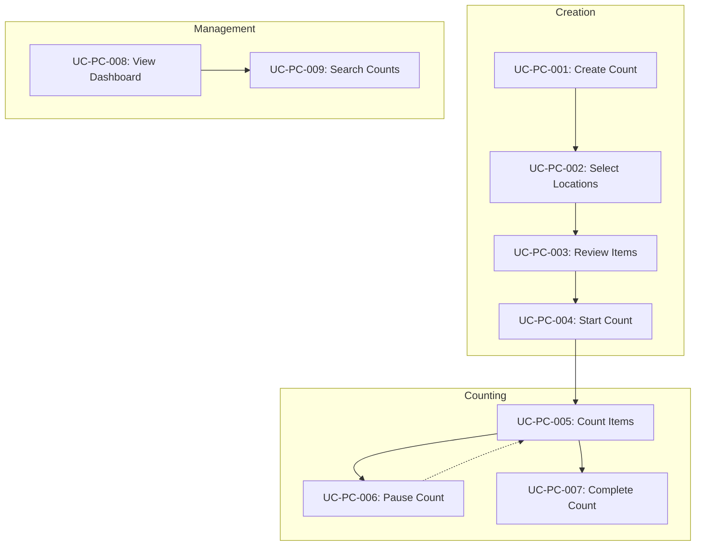

# Use Cases: Physical Count

> Version: 1.0.0 | Status: Active | Last Updated: 2025-01-16

## 1. Document Control

| Field | Value |
|-------|-------|
| Module | Inventory Management |
| Feature | Physical Count |
| Document Type | Use Cases |

## 2. Use Case Overview

| UC ID | Name | Actor | Priority |
|-------|------|-------|----------|
| UC-PC-001 | Create Physical Count | Storekeeper | High |
| UC-PC-002 | Select Count Locations | Storekeeper | High |
| UC-PC-003 | Review Item List | Storekeeper | Medium |
| UC-PC-004 | Start Physical Count | Storekeeper | High |
| UC-PC-005 | Count Items | Storekeeper | High |
| UC-PC-006 | Pause Count | Storekeeper | Medium |
| UC-PC-007 | Complete Count | Storekeeper | High |
| UC-PC-008 | View Dashboard | Inventory Manager | High |
| UC-PC-009 | Search and Filter Counts | Inventory Manager | Medium |

## 3. Detailed Use Cases

### UC-PC-001: Create Physical Count

**Actor**: Storekeeper, Receiving Clerk
**Priority**: High
**Trigger**: User navigates to Physical Count → New Count

**Preconditions**:
- User is authenticated
- User has permission to create physical counts
- No active count exists for this user

**Main Flow**:
1. System displays Step 1 (Setup) of the wizard
2. System auto-populates counter name from logged-in user
3. User selects department from dropdown
4. User selects date and time for count
5. User optionally enters notes
6. User clicks "Next"
7. System validates required fields
8. System advances to Step 2 (Location Selection)

**Alternative Flows**:

*A1: User leaves notes empty*
- Step 5: User skips notes field
- Continue to Step 6

**Exception Flows**:

*E1: Required field missing*
- Step 7: System highlights missing field (department or date/time)
- User remains on Step 1
- User must complete required fields

**Postconditions**:
- Count setup information captured
- Wizard advances to location selection

---

### UC-PC-002: Select Count Locations

**Actor**: Storekeeper
**Priority**: High
**Trigger**: Wizard advances to Step 2

**Preconditions**:
- Count setup completed (Step 1)
- Locations exist in system

**Main Flow**:
1. System displays available locations
2. System shows location type filter (all, storage, kitchen, restaurant, bar, maintenance)
3. User optionally filters by location type
4. User optionally searches by location name
5. User clicks locations to select them
6. System updates selection count and item count
7. User clicks "Next"
8. System validates at least one location selected
9. System advances to Step 3 (Item Review)

**Alternative Flows**:

*A1: User filters by type*
- Step 3: User selects location type from dropdown
- System filters location list to matching type
- Continue to Step 4

*A2: User searches locations*
- Step 4: User types in search field
- System filters locations by name match
- Continue to Step 5

*A3: User deselects location*
- Step 5: User clicks selected location again
- System removes from selection
- System updates counts
- Continue to Step 5

**Exception Flows**:

*E1: No locations selected*
- Step 8: System displays validation error
- User must select at least one location

**Postconditions**:
- One or more locations selected
- Item list loaded based on locations

---

### UC-PC-003: Review Item List

**Actor**: Storekeeper
**Priority**: Medium
**Trigger**: Wizard advances to Step 3

**Preconditions**:
- Locations selected
- Items loaded for selected locations

**Main Flow**:
1. System displays items from selected locations
2. System shows columns: code, name, category, unit, expected quantity
3. User optionally searches items
4. User optionally filters by category
5. User optionally sorts by clicking column headers
6. User reviews item list
7. User clicks "Next"
8. System advances to Step 4 (Final Review)

**Alternative Flows**:

*A1: User searches items*
- Step 3: User enters text in search field
- System filters items matching code or name
- Continue to Step 6

*A2: User filters by category*
- Step 4: User selects category from dropdown
- System filters items to selected category
- Continue to Step 6

*A3: User sorts items*
- Step 5: User clicks column header
- System sorts by that column (toggle asc/desc)
- Continue to Step 6

*A4: User returns to previous step*
- Step 6: User clicks "Back"
- System returns to Step 2
- Previous selections preserved

**Postconditions**:
- User has reviewed count scope
- Ready for final confirmation

---

### UC-PC-004: Start Physical Count

**Actor**: Storekeeper
**Priority**: High
**Trigger**: Wizard advances to Step 4, user clicks Start Count

**Preconditions**:
- All wizard steps completed
- At least one location with items selected

**Main Flow**:
1. System displays final review summary
2. System shows: counter info, location count, item count, estimated duration
3. System displays category breakdown
4. System lists selected locations
5. User reviews summary
6. User clicks "Start Count"
7. System creates count record with status "in-progress"
8. System generates unique count ID
9. System records start time
10. System navigates to active counting page

**Alternative Flows**:

*A1: User wants to modify selection*
- Step 5: User clicks "Back"
- System returns to Step 3
- User can modify item selection

**Postconditions**:
- Physical count record created
- Count status set to "in-progress"
- Start time recorded
- User on active counting interface

---

### UC-PC-005: Count Items

**Actor**: Storekeeper
**Priority**: High
**Trigger**: User on active count page

**Preconditions**:
- Active count exists
- Count status is "in-progress"

**Main Flow**:
1. System displays count header (count number, counter, start time, duration)
2. System shows progress (items counted / total)
3. System displays item list
4. User locates item to count
5. User enters physical count quantity
6. User selects item status (good, damaged, missing, expired)
7. User clicks "Save Count"
8. System saves item count
9. System calculates variance (physical - expected)
10. System updates progress
11. Repeat steps 4-10 for remaining items

**Alternative Flows**:

*A1: User searches for specific item*
- Step 4: User enters text in search field
- System filters item list
- User selects item from filtered results

*A2: Item is damaged*
- Step 6: User selects "damaged"
- Continue to Step 7
- System flags item for follow-up

*A3: Item is missing*
- Step 6: User selects "missing"
- User enters 0 for physical count
- Continue to Step 7

**Postconditions**:
- Item count recorded
- Variance calculated
- Progress updated

---

### UC-PC-006: Pause Count

**Actor**: Storekeeper
**Priority**: Medium
**Trigger**: User clicks "Pause Count"

**Preconditions**:
- Active count in progress
- At least one item counted (optional)

**Main Flow**:
1. User clicks "Pause Count" button
2. System prompts for confirmation
3. User confirms pause
4. System saves current progress
5. System updates count status to "on-hold"
6. System records pause time
7. System navigates to dashboard

**Alternative Flows**:

*A1: User cancels pause*
- Step 3: User clicks "Cancel"
- System returns to counting interface
- Count continues

**Postconditions**:
- Count progress saved
- Count status changed to "on-hold"
- Count can be resumed later

---

### UC-PC-007: Complete Count

**Actor**: Storekeeper
**Priority**: High
**Trigger**: User clicks "Complete Count"

**Preconditions**:
- Active count in progress
- All items counted (recommended)

**Main Flow**:
1. User clicks "Complete Count" button
2. System calculates total variances
3. System displays completion summary
4. System shows: items counted, total variance, items with variance
5. User confirms completion
6. System updates count status to "completed"
7. System records end time and duration
8. System generates variance report
9. System navigates to dashboard

**Alternative Flows**:

*A1: Items remain uncounted*
- Step 2: System warns about uncounted items
- User can choose to continue or return to counting

*A2: Significant variances detected*
- Step 3: System highlights high-variance items
- System prompts for variance acknowledgment

**Postconditions**:
- Count status set to "completed"
- End time and duration recorded
- Variance report available
- Count ready for review/finalization

---

### UC-PC-008: View Dashboard

**Actor**: Inventory Manager, Storekeeper
**Priority**: High
**Trigger**: User navigates to Physical Count Dashboard

**Preconditions**:
- User has permission to view physical counts

**Main Flow**:
1. System displays dashboard page
2. System shows KPI cards: Total Counts, In Progress, Active Counters, Pending Review
3. System displays bar chart of count activity
4. System shows recent counts list with status badges
5. System displays counts table with all records
6. User reviews count status and activities

**Alternative Flows**:

*A1: User clicks on a count*
- Step 6: User clicks count row
- System navigates to count detail view

**Postconditions**:
- User has visibility into counting operations

---

### UC-PC-009: Search and Filter Counts

**Actor**: Inventory Manager
**Priority**: Medium
**Trigger**: User on dashboard, wants to find specific counts

**Preconditions**:
- Dashboard displayed
- Counts exist in system

**Main Flow**:
1. User enters search text in search field
2. System filters counts matching department, location, or counter
3. User reviews filtered results
4. User optionally sorts by clicking column header
5. User optionally navigates pages if results exceed page size

**Alternative Flows**:

*A1: User filters by status*
- Step 1: User clicks status filter
- System shows only counts with selected status

*A2: User clears search*
- Step 3: User clears search field
- System shows all counts

**Postconditions**:
- Filtered count list displayed
- User can locate specific counts

## 4. Use Case Relationships

---
*Document Version: 1.0.0 | Carmen ERP Physical Count Module*
