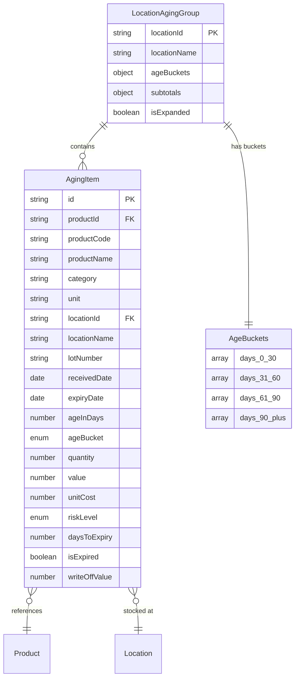

# DD-INV-AGE: Inventory Aging Data Dictionary

**Document Version**: 1.0
**Last Updated**: 2026-01-15
**Module**: Inventory Management
**Sub-Module**: Stock Overview > Inventory Aging

---

## Document History

| Version | Date | Author | Changes |
|---------|------|--------|---------|
| 1.0.0 | 2026-01-15 | Documentation Team | Initial version |

---

## Document Overview

This document provides comprehensive data schema documentation for the Inventory Aging sub-module. It defines the data structures, types, and relationships used for age bucket analysis and expiry tracking of inventory items.

**Related Documents**:
- [INDEX-inventory-aging.md](./INDEX-inventory-aging.md)
- [BR-inventory-aging.md](./BR-inventory-aging.md)
- [TS-inventory-aging.md](./TS-inventory-aging.md)
- [DD-stock-overview.md](../DD-stock-overview.md) (Parent schema)

---

## Entity-Relationship Diagram



---

## Core Interfaces

### AgingItem

**Purpose**: Individual inventory item with age and expiry tracking

**TypeScript Definition**:
```typescript
interface AgingItem {
  id: string
  productId: string
  productCode: string
  productName: string
  category: string
  unit: string
  locationId: string
  locationName: string
  lotNumber?: string
  receivedDate: Date
  expiryDate?: Date
  ageInDays: number
  ageBucket: '0-30' | '31-60' | '61-90' | '90+'
  quantity: number
  value: number
  unitCost: number
  riskLevel: 'low' | 'medium' | 'high' | 'critical'
  daysToExpiry?: number
  isExpired: boolean
  writeOffValue?: number
}
```

**Field Definitions**:

| Field | Type | Required | Constraints | Description |
|-------|------|----------|-------------|-------------|
| `id` | `string` | Yes | UUID format | Unique record identifier |
| `productId` | `string` | Yes | UUID, FK | Reference to product |
| `productCode` | `string` | Yes | Max 50 chars | Product code |
| `productName` | `string` | Yes | Max 255 chars | Product display name |
| `category` | `string` | Yes | Max 100 chars | Product category |
| `unit` | `string` | Yes | Max 20 chars | Unit of measure |
| `locationId` | `string` | Yes | UUID, FK | Reference to location |
| `locationName` | `string` | Yes | Max 255 chars | Location display name |
| `lotNumber` | `string` | No | Max 50 chars | Lot/batch number |
| `receivedDate` | `Date` | Yes | Valid date | Date item was received |
| `expiryDate` | `Date` | No | Valid date | Expiration date |
| `ageInDays` | `number` | Yes | >= 0 | Days since received |
| `ageBucket` | `enum` | Yes | Valid bucket | Age classification |
| `quantity` | `number` | Yes | >= 0 | Current quantity |
| `value` | `number` | Yes | >= 0 | Total inventory value |
| `unitCost` | `number` | Yes | >= 0 | Cost per unit |
| `riskLevel` | `enum` | Yes | Valid level | Risk classification |
| `daysToExpiry` | `number` | No | Integer | Days until expiration |
| `isExpired` | `boolean` | Yes | - | Whether item is expired |
| `writeOffValue` | `number` | No | >= 0 | Estimated writeoff value |

---

### LocationAgingGroup

**Purpose**: Aging items grouped by location with bucket breakdown

**TypeScript Definition**:
```typescript
interface LocationAgingGroup {
  locationId: string
  locationName: string
  ageBuckets: {
    '0-30': AgingItem[]
    '31-60': AgingItem[]
    '61-90': AgingItem[]
    '90+': AgingItem[]
  }
  subtotals: {
    totalItems: number
    totalQuantity: number
    totalValue: number
    criticalItems: number
    expiredItems: number
    expiringItems: number
    bucketSummaries: AgingBucketSummary[]
  }
  isExpanded: boolean
}
```

**Field Definitions**:

| Field | Type | Required | Description |
|-------|------|----------|-------------|
| `locationId` | `string` | Yes | Location identifier |
| `locationName` | `string` | Yes | Location display name |
| `ageBuckets` | `object` | Yes | Items organized by age bucket |
| `ageBuckets['0-30']` | `AgingItem[]` | Yes | Items 0-30 days old |
| `ageBuckets['31-60']` | `AgingItem[]` | Yes | Items 31-60 days old |
| `ageBuckets['61-90']` | `AgingItem[]` | Yes | Items 61-90 days old |
| `ageBuckets['90+']` | `AgingItem[]` | Yes | Items 90+ days old |
| `subtotals.totalItems` | `number` | Yes | Total item count |
| `subtotals.totalQuantity` | `number` | Yes | Sum of quantities |
| `subtotals.totalValue` | `number` | Yes | Sum of values |
| `subtotals.criticalItems` | `number` | Yes | Critical risk count |
| `subtotals.expiredItems` | `number` | Yes | Expired item count |
| `subtotals.expiringItems` | `number` | Yes | Expiring in 7 days count |
| `subtotals.bucketSummaries` | `AgingBucketSummary[]` | Yes | Per-bucket summaries |
| `isExpanded` | `boolean` | Yes | UI expansion state |

---

### AgingBucketSummary

**Purpose**: Aggregated metrics for a single age bucket

**TypeScript Definition**:
```typescript
interface AgingBucketSummary {
  bucket: '0-30' | '31-60' | '61-90' | '90+'
  quantity: number
  value: number
  itemCount: number
  percentage: number
  criticalCount: number
}
```

**Field Definitions**:

| Field | Type | Description |
|-------|------|-------------|
| `bucket` | `enum` | Age bucket identifier |
| `quantity` | `number` | Total quantity in bucket |
| `value` | `number` | Total value in bucket |
| `itemCount` | `number` | Number of items in bucket |
| `percentage` | `number` | Percentage of total value |
| `criticalCount` | `number` | Critical items in bucket |

---

## Enumerations

### AgeBucket

**Purpose**: Classification of inventory age

**Type Definition**:
```typescript
type AgeBucket = '0-30' | '31-60' | '61-90' | '90+'
```

**Values**:

| Value | Days Range | Color | Description |
|-------|------------|-------|-------------|
| `0-30` | 0-30 days | Green | Fresh inventory |
| `31-60` | 31-60 days | Amber | Aging inventory |
| `61-90` | 61-90 days | Orange | Old inventory |
| `90+` | 91+ days | Red | Very old inventory |

**Bucket Assignment**:
```typescript
function getAgeBucket(ageInDays: number): AgeBucket {
  if (ageInDays <= 30) return '0-30'
  if (ageInDays <= 60) return '31-60'
  if (ageInDays <= 90) return '61-90'
  return '90+'
}
```

---

### RiskLevel

**Purpose**: Risk classification based on age and expiry

**Type Definition**:
```typescript
type RiskLevel = 'low' | 'medium' | 'high' | 'critical'
```

**Values**:

| Value | Condition | Color | Description |
|-------|-----------|-------|-------------|
| `low` | Age <= 30 days, expiry > 14 days | Green | Normal stock |
| `medium` | Age 31-90 days or expiry 7-14 days | Amber | Monitor |
| `high` | Age > 90 days or expiry < 7 days | Orange | Action needed |
| `critical` | Expired or expiry < 3 days | Red | Immediate action |

**Risk Level Calculation**:
```typescript
function calculateRiskLevel(
  ageInDays: number,
  daysToExpiry?: number,
  isExpired: boolean
): RiskLevel {
  if (isExpired || (daysToExpiry !== undefined && daysToExpiry < 7)) {
    return 'critical'
  }
  if (daysToExpiry !== undefined && daysToExpiry < 14) {
    return 'high'
  }
  if (ageInDays > 90) {
    return 'medium'
  }
  return 'low'
}
```

---

## Expiry Status

### ExpiryStatus

**Purpose**: Classification of expiry status

**Type Definition**:
```typescript
type ExpiryStatus = 'expired' | 'critical' | 'warning' | 'normal' | 'no_expiry'
```

**Values**:

| Value | Condition | Color | Icon |
|-------|-----------|-------|------|
| `expired` | daysToExpiry < 0 | Red | AlertTriangle |
| `critical` | daysToExpiry 0-3 | Red | AlertCircle |
| `warning` | daysToExpiry 4-7 | Amber | Clock |
| `normal` | daysToExpiry > 7 | Green | CheckCircle |
| `no_expiry` | expiryDate null | Gray | Minus |

---

## Filter Configuration

### AgingFilter

**Purpose**: Filter parameters for aging inventory view

**TypeScript Definition**:
```typescript
interface AgingFilter {
  locations: string[]
  categories: string[]
  ageBuckets: AgeBucket[]
  riskLevels: RiskLevel[]
  expiryStatus: ExpiryStatus[]
  minAge: number
  maxAge: number
  showExpiredOnly: boolean
  showExpiringOnly: boolean
  search: string
}
```

**Field Definitions**:

| Field | Type | Default | Description |
|-------|------|---------|-------------|
| `locations` | `string[]` | [] | Selected location IDs |
| `categories` | `string[]` | [] | Selected categories |
| `ageBuckets` | `AgeBucket[]` | [] | Selected age buckets |
| `riskLevels` | `RiskLevel[]` | [] | Selected risk levels |
| `expiryStatus` | `ExpiryStatus[]` | [] | Selected expiry statuses |
| `minAge` | `number` | 0 | Minimum age in days |
| `maxAge` | `number` | 365 | Maximum age in days |
| `showExpiredOnly` | `boolean` | false | Show only expired items |
| `showExpiringOnly` | `boolean` | false | Show items expiring in 7 days |
| `search` | `string` | "" | Text search |

---

## Analytics Data Structures

### AgingDistribution

**Purpose**: Distribution of inventory value by age bucket

```typescript
interface AgingDistribution {
  bucket: AgeBucket
  itemCount: number
  quantity: number
  value: number
  percentage: number
}
```

### ExpiryDistribution

**Purpose**: Distribution of items by expiry status

```typescript
interface ExpiryDistribution {
  status: ExpiryStatus
  itemCount: number
  value: number
  percentage: number
}
```

### AgingTrend

**Purpose**: Historical trend of aging inventory

```typescript
interface AgingTrend {
  period: string
  bucket_0_30: number
  bucket_31_60: number
  bucket_61_90: number
  bucket_90_plus: number
  expiredValue: number
}
```

---

## Summary Metrics

### AgingSummary

**Purpose**: Aggregate metrics for aging inventory

```typescript
interface AgingSummary {
  totalItems: number
  totalQuantity: number
  totalValue: number
  averageAge: number
  agingDistribution: AgingDistribution[]
  expiryMetrics: {
    expiredItems: number
    expiredValue: number
    expiringIn7Days: number
    expiringIn7DaysValue: number
    expiringIn30Days: number
    expiringIn30DaysValue: number
  }
  riskDistribution: {
    low: number
    medium: number
    high: number
    critical: number
  }
  writeOffRisk: number
}
```

**Calculated Fields**:

| Field | Formula | Description |
|-------|---------|-------------|
| `averageAge` | Mean of all item ages | Average inventory age |
| `writeOffRisk` | Sum of critical + expired values | Value at risk of writeoff |
| `percentage` | `(bucket.value / totalValue) * 100` | Bucket percentage |

---

## Action Records

### AgingAction

**Purpose**: Record of action taken on aging item

```typescript
interface AgingAction {
  id: string
  agingItemId: string
  actionType: 'writeoff' | 'markdown' | 'transfer' | 'dispose'
  actionDate: Date
  performedBy: string
  reason: string
  quantityAffected: number
  valueAffected: number
  writeOffAmount?: number
  notes: string
}
```

**Field Definitions**:

| Field | Type | Description |
|-------|------|-------------|
| `id` | `string` | Action record identifier |
| `agingItemId` | `string` | Reference to aging item |
| `actionType` | `enum` | Type of action taken |
| `actionDate` | `Date` | Date action was taken |
| `performedBy` | `string` | User who performed action |
| `reason` | `string` | Reason for action |
| `quantityAffected` | `number` | Quantity involved |
| `valueAffected` | `number` | Value involved |
| `writeOffAmount` | `number` | Amount written off |
| `notes` | `string` | Additional notes |

---

## Validation Rules

### Age Calculation

| Rule | Formula | Description |
|------|---------|-------------|
| Age in Days | `CURRENT_DATE - receivedDate` | Days since receipt |
| Days to Expiry | `expiryDate - CURRENT_DATE` | Days until expiration |
| Is Expired | `daysToExpiry < 0` | Expiration flag |

### Value Constraints

| Field | Constraint | Error Message |
|-------|------------|---------------|
| `ageInDays` | >= 0 | "Age cannot be negative" |
| `quantity` | >= 0 | "Quantity cannot be negative" |
| `value` | >= 0 | "Value cannot be negative" |
| `daysToExpiry` | Integer | "Days must be whole number" |

### Date Constraints

| Field | Constraint | Error Message |
|-------|------------|---------------|
| `receivedDate` | <= Current date | "Cannot receive in future" |
| `expiryDate` | Valid date | "Invalid expiry date" |

---

## Sample Data

### Sample Aging Item

```json
{
  "id": "aging-loc001-prod001-1",
  "productId": "prod-001",
  "productCode": "FOOD-001",
  "productName": "All-Purpose Flour",
  "category": "Food",
  "unit": "kg",
  "locationId": "loc-001",
  "locationName": "Main Kitchen",
  "lotNumber": "LOT-20251215A",
  "receivedDate": "2025-12-15T00:00:00.000Z",
  "expiryDate": "2026-02-15T00:00:00.000Z",
  "ageInDays": 38,
  "ageBucket": "31-60",
  "quantity": 75,
  "value": 412.50,
  "unitCost": 5.50,
  "riskLevel": "medium",
  "daysToExpiry": 24,
  "isExpired": false,
  "writeOffValue": null
}
```

### Sample Location Aging Group

```json
{
  "locationId": "loc-001",
  "locationName": "Main Kitchen",
  "ageBuckets": {
    "0-30": ["...items..."],
    "31-60": ["...items..."],
    "61-90": ["...items..."],
    "90+": ["...items..."]
  },
  "subtotals": {
    "totalItems": 45,
    "totalQuantity": 2850,
    "totalValue": 42500.00,
    "criticalItems": 3,
    "expiredItems": 1,
    "expiringItems": 5,
    "bucketSummaries": [
      { "bucket": "0-30", "quantity": 1500, "value": 25000, "itemCount": 20, "percentage": 58.8, "criticalCount": 0 },
      { "bucket": "31-60", "quantity": 800, "value": 12000, "itemCount": 15, "percentage": 28.2, "criticalCount": 1 },
      { "bucket": "61-90", "quantity": 400, "value": 4000, "itemCount": 7, "percentage": 9.4, "criticalCount": 1 },
      { "bucket": "90+", "quantity": 150, "value": 1500, "itemCount": 3, "percentage": 3.6, "criticalCount": 1 }
    ]
  },
  "isExpanded": true
}
```

---

## Database Mapping

This sub-module uses data from the following parent schema tables:

| Interface | Primary Table | Related Tables |
|-----------|--------------|----------------|
| `AgingItem` | `tb_inventory_transaction` | `tb_inventory_item`, `tb_stock_balance` |
| `LocationAgingGroup` | Grouped by `tb_location` | `tb_inventory_transaction` |

### Aging Query

```sql
SELECT
  t.id,
  i.id as product_id,
  i.item_code as product_code,
  i.item_name as product_name,
  c.category_name as category,
  u.unit_symbol as unit,
  l.id as location_id,
  l.location_name,
  t.lot_no as lot_number,
  t.transaction_date as received_date,
  t.expiry_date,
  EXTRACT(DAY FROM (CURRENT_DATE - t.transaction_date)) as age_in_days,
  CASE
    WHEN EXTRACT(DAY FROM (CURRENT_DATE - t.transaction_date)) <= 30 THEN '0-30'
    WHEN EXTRACT(DAY FROM (CURRENT_DATE - t.transaction_date)) <= 60 THEN '31-60'
    WHEN EXTRACT(DAY FROM (CURRENT_DATE - t.transaction_date)) <= 90 THEN '61-90'
    ELSE '90+'
  END as age_bucket,
  t.quantity,
  t.total_cost as value,
  t.unit_cost,
  CASE
    WHEN t.expiry_date < CURRENT_DATE THEN 'critical'
    WHEN t.expiry_date < CURRENT_DATE + INTERVAL '7 days' THEN 'high'
    WHEN EXTRACT(DAY FROM (CURRENT_DATE - t.transaction_date)) > 90 THEN 'medium'
    ELSE 'low'
  END as risk_level,
  EXTRACT(DAY FROM (t.expiry_date - CURRENT_DATE)) as days_to_expiry,
  t.expiry_date < CURRENT_DATE as is_expired
FROM tb_inventory_transaction t
INNER JOIN tb_inventory_item i ON t.item_id = i.id
INNER JOIN tb_category c ON i.category_id = c.id
INNER JOIN tb_unit u ON i.base_unit_id = u.id
INNER JOIN tb_location l ON t.location_id = l.id
WHERE t.transaction_type = 'RECEIVE'
  AND t.quantity > 0
ORDER BY age_in_days DESC, days_to_expiry ASC NULLS LAST;
```

---

## State Management

### Component State

```typescript
interface InventoryAgingState {
  items: AgingItem[]
  groups: LocationAgingGroup[]
  filter: AgingFilter
  summary: AgingSummary
  selectedItems: Set<string>
  activeTab: 'inventory' | 'analytics' | 'actions'
  activeAgeBucket: AgeBucket | 'all'
  isLoading: boolean
  sortConfig: {
    key: string
    direction: 'asc' | 'desc'
  }
}
```

---

**Document Control**

| Version | Date | Author | Changes |
|---------|------|--------|---------|
| 1.0.0 | 2026-01-15 | Documentation Team | Initial data dictionary |
