# Flow Diagrams: Inventory Aging

## Document Information
| Field | Value |
|-------|-------|
| Module | Inventory Management |
| Sub-module | Inventory Aging |
| Version | 3.0.0 |
| Last Updated | 2025-01-15 |

## Document History
| Version | Date | Author | Changes |
|---------|------|--------|---------|
| 3.0.0 | 2025-01-15 | Documentation Team | Synced with current code; Updated expiry thresholds (30/90 days); Added alert generation flow; Added expiry timeline flow; Added location aging performance flow; Added oldest items flow; Updated color assignments |
| 2.0.0 | 2024-06-15 | System | Previous version |
| 1.0 | 2024-01-15 | Documentation Team | Initial version |

---

## 1. Page Load Flow

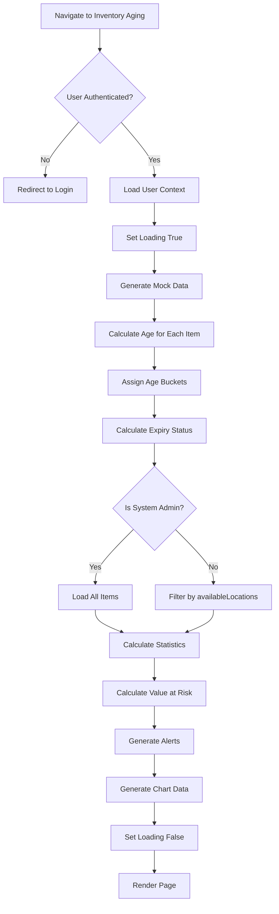

**Source Evidence**: `inventory-aging/page.tsx:84-120`

---

## 2. Age Calculation Flow

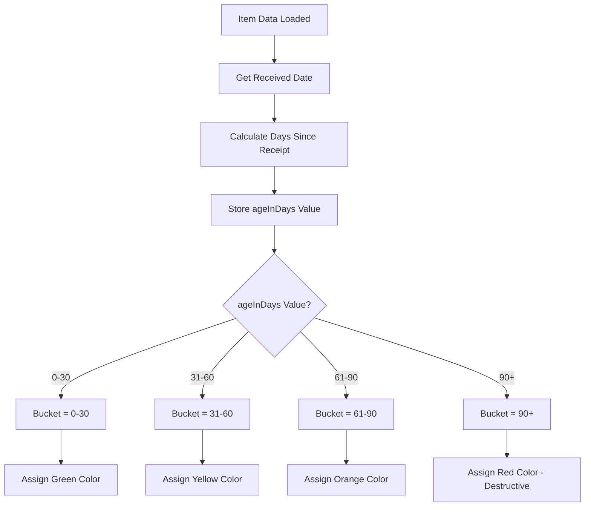

**Source Evidence**: `inventory-aging/page.tsx:281-296`

---

## 3. Expiry Status Calculation Flow

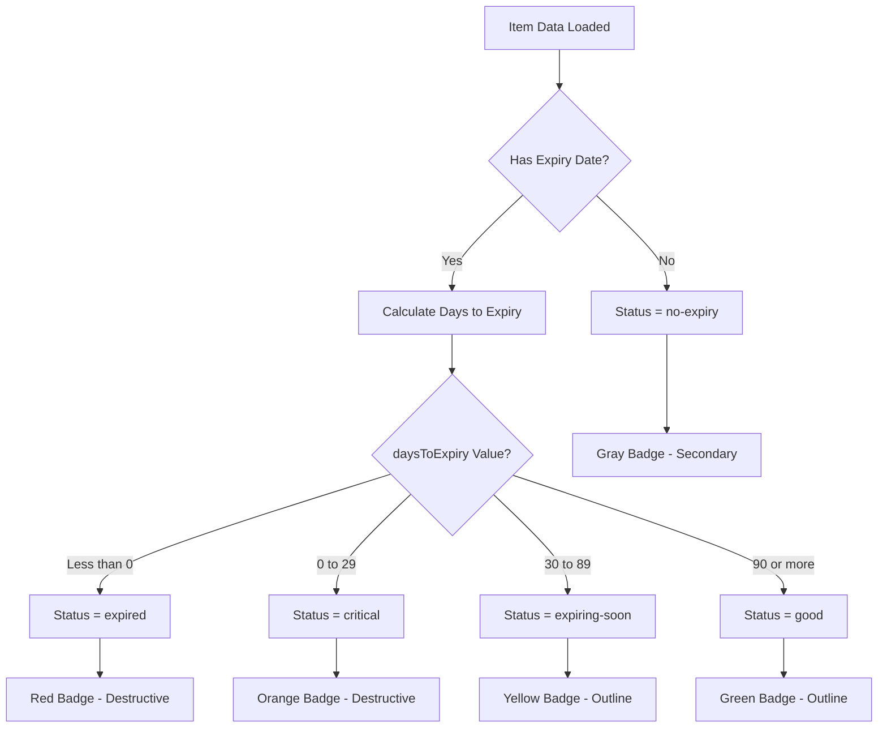

**Source Evidence**: `inventory-aging/page.tsx:129-136`

---

## 4. Alert Generation Flow

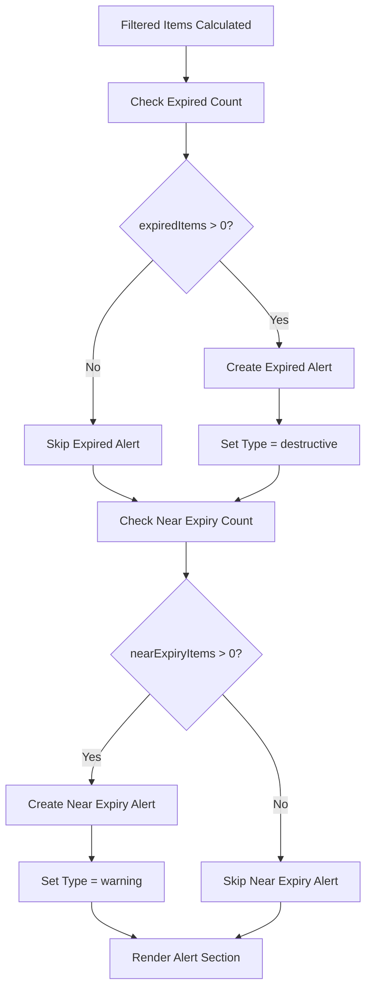

**Source Evidence**: `inventory-aging/page.tsx:694-718`

---

## 5. Value at Risk Calculation Flow

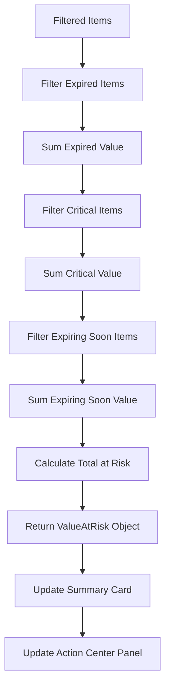

**Source Evidence**: `inventory-aging/page.tsx:503-517`

---

## 6. Filter Application Flow

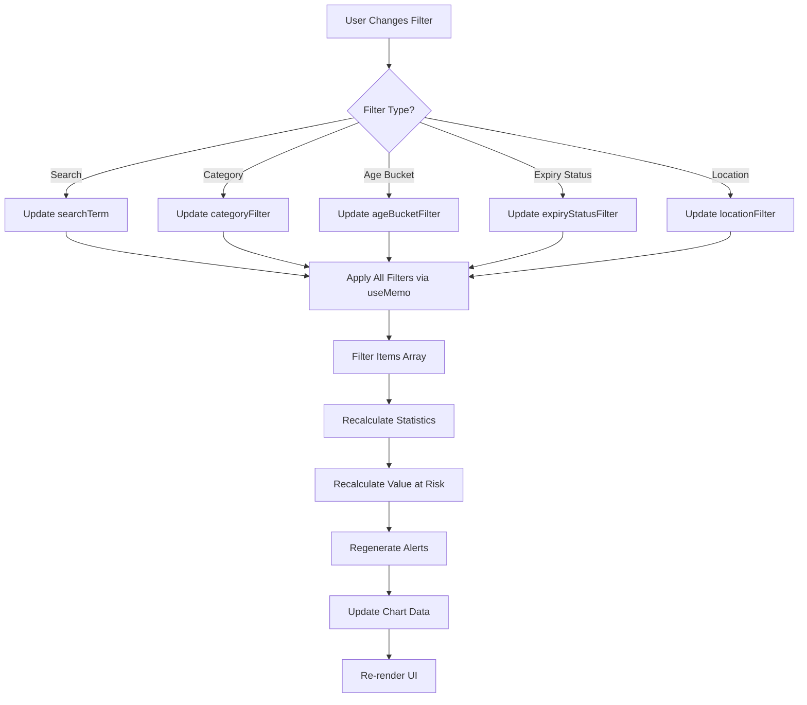

**Source Evidence**: `inventory-aging/page.tsx:820-903`

---

## 7. Tab Navigation Flow

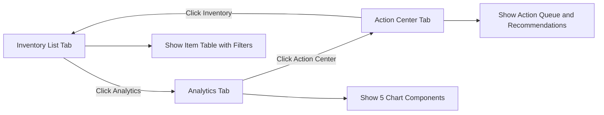

**Source Evidence**: `inventory-aging/page.tsx:807-813`

---

## 8. Group By Selection Flow

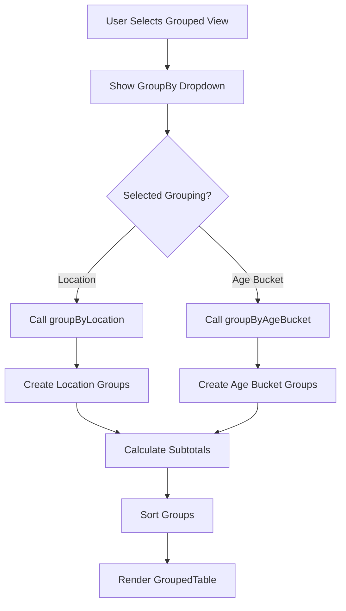

**Source Evidence**: `inventory-aging/page.tsx:854-862`

---

## 9. Group by Location Flow

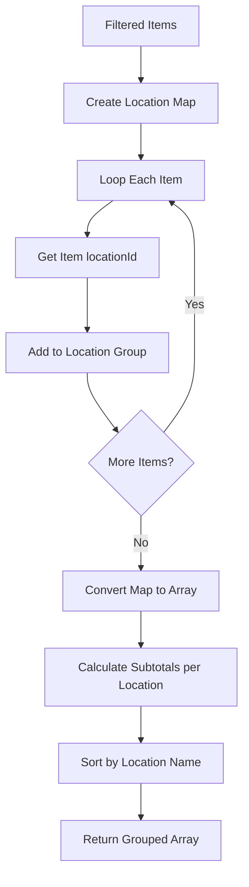

---

## 10. Group by Age Bucket Flow

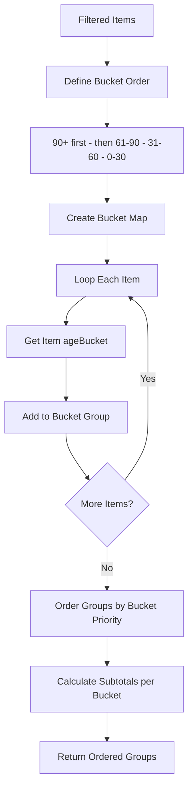

---

## 11. Expiry Timeline Chart Flow

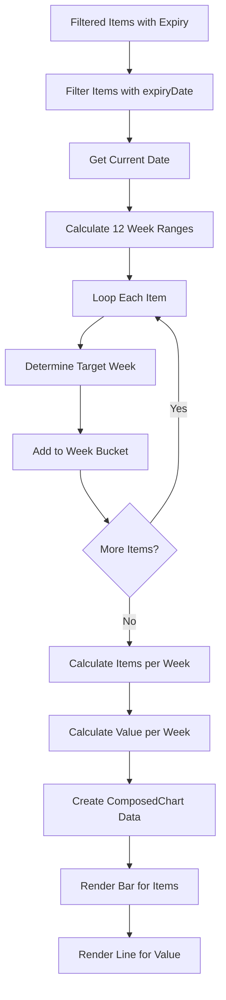

**Source Evidence**: `inventory-aging/page.tsx:1124-1156`

---

## 12. Age Bucket Distribution Chart Flow

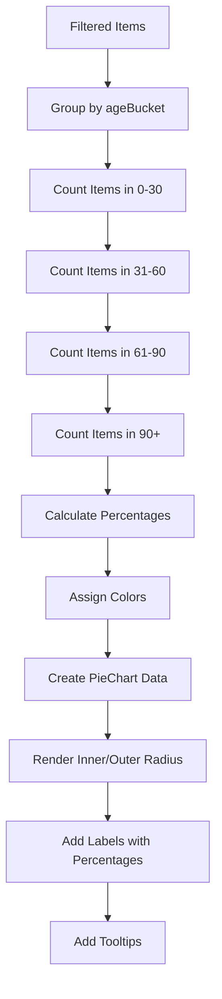

**Source Evidence**: `inventory-aging/page.tsx:1159-1203`

---

## 13. Expiry Status Distribution Chart Flow

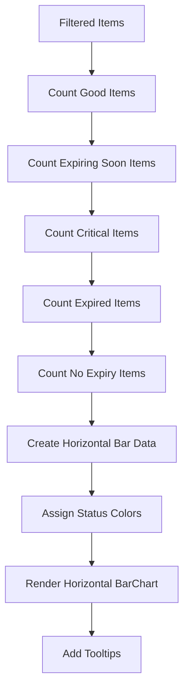

**Source Evidence**: `inventory-aging/page.tsx:1205-1241`

---

## 14. Location Aging Performance Chart Flow

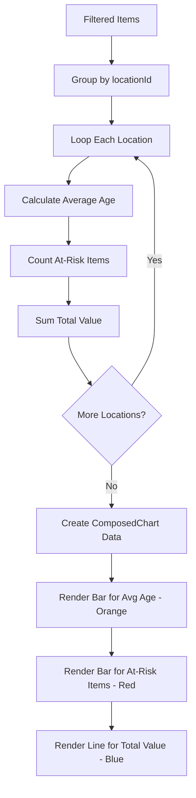

**Source Evidence**: `inventory-aging/page.tsx:1244-1278`

---

## 15. Category Aging Analysis Flow

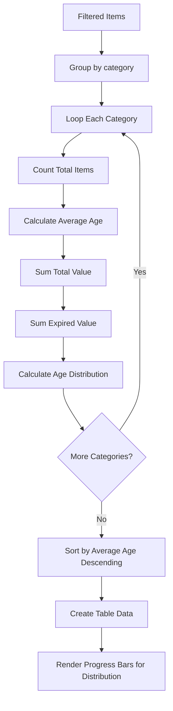

**Source Evidence**: `inventory-aging/page.tsx:1281-1323`

---

## 16. Action Center Value at Risk Panel Flow

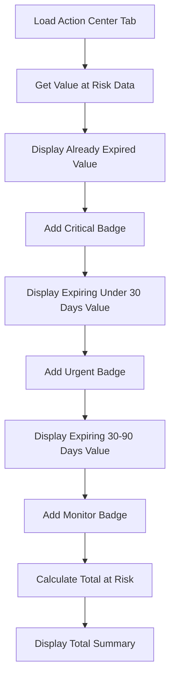

**Source Evidence**: `inventory-aging/page.tsx:1329-1367`

---

## 17. Critical Items List Flow

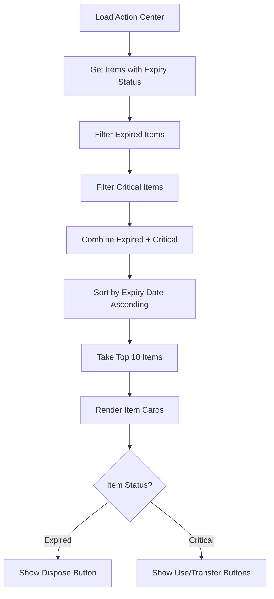

**Source Evidence**: `inventory-aging/page.tsx:1369-1440`

---

## 18. Oldest Items List Flow

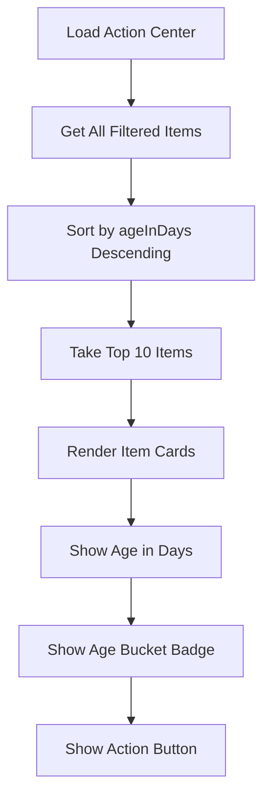

**Source Evidence**: `inventory-aging/page.tsx:1442-1482`

---

## 19. Recommended Actions Flow

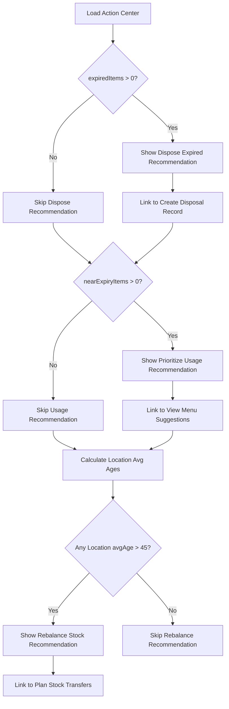

**Source Evidence**: `inventory-aging/page.tsx:1484-1538`

---

## 20. Disposal Action Flow

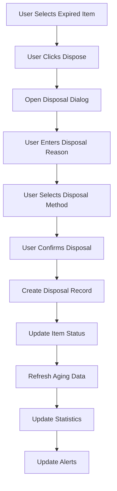

---

## 21. FIFO Transfer Flow

```mermaid
graph TD
    A[User Selects Old Item from 90+ Bucket] --> B[User Clicks Transfer]
    B --> C[System Suggests High-Demand Locations]
    C --> D[User Selects Destination Location]
    D --> E[User Enters Transfer Quantity]
    E --> F[User Confirms Transfer]
    F --> G[Create Transfer Request]
    G --> H[Update Item Location]
    H --> I[Refresh Aging Data]
    I --> J[Recalculate Location Statistics]
```

---

## 22. Summary Statistics Update Flow

```mermaid
graph TD
    A[Filtered Items Change] --> B[useMemo Triggers]
    B --> C[Count Total Items]
    C --> D[Sum Total Value]
    D --> E[Calculate Average Age]
    E --> F[Count Near Expiry Items]
    F --> G[Count Expired Items]
    G --> H[Calculate Value at Risk]
    H --> I[Return Stats Object]
    I --> J[Update 6 Summary Cards]
```

**Source Evidence**: `inventory-aging/page.tsx:720-805`

---

## 23. Permission Check Flow

```mermaid
graph TD
    A[Load Inventory Aging] --> B[Get User Context]
    B --> C{Check User Role}
    C -->|System Administrator| D[Access All Items]
    C -->|Quality Manager| E[Get availableLocations]
    C -->|Inventory Manager| E
    C -->|Storekeeper| E
    C -->|Other Roles| E
    E --> F[Filter Items by locationId]
    F --> G{Item locationId in availableLocations?}
    G -->|Yes| H[Include Item]
    G -->|No| I[Exclude Item]
    D --> J[Display All Items]
    H --> J
```

**Source Evidence**: `inventory-aging/page.tsx:84-120`

---

## Related Documents

- [BR-inventory-aging.md](./BR-inventory-aging.md) - Business Requirements
- [TS-inventory-aging.md](./TS-inventory-aging.md) - Technical Specification
- [UC-inventory-aging.md](./UC-inventory-aging.md) - Use Cases
- [VAL-inventory-aging.md](./VAL-inventory-aging.md) - Validations
