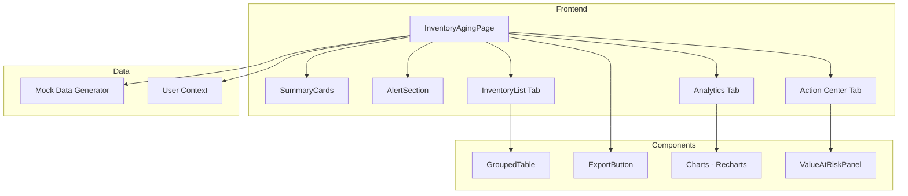
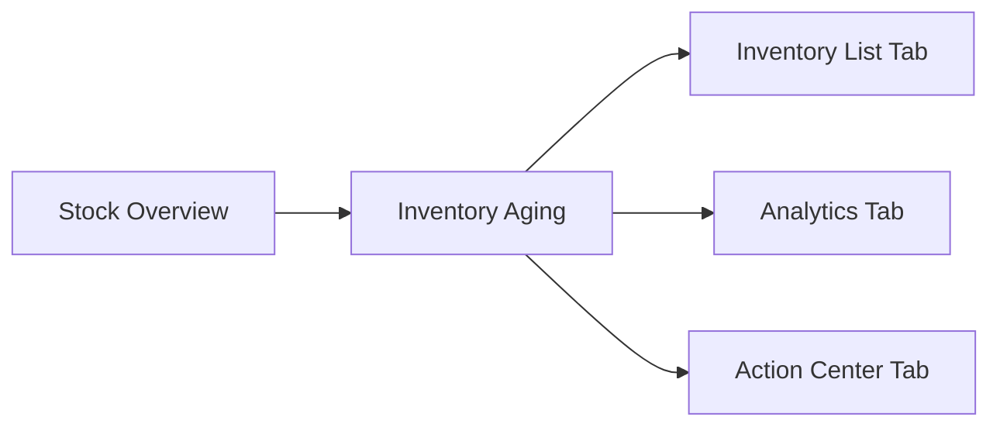
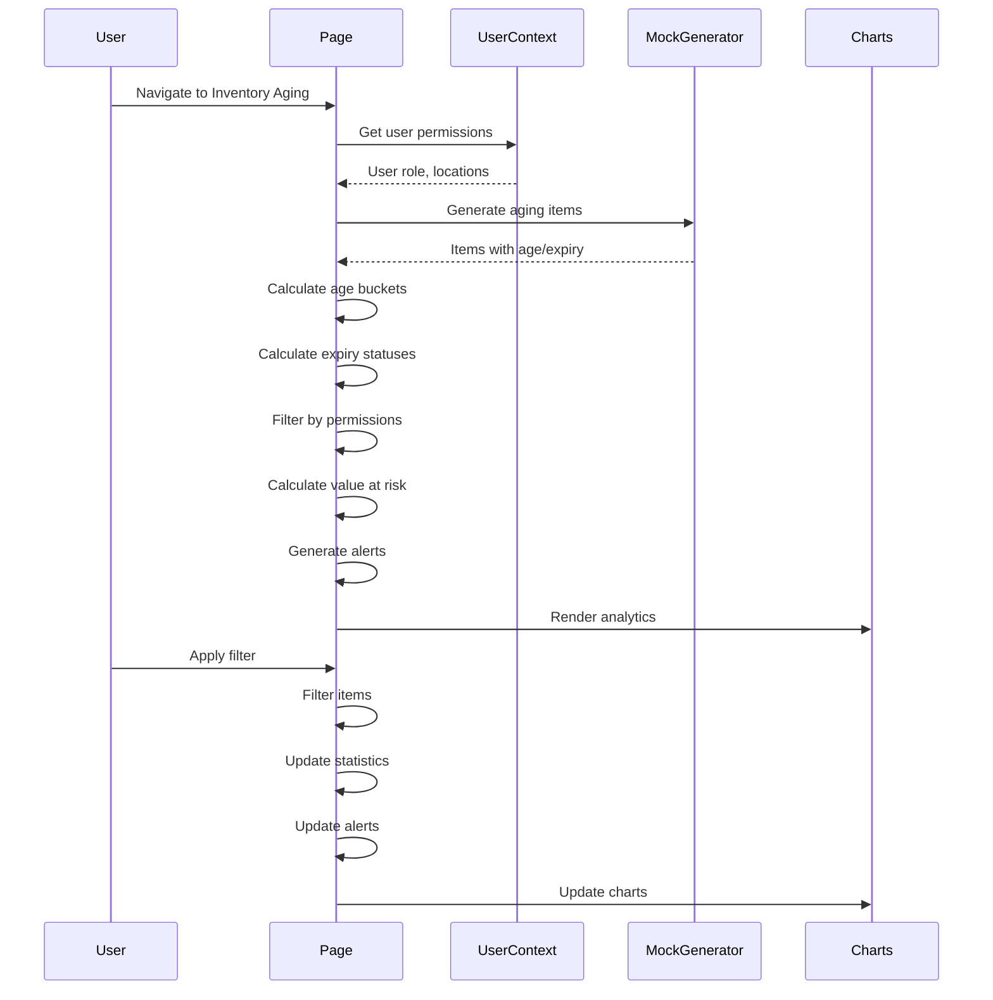

# Technical Specification: Inventory Aging

## Document Information
| Field | Value |
|-------|-------|
| Module | Inventory Management |
| Sub-module | Inventory Aging |
| Version | 3.0.0 |
| Last Updated | 2025-01-15 |

## Document History
| Version | Date | Author | Changes |
|---------|------|--------|---------|
| 3.0.0 | 2025-01-15 | Documentation Team | Synced with current code; Updated interface field names; Updated expiry thresholds (30/90 days); Added alert system; Added expiry timeline chart; Added location aging performance; Added oldest items feature; Updated component tree |
| 2.0.0 | 2024-06-15 | System | Previous version |
| 1.0 | 2024-01-15 | Documentation Team | Initial version |

---

## 1. System Architecture



---

## 2. Page Hierarchy



**Route**: `/inventory-management/stock-overview/inventory-aging`

---

## 3. Component Architecture

### 3.1 Page Component

**File**: `app/(main)/inventory-management/stock-overview/inventory-aging/page.tsx`

**Directive**: `"use client"`

**State Management**:
```typescript
const [isLoading, setIsLoading] = useState(true)
const [searchTerm, setSearchTerm] = useState('')
const [categoryFilter, setCategoryFilter] = useState('all')
const [ageBucketFilter, setAgeBucketFilter] = useState('all')
const [expiryStatusFilter, setExpiryStatusFilter] = useState('all')
const [locationFilter, setLocationFilter] = useState('all')
const [viewMode, setViewMode] = useState<'list' | 'grouped'>('list')
const [groupBy, setGroupBy] = useState<'location' | 'ageBucket'>('location')
const [agingItems, setAgingItems] = useState<AgingItem[]>([])
```

**Source Evidence**: `inventory-aging/page.tsx:84-92`

---

## 4. Type Definitions

### 4.1 Aging Item
```typescript
interface AgingItem {
  id: string
  productId: string
  productCode: string
  productName: string
  category: string
  unit: string
  lotNumber?: string
  locationId: string
  locationName: string
  receiptDate: Date
  ageInDays: number
  ageBucket: '0-30' | '31-60' | '61-90' | '90+'
  expiryDate?: Date
  quantity: number
  value: number
}
```

**Source Evidence**: `lib/mock-data/location-inventory.ts`

### 4.2 Age Bucket Type
```typescript
type AgeBucket = '0-30' | '31-60' | '61-90' | '90+'

const AGE_BUCKET_COLORS: Record<AgeBucket, string> = {
  '0-30': '#22c55e',   // Green
  '31-60': '#eab308',  // Yellow
  '61-90': '#f97316',  // Orange
  '90+': '#ef4444'     // Red
}
```

**Source Evidence**: `inventory-aging/page.tsx:281-296`

### 4.3 Expiry Status Type
```typescript
type ExpiryStatus = 'good' | 'expiring-soon' | 'critical' | 'expired' | 'no-expiry'

const EXPIRY_STATUS_CONFIG: Record<ExpiryStatus, { label: string; color: string; days: string }> = {
  'good': { label: 'Good', color: '#22c55e', days: '> 90 days' },
  'expiring-soon': { label: 'Expiring Soon', color: '#eab308', days: '30-90 days' },
  'critical': { label: 'Critical', color: '#f97316', days: '< 30 days' },
  'expired': { label: 'Expired', color: '#ef4444', days: 'Past expiry' },
  'no-expiry': { label: 'No Expiry', color: '#94a3b8', days: 'N/A' }
}
```

**Source Evidence**: `inventory-aging/page.tsx:129-136`

### 4.4 Value at Risk
```typescript
interface ValueAtRisk {
  expired: number
  critical: number
  expiringSoon: number
  total: number
}
```

**Source Evidence**: `inventory-aging/page.tsx:503-517`

### 4.5 Summary Statistics
```typescript
interface AgingStats {
  totalItems: number
  totalValue: number
  avgAge: number
  expiredItems: number
  nearExpiryItems: number
}
```

**Source Evidence**: `inventory-aging/page.tsx:332-353`

---

## 5. Age & Expiry Calculation Logic

### 5.1 Age Calculation
```typescript
const calculateAgeInDays = (receiptDate: Date): number => {
  return Math.ceil(
    (Date.now() - new Date(receiptDate).getTime()) / (1000 * 60 * 60 * 24)
  )
}

const getAgeBucket = (ageInDays: number): AgeBucket => {
  if (ageInDays <= 30) return '0-30'
  if (ageInDays <= 60) return '31-60'
  if (ageInDays <= 90) return '61-90'
  return '90+'
}
```

### 5.2 Expiry Status Calculation
```typescript
const getExpiryStatus = (expiryDate?: Date): ExpiryStatus => {
  if (!expiryDate) return 'no-expiry'

  const daysToExpiry = Math.ceil(
    (new Date(expiryDate).getTime() - Date.now()) / (1000 * 60 * 60 * 24)
  )

  if (daysToExpiry < 0) return 'expired'
  if (daysToExpiry < 30) return 'critical'
  if (daysToExpiry < 90) return 'expiring-soon'
  return 'good'
}

const calculateDaysToExpiry = (expiryDate?: Date): number | null => {
  if (!expiryDate) return null
  return Math.ceil(
    (new Date(expiryDate).getTime() - Date.now()) / (1000 * 60 * 60 * 24)
  )
}
```

**Source Evidence**: `inventory-aging/page.tsx:129-136`

---

## 6. Data Flow



---

## 7. Summary Statistics Calculation

```typescript
const summaryStats = useMemo(() => {
  const totalItems = filteredItems.length
  const totalValue = filteredItems.reduce((sum, item) => sum + item.value, 0)
  const avgAge = totalItems > 0
    ? filteredItems.reduce((sum, item) => sum + item.ageInDays, 0) / totalItems
    : 0

  const nearExpiryItems = filteredItems.filter(item => {
    const status = getExpiryStatus(item.expiryDate)
    return status === 'expiring-soon' || status === 'critical'
  }).length

  const expiredItems = filteredItems.filter(item =>
    getExpiryStatus(item.expiryDate) === 'expired'
  ).length

  return {
    totalItems,
    totalValue,
    avgAge: Math.round(avgAge),
    nearExpiryItems,
    expiredItems
  }
}, [filteredItems])
```

**Source Evidence**: `inventory-aging/page.tsx:332-353`

---

## 8. Value at Risk Calculation

```typescript
const valueAtRisk = useMemo((): ValueAtRisk => {
  const expired = filteredItems
    .filter(item => getExpiryStatus(item.expiryDate) === 'expired')
    .reduce((sum, item) => sum + item.value, 0)

  const critical = filteredItems
    .filter(item => getExpiryStatus(item.expiryDate) === 'critical')
    .reduce((sum, item) => sum + item.value, 0)

  const expiringSoon = filteredItems
    .filter(item => getExpiryStatus(item.expiryDate) === 'expiring-soon')
    .reduce((sum, item) => sum + item.value, 0)

  return {
    expired,
    critical,
    expiringSoon,
    total: expired + critical + expiringSoon
  }
}, [filteredItems])
```

**Source Evidence**: `inventory-aging/page.tsx:503-517`

---

## 9. Alert Generation

```typescript
const alerts = useMemo(() => {
  const alertList: Alert[] = []

  if (summaryStats.expiredItems > 0) {
    alertList.push({
      type: 'destructive',
      title: 'Expired Items',
      description: `${summaryStats.expiredItems} items have expired and require immediate action`,
      icon: AlertCircle
    })
  }

  if (summaryStats.nearExpiryItems > 0) {
    alertList.push({
      type: 'warning',
      title: 'Items Expiring Soon',
      description: `${summaryStats.nearExpiryItems} items are expiring within 90 days`,
      icon: AlertTriangle
    })
  }

  return alertList
}, [summaryStats])
```

**Source Evidence**: `inventory-aging/page.tsx:694-718`

---

## 10. Chart Data Preparation

### 10.1 Expiry Timeline Data (12 Weeks)
```typescript
const expiryTimelineData = useMemo(() => {
  const weeks: { week: string; items: number; value: number }[] = []
  const today = new Date()

  for (let i = 0; i < 12; i++) {
    const weekStart = addWeeks(today, i)
    const weekEnd = addWeeks(today, i + 1)

    const weekItems = filteredItems.filter(item => {
      if (!item.expiryDate) return false
      const expiry = new Date(item.expiryDate)
      return expiry >= weekStart && expiry < weekEnd
    })

    weeks.push({
      week: format(weekStart, 'MMM d'),
      items: weekItems.length,
      value: weekItems.reduce((sum, item) => sum + item.value, 0)
    })
  }

  return weeks
}, [filteredItems])
```

**Source Evidence**: `inventory-aging/page.tsx:1124-1156`

### 10.2 Age Bucket Distribution Data
```typescript
const ageBucketData = useMemo(() => {
  const distribution = filteredItems.reduce((acc, item) => {
    acc[item.ageBucket] = (acc[item.ageBucket] || 0) + 1
    return acc
  }, {} as Record<AgeBucket, number>)

  return Object.entries(distribution).map(([bucket, count]) => ({
    name: bucket,
    value: count,
    color: AGE_BUCKET_COLORS[bucket as AgeBucket]
  }))
}, [filteredItems])
```

**Source Evidence**: `inventory-aging/page.tsx:1159-1203`

### 10.3 Expiry Status Data
```typescript
const expiryStatusData = useMemo(() => {
  const distribution = filteredItems.reduce((acc, item) => {
    const status = getExpiryStatus(item.expiryDate)
    acc[status] = (acc[status] || 0) + 1
    return acc
  }, {} as Record<ExpiryStatus, number>)

  return Object.entries(distribution).map(([status, count]) => ({
    name: EXPIRY_STATUS_CONFIG[status as ExpiryStatus].label,
    value: count,
    color: EXPIRY_STATUS_CONFIG[status as ExpiryStatus].color
  }))
}, [filteredItems])
```

**Source Evidence**: `inventory-aging/page.tsx:1205-1241`

### 10.4 Location Aging Data
```typescript
const locationAgingData = useMemo(() => {
  const locationMap = new Map<string, {
    items: number;
    totalAge: number;
    atRisk: number;
    value: number
  }>()

  filteredItems.forEach(item => {
    const existing = locationMap.get(item.locationName) || {
      items: 0, totalAge: 0, atRisk: 0, value: 0
    }
    const status = getExpiryStatus(item.expiryDate)
    const isAtRisk = ['expired', 'critical', 'expiring-soon'].includes(status)

    locationMap.set(item.locationName, {
      items: existing.items + 1,
      totalAge: existing.totalAge + item.ageInDays,
      atRisk: existing.atRisk + (isAtRisk ? 1 : 0),
      value: existing.value + item.value
    })
  })

  return Array.from(locationMap.entries()).map(([location, data]) => ({
    location,
    avgAge: Math.round(data.totalAge / data.items),
    atRisk: data.atRisk,
    value: data.value
  }))
}, [filteredItems])
```

**Source Evidence**: `inventory-aging/page.tsx:1244-1278`

### 10.5 Category Aging Data
```typescript
const categoryAgingData = useMemo(() => {
  const categoryMap = new Map<string, {
    items: number;
    totalAge: number;
    value: number;
    expiredValue: number
  }>()

  filteredItems.forEach(item => {
    const existing = categoryMap.get(item.category) || {
      items: 0, totalAge: 0, value: 0, expiredValue: 0
    }
    const isExpired = getExpiryStatus(item.expiryDate) === 'expired'

    categoryMap.set(item.category, {
      items: existing.items + 1,
      totalAge: existing.totalAge + item.ageInDays,
      value: existing.value + item.value,
      expiredValue: existing.expiredValue + (isExpired ? item.value : 0)
    })
  })

  return Array.from(categoryMap.entries())
    .map(([category, data]) => ({
      category,
      items: data.items,
      avgAge: Math.round(data.totalAge / data.items),
      value: data.value,
      expiredValue: data.expiredValue
    }))
    .sort((a, b) => b.avgAge - a.avgAge)
}, [filteredItems])
```

**Source Evidence**: `inventory-aging/page.tsx:1281-1323`

---

## 11. Grouping Logic

### 11.1 Group by Location
```typescript
const groupByLocation = (items: AgingItem[]): GroupedData[] => {
  const locationMap = new Map<string, AgingItem[]>()

  items.forEach(item => {
    const key = item.locationId
    if (!locationMap.has(key)) {
      locationMap.set(key, [])
    }
    locationMap.get(key)!.push(item)
  })

  return Array.from(locationMap.entries()).map(([locationId, items]) => ({
    groupId: locationId,
    groupName: items[0].locationName,
    items: items.sort((a, b) => b.ageInDays - a.ageInDays),
    subtotals: calculateSubtotals(items),
    isExpanded: false
  }))
}
```

### 11.2 Group by Age Bucket
```typescript
const groupByAgeBucket = (items: AgingItem[]): GroupedData[] => {
  const bucketOrder: AgeBucket[] = ['90+', '61-90', '31-60', '0-30']
  const bucketMap = new Map<AgeBucket, AgingItem[]>()

  items.forEach(item => {
    const key = item.ageBucket
    if (!bucketMap.has(key)) {
      bucketMap.set(key, [])
    }
    bucketMap.get(key)!.push(item)
  })

  return bucketOrder
    .filter(bucket => bucketMap.has(bucket))
    .map(bucket => ({
      groupId: bucket,
      groupName: `${bucket} Days`,
      items: bucketMap.get(bucket)!.sort((a, b) => b.ageInDays - a.ageInDays),
      subtotals: calculateSubtotals(bucketMap.get(bucket)!),
      isExpanded: false
    }))
}
```

---

## 12. Component Tree

```
InventoryAgingPage
├── PageHeader
│   ├── BackLink
│   ├── Title with CalendarClock Icon
│   └── Description
├── AlertSection
│   ├── ExpiredItemsAlert (destructive)
│   └── NearExpiryAlert (warning)
├── SummaryCards (6 cards)
│   ├── TotalItems (Package icon, blue)
│   ├── TotalValue (DollarSign icon, green)
│   ├── AverageAge (Clock icon, orange)
│   ├── NearExpiry (Timer icon, yellow)
│   ├── ExpiredItems (AlertCircle icon, red)
│   └── ValueAtRisk (TrendingDown icon, red)
├── MainContent (Card with Tabs)
│   ├── TabsList
│   │   ├── Inventory List
│   │   ├── Analytics
│   │   └── Action Center
│   ├── InventoryListTab
│   │   ├── FilterBar
│   │   │   ├── SearchInput
│   │   │   ├── CategorySelect
│   │   │   ├── AgeBucketSelect
│   │   │   ├── ExpiryStatusSelect
│   │   │   └── LocationSelect
│   │   ├── ViewControls
│   │   │   ├── ViewModeToggle (List/Grouped)
│   │   │   └── GroupBySelect (when grouped)
│   │   └── DataTable or GroupedTable
│   ├── AnalyticsTab
│   │   ├── ExpiryTimelineChart (ComposedChart)
│   │   ├── AgeBucketDistribution (PieChart)
│   │   ├── ExpiryStatusChart (BarChart)
│   │   ├── LocationAgingPerformance (ComposedChart)
│   │   └── CategoryAgingAnalysis (Table)
│   └── ActionCenterTab
│       ├── ValueAtRiskSummary
│       │   ├── ExpiredValue (critical badge)
│       │   ├── CriticalValue (urgent badge)
│       │   └── ExpiringSoonValue (monitor badge)
│       ├── CriticalItemsList (top 10)
│       ├── OldestItemsList (top 10)
│       └── RecommendedActions
│           ├── DisposeExpired
│           ├── PrioritizeUsage
│           └── RebalanceStock
└── Footer
    └── RecordCount
```

**Source Evidence**: `inventory-aging/page.tsx:694-1538`

---

## 13. Third-Party Libraries

| Library | Version | Usage |
|---------|---------|-------|
| Recharts | ^2.x | PieChart, BarChart, ComposedChart, Bar, Line |
| lucide-react | ^0.x | CalendarClock, Package, DollarSign, Clock, Timer, AlertCircle, TrendingDown, AlertTriangle |
| shadcn/ui | ^0.x | Card, Table, Badge, Progress, Tabs, Alert, Button, Select |
| date-fns | ^2.x | addWeeks, format, differenceInDays |

---

## 14. Badge Rendering

### 14.1 Age Bucket Badge
```typescript
const renderAgeBucketBadge = (bucket: AgeBucket) => {
  const colorMap = {
    '0-30': 'bg-green-100 text-green-800',
    '31-60': 'bg-yellow-100 text-yellow-800',
    '61-90': 'bg-orange-100 text-orange-800',
    '90+': 'destructive'
  }

  if (bucket === '90+') {
    return <Badge variant="destructive">{bucket}</Badge>
  }

  return (
    <Badge variant="outline" className={colorMap[bucket]}>
      {bucket}
    </Badge>
  )
}
```

**Source Evidence**: `inventory-aging/page.tsx:281-296`

### 14.2 Expiry Status Badge
```typescript
const renderExpiryBadge = (status: ExpiryStatus) => {
  const variants = {
    'good': { variant: 'outline', className: 'bg-green-100 text-green-800' },
    'expiring-soon': { variant: 'outline', className: 'bg-yellow-100 text-yellow-800' },
    'critical': { variant: 'destructive', className: '' },
    'expired': { variant: 'destructive', className: '' },
    'no-expiry': { variant: 'secondary', className: '' }
  }

  const config = variants[status]
  return (
    <Badge variant={config.variant} className={config.className}>
      {EXPIRY_STATUS_CONFIG[status].label}
    </Badge>
  )
}
```

---

## 15. Performance Considerations

| Concern | Mitigation |
|---------|------------|
| Large item list | useMemo for filtering and statistics |
| Date calculations | Cache age/expiry on initial load |
| Chart rendering | Lazy loading tabs with TabsContent |
| Grouping changes | Memoized grouping functions |
| Alert calculation | Derived from memoized stats |

---

## 16. Accessibility

| Feature | Implementation |
|---------|---------------|
| Keyboard navigation | Tab through filters and items |
| Screen readers | ARIA labels on badges and alerts |
| Color contrast | 4.5:1 minimum ratio |
| Focus indicators | Visible focus rings on interactive elements |
| Status indicators | Text labels accompany colors |
| Alert announcements | Alert role for screen reader announcement |

---

## Related Documents

- [BR-inventory-aging.md](./BR-inventory-aging.md) - Business Requirements
- [FD-inventory-aging.md](./FD-inventory-aging.md) - Flow Diagrams
- [UC-inventory-aging.md](./UC-inventory-aging.md) - Use Cases
- [VAL-inventory-aging.md](./VAL-inventory-aging.md) - Validations
