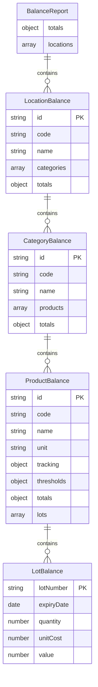

# DD-INV-BAL: Inventory Balance Data Dictionary

**Document Version**: 1.0
**Last Updated**: 2026-01-15
**Module**: Inventory Management
**Sub-Module**: Stock Overview > Inventory Balance

---

## Document History

| Version | Date | Author | Changes |
|---------|------|--------|---------|
| 1.0.0 | 2026-01-15 | Documentation Team | Initial version |

---

## Document Overview

This document provides comprehensive data schema documentation for the Inventory Balance sub-module. It defines the data structures, types, and relationships used in the inventory balance reporting functionality.

**Related Documents**:
- [INDEX-inventory-balance.md](./INDEX-inventory-balance.md)
- [BR-inventory-balance.md](./BR-inventory-balance.md)
- [TS-inventory-balance.md](./TS-inventory-balance.md)
- [DD-stock-overview.md](../DD-stock-overview.md) (Parent schema)

---

## Entity-Relationship Diagram



---

## Core Interfaces

### BalanceReport

**Purpose**: Root container for the complete inventory balance report

**TypeScript Definition**:
```typescript
interface BalanceReport {
  locations: LocationBalance[]
  totals: {
    quantity: number
    value: number
  }
}
```

**Field Definitions**:

| Field | Type | Required | Description |
|-------|------|----------|-------------|
| `locations` | `LocationBalance[]` | Yes | Array of location balances |
| `totals` | `object` | Yes | Aggregate totals across all locations |
| `totals.quantity` | `number` | Yes | Sum of all product quantities |
| `totals.value` | `number` | Yes | Sum of all inventory values |

---

### LocationBalance

**Purpose**: Inventory balance data for a single storage location

**TypeScript Definition**:
```typescript
interface LocationBalance {
  id: string
  code: string
  name: string
  categories: CategoryBalance[]
  totals: {
    quantity: number
    value: number
  }
}
```

**Field Definitions**:

| Field | Type | Required | Constraints | Description |
|-------|------|----------|-------------|-------------|
| `id` | `string` | Yes | UUID format | Unique location identifier |
| `code` | `string` | Yes | Max 20 chars | Location code (e.g., "MK", "RK") |
| `name` | `string` | Yes | Max 255 chars | Location display name |
| `categories` | `CategoryBalance[]` | Yes | - | Categories with stock at this location |
| `totals.quantity` | `number` | Yes | >= 0 | Sum of quantities at location |
| `totals.value` | `number` | Yes | >= 0 | Sum of values at location |

---

### CategoryBalance

**Purpose**: Inventory balance data grouped by product category

**TypeScript Definition**:
```typescript
interface CategoryBalance {
  id: string
  code: string
  name: string
  products: ProductBalance[]
  totals: {
    quantity: number
    value: number
  }
}
```

**Field Definitions**:

| Field | Type | Required | Constraints | Description |
|-------|------|----------|-------------|-------------|
| `id` | `string` | Yes | UUID format | Unique category identifier |
| `code` | `string` | Yes | Max 50 chars | Category code (e.g., "FOOD", "BEV") |
| `name` | `string` | Yes | Max 255 chars | Category display name |
| `products` | `ProductBalance[]` | Yes | - | Products in this category |
| `totals.quantity` | `number` | Yes | >= 0 | Sum of product quantities |
| `totals.value` | `number` | Yes | >= 0 | Sum of product values |

---

### ProductBalance

**Purpose**: Detailed balance data for a single inventory item

**TypeScript Definition**:
```typescript
interface ProductBalance {
  id: string
  code: string
  name: string
  unit: string
  tracking: {
    batch: boolean
  }
  thresholds: {
    minimum: number
    maximum: number
  }
  totals: {
    quantity: number
    averageCost: number
    value: number
  }
  lots: LotBalance[]
}
```

**Field Definitions**:

| Field | Type | Required | Constraints | Description |
|-------|------|----------|-------------|-------------|
| `id` | `string` | Yes | UUID format | Unique product identifier |
| `code` | `string` | Yes | Max 50 chars | Product code (e.g., "FOOD-001") |
| `name` | `string` | Yes | Max 255 chars | Product display name |
| `unit` | `string` | Yes | Max 20 chars | Unit of measure (e.g., "kg", "L") |
| `tracking.batch` | `boolean` | Yes | - | Whether batch/lot tracking is enabled |
| `thresholds.minimum` | `number` | Yes | >= 0 | Minimum stock level (reorder point) |
| `thresholds.maximum` | `number` | Yes | >= minimum | Maximum stock level |
| `totals.quantity` | `number` | Yes | >= 0 | Current quantity on hand |
| `totals.averageCost` | `number` | Yes | >= 0 | Weighted average unit cost |
| `totals.value` | `number` | Yes | >= 0 | Total value (quantity x averageCost) |
| `lots` | `LotBalance[]` | No | - | Lot-level breakdown (if tracking enabled) |

---

### LotBalance

**Purpose**: Balance data for a specific lot/batch within a product

**TypeScript Definition**:
```typescript
interface LotBalance {
  lotNumber: string
  expiryDate?: string
  quantity: number
  unitCost: number
  value: number
}
```

**Field Definitions**:

| Field | Type | Required | Constraints | Description |
|-------|------|----------|-------------|-------------|
| `lotNumber` | `string` | Yes | Max 50 chars | Unique lot/batch identifier |
| `expiryDate` | `string` | No | ISO 8601 date | Expiration date (YYYY-MM-DD) |
| `quantity` | `number` | Yes | >= 0 | Quantity in this lot |
| `unitCost` | `number` | Yes | >= 0 | Cost per unit for this lot |
| `value` | `number` | Yes | >= 0 | Total lot value (quantity x unitCost) |

---

## Report Parameters

### BalanceReportParams

**Purpose**: Filter and view parameters for generating balance reports

**TypeScript Definition**:
```typescript
interface BalanceReportParams {
  asOfDate: string
  locationRange: {
    from: string
    to: string
  }
  categoryRange: {
    from: string
    to: string
  }
  productRange: {
    from: string
    to: string
  }
  viewType: 'CATEGORY' | 'PRODUCT' | 'LOT'
  showLots: boolean
}
```

**Field Definitions**:

| Field | Type | Required | Default | Description |
|-------|------|----------|---------|-------------|
| `asOfDate` | `string` | Yes | Current date | Report date (YYYY-MM-DD format) |
| `locationRange.from` | `string` | No | "" | Starting location code for range filter |
| `locationRange.to` | `string` | No | "" | Ending location code for range filter |
| `categoryRange.from` | `string` | No | "" | Starting category code for range filter |
| `categoryRange.to` | `string` | No | "" | Ending category code for range filter |
| `productRange.from` | `string` | No | "" | Starting product code for range filter |
| `productRange.to` | `string` | No | "" | Ending product code for range filter |
| `viewType` | `enum` | Yes | "PRODUCT" | Report aggregation level |
| `showLots` | `boolean` | Yes | false | Whether to include lot-level detail |

**View Type Values**:

| Value | Description |
|-------|-------------|
| `CATEGORY` | Summarize at category level only |
| `PRODUCT` | Show product-level detail (default) |
| `LOT` | Show lot/batch-level detail |

---

## Derived/Calculated Fields

### Inventory Value Calculations

| Field | Formula | Description |
|-------|---------|-------------|
| `totals.value` | `quantity × averageCost` | Total inventory value for item |
| `categoryTotal.value` | `SUM(products[].totals.value)` | Category total value |
| `locationTotal.value` | `SUM(categories[].totals.value)` | Location total value |
| `reportTotal.value` | `SUM(locations[].totals.value)` | Grand total value |

### Stock Level Indicators

| Indicator | Condition | Description |
|-----------|-----------|-------------|
| `isLowStock` | `quantity <= thresholds.minimum` | Below reorder point |
| `isOutOfStock` | `quantity === 0` | Zero stock |
| `isOverstock` | `quantity > thresholds.maximum` | Above maximum level |

---

## Chart Data Structures

### Category Distribution Data

**Purpose**: Data for pie chart showing value distribution by category

```typescript
interface CategoryChartData {
  name: string        // Category name
  quantity: number    // Total quantity in category
  value: number       // Total value in category
}
```

### Location Distribution Data

**Purpose**: Data for bar chart showing stock by location

```typescript
interface LocationChartData {
  name: string        // Location name
  quantity: number    // Total quantity at location
  value: number       // Total value at location
}
```

### Value Trend Data

**Purpose**: Data for area chart showing historical value trends

```typescript
interface TrendData {
  month: string       // Month label (e.g., "Jan", "Feb")
  value: number       // Inventory value for month
  quantity: number    // Inventory quantity for month
}
```

---

## Insights Data Structures

### High Value Item

**Purpose**: Identifies items with highest inventory value

```typescript
interface HighValueItem extends ProductBalance {
  locationName: string    // Location where item is stored
  categoryName: string    // Category name
}
```

### Low Stock Item

**Purpose**: Identifies items below minimum stock levels

```typescript
interface LowStockItem extends ProductBalance {
  locationName: string    // Location name
  categoryName: string    // Category name
}
```

---

## Data Relationships

### Hierarchical Structure

```
BalanceReport
    |
    +-- totals (aggregate)
    |       |-- quantity: SUM(all locations)
    |       +-- value: SUM(all locations)
    |
    +-- locations[]
            |
            +-- LocationBalance
                    |
                    +-- totals (location aggregate)
                    |
                    +-- categories[]
                            |
                            +-- CategoryBalance
                                    |
                                    +-- totals (category aggregate)
                                    |
                                    +-- products[]
                                            |
                                            +-- ProductBalance
                                                    |
                                                    +-- totals (product aggregate)
                                                    |
                                                    +-- lots[] (optional)
                                                            |
                                                            +-- LotBalance
```

### Aggregation Rules

1. **Product totals**: Direct from stock balance table
2. **Category totals**: Sum of all products in category
3. **Location totals**: Sum of all categories at location
4. **Report totals**: Sum of all locations in report

---

## Validation Rules

### Value Constraints

| Field | Constraint | Error Message |
|-------|------------|---------------|
| `quantity` | >= 0 | "Quantity cannot be negative" |
| `value` | >= 0 | "Value cannot be negative" |
| `averageCost` | >= 0 | "Average cost cannot be negative" |
| `minimum` | >= 0 | "Minimum threshold cannot be negative" |
| `maximum` | >= minimum | "Maximum must be greater than or equal to minimum" |

### Date Constraints

| Field | Constraint | Error Message |
|-------|------------|---------------|
| `asOfDate` | Valid ISO date | "Invalid date format" |
| `asOfDate` | <= Current date | "Cannot report future dates" |
| `expiryDate` | Valid ISO date or null | "Invalid expiry date format" |

---

## Sample Data

### Sample Balance Report

```json
{
  "locations": [
    {
      "id": "loc-001",
      "code": "MK",
      "name": "Main Kitchen",
      "categories": [
        {
          "id": "cat-001",
          "code": "FOOD",
          "name": "Food",
          "products": [
            {
              "id": "prod-001",
              "code": "FOOD-001",
              "name": "All-Purpose Flour",
              "unit": "kg",
              "tracking": { "batch": true },
              "thresholds": { "minimum": 100, "maximum": 500 },
              "totals": {
                "quantity": 250,
                "averageCost": 5.50,
                "value": 1375.00
              },
              "lots": [
                {
                  "lotNumber": "LOT-20260110",
                  "expiryDate": "2026-07-10",
                  "quantity": 150,
                  "unitCost": 5.25,
                  "value": 787.50
                },
                {
                  "lotNumber": "LOT-20260115",
                  "expiryDate": "2026-07-15",
                  "quantity": 100,
                  "unitCost": 5.75,
                  "value": 575.00
                }
              ]
            }
          ],
          "totals": { "quantity": 250, "value": 1375.00 }
        }
      ],
      "totals": { "quantity": 250, "value": 1375.00 }
    }
  ],
  "totals": { "quantity": 250, "value": 1375.00 }
}
```

---

## Database Mapping

This sub-module uses data from the following parent schema tables (see [DD-stock-overview.md](../DD-stock-overview.md)):

| Interface | Primary Table | Related Tables |
|-----------|--------------|----------------|
| `BalanceReport` | Aggregated view | `vw_stock_overview` |
| `LocationBalance` | `tb_location` | `tb_stock_balance` |
| `CategoryBalance` | `tb_category` | `tb_inventory_item` |
| `ProductBalance` | `tb_inventory_item` | `tb_stock_balance` |
| `LotBalance` | `tb_inventory_transaction` | (lot/batch tracking) |

---

## Migration Notes

### Current State (Mock Data)
- TypeScript interfaces in `inventory-balance/types.ts`
- Mock data from `lib/mock-data`
- In-memory hierarchical structure

### Target State (Database)
- Materialized view for report aggregation
- Real-time balance from `tb_stock_balance`
- Lot tracking from transaction history

---

**Document Control**

| Version | Date | Author | Changes |
|---------|------|--------|---------|
| 1.0.0 | 2026-01-15 | Documentation Team | Initial data dictionary |
