# Flow Diagrams: Inventory Balance

## Document Information
| Field | Value |
|-------|-------|
| Module | Inventory Management |
| Sub-module | Inventory Balance |
| Version | 3.0.0 |
| Last Updated | 2025-01-15 |

## Document History
| Version | Date | Author | Changes |
|---------|------|--------|---------|
| 3.0.0 | 2025-01-15 | Documentation Team | Synced with current code; Updated tab structure to Balance Report and Movement History; Added inventory status flow; Updated transaction types to IN/OUT only; Added pagination flow |
| 2.0.0 | 2024-06-15 | System | Previous version |
| 1.0 | 2024-01-15 | Documentation Team | Initial version |

---

## 1. Page Load Flow

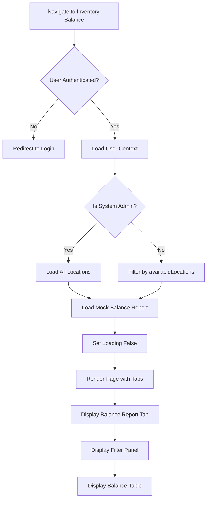

---

## 2. Filter Application Flow

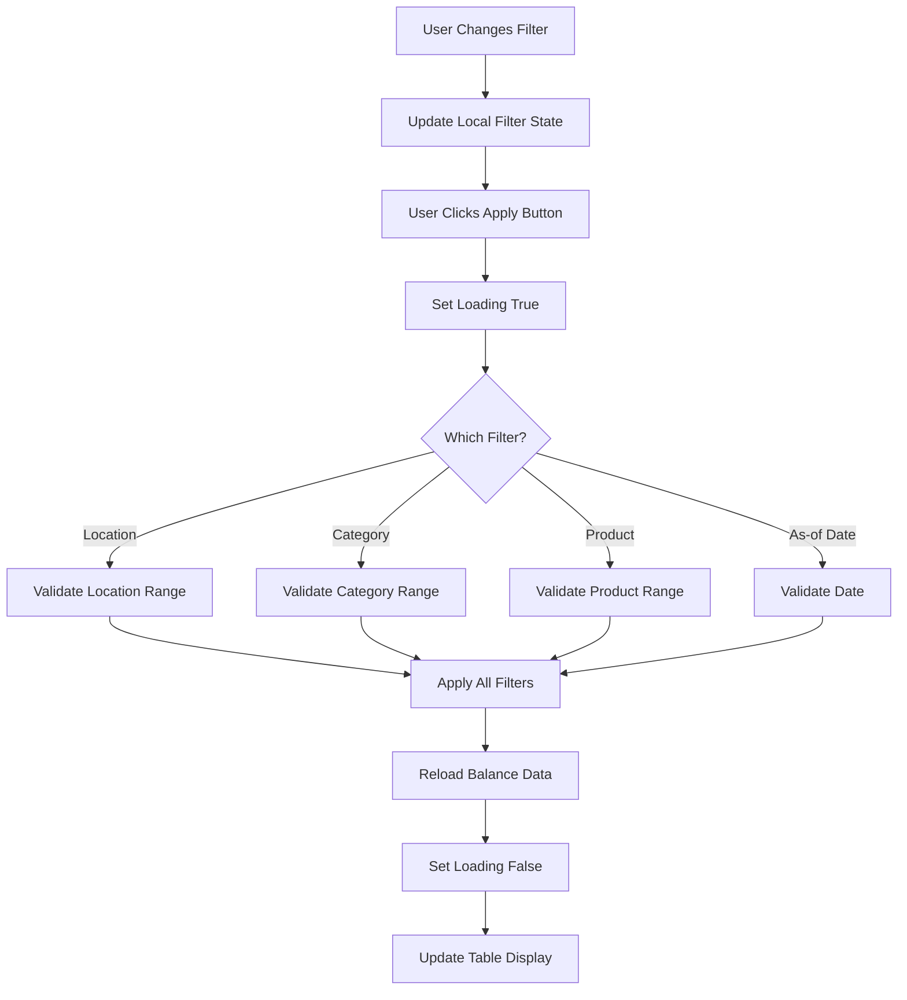

---

## 3. Filter Reset Flow

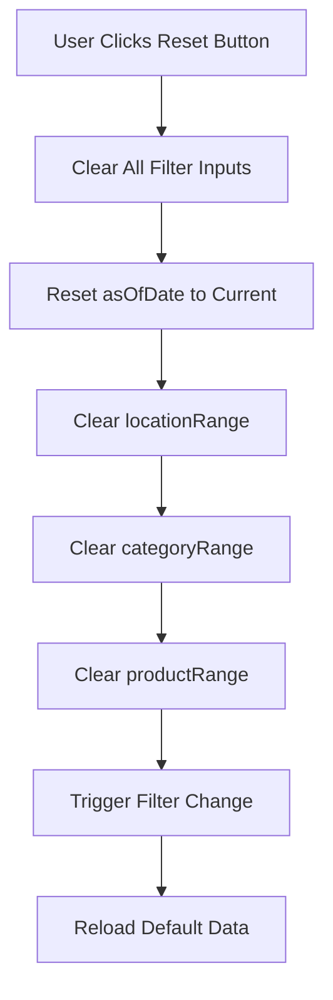

---

## 4. Data Hierarchy Expansion Flow

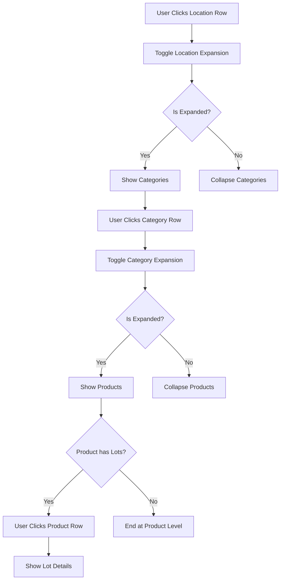

---

## 5. Inventory Status Calculation Flow

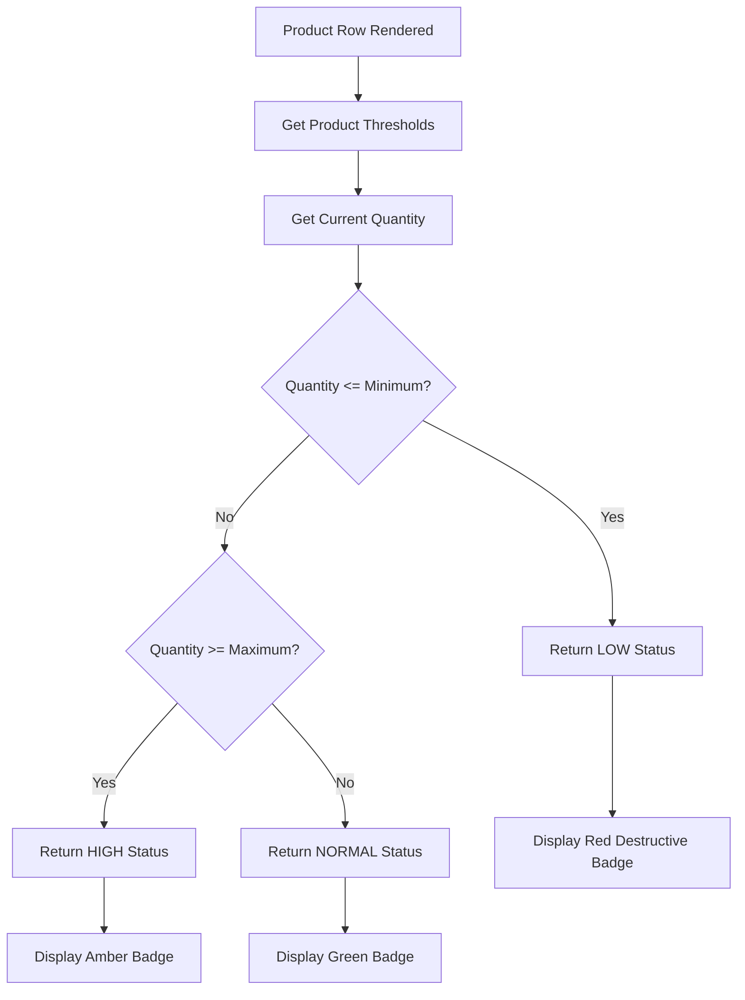

**Source Evidence**: `components/BalanceTable.tsx:112-121`

---

## 6. Tab Navigation Flow

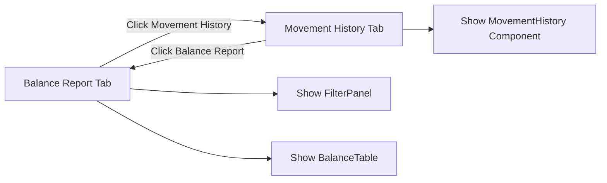

---

## 7. Movement History Load Flow

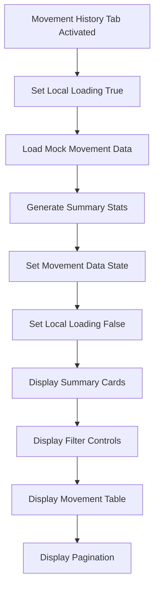

---

## 8. Movement Filter Flow

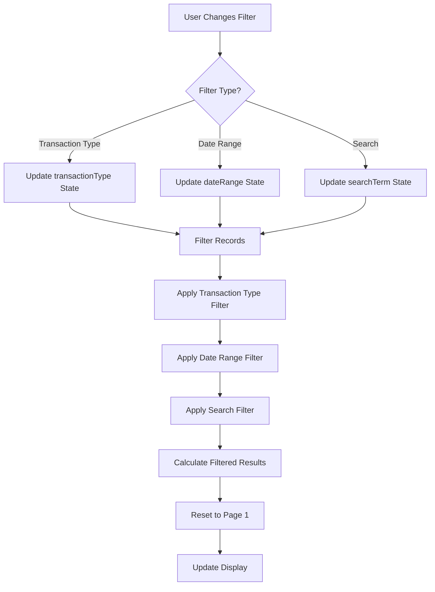

**Source Evidence**: `components/MovementHistory.tsx:71-102`

---

## 9. Transaction Type Badge Flow

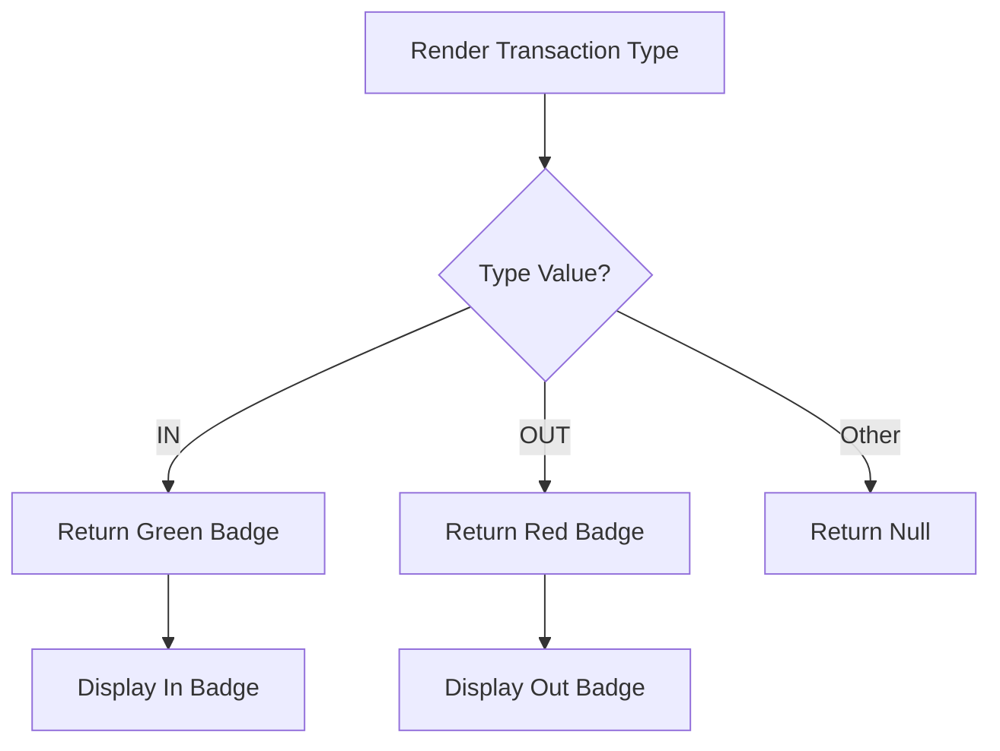

**Note**: Only IN and OUT types are supported.

**Source Evidence**: `components/MovementHistory.tsx:112-121`

---

## 10. Reference Type Badge Flow

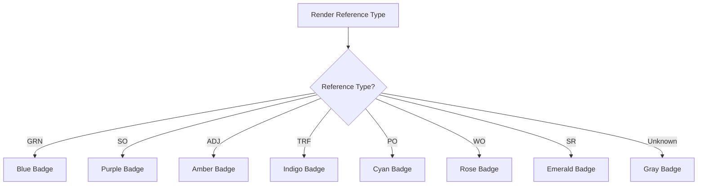

**Source Evidence**: `components/MovementHistory.tsx:124-136`

---

## 11. Pagination Flow

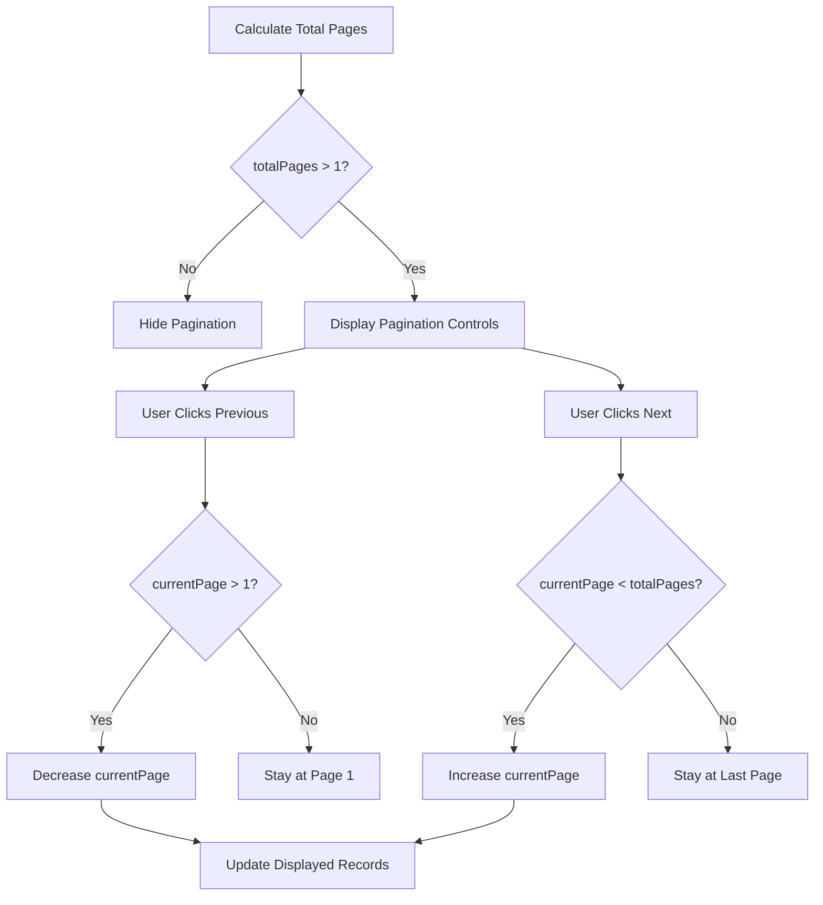

**Source Evidence**: `components/MovementHistory.tsx:398-420`

---

## 12. Export Flow

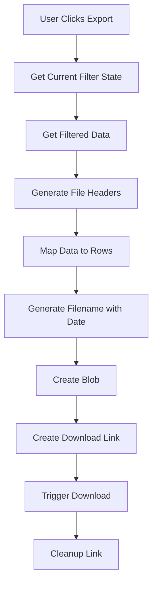

---

## 13. Permission Check Flow

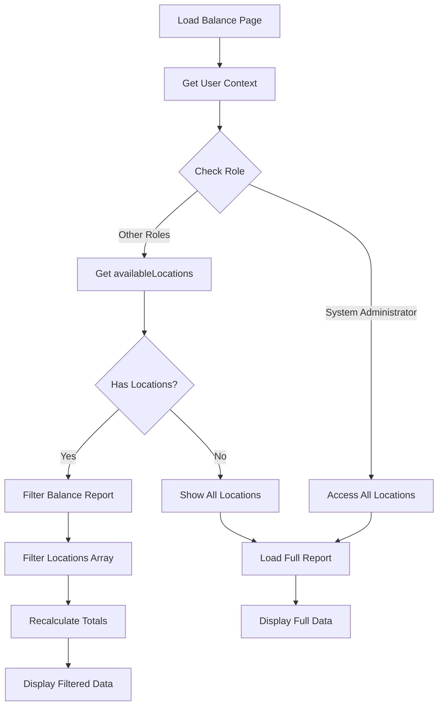

---

## 14. Navigate to Stock Card Flow

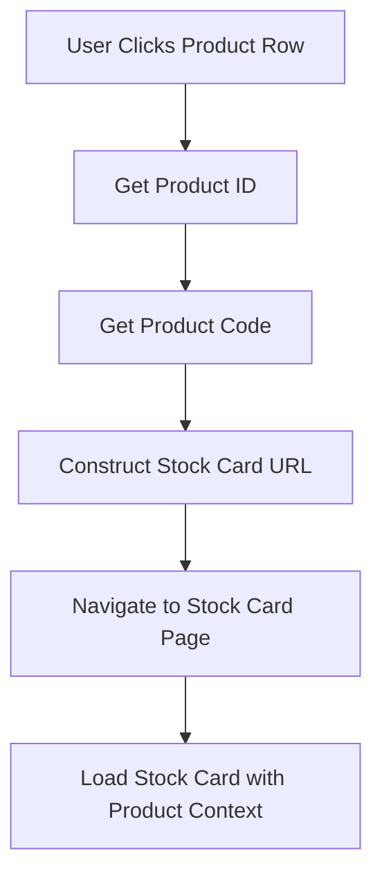

---

## 15. Movement Summary Calculation Flow

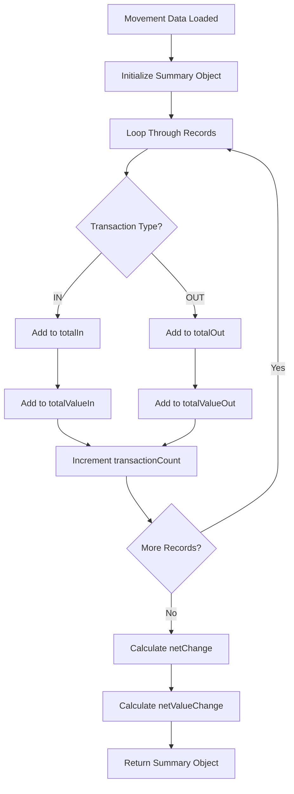

---

## 16. Quantity Change Display Flow

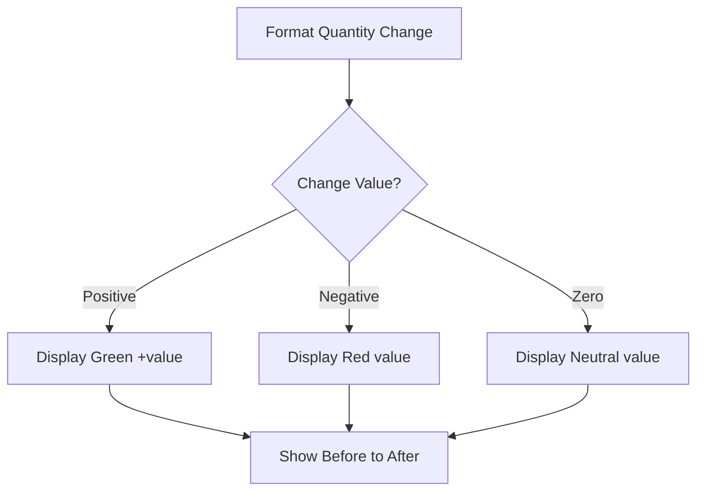

**Source Evidence**: `components/MovementHistory.tsx:139-147`

---

## Related Documents

- [BR-inventory-balance.md](./BR-inventory-balance.md) - Business Requirements
- [TS-inventory-balance.md](./TS-inventory-balance.md) - Technical Specification
- [UC-inventory-balance.md](./UC-inventory-balance.md) - Use Cases
- [VAL-inventory-balance.md](./VAL-inventory-balance.md) - Validations
