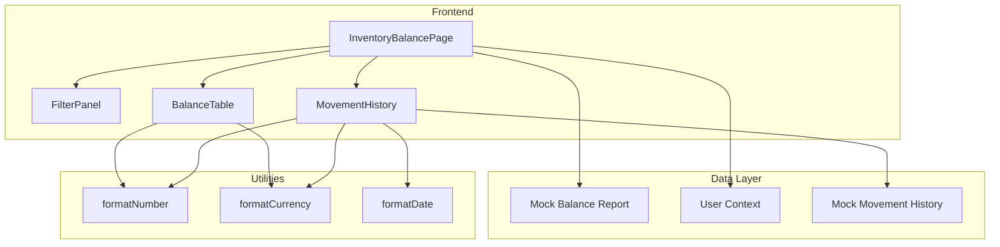
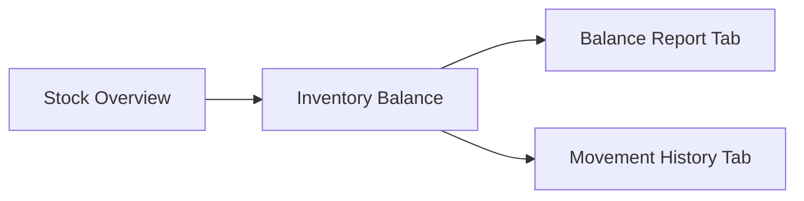
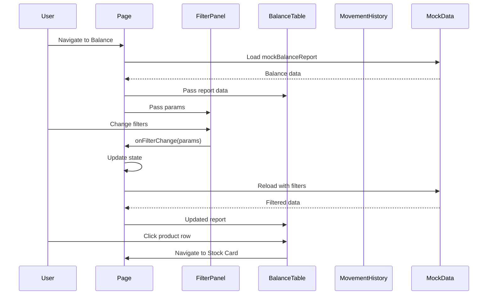

# Technical Specification: Inventory Balance

## Document Information
| Field | Value |
|-------|-------|
| Module | Inventory Management |
| Sub-module | Inventory Balance |
| Version | 3.0.0 |
| Last Updated | 2025-01-15 |

## Document History
| Version | Date | Author | Changes |
|---------|------|--------|---------|
| 3.0.0 | 2025-01-15 | Documentation Team | Synced with current code; Updated type definitions; Added MovementHistory component details; Updated FilterPanel component; Added inventory status logic; Corrected transaction types to IN/OUT only |
| 2.0.0 | 2024-06-15 | System | Previous version |
| 1.0 | 2024-01-15 | Documentation Team | Initial version |

---

## 1. System Architecture



---

## 2. Page Hierarchy



**Route**: `/inventory-management/stock-overview/inventory-balance`

---

## 3. Component Architecture

### 3.1 Page Component

**File**: `app/(main)/inventory-management/stock-overview/inventory-balance/page.tsx`

**Responsibilities**:
- Manage filter state and tab state
- Load balance data with permission filtering
- Coordinate child components
- Handle navigation to Stock Card

**State Management**:
```typescript
const [isLoading, setIsLoading] = useState(true)
const [report, setReport] = useState<BalanceReport | null>(null)
const [params, setParams] = useState<BalanceReportParams>({
  asOfDate: format(new Date(), 'yyyy-MM-dd'),
  locationRange: { from: '', to: '' },
  categoryRange: { from: '', to: '' },
  productRange: { from: '', to: '' },
  viewType: 'PRODUCT',
  showLots: false
})
```

---

### 3.2 FilterPanel Component

**File**: `app/(main)/inventory-management/stock-overview/inventory-balance/components/FilterPanel.tsx`

**Responsibilities**:
- Render filter inputs (location, category, product ranges)
- Date picker for as-of date
- Apply and reset filters

**Props**:
```typescript
interface FilterPanelProps {
  params: BalanceReportParams
  onFilterChange: (params: BalanceReportParams) => void
  isLoading: boolean
}
```

**Key Features**:
- Calendar picker using shadcn/ui Calendar component
- Range inputs for location, category, product codes
- Apply button to execute filters
- Reset button to clear all filters

**Source Evidence**: `components/FilterPanel.tsx:1-210`

---

### 3.3 BalanceTable Component

**File**: `app/(main)/inventory-management/stock-overview/inventory-balance/components/BalanceTable.tsx`

**Responsibilities**:
- Render hierarchical balance data (Location → Category → Product → Lot)
- Handle expand/collapse for locations, categories, products
- Display quantities, values, and inventory status
- Navigate to Stock Card on product click

**Props**:
```typescript
interface BalanceTableProps {
  params: BalanceReportParams
  isLoading: boolean
}
```

**Inventory Status Logic**:
```typescript
const getInventoryStatus = (product: ProductBalance): 'low' | 'high' | 'normal' => {
  const quantity = product.totals.quantity
  const minimum = product.thresholds.minimum
  const maximum = product.thresholds.maximum

  if (quantity <= minimum) return 'low'
  if (quantity >= maximum) return 'high'
  return 'normal'
}
```

**Status Badge Rendering**:
```typescript
// Low stock - Red destructive badge
<Badge variant="destructive">Low</Badge>

// High stock - Amber badge
<Badge className="bg-amber-100 text-amber-800 hover:bg-amber-100">High</Badge>

// Normal stock - Green badge
<Badge className="bg-green-100 text-green-800 hover:bg-green-100">Normal</Badge>
```

**Source Evidence**: `components/BalanceTable.tsx:112-121`

---

### 3.4 MovementHistory Component

**File**: `app/(main)/inventory-management/stock-overview/inventory-balance/components/MovementHistory.tsx`

**Responsibilities**:
- Display recent inventory movements
- Filter by transaction type (IN/OUT only)
- Filter by date range
- Search by product, location, reference
- Paginate results
- Show summary cards

**Props**:
```typescript
interface MovementHistoryProps {
  params: BalanceReportParams
  isLoading: boolean
}
```

**State Management**:
```typescript
const [movementData, setMovementData] = useState<MovementHistoryData | null>(null)
const [localLoading, setLocalLoading] = useState(true)
const [dateRange, setDateRange] = useState<{
  from: Date | undefined
  to: Date | undefined
}>({ from: undefined, to: undefined })
const [transactionType, setTransactionType] = useState<string>("ALL")
const [searchTerm, setSearchTerm] = useState("")
const [currentPage, setCurrentPage] = useState(1)
const itemsPerPage = 10
```

**Transaction Type Badge Function**:
```typescript
const getTransactionTypeBadge = (type: string) => {
  switch (type) {
    case 'IN':
      return <Badge className="bg-green-100 text-green-800 hover:bg-green-100">In</Badge>
    case 'OUT':
      return <Badge className="bg-red-100 text-red-800 hover:bg-red-100">Out</Badge>
    default:
      return null
  }
}
```

**Reference Type Badge Function**:
```typescript
const getReferenceTypeBadge = (type: string) => {
  const colors: Record<string, string> = {
    'GRN': 'bg-blue-100 text-blue-800 hover:bg-blue-100',
    'SO': 'bg-purple-100 text-purple-800 hover:bg-purple-100',
    'ADJ': 'bg-amber-100 text-amber-800 hover:bg-amber-100',
    'TRF': 'bg-indigo-100 text-indigo-800 hover:bg-indigo-100',
    'PO': 'bg-cyan-100 text-cyan-800 hover:bg-cyan-100',
    'WO': 'bg-rose-100 text-rose-800 hover:bg-rose-100',
    'SR': 'bg-emerald-100 text-emerald-800 hover:bg-emerald-100'
  }
  return <Badge className={colors[type] || 'bg-gray-100 text-gray-800'}>{type}</Badge>
}
```

**Source Evidence**: `components/MovementHistory.tsx:111-136`

---

## 4. Type Definitions

### 4.1 BalanceReport
```typescript
interface BalanceReport {
  locations: LocationBalance[]
  totals: {
    quantity: number
    value: number
  }
}
```

### 4.2 LocationBalance
```typescript
interface LocationBalance {
  id: string
  code: string
  name: string
  categories: CategoryBalance[]
  totals: {
    quantity: number
    value: number
  }
}
```

### 4.3 CategoryBalance
```typescript
interface CategoryBalance {
  id: string
  code: string
  name: string
  products: ProductBalance[]
  totals: {
    quantity: number
    value: number
  }
}
```

### 4.4 ProductBalance
```typescript
interface ProductBalance {
  id: string
  code: string
  name: string
  unit: string
  tracking: {
    batch: boolean
  }
  thresholds: {
    minimum: number
    maximum: number
  }
  totals: {
    quantity: number
    averageCost: number
    value: number
  }
  lots: LotBalance[]
}
```

### 4.5 LotBalance
```typescript
interface LotBalance {
  lotNumber: string
  expiryDate?: string
  quantity: number
  unitCost: number
  value: number
}
```

### 4.6 BalanceReportParams
```typescript
interface BalanceReportParams {
  asOfDate: string  // YYYY-MM-DD format
  locationRange: { from: string; to: string }
  categoryRange: { from: string; to: string }
  productRange: { from: string; to: string }
  viewType: 'CATEGORY' | 'PRODUCT' | 'LOT'
  showLots: boolean
}
```

### 4.7 MovementHistoryData
```typescript
interface MovementHistoryData {
  records: MovementRecord[]
  summary: {
    totalIn: number
    totalValueIn: number
    totalOut: number
    totalValueOut: number
    netChange: number
    netValueChange: number
    transactionCount: number
  }
}
```

### 4.8 MovementRecord
```typescript
interface MovementRecord {
  id: string
  date: string
  time: string
  reference: string
  referenceType: 'GRN' | 'SO' | 'ADJ' | 'TRF' | 'PO' | 'WO' | 'SR'
  productId: string
  productCode: string
  productName: string
  lotNumber?: string
  locationId: string
  locationName: string
  transactionType: 'IN' | 'OUT'
  reason: string
  quantityBefore: number
  quantityChange: number
  quantityAfter: number
  valueBefore: number
  valueChange: number
  valueAfter: number
}
```

**Source Evidence**: `inventory-balance/types.ts`

---

## 5. Utility Functions

**File**: `app/(main)/inventory-management/stock-overview/inventory-balance/utils.ts`

### 5.1 formatNumber
```typescript
export function formatNumber(value: number): string {
  return new Intl.NumberFormat('en-US', {
    minimumFractionDigits: 0,
    maximumFractionDigits: 2,
  }).format(value)
}
```

### 5.2 formatCurrency
```typescript
export function formatCurrency(value: number): string {
  return new Intl.NumberFormat('en-US', {
    style: 'currency',
    currency: 'USD',
  }).format(value)
}
```

### 5.3 formatPercent
```typescript
export function formatPercent(value: number): string {
  return new Intl.NumberFormat('en-US', {
    style: 'percent',
    minimumFractionDigits: 1,
    maximumFractionDigits: 1,
  }).format(value / 100)
}
```

### 5.4 formatDate
```typescript
export function formatDate(dateString: string): string {
  const date = new Date(dateString)
  return new Intl.DateTimeFormat('en-US', {
    year: 'numeric',
    month: 'short',
    day: 'numeric',
  }).format(date)
}
```

### 5.5 truncateText
```typescript
export function truncateText(text: string, maxLength: number): string {
  if (text.length <= maxLength) return text
  return text.slice(0, maxLength) + '...'
}
```

### 5.6 stringToColor
```typescript
export function stringToColor(str: string): string {
  // Generates consistent color from string for visual grouping
}
```

**Source Evidence**: `utils.ts:1-65`

---

## 6. Data Flow



---

## 7. Component Tree

```
InventoryBalancePage
├── PageHeader
│   ├── BackLink
│   ├── Title with Icon
│   └── As-of-date display
├── Tabs
│   ├── TabsList
│   │   ├── Balance Report
│   │   └── Movement History
│   ├── TabsContent[Balance Report]
│   │   ├── FilterPanel
│   │   │   ├── DatePicker (As-of Date)
│   │   │   ├── LocationRange (From/To)
│   │   │   ├── CategoryRange (From/To)
│   │   │   ├── ProductRange (From/To)
│   │   │   ├── ApplyButton
│   │   │   └── ResetButton
│   │   └── BalanceTable
│   │       ├── LocationRows (expandable)
│   │       │   └── CategoryRows (expandable)
│   │       │       └── ProductRows (expandable)
│   │       │           └── LotRows
│   │       └── TotalsRow
│   └── TabsContent[Movement History]
│       └── MovementHistory
│           ├── SummaryCards (4 cards)
│           │   ├── TotalIn
│           │   ├── TotalOut
│           │   ├── NetChange
│           │   └── Transactions
│           ├── Filters
│           │   ├── DateRangePicker
│           │   ├── TransactionTypeSelect
│           │   └── SearchInput
│           ├── ExportButton
│           ├── MovementTable
│           │   └── MovementRows
│           └── Pagination
```

---

## 8. Third-Party Libraries

| Library | Version | Usage |
|---------|---------|-------|
| date-fns | ^2.x | Date formatting |
| lucide-react | ^0.x | Icons (CalendarIcon, Download, FileDown, Search) |
| shadcn/ui | ^0.x | Card, Table, Badge, Tabs, Button, Input, Calendar, Popover, Select, Skeleton |

---

## 9. Performance Considerations

| Concern | Mitigation |
|---------|------------|
| Large dataset | Hierarchical lazy expansion |
| Filter changes | Debounced state updates |
| Permission filtering | Client-side filtering with caching |
| Movement history | Pagination (10 items per page) |
| Export | Async generation with progress |

---

## 10. Accessibility

| Feature | Implementation |
|---------|---------------|
| Keyboard navigation | Tab through expandable rows |
| Screen readers | ARIA labels on all interactive elements |
| Color contrast | 4.5:1 minimum ratio |
| Focus indicators | Visible focus rings |
| Status indicators | Badge colors with text labels |

---

## 11. Error Handling

| Scenario | Handling |
|----------|----------|
| Data load failure | Show error state with retry button |
| Empty data | Display "No data available" message |
| Permission denied | Redirect or show access denied |
| Export failure | Toast notification with error |
| Invalid date | Show validation error message |

---

## 12. Related Documents

- [BR-inventory-balance.md](./BR-inventory-balance.md) - Business Requirements
- [FD-inventory-balance.md](./FD-inventory-balance.md) - Flow Diagrams
- [UC-inventory-balance.md](./UC-inventory-balance.md) - Use Cases
- [VAL-inventory-balance.md](./VAL-inventory-balance.md) - Validations
