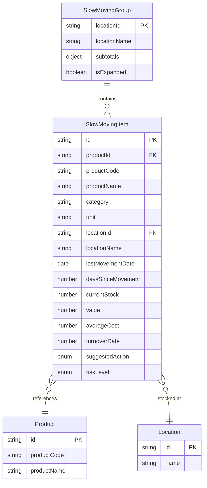

# DD-SLW-MOV: Slow Moving Inventory Data Dictionary

**Document Version**: 1.0
**Last Updated**: 2026-01-15
**Module**: Inventory Management
**Sub-Module**: Stock Overview > Slow Moving

---

## Document History

| Version | Date | Author | Changes |
|---------|------|--------|---------|
| 1.0.0 | 2026-01-15 | Documentation Team | Initial version |

---

## Document Overview

This document provides comprehensive data schema documentation for the Slow Moving Inventory sub-module. It defines the data structures, types, and relationships used for identifying and managing stagnant inventory items.

**Related Documents**:
- [INDEX-slow-moving.md](./INDEX-slow-moving.md)
- [BR-slow-moving.md](./BR-slow-moving.md)
- [TS-slow-moving.md](./TS-slow-moving.md)
- [DD-stock-overview.md](../DD-stock-overview.md) (Parent schema)

---

## Entity-Relationship Diagram



---

## Core Interfaces

### SlowMovingItem

**Purpose**: Individual inventory item identified as slow moving

**TypeScript Definition**:
```typescript
interface SlowMovingItem {
  id: string
  productId: string
  productCode: string
  productName: string
  category: string
  unit: string
  locationId: string
  locationName: string
  lastMovementDate: Date
  daysSinceMovement: number
  currentStock: number
  value: number
  averageCost: number
  turnoverRate: number
  suggestedAction: 'transfer' | 'promote' | 'writeoff' | 'hold'
  riskLevel: 'low' | 'medium' | 'high' | 'critical'
}
```

**Field Definitions**:

| Field | Type | Required | Constraints | Description |
|-------|------|----------|-------------|-------------|
| `id` | `string` | Yes | UUID format | Unique record identifier |
| `productId` | `string` | Yes | UUID, FK | Reference to product |
| `productCode` | `string` | Yes | Max 50 chars | Product code |
| `productName` | `string` | Yes | Max 255 chars | Product display name |
| `category` | `string` | Yes | Max 100 chars | Product category |
| `unit` | `string` | Yes | Max 20 chars | Unit of measure |
| `locationId` | `string` | Yes | UUID, FK | Reference to location |
| `locationName` | `string` | Yes | Max 255 chars | Location display name |
| `lastMovementDate` | `Date` | Yes | Valid date | Date of last transaction |
| `daysSinceMovement` | `number` | Yes | >= 0 | Days since last movement |
| `currentStock` | `number` | Yes | >= 0 | Current quantity on hand |
| `value` | `number` | Yes | >= 0 | Total inventory value |
| `averageCost` | `number` | Yes | >= 0 | Average unit cost |
| `turnoverRate` | `number` | Yes | >= 0 | Movements per month |
| `suggestedAction` | `enum` | Yes | Valid action | Recommended action |
| `riskLevel` | `enum` | Yes | Valid level | Risk classification |

---

### SlowMovingGroup

**Purpose**: Slow moving items grouped by location

**TypeScript Definition**:
```typescript
interface SlowMovingGroup {
  locationId: string
  locationName: string
  items: SlowMovingItem[]
  subtotals: {
    totalItems: number
    totalQuantity: number
    totalValue: number
    averageDaysSinceMovement: number
    criticalItems: number
  }
  isExpanded: boolean
}
```

**Field Definitions**:

| Field | Type | Required | Description |
|-------|------|----------|-------------|
| `locationId` | `string` | Yes | Location identifier |
| `locationName` | `string` | Yes | Location display name |
| `items` | `SlowMovingItem[]` | Yes | Slow moving items at location |
| `subtotals` | `object` | Yes | Aggregated metrics |
| `subtotals.totalItems` | `number` | Yes | Count of slow moving items |
| `subtotals.totalQuantity` | `number` | Yes | Sum of quantities |
| `subtotals.totalValue` | `number` | Yes | Sum of values |
| `subtotals.averageDaysSinceMovement` | `number` | Yes | Average days stagnant |
| `subtotals.criticalItems` | `number` | Yes | Count of critical items |
| `isExpanded` | `boolean` | Yes | UI expansion state |

---

## Enumerations

### RiskLevel

**Purpose**: Classification of slow moving inventory risk

**Type Definition**:
```typescript
type RiskLevel = 'low' | 'medium' | 'high' | 'critical'
```

**Values**:

| Value | Days Since Movement | Turnover Rate | Color | Description |
|-------|---------------------|---------------|-------|-------------|
| `low` | 30-45 days | >= 1.5x/year | Green | Monitor only |
| `medium` | 45-60 days | 1.0-1.5x/year | Amber | Consider promotion |
| `high` | 60-90 days | 0.5-1.0x/year | Orange | Action required |
| `critical` | 90+ days | < 0.5x/year | Red | Immediate action |

**Classification Logic**:
```typescript
function calculateRiskLevel(daysSinceMovement: number, turnoverRate: number): RiskLevel {
  if (daysSinceMovement > 90 || turnoverRate < 0.5) return 'critical'
  if (daysSinceMovement > 60 || turnoverRate < 1.0) return 'high'
  if (daysSinceMovement > 45 || turnoverRate < 1.5) return 'medium'
  return 'low'
}
```

---

### SuggestedAction

**Purpose**: Recommended action for slow moving inventory

**Type Definition**:
```typescript
type SuggestedAction = 'transfer' | 'promote' | 'writeoff' | 'hold'
```

**Values**:

| Value | Description | When Suggested |
|-------|-------------|----------------|
| `transfer` | Transfer to higher-demand location | Medium risk, other locations need stock |
| `promote` | Create promotions to increase movement | High risk, still has value |
| `writeoff` | Write off as loss | Critical risk, no demand expected |
| `hold` | Continue monitoring | Low risk, seasonal or specialty items |

**Suggestion Logic**:
```typescript
function suggestAction(riskLevel: RiskLevel, value: number): SuggestedAction {
  switch(riskLevel) {
    case 'critical': return value > 100 ? 'promote' : 'writeoff'
    case 'high': return 'promote'
    case 'medium': return 'transfer'
    default: return 'hold'
  }
}
```

---

## Filter Configuration

### SlowMovingFilter

**Purpose**: Filter parameters for slow moving inventory view

**TypeScript Definition**:
```typescript
interface SlowMovingFilter {
  locations: string[]
  categories: string[]
  riskLevels: RiskLevel[]
  suggestedActions: SuggestedAction[]
  minDaysSinceMovement: number
  maxDaysSinceMovement: number
  minValue: number
  maxValue: number
  search: string
}
```

**Field Definitions**:

| Field | Type | Default | Description |
|-------|------|---------|-------------|
| `locations` | `string[]` | [] | Selected location IDs |
| `categories` | `string[]` | [] | Selected category names |
| `riskLevels` | `RiskLevel[]` | [] | Selected risk levels |
| `suggestedActions` | `SuggestedAction[]` | [] | Selected actions |
| `minDaysSinceMovement` | `number` | 30 | Minimum days filter |
| `maxDaysSinceMovement` | `number` | 365 | Maximum days filter |
| `minValue` | `number` | 0 | Minimum value filter |
| `maxValue` | `number` | Infinity | Maximum value filter |
| `search` | `string` | "" | Text search |

---

## Analytics Data Structures

### RiskDistribution

**Purpose**: Distribution of items by risk level

```typescript
interface RiskDistribution {
  riskLevel: RiskLevel
  itemCount: number
  totalValue: number
  percentage: number
}
```

### ActionDistribution

**Purpose**: Distribution of items by suggested action

```typescript
interface ActionDistribution {
  action: SuggestedAction
  itemCount: number
  totalValue: number
  percentage: number
}
```

### TrendData

**Purpose**: Historical trend of slow moving inventory

```typescript
interface SlowMovingTrend {
  period: string
  itemCount: number
  totalValue: number
  criticalCount: number
}
```

---

## Summary Metrics

### SlowMovingSummary

**Purpose**: Aggregate metrics for slow moving inventory

```typescript
interface SlowMovingSummary {
  totalItems: number
  totalQuantity: number
  totalValue: number
  averageDaysSinceMovement: number
  riskDistribution: {
    low: number
    medium: number
    high: number
    critical: number
  }
  actionDistribution: {
    transfer: number
    promote: number
    writeoff: number
    hold: number
  }
  potentialRecovery: number
  potentialWriteoff: number
}
```

**Calculated Fields**:

| Field | Formula | Description |
|-------|---------|-------------|
| `potentialRecovery` | Sum of transfer + promote items value | Value that can be recovered |
| `potentialWriteoff` | Sum of writeoff items value | Value at risk of loss |
| `averageDaysSinceMovement` | Mean of all items | Average stagnation period |

---

## Action Records

### SlowMovingAction

**Purpose**: Record of action taken on slow moving item

```typescript
interface SlowMovingAction {
  id: string
  slowMovingItemId: string
  actionType: SuggestedAction
  actionDate: Date
  performedBy: string
  notes: string
  result: 'success' | 'partial' | 'failed'
  quantityAffected: number
  valueAffected: number
}
```

**Field Definitions**:

| Field | Type | Description |
|-------|------|-------------|
| `id` | `string` | Action record identifier |
| `slowMovingItemId` | `string` | Reference to slow moving item |
| `actionType` | `SuggestedAction` | Type of action taken |
| `actionDate` | `Date` | Date action was taken |
| `performedBy` | `string` | User who performed action |
| `notes` | `string` | Action notes/comments |
| `result` | `enum` | Outcome of action |
| `quantityAffected` | `number` | Quantity involved |
| `valueAffected` | `number` | Value involved |

---

## Validation Rules

### Threshold Validation

| Rule | Constraint | Description |
|------|------------|-------------|
| Slow Moving Threshold | >= 30 days | Minimum days to classify as slow moving |
| Critical Threshold | >= 90 days | Days to classify as critical |
| Turnover Threshold | < 2.0x/year | Maximum turnover to be slow moving |

### Value Constraints

| Field | Constraint | Error Message |
|-------|------------|---------------|
| `daysSinceMovement` | >= 0 | "Days cannot be negative" |
| `currentStock` | >= 0 | "Stock cannot be negative" |
| `value` | >= 0 | "Value cannot be negative" |
| `turnoverRate` | >= 0 | "Turnover rate cannot be negative" |

---

## Sample Data

### Sample Slow Moving Item

```json
{
  "id": "slow-loc001-prod001-1",
  "productId": "prod-001",
  "productCode": "FOOD-042",
  "productName": "Specialty Olive Oil",
  "category": "Food",
  "unit": "bottle",
  "locationId": "loc-001",
  "locationName": "Main Kitchen",
  "lastMovementDate": "2025-10-15T00:00:00.000Z",
  "daysSinceMovement": 92,
  "currentStock": 48,
  "value": 960.00,
  "averageCost": 20.00,
  "turnoverRate": 0.4,
  "suggestedAction": "promote",
  "riskLevel": "critical"
}
```

### Sample Slow Moving Group

```json
{
  "locationId": "loc-001",
  "locationName": "Main Kitchen",
  "items": ["...items array..."],
  "subtotals": {
    "totalItems": 12,
    "totalQuantity": 485,
    "totalValue": 8250.00,
    "averageDaysSinceMovement": 68,
    "criticalItems": 3
  },
  "isExpanded": true
}
```

---

## Database Mapping

This sub-module uses data from the following parent schema tables:

| Interface | Primary Table | Related Tables |
|-----------|--------------|----------------|
| `SlowMovingItem` | Calculated from `tb_stock_balance` | `tb_inventory_item`, `tb_location` |
| `SlowMovingGroup` | Grouped by `tb_location` | `tb_stock_balance` |
| `SlowMovingAction` | `tb_inventory_adjustment` | `tb_inventory_transaction` |

### Slow Moving Query

```sql
SELECT
  sb.id,
  i.id as product_id,
  i.item_code as product_code,
  i.item_name as product_name,
  c.category_name as category,
  u.unit_symbol as unit,
  l.id as location_id,
  l.location_name,
  sb.last_movement_date,
  EXTRACT(DAY FROM (CURRENT_DATE - sb.last_movement_date)) as days_since_movement,
  sb.quantity_on_hand as current_stock,
  sb.total_value as value,
  sb.average_cost
FROM tb_stock_balance sb
INNER JOIN tb_inventory_item i ON sb.item_id = i.id
INNER JOIN tb_category c ON i.category_id = c.id
INNER JOIN tb_unit u ON i.base_unit_id = u.id
INNER JOIN tb_location l ON sb.location_id = l.id
WHERE sb.last_movement_date < CURRENT_DATE - INTERVAL '30 days'
  AND sb.quantity_on_hand > 0
ORDER BY days_since_movement DESC;
```

---

## State Management

### Component State

```typescript
interface SlowMovingState {
  items: SlowMovingItem[]
  groups: SlowMovingGroup[]
  filter: SlowMovingFilter
  summary: SlowMovingSummary
  selectedItems: Set<string>
  activeTab: 'inventory' | 'analytics' | 'actions'
  isLoading: boolean
  sortConfig: {
    key: string
    direction: 'asc' | 'desc'
  }
}
```

---

**Document Control**

| Version | Date | Author | Changes |
|---------|------|--------|---------|
| 1.0.0 | 2026-01-15 | Documentation Team | Initial data dictionary |
