# Flow Diagrams: Slow Moving Inventory

## Document Information
| Field | Value |
|-------|-------|
| Module | Inventory Management |
| Sub-module | Slow Moving |
| Version | 3.0.0 |
| Last Updated | 2025-01-15 |

## Document History
| Version | Date | Author | Changes |
|---------|------|--------|---------|
| 3.0.0 | 2025-01-15 | Documentation Team | Synced with current code; Added alert generation flow; Added aging distribution flow; Added quick actions flow; Updated field names to match code |
| 2.0.0 | 2024-06-15 | System | Previous version |
| 1.0 | 2024-01-15 | Documentation Team | Initial version |

---

## 1. Page Load Flow

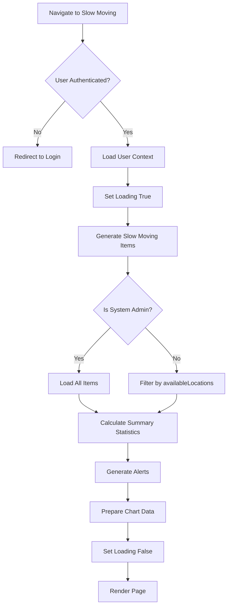

**Source Evidence**: `slow-moving/page.tsx:54-89`

---

## 2. Risk Level Calculation Flow

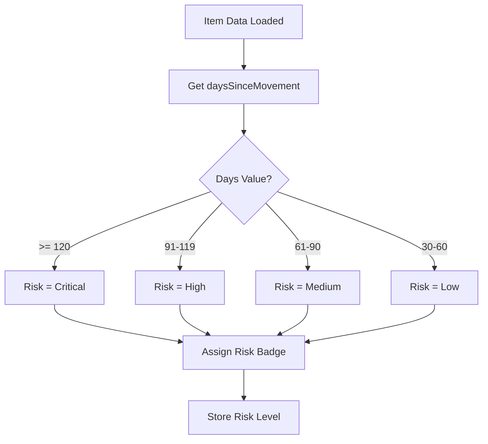

**Source Evidence**: `slow-moving/page.tsx:294-310`

---

## 3. Alert Generation Flow

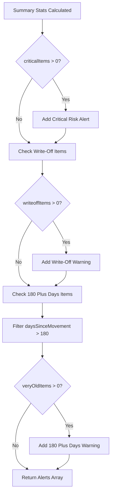

**Source Evidence**: `slow-moving/page.tsx:419-444`

---

## 4. Summary Statistics Calculation Flow

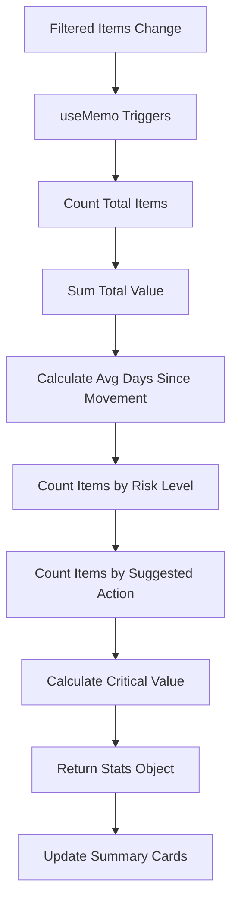

**Source Evidence**: `slow-moving/page.tsx:332-362`

---

## 5. Filter Application Flow

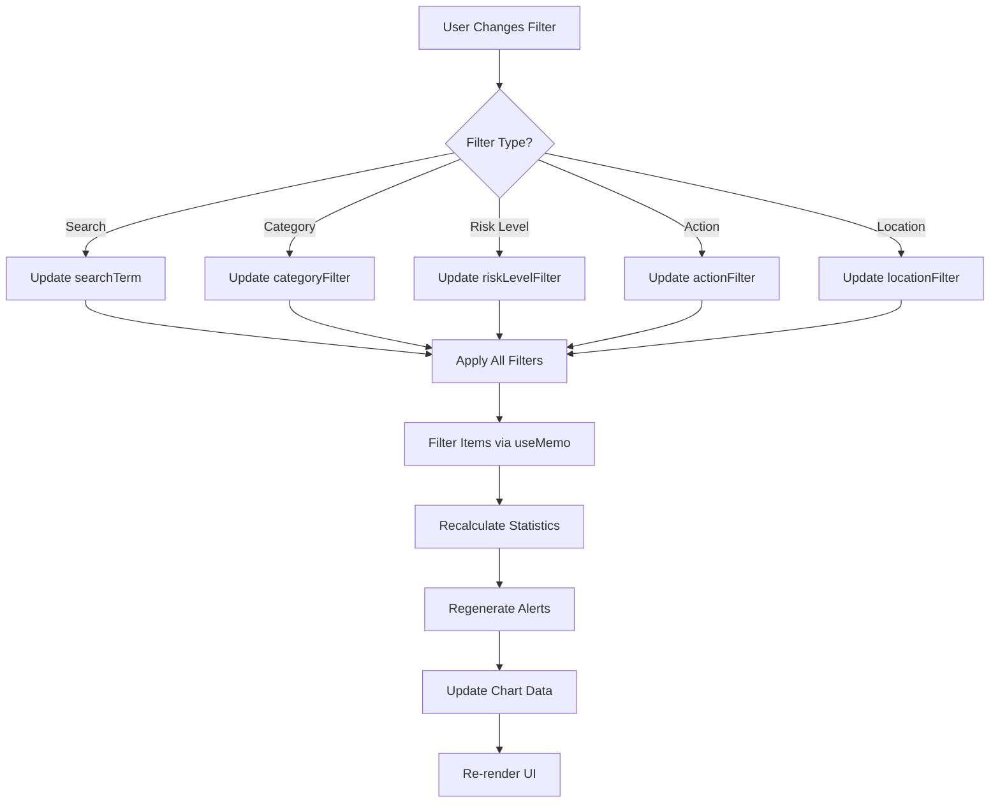

**Source Evidence**: `slow-moving/page.tsx:447-475`

---

## 6. Tab Navigation Flow

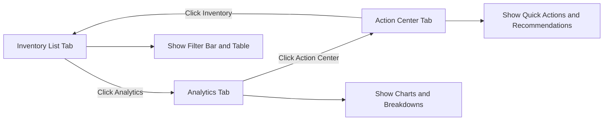

**Source Evidence**: `slow-moving/page.tsx:662-667`

---

## 7. Analytics Chart Generation Flow

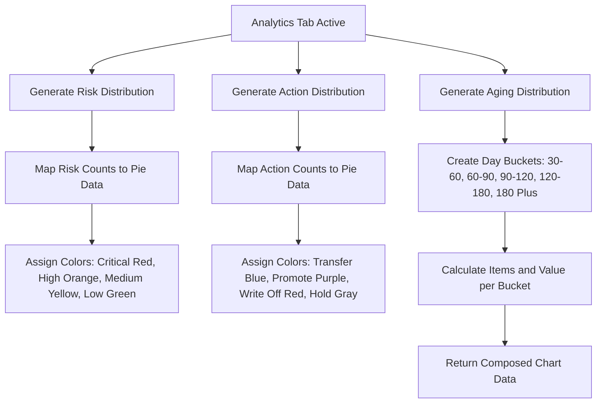

**Source Evidence**: `slow-moving/page.tsx:365-416`

---

## 8. Category Breakdown Flow

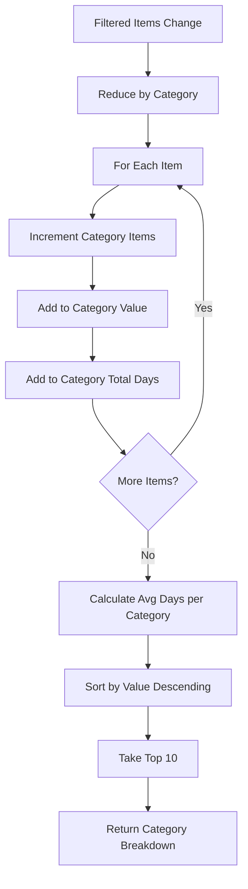

**Source Evidence**: `slow-moving/page.tsx:383-391`

---

## 9. Location Breakdown Flow

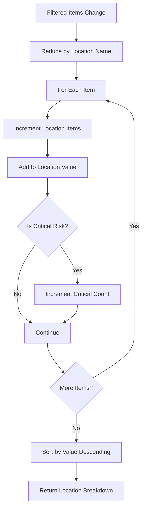

**Source Evidence**: `slow-moving/page.tsx:394-402`

---

## 10. Quick Actions Flow

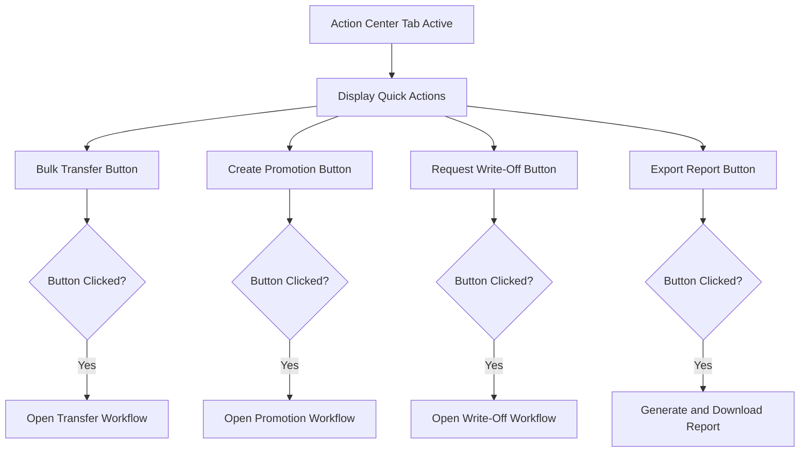

**Source Evidence**: `slow-moving/page.tsx:1141-1163`

---

## 11. Recommended Actions by Risk Flow

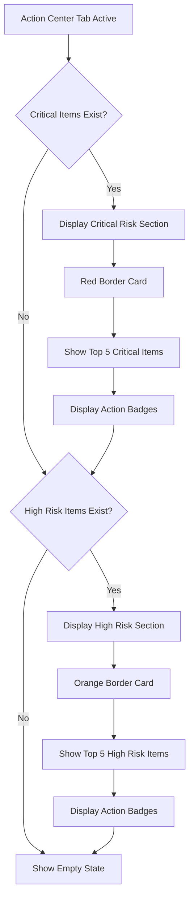

**Source Evidence**: `slow-moving/page.tsx:1168-1238`

---

## 12. View Mode Switch Flow

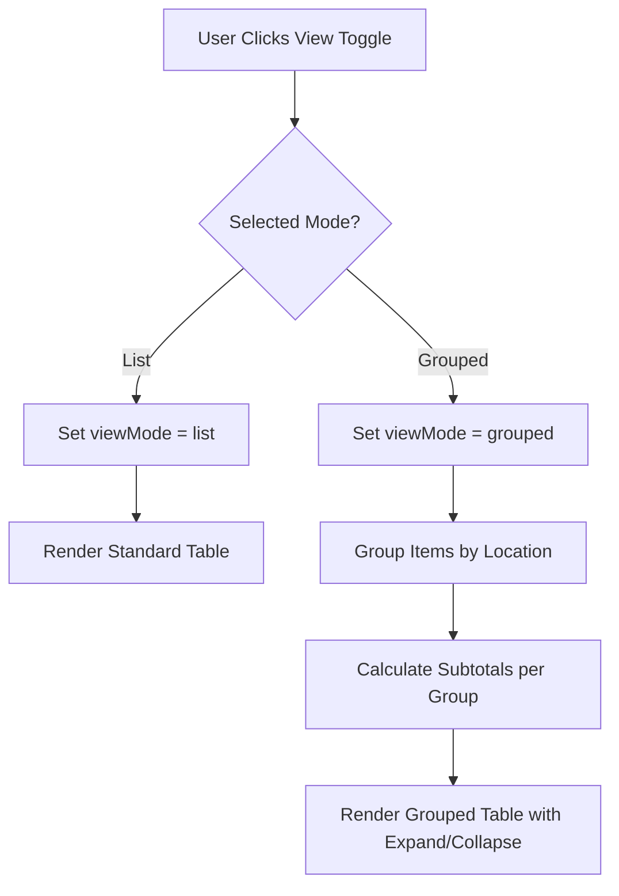

**Source Evidence**: `slow-moving/page.tsx:672-694`

---

## 13. Permission Check Flow

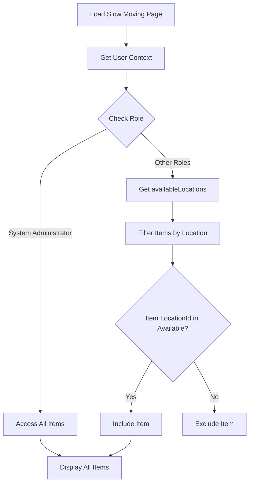

---

## 14. Export Flow

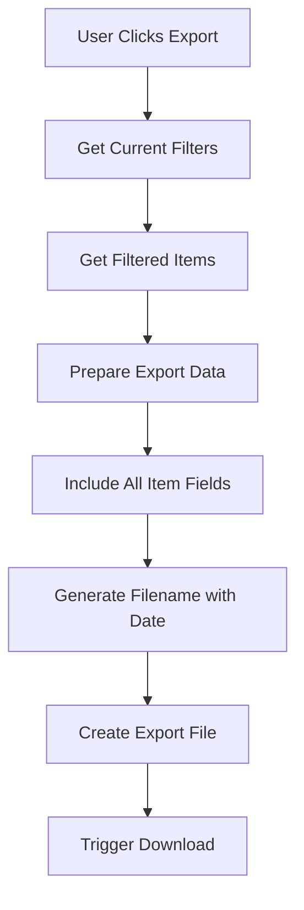

---

## 15. Grouped View Expand/Collapse Flow

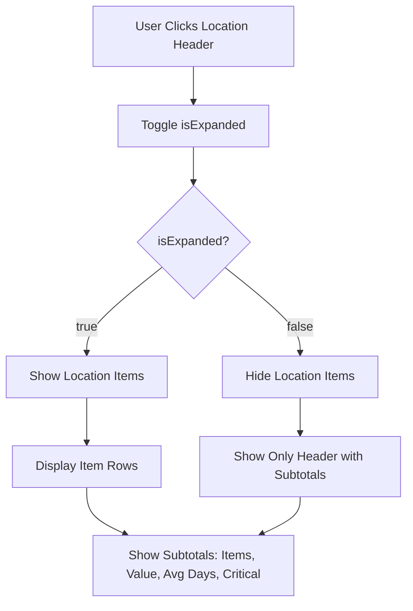

---

## 16. Risk Distribution Chart Render Flow

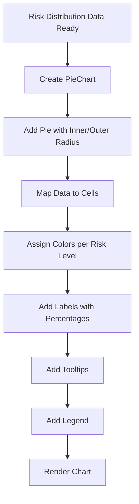

**Source Evidence**: `slow-moving/page.tsx:964-995`

---

## 17. Aging Distribution Chart Render Flow

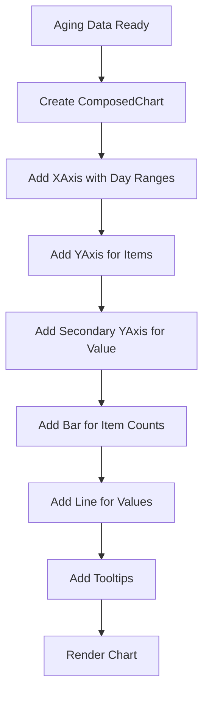

**Source Evidence**: `slow-moving/page.tsx:1033-1061`

---

## 18. Action Summary Cards Flow

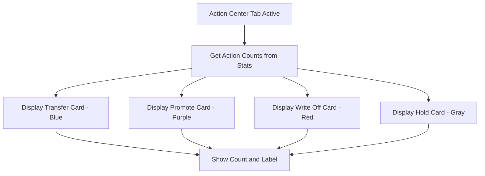

**Source Evidence**: `slow-moving/page.tsx:1241-1285`

---

## Related Documents

- [BR-slow-moving.md](./BR-slow-moving.md) - Business Requirements
- [TS-slow-moving.md](./TS-slow-moving.md) - Technical Specification
- [UC-slow-moving.md](./UC-slow-moving.md) - Use Cases
- [VAL-slow-moving.md](./VAL-slow-moving.md) - Validations
