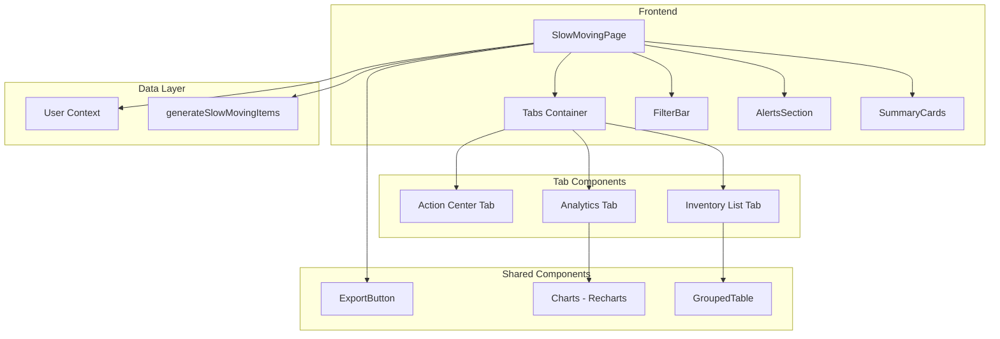
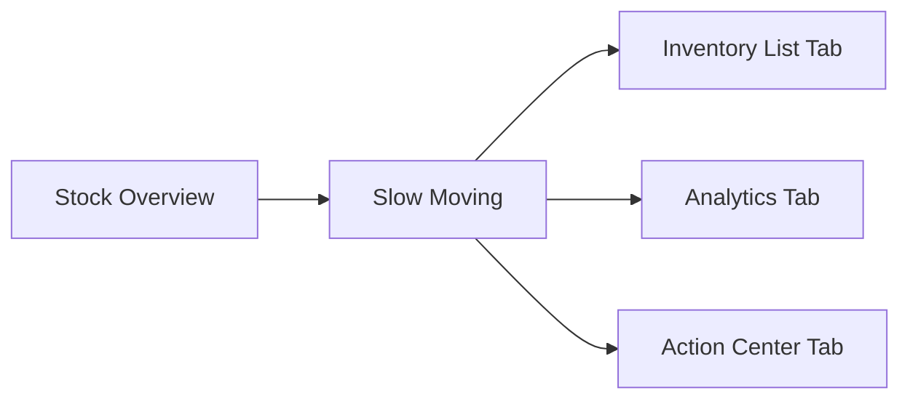
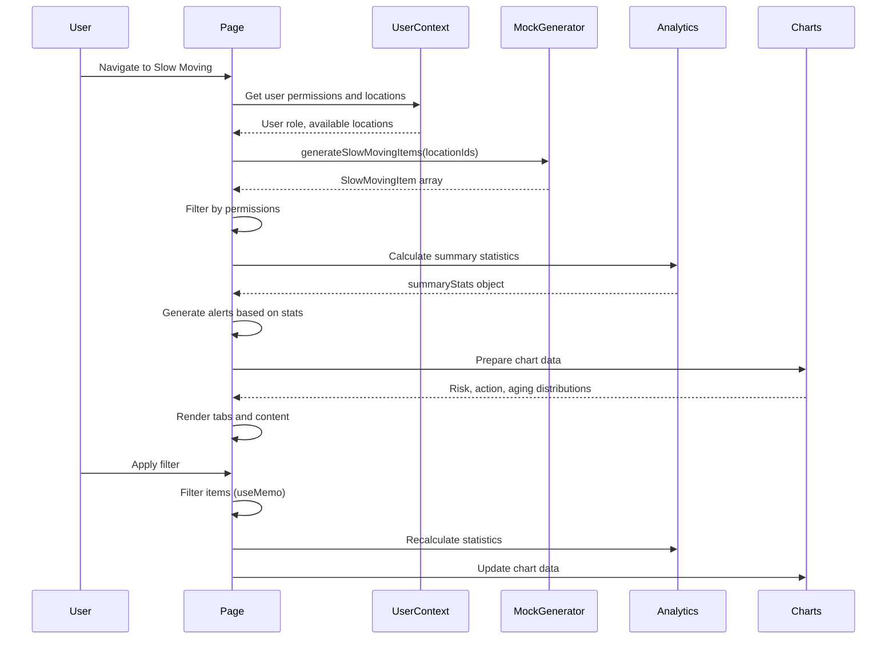

# Technical Specification: Slow Moving Inventory

## Document Information
| Field | Value |
|-------|-------|
| Module | Inventory Management |
| Sub-module | Slow Moving |
| Version | 3.0.0 |
| Last Updated | 2025-01-15 |

## Document History
| Version | Date | Author | Changes |
|---------|------|--------|---------|
| 3.0.0 | 2025-01-15 | Documentation Team | Synced with current code; Updated type definitions; Added alert system; Added aging distribution chart; Added quick actions; Updated component tree |
| 2.0.0 | 2024-06-15 | System | Previous version |
| 1.0 | 2024-01-15 | Documentation Team | Initial version |

---

## 1. System Architecture



---

## 2. Page Hierarchy



**Route**: `/inventory-management/stock-overview/slow-moving`

---

## 3. Component Architecture

### 3.1 Page Component

**File**: `app/(main)/inventory-management/stock-overview/slow-moving/page.tsx`

**Responsibilities**:
- Load slow-moving items based on user permissions
- Calculate summary statistics and analytics data
- Manage filtering and view modes
- Display alerts based on risk conditions
- Render 3-tab interface

**State Management**:
```typescript
const [isLoading, setIsLoading] = useState(true)
const [slowMovingItems, setSlowMovingItems] = useState<SlowMovingItem[]>([])
const [searchTerm, setSearchTerm] = useState("")
const [categoryFilter, setCategoryFilter] = useState("all")
const [riskLevelFilter, setRiskLevelFilter] = useState("all")
const [actionFilter, setActionFilter] = useState("all")
const [locationFilter, setLocationFilter] = useState("all")
const [viewMode, setViewMode] = useState<"list" | "grouped">("list")
```

**Source Evidence**: `slow-moving/page.tsx:54-72`

---

## 4. Type Definitions

### 4.1 SlowMovingItem Interface
```typescript
interface SlowMovingItem {
  id: string
  productId: string
  productCode: string
  productName: string
  category: string
  unit: string
  locationId: string
  locationName: string
  lastMovementDate: Date
  daysSinceMovement: number
  currentStock: number
  value: number
  averageCost: number
  turnoverRate: number  // movements per month
  suggestedAction: 'transfer' | 'promote' | 'writeoff' | 'hold'
  riskLevel: 'low' | 'medium' | 'high' | 'critical'
}
```

**Source Evidence**: `lib/mock-data/location-inventory.ts:189-206`

### 4.2 SlowMovingGroup Interface
```typescript
interface SlowMovingGroup {
  locationId: string
  locationName: string
  items: SlowMovingItem[]
  subtotals: {
    totalItems: number
    totalQuantity: number
    totalValue: number
    avgDaysSinceMovement: number
    criticalItems: number
  }
  isExpanded: boolean
}
```

**Source Evidence**: `lib/mock-data/location-inventory.ts:208-219`

### 4.3 Risk Level Configuration
```typescript
const RISK_LEVELS = {
  low: { label: 'Low', days: '30-60', color: 'green', badgeStyle: 'outline with green bg' },
  medium: { label: 'Medium', days: '61-90', color: 'yellow', badgeStyle: 'outline with yellow bg' },
  high: { label: 'High', days: '91-120', color: 'orange', badgeStyle: 'outline with orange bg' },
  critical: { label: 'Critical', days: '120+', color: 'red', badgeStyle: 'destructive' }
}
```

**Source Evidence**: `slow-moving/page.tsx:294-310`

### 4.4 Suggested Action Configuration
```typescript
const SUGGESTED_ACTIONS = {
  transfer: { label: 'Transfer', icon: ArrowRightLeft, badgeStyle: 'outline blue' },
  promote: { label: 'Promote', icon: Tag, badgeStyle: 'outline purple' },
  writeoff: { label: 'Write Off', icon: Trash2, badgeStyle: 'destructive' },
  hold: { label: 'Hold', icon: Eye, badgeStyle: 'secondary' }
}
```

**Source Evidence**: `slow-moving/page.tsx:313-329`

---

## 5. Risk Calculation Logic

### 5.1 Risk Level Determination
```typescript
const getRiskLevel = (daysSinceMovement: number): RiskLevel => {
  if (daysSinceMovement >= 120) return 'critical'
  if (daysSinceMovement >= 91) return 'high'
  if (daysSinceMovement >= 61) return 'medium'
  return 'low'
}
```

### 5.2 Risk Badge Rendering
```typescript
const getRiskBadge = (level: RiskLevel) => {
  switch (level) {
    case "critical":
      return <Badge variant="destructive">Critical</Badge>
    case "high":
      return <Badge variant="outline" className="bg-orange-100 text-orange-800">High</Badge>
    case "medium":
      return <Badge variant="outline" className="bg-yellow-100 text-yellow-800">Medium</Badge>
    case "low":
      return <Badge variant="outline" className="bg-green-100 text-green-800">Low</Badge>
  }
}
```

**Source Evidence**: `slow-moving/page.tsx:294-310`

---

## 6. Summary Statistics Calculation

```typescript
const summaryStats = useMemo(() => {
  const totalItems = filteredItems.length
  const totalValue = filteredItems.reduce((sum, item) => sum + item.value, 0)
  const avgDaysSinceMovement = filteredItems.length > 0
    ? filteredItems.reduce((sum, item) => sum + item.daysSinceMovement, 0) / filteredItems.length
    : 0
  const criticalItems = filteredItems.filter(item => item.riskLevel === 'critical').length
  const highRiskItems = filteredItems.filter(item => item.riskLevel === 'high').length
  const mediumRiskItems = filteredItems.filter(item => item.riskLevel === 'medium').length
  const lowRiskItems = filteredItems.filter(item => item.riskLevel === 'low').length
  const transferItems = filteredItems.filter(item => item.suggestedAction === 'transfer').length
  const promoteItems = filteredItems.filter(item => item.suggestedAction === 'promote').length
  const writeoffItems = filteredItems.filter(item => item.suggestedAction === 'writeoff').length
  const holdItems = filteredItems.filter(item => item.suggestedAction === 'hold').length
  const criticalValue = filteredItems
    .filter(item => item.riskLevel === 'critical')
    .reduce((sum, item) => sum + item.value, 0)

  return {
    totalItems,
    totalValue,
    avgDaysSinceMovement: Math.round(avgDaysSinceMovement),
    criticalItems,
    highRiskItems,
    mediumRiskItems,
    lowRiskItems,
    transferItems,
    promoteItems,
    writeoffItems,
    holdItems,
    criticalValue
  }
}, [filteredItems])
```

**Source Evidence**: `slow-moving/page.tsx:332-362`

---

## 7. Alert System

### 7.1 Alert Generation Logic
```typescript
const alerts = useMemo(() => {
  const alertList: { type: 'critical' | 'warning'; title: string; description: string }[] = []

  if (summaryStats.criticalItems > 0) {
    alertList.push({
      type: 'critical',
      title: 'Critical Risk Items',
      description: `${summaryStats.criticalItems} items have been idle for over 120 days`
    })
  }

  if (summaryStats.writeoffItems > 0) {
    alertList.push({
      type: 'warning',
      title: 'Items for Write-Off',
      description: `${summaryStats.writeoffItems} items are recommended for write-off`
    })
  }

  // Items inactive for 180+ days
  const veryOldItems = filteredItems.filter(item => item.daysSinceMovement > 180).length
  if (veryOldItems > 0) {
    alertList.push({
      type: 'warning',
      title: 'Items Inactive 180+ Days',
      description: `${veryOldItems} items have had no movement for over 180 days`
    })
  }

  return alertList
}, [summaryStats, filteredItems])
```

**Source Evidence**: `slow-moving/page.tsx:419-444`

---

## 8. Chart Data Preparation

### 8.1 Risk Distribution Data
```typescript
const riskDistributionData = useMemo(() => [
  { name: 'Critical', value: summaryStats.criticalItems, color: '#ef4444' },
  { name: 'High', value: summaryStats.highRiskItems, color: '#f97316' },
  { name: 'Medium', value: summaryStats.mediumRiskItems, color: '#eab308' },
  { name: 'Low', value: summaryStats.lowRiskItems, color: '#22c55e' }
].filter(item => item.value > 0), [summaryStats])
```

**Source Evidence**: `slow-moving/page.tsx:365-371`

### 8.2 Action Distribution Data
```typescript
const actionDistributionData = useMemo(() => [
  { name: 'Transfer', value: summaryStats.transferItems, color: '#3b82f6' },
  { name: 'Promote', value: summaryStats.promoteItems, color: '#8b5cf6' },
  { name: 'Write Off', value: summaryStats.writeoffItems, color: '#ef4444' },
  { name: 'Hold', value: summaryStats.holdItems, color: '#6b7280' }
].filter(item => item.value > 0), [summaryStats])
```

**Source Evidence**: `slow-moving/page.tsx:373-380`

### 8.3 Aging Distribution Data
```typescript
const agingDistributionData = useMemo(() => {
  const buckets = [
    { range: '30-60', min: 30, max: 60 },
    { range: '60-90', min: 61, max: 90 },
    { range: '90-120', min: 91, max: 120 },
    { range: '120-180', min: 121, max: 180 },
    { range: '180+', min: 181, max: Infinity }
  ]

  return buckets.map(bucket => {
    const items = filteredItems.filter(
      item => item.daysSinceMovement >= bucket.min && item.daysSinceMovement <= bucket.max
    )
    return {
      range: bucket.range,
      items: items.length,
      value: items.reduce((sum, item) => sum + item.value, 0)
    }
  })
}, [filteredItems])
```

**Source Evidence**: `slow-moving/page.tsx:404-416`

### 8.4 Category Breakdown Data
```typescript
const categoryBreakdown = useMemo(() => {
  const breakdown = filteredItems.reduce((acc, item) => {
    if (!acc[item.category]) {
      acc[item.category] = { items: 0, value: 0, avgDays: 0, totalDays: 0 }
    }
    acc[item.category].items++
    acc[item.category].value += item.value
    acc[item.category].totalDays += item.daysSinceMovement
    return acc
  }, {} as Record<string, { items: number; value: number; avgDays: number; totalDays: number }>)

  return Object.entries(breakdown)
    .map(([category, data]) => ({
      category,
      items: data.items,
      value: data.value,
      avgDays: Math.round(data.totalDays / data.items)
    }))
    .sort((a, b) => b.value - a.value)
    .slice(0, 10)
}, [filteredItems])
```

**Source Evidence**: `slow-moving/page.tsx:383-391`

### 8.5 Location Breakdown Data
```typescript
const locationBreakdown = useMemo(() => {
  const breakdown = filteredItems.reduce((acc, item) => {
    if (!acc[item.locationName]) {
      acc[item.locationName] = { items: 0, value: 0, criticalCount: 0 }
    }
    acc[item.locationName].items++
    acc[item.locationName].value += item.value
    if (item.riskLevel === 'critical') {
      acc[item.locationName].criticalCount++
    }
    return acc
  }, {} as Record<string, { items: number; value: number; criticalCount: number }>)

  return Object.entries(breakdown)
    .map(([location, data]) => ({
      location,
      items: data.items,
      value: data.value,
      criticalCount: data.criticalCount
    }))
    .sort((a, b) => b.value - a.value)
}, [filteredItems])
```

**Source Evidence**: `slow-moving/page.tsx:394-402`

---

## 9. Filtering Logic

```typescript
const filteredItems = useMemo(() => {
  return slowMovingItems.filter(item => {
    // Search filter
    if (searchTerm) {
      const search = searchTerm.toLowerCase()
      if (!item.productName.toLowerCase().includes(search) &&
          !item.productCode.toLowerCase().includes(search)) {
        return false
      }
    }

    // Category filter
    if (categoryFilter !== 'all' && item.category !== categoryFilter) {
      return false
    }

    // Risk level filter
    if (riskLevelFilter !== 'all' && item.riskLevel !== riskLevelFilter) {
      return false
    }

    // Action filter
    if (actionFilter !== 'all' && item.suggestedAction !== actionFilter) {
      return false
    }

    // Location filter
    if (locationFilter !== 'all' && item.locationId !== locationFilter) {
      return false
    }

    return true
  })
}, [slowMovingItems, searchTerm, categoryFilter, riskLevelFilter, actionFilter, locationFilter])
```

**Source Evidence**: `slow-moving/page.tsx:447-475`

---

## 10. Data Flow



---

## 11. Component Tree

```
SlowMovingPage
├── PageHeader
│   ├── BackLink
│   ├── Title (Package icon)
│   ├── Description
│   └── ActionButtons
│       ├── RefreshButton
│       └── ExportButton
├── AlertsSection (if alerts exist)
│   └── Alert[] (Critical/Warning)
│       ├── AlertCircle or AlertTriangle icon
│       ├── AlertTitle
│       └── AlertDescription
├── SummaryCards (6 cards)
│   ├── TotalItems (Package icon, blue)
│   ├── TotalValue (DollarSign icon, green)
│   ├── AvgDaysIdle (Clock icon, orange)
│   ├── CriticalRisk (AlertTriangle icon, red)
│   ├── ToTransfer (ArrowRightLeft icon, blue)
│   └── ToWriteOff (Trash2 icon, red)
├── MainCard
│   └── Tabs
│       ├── TabsList
│       │   ├── Inventory List
│       │   ├── Analytics
│       │   └── Action Center
│       ├── TabsContent[inventory-list]
│       │   ├── FilterBar
│       │   │   ├── SearchInput
│       │   │   ├── CategorySelect
│       │   │   ├── RiskLevelSelect
│       │   │   ├── ActionSelect
│       │   │   └── LocationSelect
│       │   ├── ViewModeToggle (List/Grouped)
│       │   └── DataTable or GroupedTable
│       ├── TabsContent[analytics]
│       │   ├── RiskDistributionPieChart
│       │   ├── ActionDistributionPieChart
│       │   ├── AgingDistributionChart (ComposedChart)
│       │   ├── CategoryBreakdown (Progress bars)
│       │   └── LocationBreakdown (Progress bars)
│       └── TabsContent[action-center]
│           ├── QuickActions
│           │   ├── BulkTransferButton
│           │   ├── CreatePromotionButton
│           │   ├── RequestWriteOffButton
│           │   └── ExportReportButton
│           ├── RecommendedActions
│           │   ├── CriticalRiskSection
│           │   └── HighRiskSection
│           └── ActionSummaryCards
└── Footer
    └── RecordCount
```

**Source Evidence**: `slow-moving/page.tsx:548-1293`

---

## 12. Third-Party Libraries

| Library | Version | Usage |
|---------|---------|-------|
| recharts | ^2.x | PieChart, ComposedChart, Bar, Line, Cell, Tooltip, Legend |
| lucide-react | ^0.x | Package, DollarSign, Clock, AlertTriangle, ArrowRightLeft, Trash2, Megaphone, FileDown |
| shadcn/ui | ^0.x | Card, Table, Badge, Progress, Tabs, Alert, Button, Input, Select |
| date-fns | ^2.x | Date formatting |

---

## 13. Performance Considerations

| Concern | Mitigation |
|---------|------------|
| Large item list | useMemo for filtering and statistics |
| Chart rendering | Conditional rendering based on active tab |
| Filter changes | Memoized filter logic |
| Grouped calculations | Memoized grouping with subtotals |
| Analytics data | Cached chart data preparation |
| Tab switching | Lazy content rendering |

---

## 14. Accessibility

| Feature | Implementation |
|---------|---------------|
| Keyboard navigation | Tab through filters, table, and actions |
| Screen readers | ARIA labels on badges and alerts |
| Color contrast | 4.5:1 minimum ratio |
| Focus indicators | Visible focus rings on interactive elements |
| Risk levels | Text labels accompany color indicators |
| Alert announcements | Role="alert" for critical notifications |

---

## Related Documents

- [BR-slow-moving.md](./BR-slow-moving.md) - Business Requirements
- [FD-slow-moving.md](./FD-slow-moving.md) - Flow Diagrams
- [UC-slow-moving.md](./UC-slow-moving.md) - Use Cases
- [VAL-slow-moving.md](./VAL-slow-moving.md) - Validations
