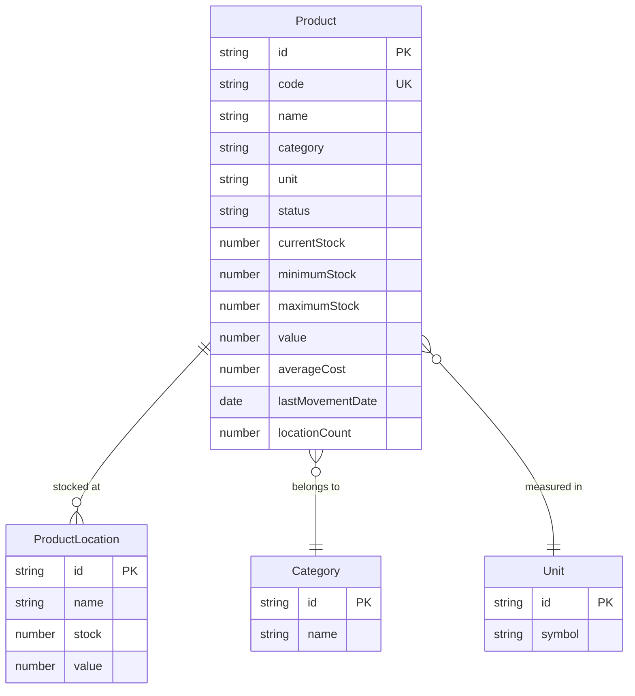

# DD-STK-CRD: Stock Cards Data Dictionary

**Document Version**: 1.0
**Last Updated**: 2026-01-15
**Module**: Inventory Management
**Sub-Module**: Stock Overview > Stock Cards

---

## Document History

| Version | Date | Author | Changes |
|---------|------|--------|---------|
| 1.0.0 | 2026-01-15 | Documentation Team | Initial version |

---

## Document Overview

This document provides comprehensive data schema documentation for the Stock Cards sub-module. It defines the data structures, types, and relationships used for product-centric inventory visualization with location distribution.

**Related Documents**:
- [INDEX-stock-cards.md](./INDEX-stock-cards.md)
- [BR-stock-cards.md](./BR-stock-cards.md)
- [TS-stock-cards.md](./TS-stock-cards.md)
- [DD-stock-overview.md](../DD-stock-overview.md) (Parent schema)

---

## Entity-Relationship Diagram



---

## Core Interfaces

### Product

**Purpose**: Complete inventory profile for a single product item

**TypeScript Definition**:
```typescript
interface Product {
  id: string
  code: string
  name: string
  category: string
  unit: string
  status: "Active" | "Inactive"
  currentStock: number
  minimumStock: number
  maximumStock: number
  value: number
  averageCost: number
  lastMovementDate: string
  locationCount: number
  locations: ProductLocation[]
}
```

**Field Definitions**:

| Field | Type | Required | Constraints | Description |
|-------|------|----------|-------------|-------------|
| `id` | `string` | Yes | UUID format | Unique product identifier |
| `code` | `string` | Yes | Max 50 chars, unique | Product code (e.g., "FOOD-001") |
| `name` | `string` | Yes | Max 255 chars | Product display name |
| `category` | `string` | Yes | Max 100 chars | Category name |
| `unit` | `string` | Yes | Max 20 chars | Unit of measure (e.g., "kg", "L") |
| `status` | `enum` | Yes | Active, Inactive | Product status |
| `currentStock` | `number` | Yes | >= 0 | Total current stock across all locations |
| `minimumStock` | `number` | Yes | >= 0 | Minimum stock threshold |
| `maximumStock` | `number` | Yes | >= minimumStock | Maximum stock threshold |
| `value` | `number` | Yes | >= 0 | Total inventory value |
| `averageCost` | `number` | Yes | >= 0 | Weighted average unit cost |
| `lastMovementDate` | `string` | Yes | ISO 8601 | Date of last transaction |
| `locationCount` | `number` | Yes | >= 0 | Number of locations with stock |
| `locations` | `ProductLocation[]` | Yes | - | Stock breakdown by location |

---

### ProductLocation

**Purpose**: Stock data for a product at a specific location

**TypeScript Definition**:
```typescript
interface ProductLocation {
  id: string
  name: string
  stock: number
  value: number
}
```

**Field Definitions**:

| Field | Type | Required | Constraints | Description |
|-------|------|----------|-------------|-------------|
| `id` | `string` | Yes | UUID format | Location identifier |
| `name` | `string` | Yes | Max 255 chars | Location display name |
| `stock` | `number` | Yes | >= 0 | Quantity at this location |
| `value` | `number` | Yes | >= 0 | Inventory value at this location |

---

## View Configuration

### ViewMode

**Purpose**: Display mode for stock cards listing

**Type Definition**:
```typescript
type ViewMode = "list" | "cards" | "grouped"
```

**Values**:

| Value | Description |
|-------|-------------|
| `list` | Traditional table/list view |
| `cards` | Card-based grid view |
| `grouped` | Grouped by category with subtotals |

---

### SortConfig

**Purpose**: Sorting configuration for product list

**TypeScript Definition**:
```typescript
interface SortConfig {
  key: SortKey
  direction: "asc" | "desc"
}

type SortKey =
  | "code"
  | "name"
  | "category"
  | "currentStock"
  | "value"
  | "lastMovementDate"
  | "locationCount"
```

**Field Definitions**:

| Field | Type | Required | Description |
|-------|------|----------|-------------|
| `key` | `SortKey` | Yes | Field to sort by |
| `direction` | `enum` | Yes | Sort direction (ascending/descending) |

**Sortable Fields**:

| Sort Key | Description | Default Direction |
|----------|-------------|-------------------|
| `code` | Product code | Ascending |
| `name` | Product name | Ascending |
| `category` | Category name | Ascending |
| `currentStock` | Current stock quantity | Descending |
| `value` | Inventory value | Descending |
| `lastMovementDate` | Last movement date | Descending |
| `locationCount` | Number of locations | Descending |

---

### FilterConfig

**Purpose**: Filter parameters for product list

**TypeScript Definition**:
```typescript
interface FilterConfig {
  search: string
  categories: string[]
  status: string[]
  stockStatus: StockStatus[]
}

type StockStatus = "in_stock" | "low_stock" | "out_of_stock" | "overstock"
```

**Field Definitions**:

| Field | Type | Required | Description |
|-------|------|----------|-------------|
| `search` | `string` | No | Text search across code, name |
| `categories` | `string[]` | No | Selected category names |
| `status` | `string[]` | No | Selected product statuses |
| `stockStatus` | `StockStatus[]` | No | Selected stock level statuses |

**Stock Status Values**:

| Value | Condition | Color |
|-------|-----------|-------|
| `in_stock` | `currentStock > minimumStock` | Green |
| `low_stock` | `0 < currentStock <= minimumStock` | Amber |
| `out_of_stock` | `currentStock === 0` | Red |
| `overstock` | `currentStock > maximumStock` | Blue |

---

## Calculated Fields

### Stock Level Indicators

| Field | Formula | Description |
|-------|---------|-------------|
| `stockLevel` | Derived from thresholds | Current stock status |
| `stockPercentage` | `(currentStock / maximumStock) * 100` | Fill percentage |
| `reorderNeeded` | `currentStock <= minimumStock` | Reorder flag |

### Aggregations

| Field | Formula | Description |
|-------|---------|-------------|
| `totalProducts` | `COUNT(products)` | Total product count |
| `totalValue` | `SUM(products.value)` | Total inventory value |
| `lowStockCount` | `COUNT(WHERE stockLevel === 'low')` | Low stock product count |
| `outOfStockCount` | `COUNT(WHERE currentStock === 0)` | Out of stock count |

---

## Summary Metrics

### Summary Cards Data

**Purpose**: Data for top-level summary cards

```typescript
interface SummaryMetrics {
  totalProducts: number
  totalValue: number
  lowStockItems: number
  outOfStockItems: number
  activeLocations: number
  lastUpdated: string
}
```

**Field Definitions**:

| Field | Type | Description |
|-------|------|-------------|
| `totalProducts` | `number` | Total number of products |
| `totalValue` | `number` | Sum of all inventory values |
| `lowStockItems` | `number` | Products below minimum |
| `outOfStockItems` | `number` | Products with zero stock |
| `activeLocations` | `number` | Locations with inventory |
| `lastUpdated` | `string` | Data timestamp |

---

## Grouped View Structure

### CategoryGroup

**Purpose**: Products grouped by category for grouped view mode

**TypeScript Definition**:
```typescript
interface CategoryGroup {
  category: string
  products: Product[]
  isExpanded: boolean
  subtotals: {
    productCount: number
    totalStock: number
    totalValue: number
    lowStockCount: number
  }
}
```

**Field Definitions**:

| Field | Type | Description |
|-------|------|-------------|
| `category` | `string` | Category name |
| `products` | `Product[]` | Products in this category |
| `isExpanded` | `boolean` | UI expansion state |
| `subtotals.productCount` | `number` | Count of products |
| `subtotals.totalStock` | `number` | Sum of stock quantities |
| `subtotals.totalValue` | `number` | Sum of values |
| `subtotals.lowStockCount` | `number` | Count of low stock items |

---

## Location Distribution

### LocationSummary

**Purpose**: Aggregated stock summary by location

```typescript
interface LocationSummary {
  locationId: string
  locationName: string
  productCount: number
  totalStock: number
  totalValue: number
  percentage: number
}
```

**Field Definitions**:

| Field | Type | Description |
|-------|------|-------------|
| `locationId` | `string` | Location identifier |
| `locationName` | `string` | Location display name |
| `productCount` | `number` | Products at this location |
| `totalStock` | `number` | Total quantity at location |
| `totalValue` | `number` | Total value at location |
| `percentage` | `number` | Percentage of total value |

---

## Export Data Structure

### ExportRecord

**Purpose**: Flattened structure for CSV/Excel export

```typescript
interface ExportRecord {
  productCode: string
  productName: string
  category: string
  unit: string
  status: string
  currentStock: number
  minimumStock: number
  maximumStock: number
  stockStatus: string
  value: number
  averageCost: number
  lastMovementDate: string
  locationCount: number
  locationDetails: string
}
```

**Export Columns**:

| Column | Source Field | Format |
|--------|--------------|--------|
| Product Code | `code` | Text |
| Product Name | `name` | Text |
| Category | `category` | Text |
| Unit | `unit` | Text |
| Status | `status` | Text |
| Current Stock | `currentStock` | Number |
| Min Stock | `minimumStock` | Number |
| Max Stock | `maximumStock` | Number |
| Stock Status | Calculated | Text |
| Value | `value` | Currency |
| Avg Cost | `averageCost` | Currency |
| Last Movement | `lastMovementDate` | Date |
| Location Count | `locationCount` | Number |
| Locations | Formatted list | Text |

---

## Validation Rules

### Product Validation

| Field | Constraint | Error Message |
|-------|------------|---------------|
| `code` | Required, unique | "Product code is required" |
| `name` | Required, max 255 | "Product name is required" |
| `currentStock` | >= 0 | "Stock cannot be negative" |
| `minimumStock` | >= 0 | "Minimum stock cannot be negative" |
| `maximumStock` | >= minimumStock | "Maximum must be >= minimum" |
| `averageCost` | >= 0 | "Cost cannot be negative" |

### Filter Validation

| Field | Constraint | Error Message |
|-------|------------|---------------|
| `search` | Max 100 chars | "Search term too long" |
| `categories` | Valid category names | "Invalid category selected" |
| `stockStatus` | Valid enum values | "Invalid stock status" |

---

## Sample Data

### Sample Product

```json
{
  "id": "prod-001",
  "code": "FOOD-001",
  "name": "All-Purpose Flour",
  "category": "Food",
  "unit": "kg",
  "status": "Active",
  "currentStock": 250,
  "minimumStock": 100,
  "maximumStock": 500,
  "value": 1375.00,
  "averageCost": 5.50,
  "lastMovementDate": "2026-01-15",
  "locationCount": 3,
  "locations": [
    { "id": "loc-001", "name": "Main Kitchen", "stock": 150, "value": 825.00 },
    { "id": "loc-002", "name": "Bakery", "stock": 75, "value": 412.50 },
    { "id": "loc-003", "name": "Banquet Kitchen", "stock": 25, "value": 137.50 }
  ]
}
```

### Sample Category Group

```json
{
  "category": "Food",
  "isExpanded": true,
  "products": ["...product array..."],
  "subtotals": {
    "productCount": 45,
    "totalStock": 12500,
    "totalValue": 85000.00,
    "lowStockCount": 5
  }
}
```

---

## Database Mapping

This sub-module uses data from the following parent schema tables:

| Interface | Primary Table | Related Tables |
|-----------|--------------|----------------|
| `Product` | `tb_inventory_item` | `tb_stock_balance`, `tb_category` |
| `ProductLocation` | `tb_stock_balance` | `tb_location` |
| `CategoryGroup` | `tb_category` | `tb_inventory_item` |

---

## State Management

### Component State

```typescript
interface StockCardsState {
  products: Product[]
  filteredProducts: Product[]
  viewMode: ViewMode
  sortConfig: SortConfig
  filterConfig: FilterConfig
  selectedProduct: Product | null
  isLoading: boolean
  expandedCategories: Set<string>
}
```

---

**Document Control**

| Version | Date | Author | Changes |
|---------|------|--------|---------|
| 1.0.0 | 2026-01-15 | Documentation Team | Initial data dictionary |
