# Flow Diagrams: Stock Cards

## Document Information
| Field | Value |
|-------|-------|
| Module | Inventory Management |
| Sub-module | Stock Cards |
| Version | 3.0.0 |
| Last Updated | 2025-01-15 |

## Document History
| Version | Date | Author | Changes |
|---------|------|--------|---------|
| 3.0.0 | 2025-01-15 | Documentation Team | Synced with current code; Updated to single product detail page flows; Added analytics calculation flow; Added alert generation flow; Added quick actions flow; Corrected transaction types to IN/OUT only |
| 2.0.0 | 2024-06-15 | System | Previous version |
| 1.0 | 2024-01-15 | Documentation Team | Initial version |

---

## 1. Page Load Flow

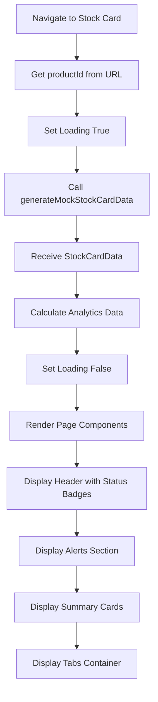

**Source Evidence**: `stock-card/page.tsx:73-89`

---

## 2. Analytics Data Calculation Flow

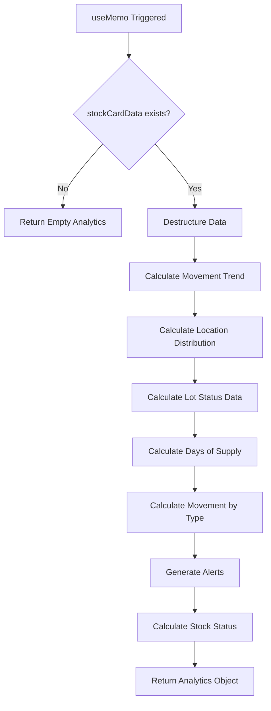

**Source Evidence**: `stock-card/page.tsx:92-228`

---

## 3. Movement Trend Calculation Flow

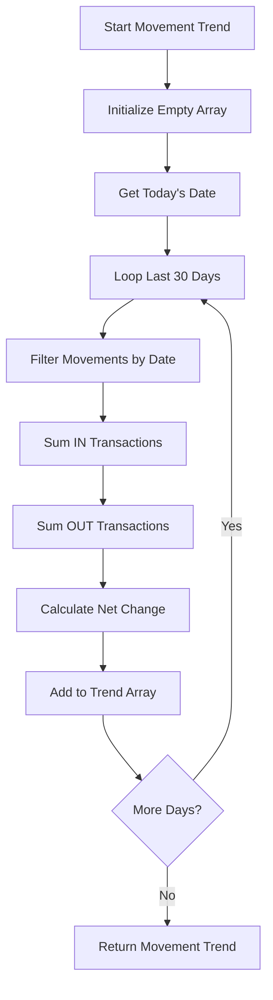

**Source Evidence**: `stock-card/page.tsx:111-132`

---

## 4. Alert Generation Flow

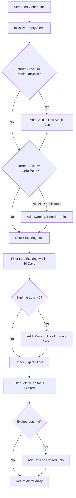

**Source Evidence**: `stock-card/page.tsx:171-211`

---

## 5. Stock Status Calculation Flow

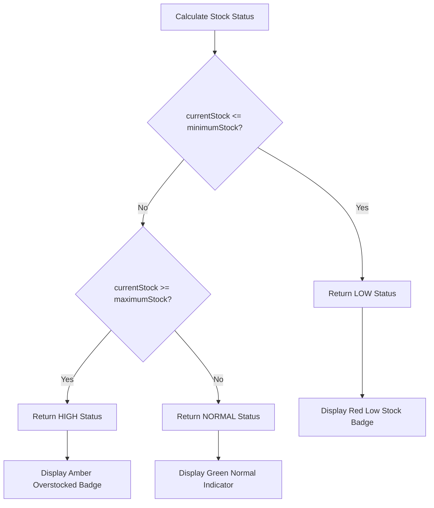

**Source Evidence**: `stock-card/page.tsx:213-215`

---

## 6. Days of Supply Calculation Flow

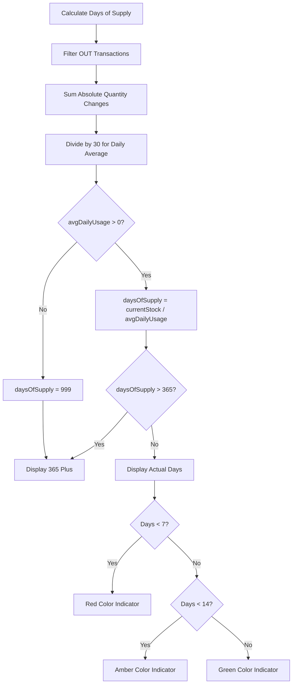

**Source Evidence**: `stock-card/page.tsx:159-162`

---

## 7. Tab Navigation Flow

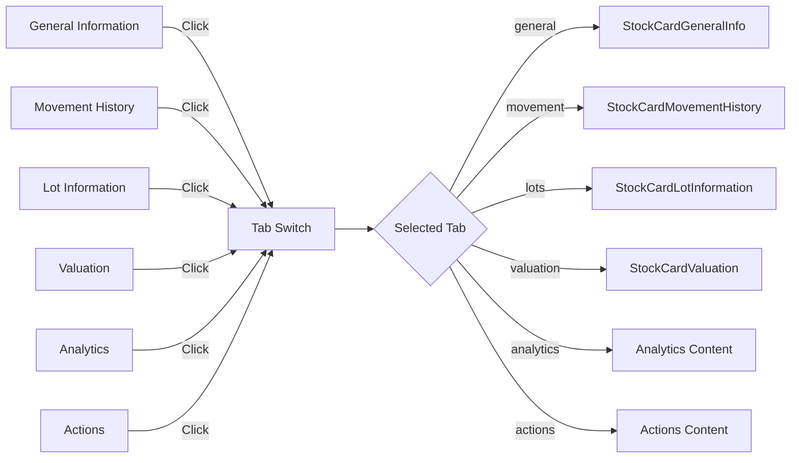

**Source Evidence**: `stock-card/page.tsx:534-542`

---

## 8. Location Distribution Calculation Flow

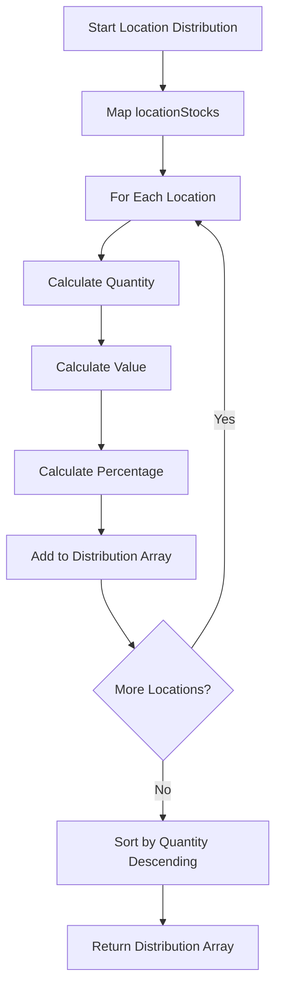

**Source Evidence**: `stock-card/page.tsx:135-140`

---

## 9. Lot Status Distribution Flow

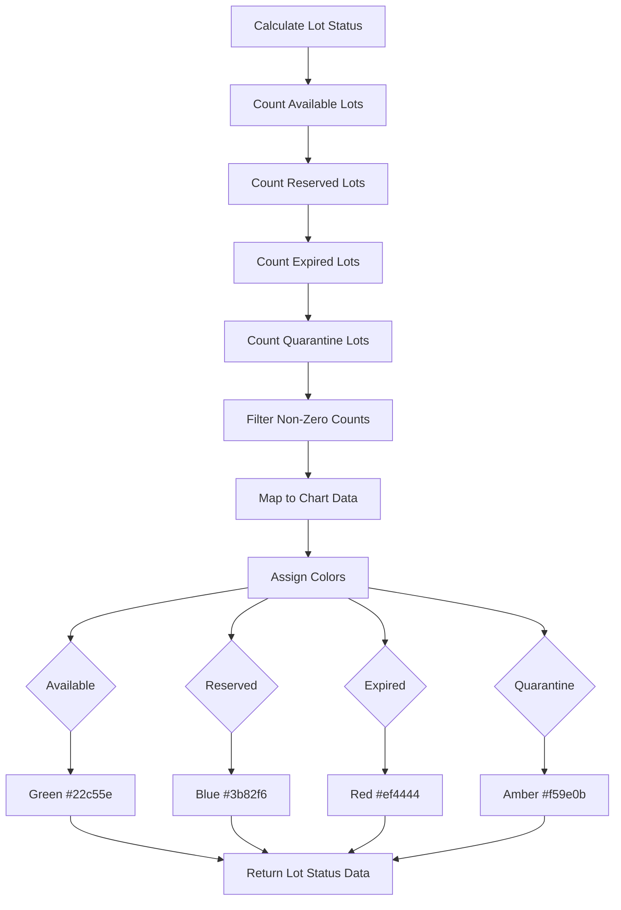

**Source Evidence**: `stock-card/page.tsx:143-156`

---

## 10. Summary Cards Render Flow

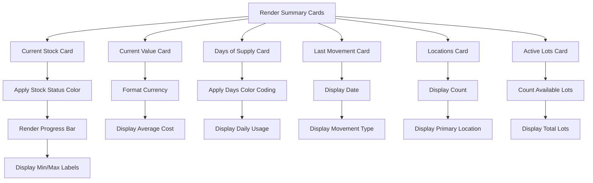

**Source Evidence**: `stock-card/page.tsx:392-529`

---

## 11. Quick Actions Flow

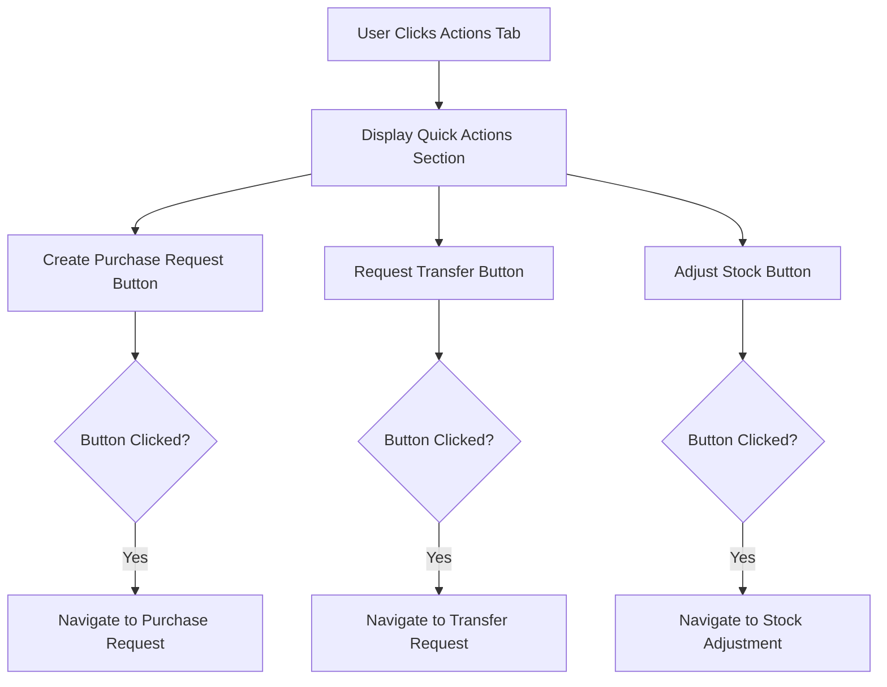

**Source Evidence**: `stock-card/page.tsx:692-722`

---

## 12. Recommended Actions Flow

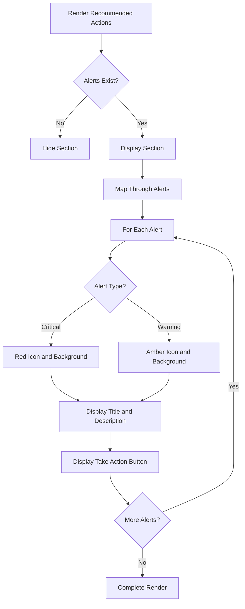

**Source Evidence**: `stock-card/page.tsx:724-758`

---

## 13. Header Actions Flow

```mermaid
flowchart TD
    A[User Interacts with Header] --> B{Action?}
    B -->|Back| C[Navigate to Stock Cards List]
    B -->|Refresh| D[Set Loading True]
    D --> E[Reload Stock Card Data]
    E --> F[Recalculate Analytics]
    F --> G[Set Loading False]
    B -->|Print| H[Open Print Dialog]
    B -->|Export| I[Generate Export Data]
    I --> J[Trigger Download]
    B -->|Edit| K[Navigate to Edit Page]
```

---

## 14. Loading State Flow

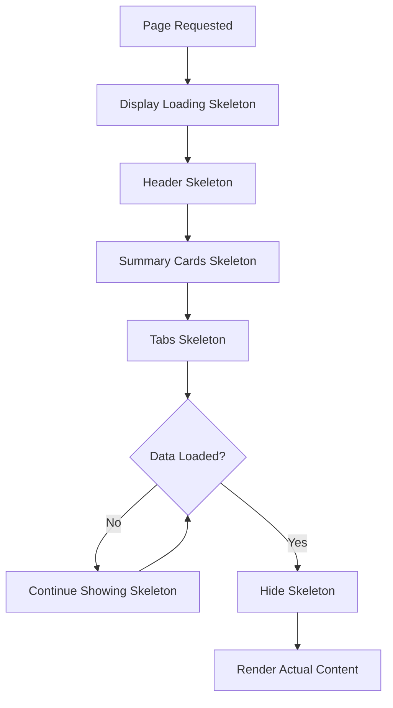

**Source Evidence**: `stock-card/page.tsx:231-269`

---

## 15. Error State Flow

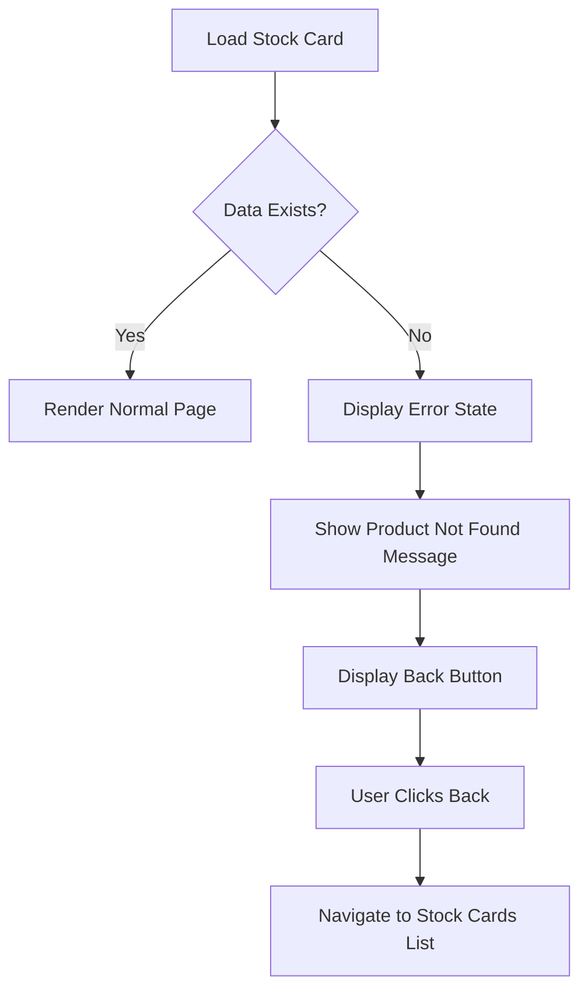

**Source Evidence**: `stock-card/page.tsx:271-290`

---

## 16. Movement by Type Calculation Flow

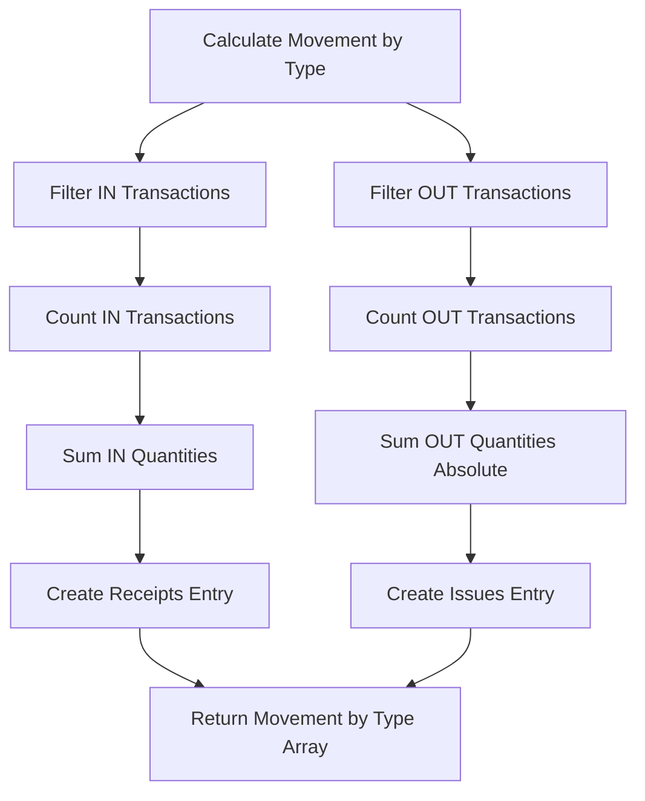

**Note**: Only IN and OUT transaction types are supported.

**Source Evidence**: `stock-card/page.tsx:165-168`

---

## Related Documents

- [BR-stock-cards.md](./BR-stock-cards.md) - Business Requirements
- [TS-stock-cards.md](./TS-stock-cards.md) - Technical Specification
- [UC-stock-cards.md](./UC-stock-cards.md) - Use Cases
- [VAL-stock-cards.md](./VAL-stock-cards.md) - Validations
