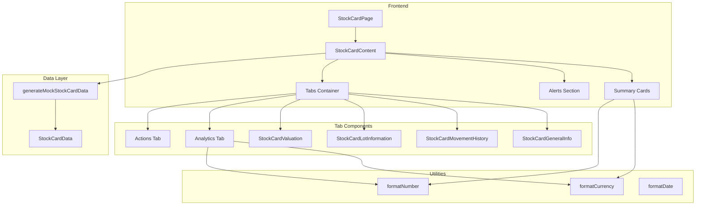
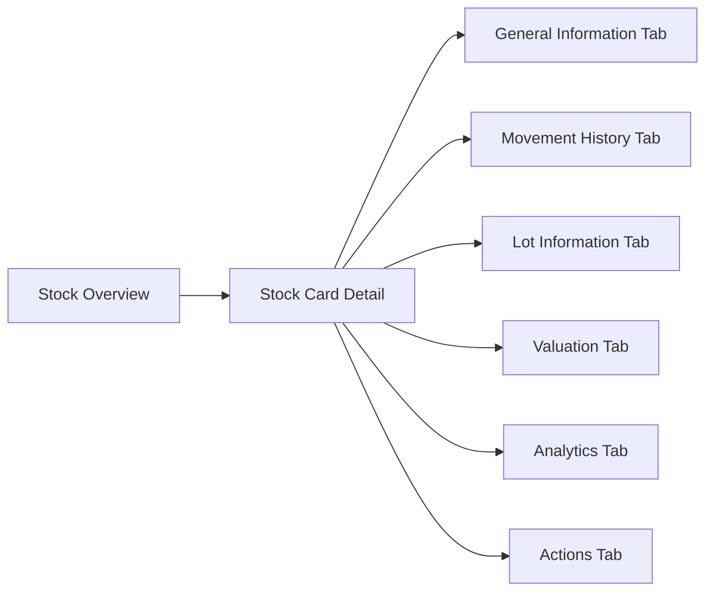
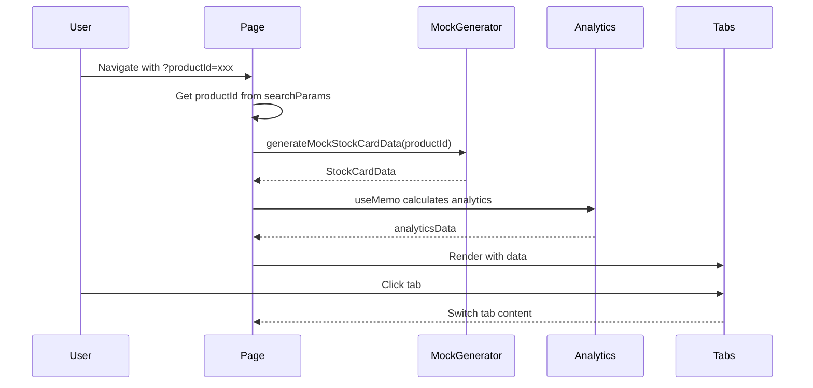

# Technical Specification: Stock Cards

## Document Information
| Field | Value |
|-------|-------|
| Module | Inventory Management |
| Sub-module | Stock Cards |
| Version | 3.0.0 |
| Last Updated | 2025-01-15 |

## Document History
| Version | Date | Author | Changes |
|---------|------|--------|---------|
| 3.0.0 | 2025-01-15 | Documentation Team | Synced with current code; Updated to single product detail page architecture; Added 6-tab structure with analytics; Added recharts integration; Updated type definitions; Corrected transaction types to IN/OUT only |
| 2.0.0 | 2024-06-15 | System | Previous version |
| 1.0 | 2024-01-15 | Documentation Team | Initial version |

---

## 1. System Architecture



---

## 2. Page Hierarchy



**Route**: `/inventory-management/stock-overview/stock-card?productId={id}`

---

## 3. Component Architecture

### 3.1 Page Component

**File**: `app/(main)/inventory-management/stock-overview/stock-card/page.tsx`

**Responsibilities**:
- Load product data by productId query parameter
- Calculate analytics data (trends, distributions, alerts)
- Manage loading and error states
- Render summary cards and tab structure

**State Management**:
```typescript
const [isLoading, setIsLoading] = useState(true)
const [stockCardData, setStockCardData] = useState<StockCardData | null>(null)
```

**Source Evidence**: `stock-card/page.tsx:73-89`

---

### 3.2 Analytics Data Calculation

**File**: `app/(main)/inventory-management/stock-overview/stock-card/page.tsx`

**Calculated Data**:
```typescript
const analyticsData = useMemo(() => {
  return {
    movementTrend: [],           // 30-day movement data
    locationDistribution: [],    // Stock by location
    lotStatusData: [],           // Lot status counts
    daysOfSupply: number,        // Calculated from avg daily usage
    avgDailyUsage: number,       // From OUT transactions
    movementByType: [],          // Receipts (IN) and Issues (OUT)
    alerts: [],                  // Critical and warning alerts
    stockPercentage: number,     // Current vs max stock
    stockStatus: 'low' | 'high' | 'normal'
  }
}, [stockCardData])
```

**Source Evidence**: `stock-card/page.tsx:92-228`

---

### 3.3 StockCardGeneralInfo Component

**File**: `app/(main)/inventory-management/stock-overview/stock-card/components/StockCardGeneralInfo.tsx`

**Responsibilities**:
- Display product details and specifications
- Show storage parameters
- Display stock thresholds

**Props**:
```typescript
interface StockCardGeneralInfoProps {
  data: StockCardData
}
```

---

### 3.4 StockCardMovementHistory Component

**File**: `app/(main)/inventory-management/stock-overview/stock-card/components/StockCardMovementHistory.tsx`

**Responsibilities**:
- Display transaction history table
- Filter by transaction type (IN/OUT)
- Search by reference, location
- Show quantity and value changes

**Props**:
```typescript
interface StockCardMovementHistoryProps {
  data: StockCardData
}
```

---

### 3.5 StockCardLotInformation Component

**File**: `app/(main)/inventory-management/stock-overview/stock-card/components/StockCardLotInformation.tsx`

**Responsibilities**:
- Display lot tracking table
- Show lot status (Available, Reserved, Expired, Quarantine)
- Display expiry dates and received dates
- Show location assignments

**Props**:
```typescript
interface StockCardLotInformationProps {
  data: StockCardData
}
```

---

### 3.6 StockCardValuation Component

**File**: `app/(main)/inventory-management/stock-overview/stock-card/components/StockCardValuation.tsx`

**Responsibilities**:
- Display valuation history
- Show running average cost calculations
- Track running quantity and value

**Props**:
```typescript
interface StockCardValuationProps {
  data: StockCardData
}
```

---

## 4. Type Definitions

### 4.1 Product Interface
```typescript
interface Product {
  id: string
  name: string
  code: string
  category: string
  unit: string
  status: "Active" | "Inactive"
  description: string
  lastUpdated: string
  createdAt: string
  createdBy: string
  barcode?: string
  alternateUnit?: string
  conversionFactor?: number
  minimumStock?: number
  maximumStock?: number
  reorderPoint?: number
  reorderQuantity?: number
  leadTime?: number
  shelfLife?: number
  storageRequirements?: string
  tags?: string[]
}
```

**Source Evidence**: `stock-card/types.ts:1-23`

### 4.2 StockSummary Interface
```typescript
interface StockSummary {
  currentStock: number
  currentValue: number
  averageCost: number
  lastMovementDate: string
  lastMovementType: string
  locationCount: number
  primaryLocation: string
  totalIn: number
  totalOut: number
  netChange: number
}
```

**Source Evidence**: `stock-card/types.ts:25-36`

### 4.3 LocationStock Interface
```typescript
interface LocationStock {
  locationId: string
  locationName: string
  quantity: number
  value: number
  lastMovementDate: string
}
```

**Source Evidence**: `stock-card/types.ts:38-44`

### 4.4 LotInformation Interface
```typescript
interface LotInformation {
  lotNumber: string
  expiryDate: string
  receivedDate: string
  quantity: number
  unitCost: number
  value: number
  locationId: string
  locationName: string
  status: "Available" | "Reserved" | "Expired" | "Quarantine"
}
```

**Source Evidence**: `stock-card/types.ts:46-56`

### 4.5 MovementRecord Interface
```typescript
interface MovementRecord {
  id: string
  date: string
  time: string
  reference: string
  referenceType: string
  locationId: string
  locationName: string
  transactionType: "IN" | "OUT"
  reason: string
  lotNumber?: string
  quantityBefore: number
  quantityAfter: number
  quantityChange: number
  unitCost: number
  valueBefore: number
  valueAfter: number
  valueChange: number
  username: string
}
```

**Note**: Only IN and OUT transaction types are supported.

**Source Evidence**: `stock-card/types.ts:58-77`

### 4.6 ValuationRecord Interface
```typescript
interface ValuationRecord {
  date: string
  reference: string
  transactionType: "IN" | "OUT"
  quantity: number
  unitCost: number
  value: number
  runningQuantity: number
  runningValue: number
  runningAverageCost: number
}
```

**Source Evidence**: `stock-card/types.ts:79-89`

### 4.7 StockCardData Interface
```typescript
interface StockCardData {
  product: Product
  summary: StockSummary
  locationStocks: LocationStock[]
  lotInformation: LotInformation[]
  movements: MovementRecord[]
  valuation: ValuationRecord[]
}
```

**Source Evidence**: `stock-card/types.ts:128-135`

---

## 5. Alert System

### 5.1 Alert Generation Logic
```typescript
const alerts: { type: 'critical' | 'warning' | 'info'; title: string; description: string }[] = []

// Low stock alert
if (summary.currentStock <= (product.minimumStock || 0)) {
  alerts.push({
    type: 'critical',
    title: 'Low Stock Alert',
    description: `Current stock is below minimum level`
  })
}

// Reorder point alert
if (summary.currentStock <= (product.reorderPoint || 0) &&
    summary.currentStock > (product.minimumStock || 0)) {
  alerts.push({
    type: 'warning',
    title: 'Reorder Point Reached',
    description: 'Consider placing a purchase order'
  })
}

// Expiring lots alert
const expiringLots = lotInformation.filter(lot => {
  const daysToExpiry = calculateDaysToExpiry(lot.expiryDate)
  return daysToExpiry <= 30 && daysToExpiry > 0
})

if (expiringLots.length > 0) {
  alerts.push({
    type: 'warning',
    title: 'Lots Expiring Soon',
    description: `${expiringLots.length} lot(s) will expire within 30 days`
  })
}

// Expired lots alert
const expiredLots = lotInformation.filter(lot => lot.status === 'Expired')
if (expiredLots.length > 0) {
  alerts.push({
    type: 'critical',
    title: 'Expired Lots',
    description: `${expiredLots.length} lot(s) have expired`
  })
}
```

**Source Evidence**: `stock-card/page.tsx:171-211`

---

## 6. Stock Status Calculation

```typescript
const stockStatus = summary.currentStock <= (product.minimumStock || 0)
  ? 'low'
  : summary.currentStock >= (product.maximumStock || Infinity)
    ? 'high'
    : 'normal'

const stockPercentage = product.maximumStock
  ? (summary.currentStock / product.maximumStock) * 100
  : 50
```

**Source Evidence**: `stock-card/page.tsx:213-215`

---

## 7. Days of Supply Calculation

```typescript
const avgDailyUsage = movements
  .filter(m => m.transactionType === 'OUT')
  .reduce((sum, m) => sum + Math.abs(m.quantityChange), 0) / 30

const daysOfSupply = avgDailyUsage > 0
  ? Math.round(summary.currentStock / avgDailyUsage)
  : 999
```

**Source Evidence**: `stock-card/page.tsx:159-162`

---

## 8. Component Tree

```
StockCardPage
├── Suspense
│   └── StockCardContent
│       ├── PageHeader
│       │   ├── BackButton
│       │   ├── ProductIcon
│       │   ├── Title and Code
│       │   ├── Status Badge (Active/Inactive)
│       │   ├── Stock Status Badge (Low/Overstocked)
│       │   └── ActionButtons (Refresh, Print, Export, Edit)
│       ├── AlertsSection
│       │   └── Alert[] (Critical/Warning/Info)
│       ├── SummaryCards (6 cards)
│       │   ├── CurrentStock (with Progress)
│       │   ├── CurrentValue
│       │   ├── DaysOfSupply
│       │   ├── LastMovement
│       │   ├── Locations
│       │   └── ActiveLots
│       └── MainCard
│           └── Tabs
│               ├── TabsTrigger (6 tabs)
│               ├── TabsContent[general]
│               │   └── StockCardGeneralInfo
│               ├── TabsContent[movement]
│               │   └── StockCardMovementHistory
│               ├── TabsContent[lots]
│               │   └── StockCardLotInformation
│               ├── TabsContent[valuation]
│               │   └── StockCardValuation
│               ├── TabsContent[analytics]
│               │   ├── MovementTrendChart (ComposedChart)
│               │   ├── LocationDistribution (Progress bars)
│               │   ├── LotStatusPieChart
│               │   └── MovementSummaryCards
│               └── TabsContent[actions]
│                   ├── QuickActions (3 buttons)
│                   ├── RecommendedActions (from alerts)
│                   └── StockParameters
```

---

## 9. Third-Party Libraries

| Library | Version | Usage |
|---------|---------|-------|
| recharts | ^2.x | ComposedChart, PieChart, AreaChart, Line, Bar |
| date-fns | ^2.x | Date formatting |
| lucide-react | ^0.x | Icons (Package, DollarSign, Clock, etc.) |
| shadcn/ui | ^0.x | Card, Tabs, Badge, Progress, Alert, Button, Skeleton |
| next/navigation | ^14.x | useSearchParams |

---

## 10. Data Flow



---

## 11. Performance Considerations

| Concern | Mitigation |
|---------|------------|
| Chart rendering | Lazy load recharts |
| Large movement history | Pagination in component |
| Analytics calculation | useMemo for expensive calculations |
| Initial load | Skeleton placeholders |

---

## 12. Accessibility

| Feature | Implementation |
|---------|---------------|
| Keyboard navigation | Tab through tabs and buttons |
| Screen readers | ARIA labels on all interactive elements |
| Color contrast | 4.5:1 minimum ratio |
| Focus indicators | Visible focus rings |
| Alert announcements | Role="alert" for critical alerts |

---

## 13. Related Documents

- [BR-stock-cards.md](./BR-stock-cards.md) - Business Requirements
- [FD-stock-cards.md](./FD-stock-cards.md) - Flow Diagrams
- [UC-stock-cards.md](./UC-stock-cards.md) - Use Cases
- [VAL-stock-cards.md](./VAL-stock-cards.md) - Validations
