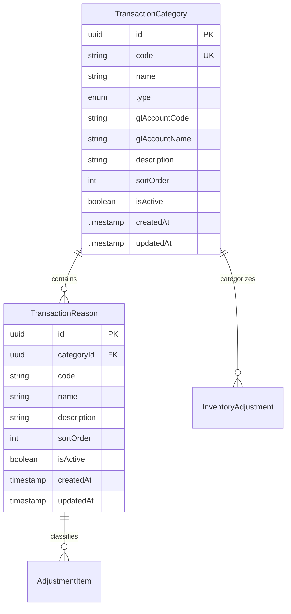

# Data Definition: Transaction Categories

**Module**: Inventory Management
**Sub-module**: Transaction Categories
**Version**: 1.0.0
**Last Updated**: 2025-01-16
**Status**: Active

## Document History

| Version | Date | Author | Changes |
|---------|------|--------|---------|
| 1.0.0 | 2025-01-16 | Documentation Team | Initial version |

---

## Related Documentation
- [Business Requirements](./BR-transaction-categories.md)
- [Use Cases](./UC-transaction-categories.md)
- [Technical Specification](./TS-transaction-categories.md)
- [Flow Diagrams](./FD-transaction-categories.md)
- [Validations](./VAL-transaction-categories.md)

---

## Data Model Overview



---

## Table Definitions

### tb_transaction_category

Parent classification for inventory adjustments. Maps to GL accounts for journal entries.

| Column | Type | Constraints | Description |
|--------|------|-------------|-------------|
| id | UUID | PK, NOT NULL | Unique identifier |
| code | VARCHAR(10) | NOT NULL, UK per type | Short code (e.g., WST, LSS) |
| name | VARCHAR(100) | NOT NULL | Display name |
| type | ENUM('IN','OUT') | NOT NULL | Adjustment type |
| gl_account_code | VARCHAR(20) | NOT NULL | GL account code |
| gl_account_name | VARCHAR(100) | NOT NULL | GL account name |
| description | TEXT | NULL | Usage description |
| sort_order | INTEGER | NOT NULL, DEFAULT 1 | Display order (1-999) |
| is_active | BOOLEAN | NOT NULL, DEFAULT true | Active status |
| created_at | TIMESTAMP | NOT NULL, DEFAULT NOW() | Creation timestamp |
| updated_at | TIMESTAMP | NOT NULL, DEFAULT NOW() | Last update timestamp |

**Indexes**:
- PRIMARY KEY: `id`
- UNIQUE: `(code, type)` - Code unique within each type
- INDEX: `type, is_active, sort_order` - For dropdown queries

---

### tb_transaction_reason

Child classification within a category. Provides detailed tracking at item level.

| Column | Type | Constraints | Description |
|--------|------|-------------|-------------|
| id | UUID | PK, NOT NULL | Unique identifier |
| category_id | UUID | FK, NOT NULL | Parent category reference |
| code | VARCHAR(10) | NOT NULL | Short code (e.g., DMG, EXP) |
| name | VARCHAR(100) | NOT NULL | Display name |
| description | TEXT | NULL | Usage description |
| sort_order | INTEGER | NOT NULL, DEFAULT 1 | Display order (1-999) |
| is_active | BOOLEAN | NOT NULL, DEFAULT true | Active status |
| created_at | TIMESTAMP | NOT NULL, DEFAULT NOW() | Creation timestamp |
| updated_at | TIMESTAMP | NOT NULL, DEFAULT NOW() | Last update timestamp |

**Foreign Keys**:
- `category_id` → `tb_transaction_category.id` ON DELETE CASCADE

**Indexes**:
- PRIMARY KEY: `id`
- UNIQUE: `(category_id, code)` - Code unique within category
- INDEX: `category_id, is_active, sort_order` - For filtered queries

---

## Enumerations

### AdjustmentType

| Value | Description |
|-------|-------------|
| IN | Stock increase (positive adjustment) |
| OUT | Stock decrease (negative adjustment) |

---

## TypeScript Interfaces

### TransactionCategory

```typescript
interface TransactionCategory {
  id: string
  code: string
  name: string
  type: 'IN' | 'OUT'
  glAccountCode: string
  glAccountName: string
  description?: string
  sortOrder: number
  isActive: boolean
  createdAt: string
  updatedAt: string
}
```

### TransactionReason

```typescript
interface TransactionReason {
  id: string
  categoryId: string
  code: string
  name: string
  description?: string
  sortOrder: number
  isActive: boolean
  createdAt: string
  updatedAt: string
}
```

### CategoryFormData

```typescript
interface CategoryFormData {
  code: string
  name: string
  type: 'IN' | 'OUT'
  glAccountCode: string
  glAccountName: string
  description: string
  sortOrder: number
  isActive: boolean
}
```

### ReasonFormData

```typescript
interface ReasonFormData {
  code: string
  name: string
  description: string
  sortOrder: number
  isActive: boolean
}
```

---

## Sample Data

### Categories

| Code | Name | Type | GL Code | GL Name |
|------|------|------|---------|---------|
| WST | Wastage | OUT | 5200 | Waste Expense |
| LSS | Loss | OUT | 5210 | Inventory Loss |
| QLT | Quality | OUT | 5100 | Cost of Goods Sold |
| CON | Consumption | OUT | 5100 | Cost of Goods Sold |
| FND | Found | IN | 1310 | Raw Materials Inventory |
| RTN | Return | IN | 1310 | Raw Materials Inventory |
| COR | Correction | IN | 1310 | Raw Materials Inventory |

### Reasons by Category

| Category | Code | Name |
|----------|------|------|
| Wastage | DMG | Damaged Goods |
| Wastage | EXP | Expired Items |
| Wastage | SPL | Spoilage |
| Loss | THF | Theft/Loss |
| Loss | SHR | Shrinkage |
| Loss | CNV | Count Variance |
| Quality | QCR | QC Rejection |
| Quality | CRT | Customer Return |
| Consumption | PRD | Production Use |
| Consumption | TRO | Transfer Out |
| Found | CNV | Count Variance |
| Found | FIT | Found Items |
| Return | RTS | Return to Stock |
| Return | VRT | Vendor Return |
| Correction | SYC | System Correction |
| Correction | DFX | Data Fix |

---

## Data Relationships

### Category → Reason (One-to-Many)

Each category can have multiple reasons. Reasons are filtered by category when displayed in adjustment forms.

### Category → Inventory Adjustment (One-to-Many)

Each adjustment references one category at the header level. The category determines the GL account for journal entries.

### Reason → Adjustment Item (One-to-Many)

Each adjustment item can reference one reason. Reasons provide detailed classification within the selected category.

---

## Query Patterns

### Get Active Categories by Type

```sql
SELECT id, code, name, gl_account_code, gl_account_name
FROM tb_transaction_category
WHERE type = :type
  AND is_active = true
ORDER BY sort_order ASC, name ASC;
```

### Get Reasons for Category

```sql
SELECT id, code, name, description
FROM tb_transaction_reason
WHERE category_id = :categoryId
  AND is_active = true
ORDER BY sort_order ASC, name ASC;
```

### Get Categories with Reason Counts

```sql
SELECT c.*,
       COUNT(r.id) as reason_count
FROM tb_transaction_category c
LEFT JOIN tb_transaction_reason r ON r.category_id = c.id
GROUP BY c.id
ORDER BY c.type, c.sort_order;
```

### Search Categories

```sql
SELECT *
FROM tb_transaction_category
WHERE (code ILIKE :search
       OR name ILIKE :search
       OR gl_account_code ILIKE :search
       OR gl_account_name ILIKE :search
       OR description ILIKE :search)
  AND (:type IS NULL OR type = :type)
  AND (:isActive IS NULL OR is_active = :isActive)
ORDER BY sort_order ASC;
```

---

## Migration Notes

### Initial Setup

1. Create `tb_transaction_category` table
2. Create `tb_transaction_reason` table with FK constraint
3. Seed default categories (7 categories)
4. Seed default reasons (16 reasons)

### Data Migration Considerations

- Code uniqueness must be enforced per type, not globally
- Existing adjustments must have category_id populated before dropping old reason column
- Soft delete preferred over hard delete to maintain referential integrity

---

**Document Control**

| Version | Date | Author | Changes |
|---------|------|--------|---------|
| 1.0.0 | 2025-01-16 | Documentation Team | Initial creation |
