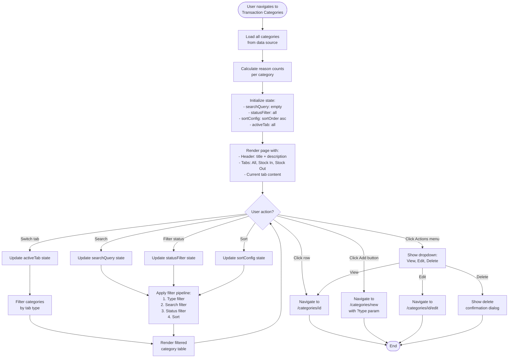
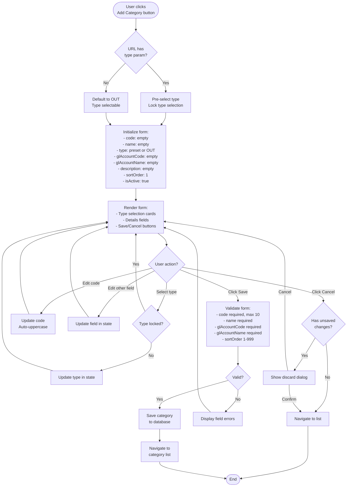
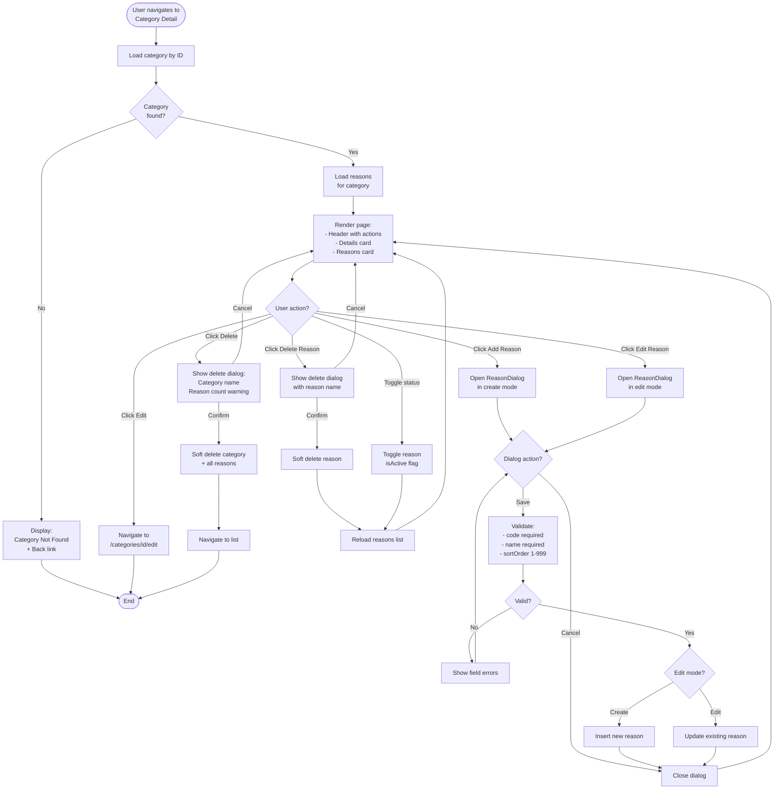
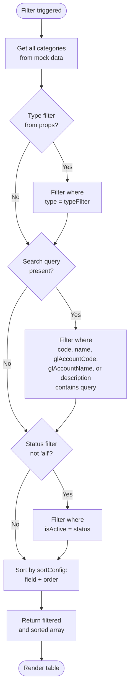
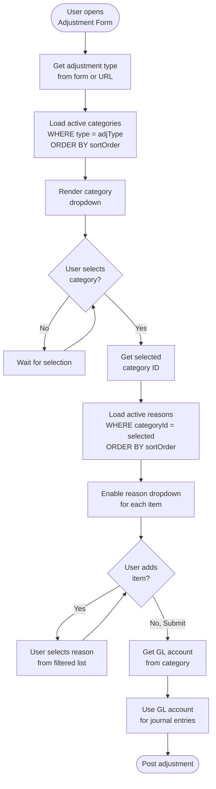
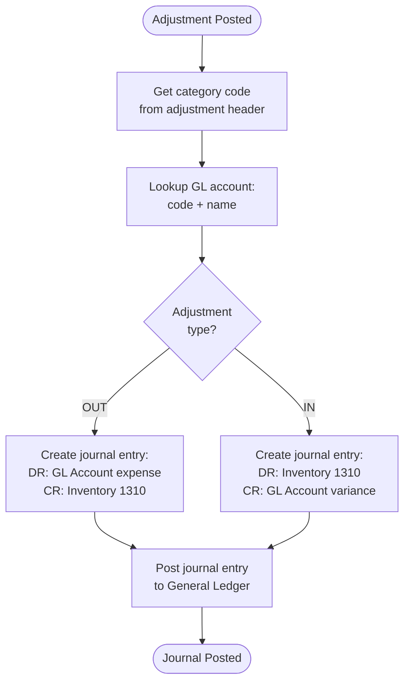
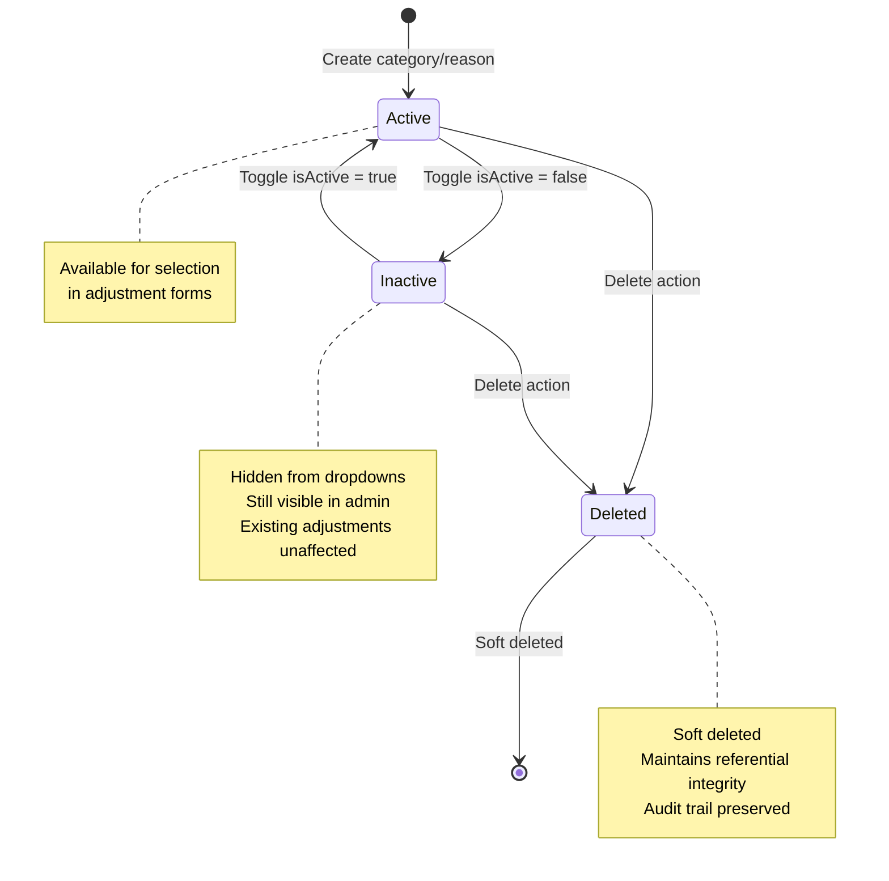
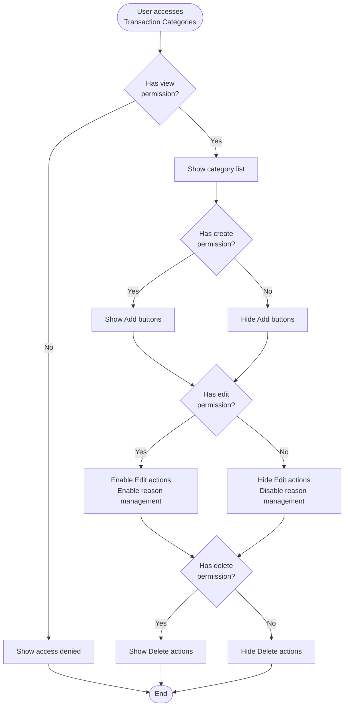

# Flow Diagrams: Transaction Categories

**Module**: Inventory Management
**Sub-module**: Transaction Categories
**Version**: 1.0.0
**Last Updated**: 2025-01-16
**Status**: Active

## Document History

| Version | Date | Author | Changes |
|---------|------|--------|---------|
| 1.0.0 | 2025-01-16 | Documentation Team | Initial version |

---

## Related Documentation
- [Business Requirements](./BR-transaction-categories.md)
- [Use Cases](./UC-transaction-categories.md)
- [Technical Specification](./TS-transaction-categories.md)
- [Data Definition](./DD-transaction-categories.md)
- [Validations](./VAL-transaction-categories.md)

---

## 1. Category List Page Flow

---

## 2. Create Category Flow

---

## 3. Category Detail Page Flow

---

## 4. Filter Pipeline Flow

---

## 5. Category-Reason Selection in Adjustments

---

## 6. GL Account Mapping Flow

---

## 7. Status State Diagram

---

## 8. Permission Flow

---

**Document Control**

| Version | Date | Author | Changes |
|---------|------|--------|---------|
| 1.0.0 | 2025-01-16 | Documentation Team | Initial creation |
