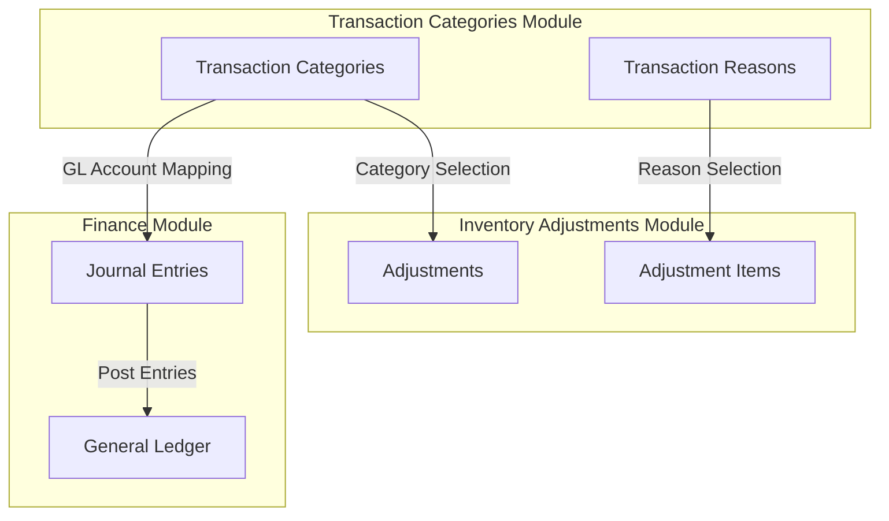
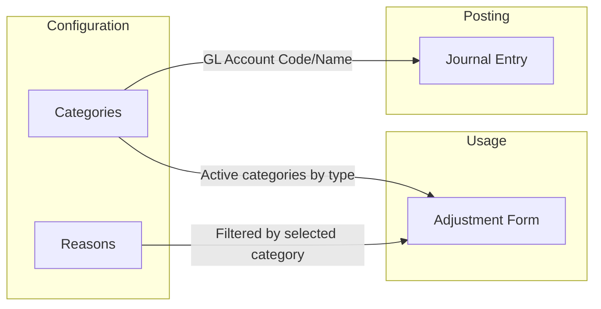
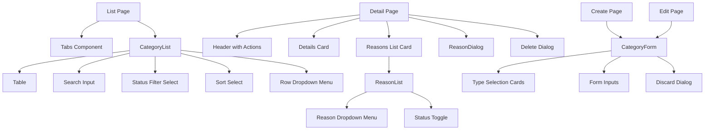
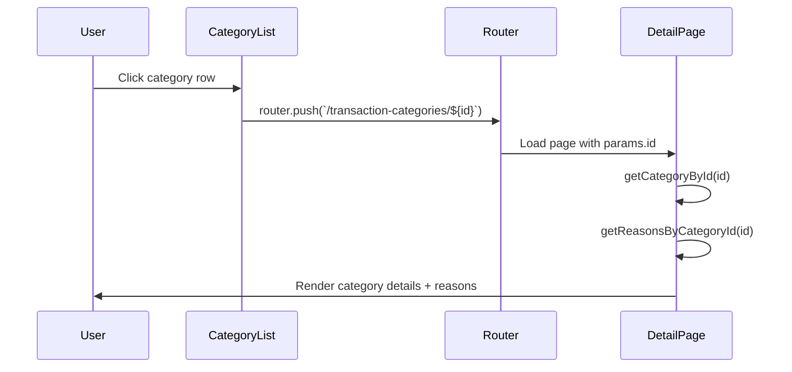
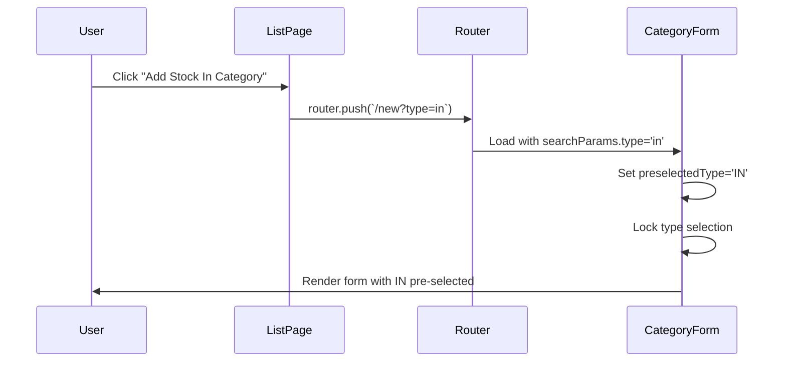

# Technical Specification: Transaction Categories

**Module**: Inventory Management
**Sub-module**: Transaction Categories
**Version**: 1.0.0
**Last Updated**: 2025-01-16
**Status**: Active

## Document History

| Version | Date | Author | Changes |
|---------|------|--------|---------|
| 1.0.0 | 2025-01-16 | Documentation Team | Initial version |

---

## Related Documentation
- [Business Requirements](./BR-transaction-categories.md)
- [Use Cases](./UC-transaction-categories.md)
- [Data Definition](./DD-transaction-categories.md)
- [Flow Diagrams](./FD-transaction-categories.md)
- [Validations](./VAL-transaction-categories.md)

---

## System Architecture

### Module Integration



### Data Flow



---

## Page Architecture

### Route Hierarchy

```
/inventory-management/transaction-categories/
├── page.tsx                    # List page (All, Stock In, Stock Out tabs)
├── new/
│   └── page.tsx               # Create category form
└── [id]/
    ├── page.tsx               # Category detail with reasons
    └── edit/
        └── page.tsx           # Edit category form
```

### Page Descriptions

| Route | Page | Description |
|-------|------|-------------|
| `/transaction-categories` | List Page | Three-tab view (All, Stock In, Stock Out) with category table, search, filter, sort |
| `/transaction-categories/new` | Create Page | Form for creating new category with type selection cards |
| `/transaction-categories/[id]` | Detail Page | Category info card + reasons table with management actions |
| `/transaction-categories/[id]/edit` | Edit Page | Form for editing existing category (type locked) |

---

## Component Architecture

### Component Hierarchy



### Component Descriptions

| Component | File | Purpose |
|-----------|------|---------|
| CategoryList | `components/category-list.tsx` | Renders searchable, filterable category table with row actions |
| CategoryForm | `components/category-form.tsx` | Shared form for create/edit with type selection, validation, discard dialog |
| ReasonList | `components/reason-list.tsx` | Renders reason table with inline status toggle and row actions |
| ReasonDialog | `components/reason-dialog.tsx` | Modal for add/edit reason with form validation |

---

## State Management

### CategoryList State

| State | Type | Purpose |
|-------|------|---------|
| searchQuery | string | Full-text search input |
| statusFilter | 'all' \| 'active' \| 'inactive' | Status filter selection |
| sortConfig | { field: string, order: 'asc' \| 'desc' } | Sort configuration |

### CategoryForm State

| State | Type | Purpose |
|-------|------|---------|
| formData | CategoryFormData | Form field values |
| errors | Record<string, string> | Field validation errors |
| isSaving | boolean | Save operation in progress |
| showDiscardDialog | boolean | Discard confirmation visibility |

### ReasonDialog State

| State | Type | Purpose |
|-------|------|---------|
| formData | ReasonFormData | Form field values |
| errors | Record<string, string> | Field validation errors |
| isSaving | boolean | Save operation in progress |

---

## Data Processing

### Filter Pipeline (CategoryList)

The CategoryList component applies a four-stage filter pipeline using `useMemo`:

1. **Type Filter**: Filter by type prop (from tab selection)
2. **Search Filter**: Match query against code, name, glAccountCode, glAccountName, description
3. **Status Filter**: Match isActive boolean
4. **Sort**: Order by selected field and direction

### Reason Count Calculation

Reason counts are pre-calculated using `useMemo` by iterating through all reasons and grouping by categoryId.

---

## Navigation Flows

### List to Detail Navigation



### Create Category Navigation



---

## API Design (TODO)

### Endpoints

| Method | Endpoint | Description |
|--------|----------|-------------|
| GET | `/api/transaction-categories` | List all categories with filters |
| GET | `/api/transaction-categories/:id` | Get category by ID |
| POST | `/api/transaction-categories` | Create new category |
| PUT | `/api/transaction-categories/:id` | Update category |
| DELETE | `/api/transaction-categories/:id` | Soft-delete category |
| POST | `/api/transaction-categories/:id/reasons` | Add reason to category |
| PUT | `/api/transaction-reasons/:id` | Update reason |
| DELETE | `/api/transaction-reasons/:id` | Soft-delete reason |

### Query Parameters

| Parameter | Type | Description |
|-----------|------|-------------|
| type | 'IN' \| 'OUT' | Filter by adjustment type |
| isActive | boolean | Filter by active status |
| search | string | Search across fields |
| sortField | string | Sort field name |
| sortOrder | 'asc' \| 'desc' | Sort direction |

---

## Integration Points

### Inventory Adjustments Integration

The Transaction Categories module provides lookup data for the Inventory Adjustments form:

1. **Category Dropdown**: Active categories filtered by adjustment type
2. **Reason Dropdown**: Active reasons filtered by selected category
3. **GL Account**: Retrieved from category when posting adjustment

Helper functions from `lib/mock-data/transaction-categories.ts`:
- `getCategoryOptionsForType(type)`: Returns active categories with nested reasons
- `getGLAccountForCategory(code)`: Returns GL account info for journal generation

### Journal Entry Integration

When an adjustment is posted:
1. System retrieves category by code
2. GL Account Code and Name are used to create journal entries
3. Stock OUT → Debit expense, Credit inventory
4. Stock IN → Debit inventory, Credit variance

---

## Error Handling

### Form Validation Errors

Field-level errors are stored in state and displayed below each input:
- Required field messages
- Length validation messages
- Range validation messages

### API Error Handling (Future)

- Network errors: Retry with exponential backoff
- 404 errors: Show "Not Found" UI
- 409 conflicts: Show "Duplicate" message
- 500 errors: Show generic error with retry option

---

## Performance Considerations

### Memoization

- `filteredAndSortedData`: Memoized with `useMemo` to avoid recalculation on every render
- `reasonCounts`: Pre-calculated once when data loads

### Optimization Strategies

- Client-side filtering suitable for small datasets (<100 categories)
- Server-side pagination recommended for larger datasets
- Debounce search input (300ms recommended)

---

## Security Considerations

### Permission Requirements

| Action | Required Permission |
|--------|---------------------|
| View categories | `view_transaction_categories` |
| Create category | `create_transaction_categories` |
| Edit category | `edit_transaction_categories` |
| Delete category | `delete_transaction_categories` |
| Manage reasons | `edit_transaction_categories` |

### Data Protection

- Soft delete to maintain referential integrity
- Audit timestamps on all records
- Category/reason deletion blocked if used in posted adjustments

---

**Document Control**

| Version | Date | Author | Changes |
|---------|------|--------|---------|
| 1.0.0 | 2025-01-16 | Documentation Team | Initial creation |
