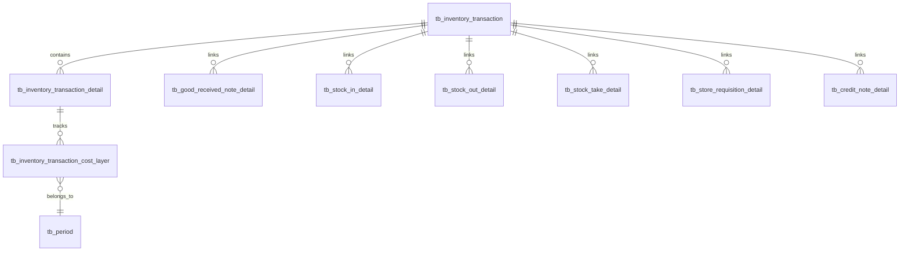

# Data Definition: Inventory Transactions

## Document Information
| Field | Value |
|-------|-------|
| Module | Inventory Management |
| Sub-module | Transactions |
| Version | 2.0.0 |
| Last Updated | 2025-01-16 |

## Document History
| Version | Date | Author | Changes |
|---------|------|--------|---------|
| 2.0.0 | 2025-01-16 | Documentation Team | Initial version synced with Prisma schema and TypeScript interfaces |

---

## 1. Database Tables

### 1.1 tb_inventory_transaction

Main inventory transaction header table.

| Column | Type | Nullable | Description |
|--------|------|----------|-------------|
| id | UUID | No | Primary key |
| inventory_doc_type | enum_inventory_doc_type | No | Document type enum |
| inventory_doc_no | UUID | No | Reference to source document |
| note | VARCHAR | Yes | Transaction notes |
| info | JSON | Yes | Additional info |
| dimension | JSON | Yes | Dimension data |
| created_at | TIMESTAMPTZ | Yes | Creation timestamp |
| created_by_id | UUID | Yes | Creator user ID |
| updated_at | TIMESTAMPTZ | Yes | Last update timestamp |
| updated_by_id | UUID | Yes | Updater user ID |
| deleted_at | TIMESTAMPTZ | Yes | Soft delete timestamp |
| deleted_by_id | UUID | Yes | Deleter user ID |

**Indexes**:
- `inventorytransaction_inventory_doc_no_idx` on `inventory_doc_no`

**Source Evidence**: `data/schema.prisma:718-743`

---

### 1.2 tb_inventory_transaction_detail

Transaction line items with product and quantity details.

| Column | Type | Nullable | Description |
|--------|------|----------|-------------|
| id | UUID | No | Primary key |
| inventory_transaction_id | UUID | No | FK to tb_inventory_transaction |
| from_lot_no | VARCHAR | Yes | Source lot number |
| current_lot_no | VARCHAR | Yes | Current lot number |
| location_id | UUID | Yes | Storage location |
| location_code | VARCHAR | Yes | Location code |
| product_id | UUID | No | Product reference |
| qty | DECIMAL(20,5) | Yes | Quantity (default 0) |
| cost_per_unit | DECIMAL(20,5) | Yes | Unit cost (default 0) |
| total_cost | DECIMAL(20,5) | Yes | Total cost (default 0) |
| note | VARCHAR | Yes | Line notes |
| info | JSON | Yes | Additional info |
| dimension | JSON | Yes | Dimension data |
| created_at | TIMESTAMPTZ | Yes | Creation timestamp |
| created_by_id | UUID | Yes | Creator user ID |
| updated_at | TIMESTAMPTZ | Yes | Last update timestamp |
| updated_by_id | UUID | Yes | Updater user ID |

**Foreign Keys**:
- `inventory_transaction_id` → `tb_inventory_transaction.id`

**Source Evidence**: `data/schema.prisma:745-769`

---

### 1.3 tb_inventory_transaction_cost_layer

Cost layer tracking for inventory costing (Periodic Average Costing).

| Column | Type | Nullable | Description |
|--------|------|----------|-------------|
| id | UUID | No | Primary key |
| inventory_transaction_detail_id | UUID | No | FK to detail |
| lot_no | VARCHAR | Yes | Lot number |
| lot_index | INT | No | Lot index (default 1) |
| location_id | UUID | Yes | Location reference |
| location_code | VARCHAR | Yes | Location code |
| lot_at_date | TIMESTAMPTZ | Yes | Lot date |
| lot_seq_no | INT | Yes | Sequence number |
| product_id | UUID | Yes | Product reference |
| parent_lot_no | VARCHAR | Yes | Parent lot reference |
| period_id | UUID | Yes | Period reference |
| at_period | VARCHAR | Yes | Period code (YYMM) |
| transaction_type | enum_transaction_type | Yes | Transaction type |
| in_qty | DECIMAL(20,5) | Yes | Inbound quantity |
| out_qty | DECIMAL(20,5) | Yes | Outbound quantity |
| cost_per_unit | DECIMAL(20,5) | Yes | Unit cost |
| total_cost | DECIMAL(20,5) | Yes | Total cost |
| diff_amount | DECIMAL(20,5) | Yes | Difference amount |
| average_cost_per_unit | DECIMAL(20,5) | Yes | Running average cost |
| note | VARCHAR | Yes | Notes |
| info | JSON | Yes | Additional info |
| dimension | JSON | Yes | Dimension data |
| created_at | TIMESTAMPTZ | Yes | Creation timestamp |
| created_by_id | UUID | Yes | Creator user ID |
| updated_at | TIMESTAMPTZ | Yes | Last update timestamp |
| updated_by_id | UUID | Yes | Updater user ID |

**Unique Constraints**:
- `inventorytransactionclosingbalance_lotno_lot_index_u` on `(lot_no, lot_index)`

**Source Evidence**: `data/schema.prisma:785-822`

---

## 2. Enums

### 2.1 enum_transaction_type

| Value | Description |
|-------|-------------|
| good_received_note | GRN receipt |
| transfer_in | Stock transfer in |
| transfer_out | Stock transfer out |
| issue | Stock issue |
| adjustment | Inventory adjustment |
| credit_note | Credit note |
| close_period | Period close |
| open_period | Period open |

**Source Evidence**: `data/schema.prisma:771-783`

---

## 3. TypeScript Interfaces

### 3.1 TransactionRecord

Frontend display interface for transaction list.

| Field | Type | Description |
|-------|------|-------------|
| id | string | Unique identifier |
| date | string | Date (YYYY-MM-DD) |
| time | string | Time (HH:MM) |
| reference | string | Reference number (PREFIX-YYMM-NNNN) |
| referenceType | ReferenceType | Document type code |
| locationId | string | Location UUID |
| locationName | string | Location display name |
| productId | string | Product UUID |
| productCode | string | Product SKU |
| productName | string | Product name |
| categoryId | string | Category UUID |
| categoryName | string | Category name |
| transactionType | TransactionType | IN or OUT |
| reason | string | Transaction reason |
| lotNumber | string? | Optional lot number |
| quantityIn | number | Quantity received |
| quantityOut | number | Quantity issued |
| netQuantity | number | Net change |
| unitCost | number | Cost per unit |
| totalValue | number | Total value |
| balanceBefore | number | Balance before |
| balanceAfter | number | Balance after |
| createdBy | string | User UUID |
| createdByName | string | User display name |

**Source Evidence**: `types.ts:9-34`

---

### 3.2 TransactionSummary

Summary statistics for filtered transactions.

| Field | Type | Description |
|-------|------|-------------|
| totalTransactions | number | Total count |
| totalInQuantity | number | Sum of inbound quantities |
| totalOutQuantity | number | Sum of outbound quantities |
| netQuantityChange | number | Net quantity change |
| totalInValue | number | Sum of inbound values |
| totalOutValue | number | Sum of outbound values |
| netValueChange | number | Net value change |
| adjustmentCount | number | Count of ADJ transactions |
| adjustmentValue | number | Value of adjustments |

**Source Evidence**: `types.ts:36-46`

---

### 3.3 TransactionFilterParams

Filter parameters for querying transactions.

| Field | Type | Description |
|-------|------|-------------|
| dateRange | { from: Date?, to: Date? } | Date range filter |
| transactionTypes | TransactionType[] | Selected types |
| referenceTypes | ReferenceType[] | Selected reference types |
| locations | string[] | Selected location IDs |
| categories | string[] | Selected category IDs |
| searchTerm | string | Text search query |

**Source Evidence**: `types.ts:48-58`

---

### 3.4 TransactionAnalytics

Analytics data for charts.

| Field | Type | Description |
|-------|------|-------------|
| trendData | TrendDataPoint[] | Daily trend data |
| byTransactionType | TypeDistribution[] | Type distribution |
| byLocation | LocationActivity[] | Location breakdown |
| byReferenceType | ReferenceBreakdown[] | Reference type breakdown |
| byCategory | CategoryBreakdown[] | Category breakdown |

**Source Evidence**: `types.ts:60-94`

---

## 4. Reference Types

### 4.1 ReferenceType

| Code | Label | Color Class |
|------|-------|-------------|
| GRN | Goods Received Note | bg-green-100 text-green-800 |
| SC | Sales Consumption | bg-teal-100 text-teal-800 |
| SO | Sales Order | bg-blue-100 text-blue-800 |
| ADJ | Adjustment | bg-amber-100 text-amber-800 |
| ST | Stock Transfer | bg-purple-100 text-purple-800 |
| SI | Stock Issue | bg-violet-100 text-violet-800 |
| PO | Purchase Order | bg-cyan-100 text-cyan-800 |
| WO | Write Off | bg-red-100 text-red-800 |
| SR | Store Requisition | bg-orange-100 text-orange-800 |
| PC | Physical Count | bg-indigo-100 text-indigo-800 |
| WR | Wastage Report | bg-rose-100 text-rose-800 |
| PR | Purchase Request | bg-sky-100 text-sky-800 |

**Source Evidence**: `types.ts:103-115`

---

### 4.2 TransactionType

| Code | Label | Text Color | Background |
|------|-------|------------|------------|
| IN | Inbound | text-green-600 | bg-green-100 text-green-800 |
| OUT | Outbound | text-red-600 | bg-red-100 text-red-800 |

**Source Evidence**: `types.ts:118-121`

### 4.3 TransactionType Enum (lib/types/inventory.ts)

Detailed enum values for `TransactionType` used in inventory service layer:

| Enum Value | Direction | Source Module | Description |
|------------|-----------|---------------|-------------|
| `RECEIVE` | IN | GRN | Receipt from supplier via Goods Received Note |
| `ISSUE` | OUT | Store Requisition | Manual issue via Store Requisition |
| `TRANSFER_OUT` | OUT | Stock Transfer | Deduction from source location |
| `TRANSFER_IN` | IN | Stock Transfer | Addition to destination location |
| `ADJUST_UP` | IN | Inventory Adjustments | Manual upward stock correction |
| `ADJUST_DOWN` | OUT | Inventory Adjustments | Manual downward stock correction |
| `COUNT` | IN/OUT | Physical Count | Count-driven correction |
| `WASTE` | OUT | Wastage Reporting | Spoilage, spillage, expiry |
| `CONVERSION` | IN/OUT | Product Management | Unit conversion adjustment |
| `SALES_CONSUMPTION` | OUT | Sales Consumption (SC) | Ingredient deduction from POS menu sales; system-generated per shift via `sales-consumption-service.ts` |

**Note**: `SALES_CONSUMPTION` was added in v2.1.0. It is always system-generated (never created manually). See [Sales Consumption module](../../store-operations/sales-consumption/DD-sales-consumption.md).

---

## 5. Entity Relationships

---

## Related Documents

- [BR-inventory-transactions.md](./BR-inventory-transactions.md) - Business Requirements
- [TS-inventory-transactions.md](./TS-inventory-transactions.md) - Technical Specification
- [UC-inventory-transactions.md](./UC-inventory-transactions.md) - Use Cases
- [FD-inventory-transactions.md](./FD-inventory-transactions.md) - Flow Diagrams
- [VAL-inventory-transactions.md](./VAL-inventory-transactions.md) - Validations
