# Flow Diagrams: Inventory Transactions

## Document Information
| Field | Value |
|-------|-------|
| Module | Inventory Management |
| Sub-module | Transactions |
| Version | 2.0.0 |
| Last Updated | 2025-01-16 |

## Document History
| Version | Date | Author | Changes |
|---------|------|--------|---------|
| 2.0.0 | 2025-01-16 | Documentation Team | Updated transaction types; Updated reference types (ST, SI); Fixed Mermaid compatibility |
| 1.0.0 | 2024-01-15 | Documentation Team | Initial version |

---

## 1. Page Load Flow

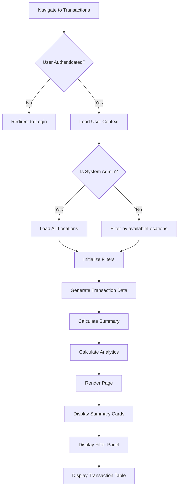

**Source Evidence**: `page.tsx:43-89`

---

## 2. Filter Application Flow

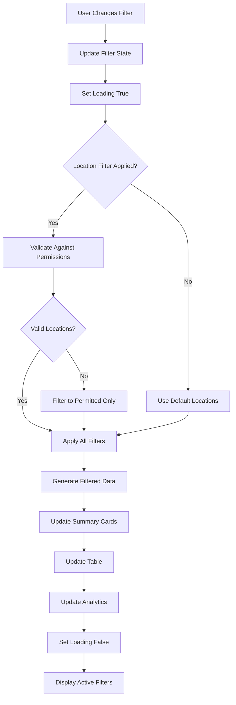

**Source Evidence**: `page.tsx:60-89`, `components/TransactionFilters.tsx:43-133`

---

## 3. Transaction Type Flow

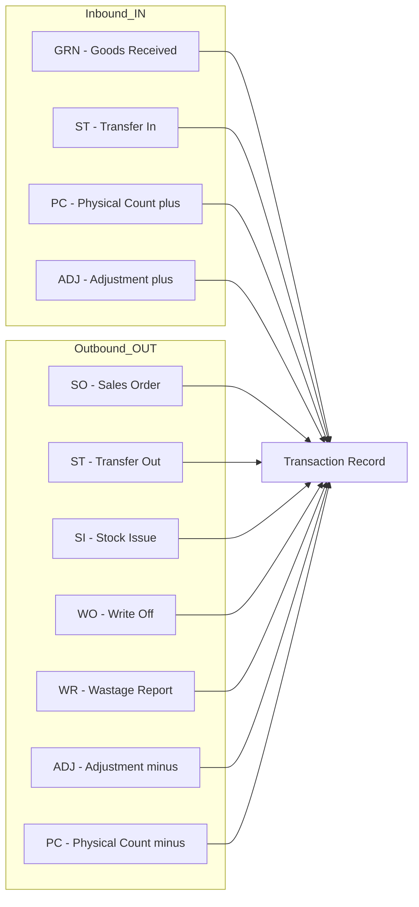

**Note**: Transaction types are only IN or OUT. Adjustments (ADJ) create either IN or OUT based on direction.

**Source Evidence**: `types.ts:6-7`, `lib/mock-data/transactions.ts:73-76`

---

## 4. Sorting Flow

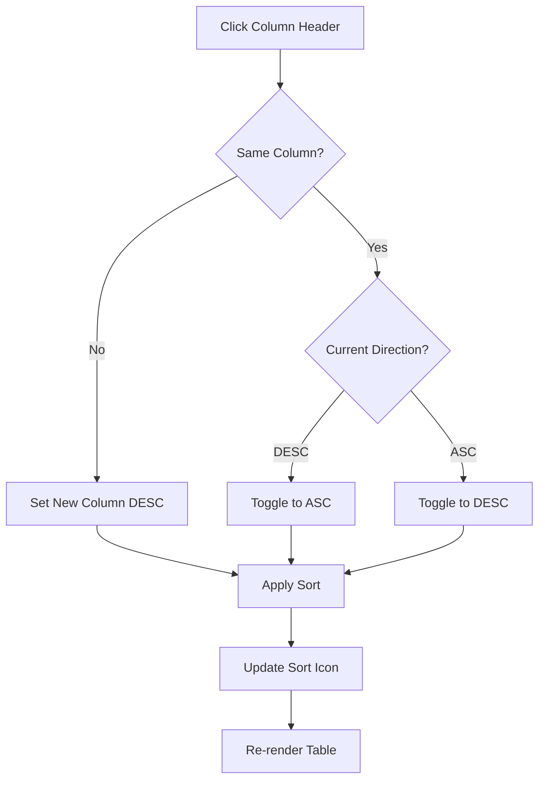

**Source Evidence**: `components/TransactionTable.tsx:104-118`

---

## 5. Pagination Flow

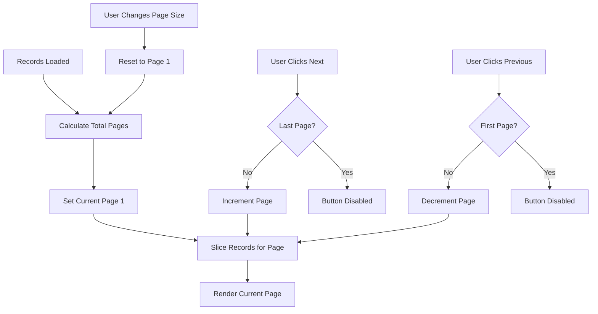

**Source Evidence**: `components/TransactionTable.tsx:44-46, 96-123`

---

## 6. CSV Export Flow

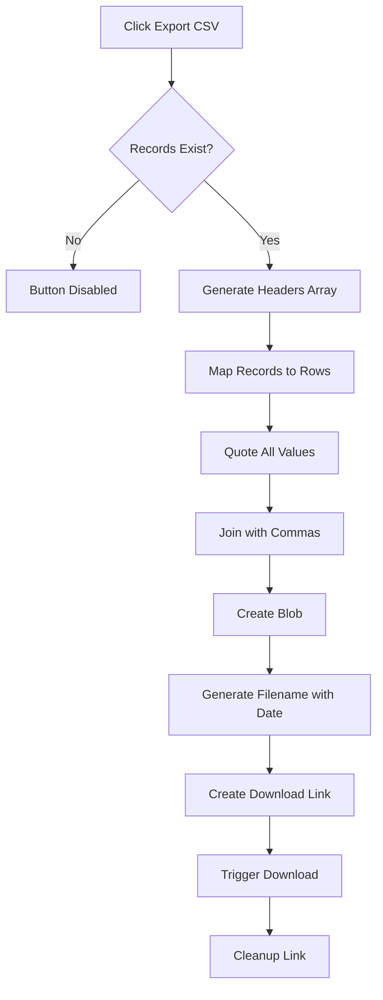

**Source Evidence**: `page.tsx:97-154`

---

## 7. Tab Navigation Flow

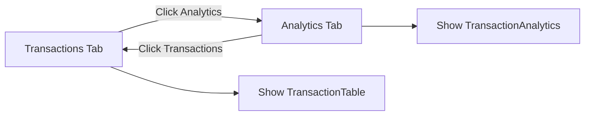

**Source Evidence**: `page.tsx:226-257`

---

## 8. Location Access Control Flow

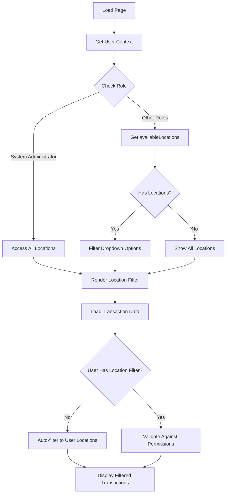

**Source Evidence**: `page.tsx:43-56`, `page.tsx:66-81`

---

## 9. Analytics Rendering Flow

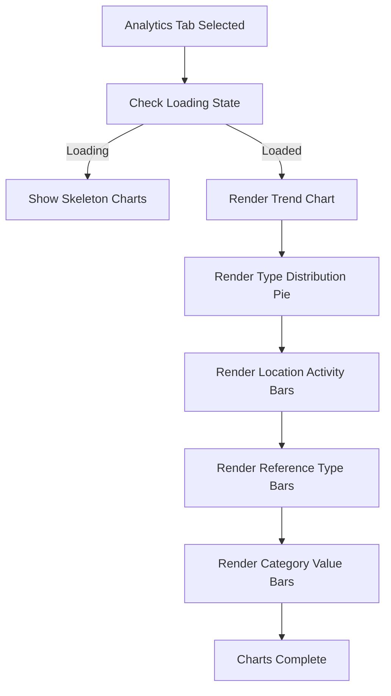

**Source Evidence**: `components/TransactionAnalytics.tsx:29-59, 61-293`

---

## 10. Quick Date Filter Flow

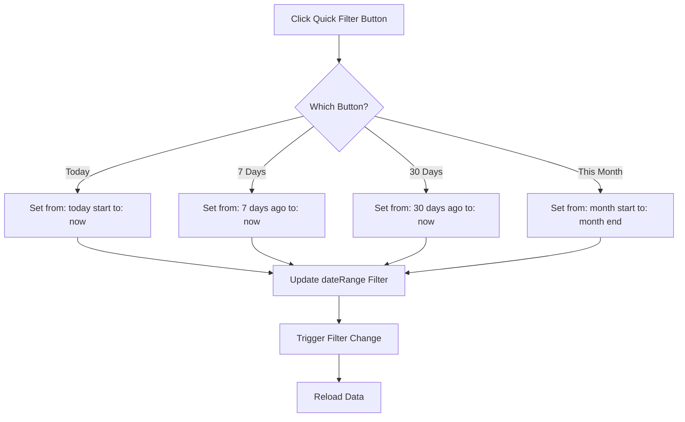

**Source Evidence**: `components/TransactionFilters.tsx:94-122`

---

## 11. Search Filter Flow

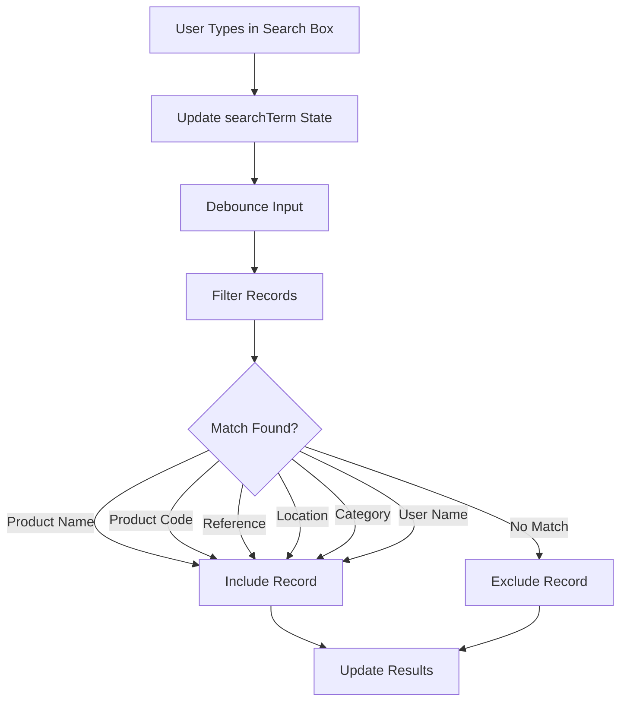

**Source Evidence**: `components/TransactionFilters.tsx:51-53`, `lib/mock-data/transactions.ts:350-365`

---

## 12. Summary Calculation Flow

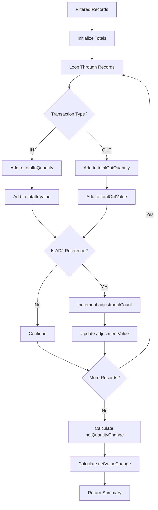

**Source Evidence**: `lib/mock-data/transactions.ts:164-197`

---

## Related Documents

- [BR-inventory-transactions.md](./BR-inventory-transactions.md) - Business Requirements
- [TS-inventory-transactions.md](./TS-inventory-transactions.md) - Technical Specification
- [UC-inventory-transactions.md](./UC-inventory-transactions.md) - Use Cases
- [VAL-inventory-transactions.md](./VAL-inventory-transactions.md) - Validations
