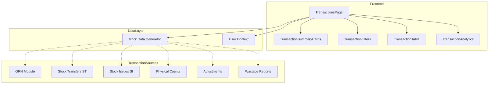
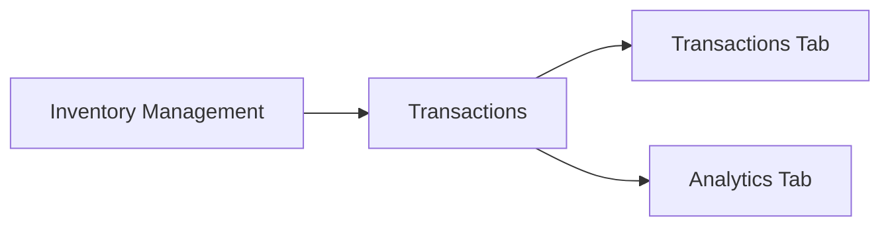
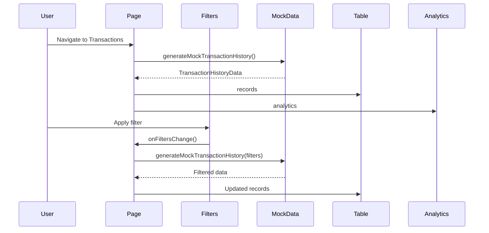

# Technical Specification: Inventory Transactions

## Document Information
| Field | Value |
|-------|-------|
| Module | Inventory Management |
| Sub-module | Transactions |
| Version | 2.0.0 |
| Last Updated | 2025-01-16 |

## Document History
| Version | Date | Author | Changes |
|---------|------|--------|---------|
| 2.0.0 | 2025-01-16 | Documentation Team | Updated architecture; Corrected transaction types; Updated reference types; Added source evidence |
| 1.0.0 | 2024-01-15 | Documentation Team | Initial version |

---

## 1. System Architecture

---

## 2. Page Hierarchy

**Route**: `/inventory-management/transactions`

---

## 3. Component Architecture

### 3.1 Page Component

**File**: `app/(main)/inventory-management/transactions/page.tsx`

**Responsibilities**:
- Manage filter state and active tab state
- Load transaction data based on filters and user permissions
- Coordinate child components
- Handle data refresh and CSV export

**State Management**:
| State | Type | Description |
|-------|------|-------------|
| filters | TransactionFilterParams | Current filter selections |
| data | TransactionHistoryData | Loaded transaction data |
| isLoading | boolean | Loading indicator |
| activeTab | string | Current tab (transactions/analytics) |

---

### 3.2 TransactionSummaryCards

**File**: `components/TransactionSummaryCards.tsx`

**Responsibilities**:
- Display 4 summary metric cards
- Format currency and number values
- Show loading skeleton during data fetch
- Color-code positive/negative values

**Props**:
| Prop | Type | Description |
|------|------|-------------|
| summary | TransactionSummary | Calculated totals |
| isLoading | boolean | Loading state |

**Cards Displayed**:
1. Total Transactions (with adjustment count subtitle)
2. Total Inbound (value and quantity)
3. Total Outbound (value and quantity)
4. Net Change (with quantity net)

---

### 3.3 TransactionFilters

**File**: `components/TransactionFilters.tsx`

**Responsibilities**:
- Render collapsible filter panel
- Handle date range selection with calendar
- Manage multi-select for transaction/reference types
- Display active filter badges
- Provide quick date filter buttons

**Props**:
| Prop | Type | Description |
|------|------|-------------|
| filters | TransactionFilterParams | Current filters |
| onFiltersChange | Function | Filter update callback |
| availableLocations | Array | Permitted locations |
| availableCategories | Array | Product categories |

**Features**:
- Quick date buttons: Today, 7 Days, 30 Days, This Month
- Collapsible advanced filters
- Active filter badge display with removal
- Clear All functionality

---

### 3.4 TransactionTable

**File**: `components/TransactionTable.tsx`

**Responsibilities**:
- Render sortable data table with 10 columns
- Handle column sorting with toggle direction
- Manage client-side pagination
- Format quantities with color coding
- Display empty state when no data

**Props**:
| Prop | Type | Description |
|------|------|-------------|
| records | TransactionRecord[] | Transaction list |
| isLoading | boolean | Loading state |

**Internal State**:
| State | Type | Default |
|-------|------|---------|
| currentPage | number | 1 |
| pageSize | number | 10 |
| sortConfig | SortConfig | { field: 'date', direction: 'desc' } |

**Table Columns**:
1. Date/Time
2. Reference (with type badge)
3. Product (name, code, category)
4. Location
5. Type (IN/OUT badge)
6. Qty In (green, positive)
7. Qty Out (red, negative)
8. Value (color-coded)
9. Balance (before → after)
10. User

---

### 3.5 TransactionAnalytics

**File**: `components/TransactionAnalytics.tsx`

**Responsibilities**:
- Render 5 analytics charts using Recharts
- Handle loading state with skeleton
- Format tooltips and labels

**Props**:
| Prop | Type | Description |
|------|------|-------------|
| analytics | TransactionAnalytics | Chart data |
| isLoading | boolean | Loading state |

**Charts**:
| Chart | Type | Data |
|-------|------|------|
| Transaction Trend | AreaChart | Daily inbound/outbound/adjustment |
| Distribution by Type | PieChart | IN/OUT counts |
| Location Activity | BarChart | Inbound vs Outbound by location |
| Reference Type | BarChart (horizontal) | Count by reference type |
| Top Categories | BarChart (horizontal) | Top 8 by value |

---

## 4. Data Flow

---

## 5. Type Definitions

### 5.1 TransactionRecord
Core transaction entity with all display fields.

| Field | Type | Description |
|-------|------|-------------|
| id | string | Unique identifier |
| date | string | Transaction date (YYYY-MM-DD) |
| time | string | Transaction time (HH:MM) |
| reference | string | Reference document number |
| referenceType | ReferenceType | Document type code |
| locationId | string | Location identifier |
| locationName | string | Location display name |
| productId | string | Product identifier |
| productCode | string | Product SKU |
| productName | string | Product display name |
| categoryId | string | Category identifier |
| categoryName | string | Category display name |
| transactionType | TransactionType | IN or OUT |
| reason | string | Transaction reason |
| lotNumber | string? | Optional lot/batch number |
| quantityIn | number | Quantity received |
| quantityOut | number | Quantity issued |
| netQuantity | number | Net change (in - out) |
| unitCost | number | Cost per unit |
| totalValue | number | Total transaction value |
| balanceBefore | number | Stock before transaction |
| balanceAfter | number | Stock after transaction |
| createdBy | string | User ID |
| createdByName | string | User display name |

**Source Evidence**: `types.ts:9-34`

### 5.2 TransactionFilterParams
Filter criteria for querying transactions.

| Field | Type | Description |
|-------|------|-------------|
| dateRange | { from, to } | Date range selection |
| transactionTypes | TransactionType[] | Selected types (IN, OUT) |
| referenceTypes | ReferenceType[] | Selected reference types |
| locations | string[] | Selected location IDs |
| categories | string[] | Selected category IDs |
| searchTerm | string | Text search query |

**Source Evidence**: `types.ts:48-58`

### 5.3 ReferenceType
Valid reference type codes.

**Values**: 'GRN' | 'SO' | 'ADJ' | 'ST' | 'SI' | 'PO' | 'WO' | 'SR' | 'PC' | 'WR' | 'PR'

**Source Evidence**: `types.ts:6`

### 5.4 TransactionType
Valid transaction type codes.

**Values**: 'IN' | 'OUT'

**Note**: No ADJUSTMENT type - adjustments use IN/OUT with referenceType='ADJ'

**Source Evidence**: `types.ts:7`

---

## 6. Integration Points

### 6.1 User Context
**Source**: `lib/context/simple-user-context`
**Usage**: Location permission filtering
**Data**: `user.role`, `user.availableLocations`

### 6.2 Navigation
**Location**: `components/Sidebar.tsx`
**Path**: Inventory Management > Transactions
**Route**: `/inventory-management/transactions`

### 6.3 Mock Data Generator
**Source**: `lib/mock-data/transactions.ts`
**Functions**:
- `generateMockTransactionHistory(params?, count?)` - Generate transaction data
- `getAvailableLocations()` - Get location list
- `getAvailableCategories()` - Get category list

---

## 7. Third-Party Libraries

| Library | Usage |
|---------|-------|
| Recharts | Analytics charts (AreaChart, PieChart, BarChart) |
| date-fns | Date manipulation (subDays, format, startOfMonth) |
| lucide-react | Icons |
| shadcn/ui | UI components (Button, Card, Table, Tabs, etc.) |

---

## 8. Performance Considerations

| Concern | Mitigation |
|---------|------------|
| Large dataset rendering | Client-side pagination (10/25/50 per page) |
| Filter re-renders | useMemo for sorted/filtered records |
| Chart rendering | ResponsiveContainer with skeleton loading |
| Export performance | Blob streaming for CSV generation |
| Location filtering | useMemo for available locations |

---

## 9. Accessibility

| Feature | Implementation |
|---------|---------------|
| Keyboard navigation | Standard table navigation |
| Screen readers | ARIA labels on buttons and controls |
| Color contrast | Minimum 4.5:1 ratio |
| Focus indicators | Visible focus rings on interactive elements |
| Loading states | Skeleton components with aria-busy |

---

## Related Documents

- [BR-inventory-transactions.md](./BR-inventory-transactions.md) - Business Requirements
- [UC-inventory-transactions.md](./UC-inventory-transactions.md) - Use Cases
- [FD-inventory-transactions.md](./FD-inventory-transactions.md) - Flow Diagrams
- [VAL-inventory-transactions.md](./VAL-inventory-transactions.md) - Validations
