# Inventory Planning - Flow Diagrams

## Document Information

| Field | Value |
|-------|-------|
| Module | Operational Planning > Inventory Planning |
| Version | 2.0.0 |
| Last Updated | 2025-01-17 |
| Status | Implemented |
| Diagram Format | Mermaid 8.8.2 Compatible |

## Document History

| Version | Date | Author | Changes |
|---------|------|--------|---------|
| 1.0.0 | 2025-12-06 | Development Team | Initial documentation |
| 2.0.0 | 2025-01-17 | Development Team | Updated to match actual UI implementation |

---

## 1. Module Navigation Flow

### 1.1 Inventory Planning Navigation

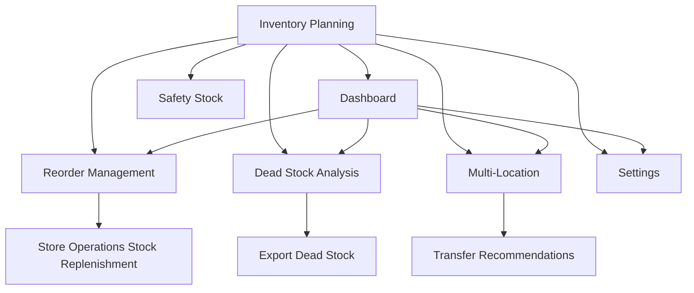

### 1.2 Cross-Module Navigation

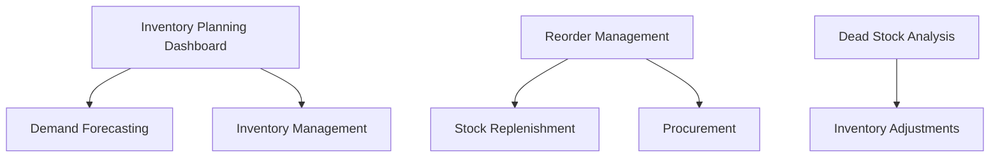

---

## 2. Dashboard Flow

### 2.1 Dashboard Load Flow

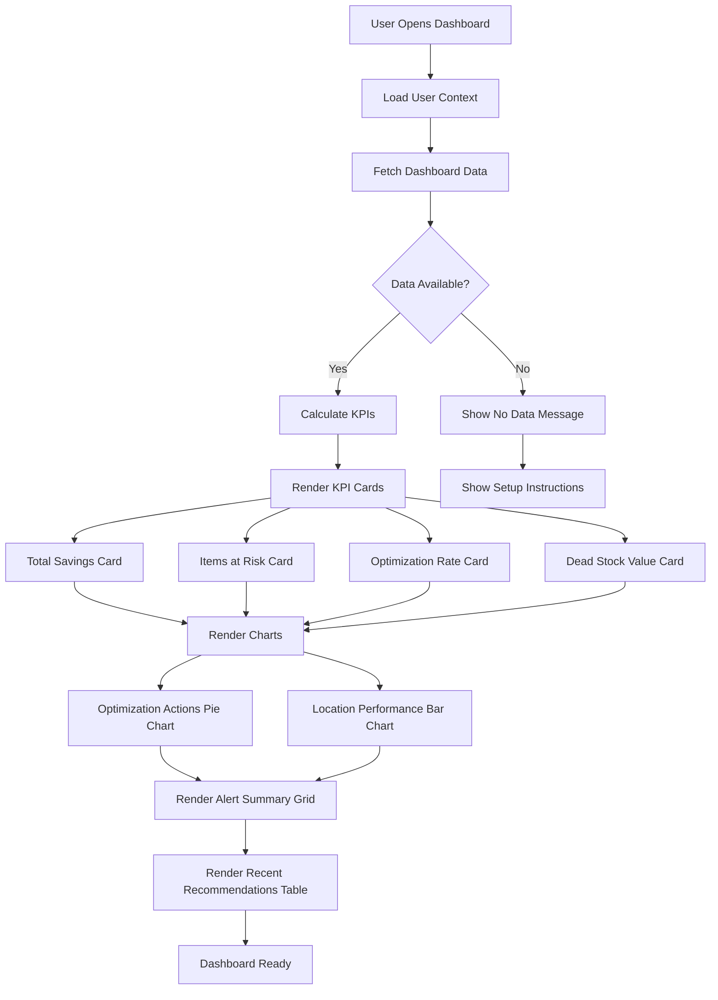

### 2.2 Dashboard Interaction Flow

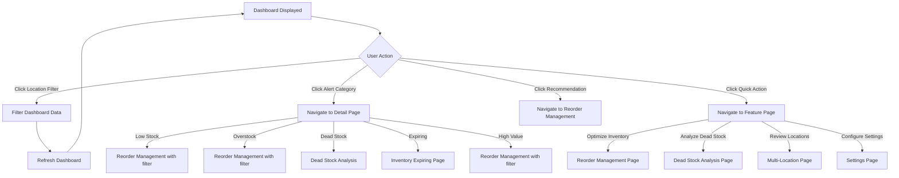

### 2.3 Quick Actions Flow

```mermaid
graph TB
    A[Quick Actions Section] --> B[Optimize Inventory Button]
    A --> C[Analyze Dead Stock Button]
    A --> D[Review Locations Button]
    A --> E[Configure Settings Button]

    B --> F[/operational-planning/inventory-planning/reorder]
    C --> G[/operational-planning/inventory-planning/dead-stock]
    D --> H[/operational-planning/inventory-planning/locations]
    E --> I[/operational-planning/inventory-planning/settings]
```

---

## 3. Reorder Management Flow

### 3.1 Reorder Recommendations Load Flow

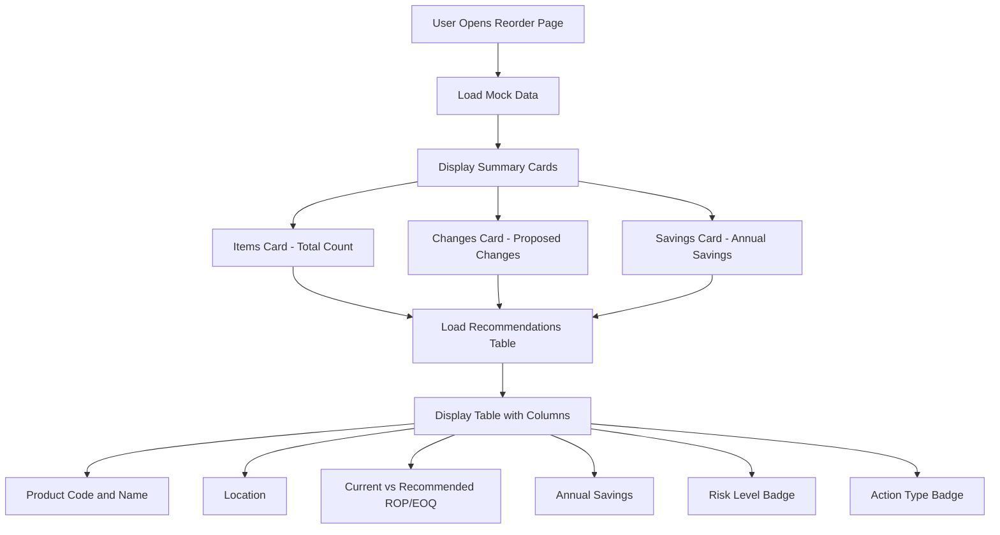

### 3.2 EOQ Calculation Flow

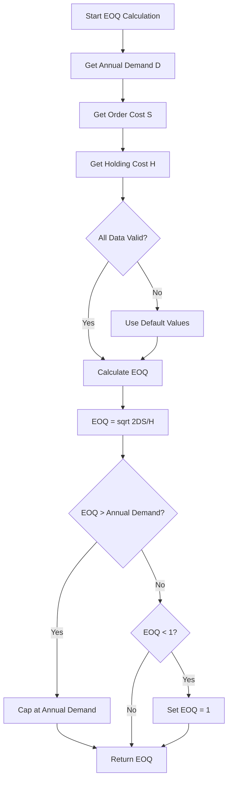

### 3.3 Reorder Point Calculation Flow

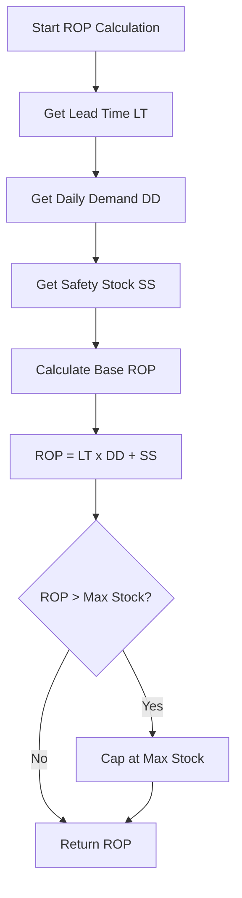

### 3.4 Apply Recommendations Flow

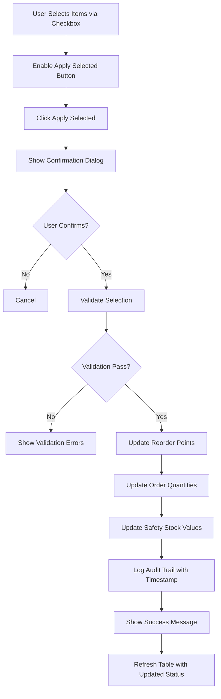

### 3.5 Expandable Row Details Flow

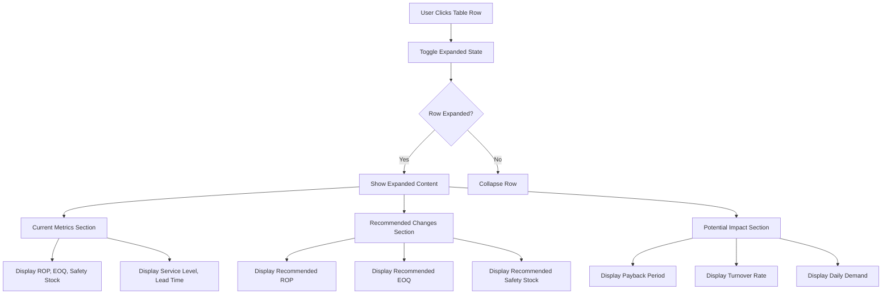

---

## 4. Dead Stock Analysis Flow

### 4.1 Dead Stock Page Load Flow

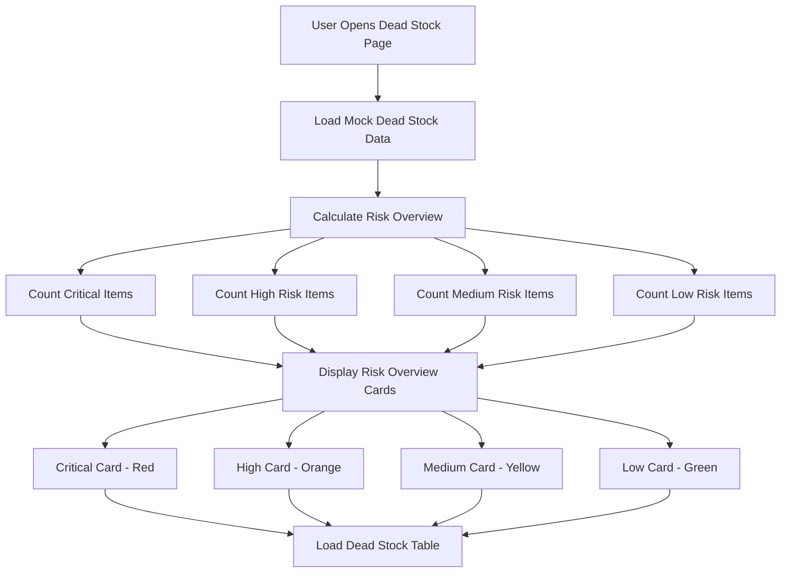

### 4.2 Risk Classification Flow

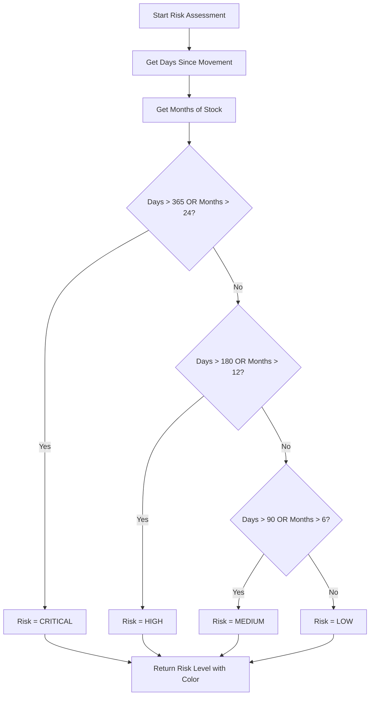

### 4.3 Dead Stock Filtering Flow

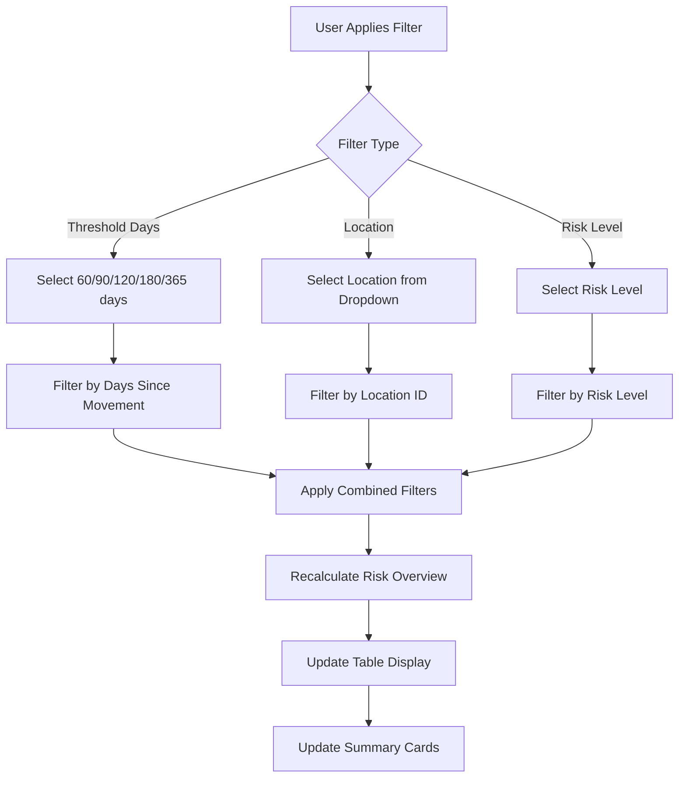

### 4.4 Dead Stock Action Flow

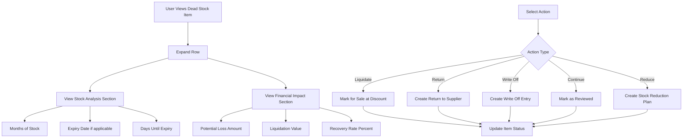

---

## 5. Safety Stock Flow

### 5.1 Safety Stock Page Load Flow

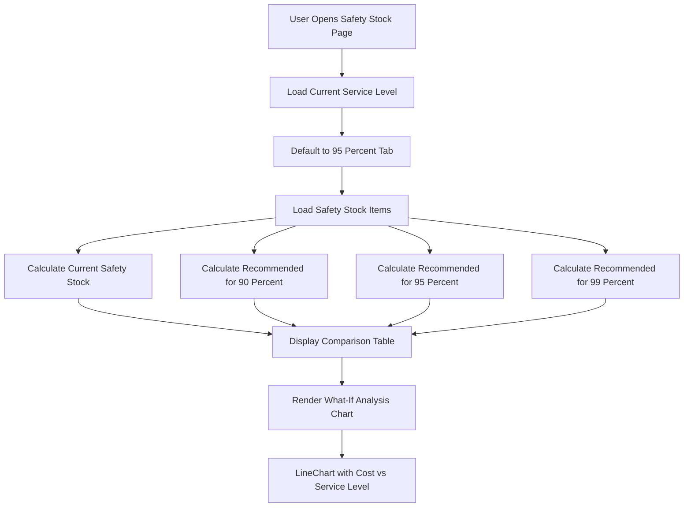

### 5.2 Service Level Selection Flow

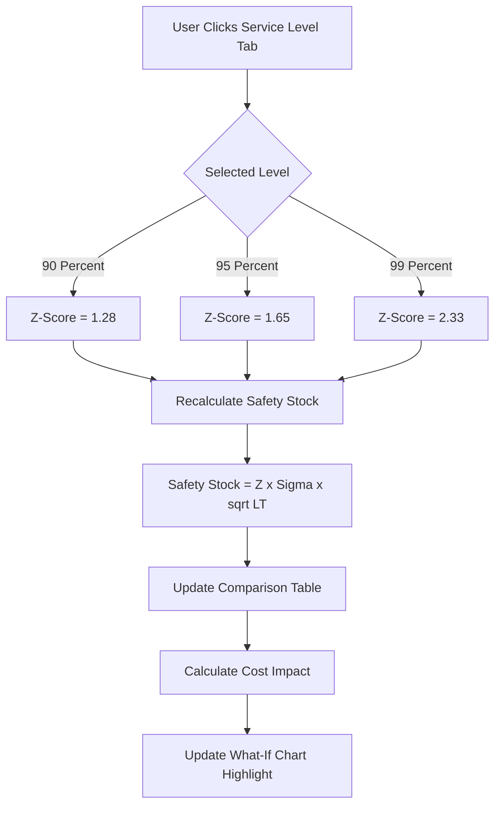

### 5.3 Apply Safety Stock Changes Flow

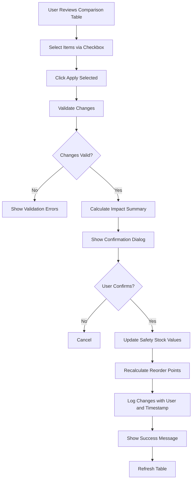

---

## 6. Multi-Location Flow

### 6.1 Location Performance Load Flow

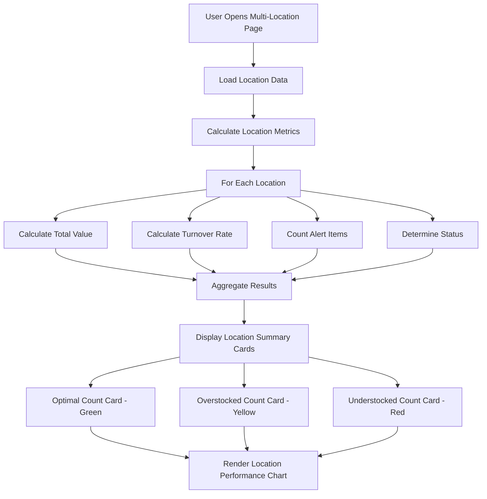

### 6.2 Location Status Classification Flow

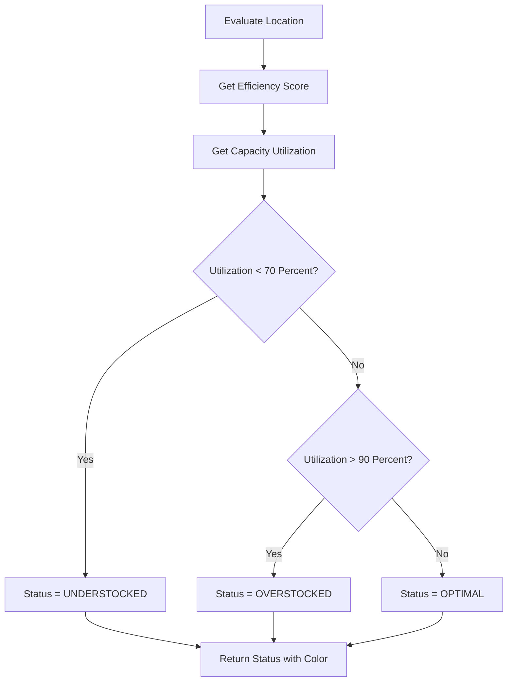

### 6.3 Transfer Recommendation Flow

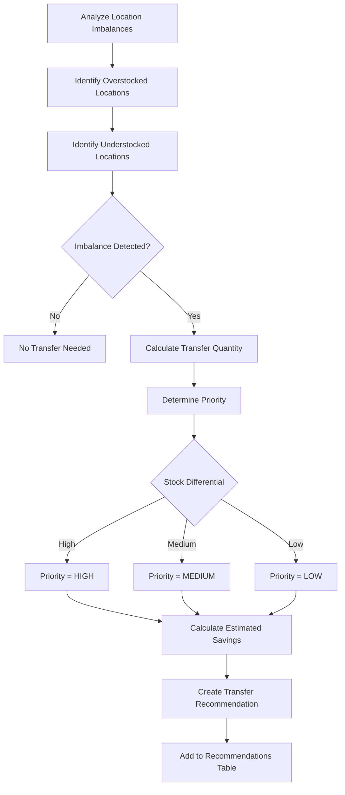

### 6.4 Create Transfer Flow

```mermaid
graph TB
    A[User Reviews Transfer Recommendation] --> B[Click Create Transfer Button]
    B --> C[Validate Transfer Parameters]

    C --> D{Valid?}
    D -->|No| E[Show Validation Error]
    D -->|Yes| F[Create Transfer Request]

    F --> G[Set Source Location]
    G --> H[Set Destination Location]
    H --> I[Set Quantity and Unit]
    I --> J[Set Priority Level]

    J --> K[Navigate to Stock Transfers]
    K --> L[Pre-fill Transfer Form]
```

---

## 7. Settings Configuration Flow

### 7.1 Settings Page Load Flow

```mermaid
graph TB
    A[User Opens Settings Page] --> B[Load Current Settings]
    B --> C[Display Settings Form]

    C --> D[Default Parameters Section]
    C --> E[Alert Thresholds Section]
    C --> F[Notification Settings Section]
    C --> G[Automation Settings Section]

    D --> H[Service Level Select]
    D --> I[Order Cost Input]
    D --> J[Holding Cost Rate Input]
    D --> K[Default Lead Time Input]

    E --> L[Dead Stock Threshold Input]
    E --> M[Low Stock Alert Switch]
    E --> N[Dead Stock Alert Switch]
    E --> O[Overstock Alert Switch]

    F --> P[Email Notifications Switch]
    F --> Q[Notification Email Input]
    F --> R[Digest Frequency Select]

    G --> S[Auto-Apply Low Risk Switch]
    G --> T[Auto-Generate Weekly Switch]
    G --> U[Sync with Procurement Switch]
```

### 7.2 Save Settings Flow

```mermaid
graph TB
    A[User Modifies Settings] --> B[Click Save Settings]
    B --> C[Validate All Fields]

    C --> D{All Valid?}
    D -->|No| E[Show Validation Errors]
    D -->|Yes| F[Save to Configuration]

    E --> G[Highlight Invalid Fields]
    G --> H[User Corrects Input]
    H --> A

    F --> I[Apply to Future Calculations]
    I --> J[Show Success Toast]
```

### 7.3 Reset to Defaults Flow

```mermaid
graph TB
    A[User Clicks Reset to Defaults] --> B[Show Confirmation Dialog]
    B --> C{User Confirms?}

    C -->|No| D[Cancel]
    C -->|Yes| E[Load Default Values]

    E --> F[Service Level = 95 Percent]
    E --> G[Order Cost = 50 USD]
    E --> H[Holding Cost Rate = 25 Percent]
    E --> I[Lead Time = 7 days]
    E --> J[Dead Stock Threshold = 90 days]

    F --> K[Update Form Fields]
    G --> K
    H --> K
    I --> K
    J --> K

    K --> L[Show Reset Success Message]
```

---

## 8. Integration Flows

### 8.1 Demand Forecasting Integration

```mermaid
graph TB
    A[Inventory Planning Dashboard] --> B[Click Go to Demand Forecasting Link]
    B --> C[Navigate to Demand Forecasting]
    C --> D[Pass Location Context if filtered]

    D --> E[Demand Forecasting Dashboard]
    E --> F[View Forecast Data]
    F --> G[Return to Inventory Planning]
```

### 8.2 Store Operations Integration

```mermaid
graph TB
    A[Reorder Management Page] --> B[Click Stock Replenishment Link]
    B --> C[Navigate to Store Operations]
    C --> D[Stock Replenishment Page]

    D --> E[View Replenishment Needs]
    E --> F[Create Replenishment Request]
```

### 8.3 Inventory Management Integration

```mermaid
graph TB
    A[Apply Optimization Recommendation] --> B[Get Current Item Data]
    B --> C[Calculate New Parameters]

    C --> D[Update Reorder Point]
    C --> E[Update Order Quantity]
    C --> F[Update Safety Stock]

    D --> G[Save Changes to Inventory Item]
    E --> G
    F --> G

    G --> H[Trigger Reorder Check]
    H --> I{Stock Below ROP?}

    I -->|Yes| J[Flag for Replenishment]
    I -->|No| K[Complete Update]
```

---

## 9. Error Handling Flows

### 9.1 Data Load Error Flow

```mermaid
graph TB
    A[Page Load Request] --> B{Data Available?}

    B -->|Yes| C[Render Page Content]
    B -->|No| D{Error Type}

    D -->|No Data| E[Show Empty State]
    D -->|Network Error| F[Show Retry Option]
    D -->|Permission Error| G[Show Access Denied]

    E --> H[Display Setup Instructions]
    F --> I[User Clicks Retry]
    I --> A

    G --> J[Contact Admin Message]
```

### 9.2 Validation Error Flow

```mermaid
graph TB
    A[User Submits Form] --> B[Client-Side Validation]
    B --> C{Valid?}

    C -->|No| D[Show Inline Errors]
    C -->|Yes| E[Submit to Server]

    D --> F[Highlight Invalid Fields]
    F --> G[User Corrects Input]
    G --> A

    E --> H[Server Validation]
    H --> I{Valid?}

    I -->|No| J[Return Error Response]
    I -->|Yes| K[Process Request]

    J --> L[Show Server Errors]
    L --> G
```

---

## 10. State Management Flow

### 10.1 Filter State Flow

```mermaid
graph TB
    A[User Changes Filter] --> B[Update Local State]
    B --> C[Filter Data Array]
    C --> D[Update Displayed Items]
    D --> E[Recalculate Summary Cards]
    E --> F[Re-render Components]
```

### 10.2 Selection State Flow

```mermaid
graph TB
    A[User Clicks Checkbox] --> B[Toggle Item in Selected Set]
    B --> C{Any Items Selected?}

    C -->|Yes| D[Enable Bulk Actions]
    C -->|No| E[Disable Bulk Actions]

    D --> F[Update Action Bar]
    E --> F

    G[User Clicks Select All] --> H[Add All Visible Items to Selection]
    H --> D
```

### 10.3 Expanded Row State Flow

```mermaid
graph TB
    A[User Clicks Row] --> B[Get Row ID]
    B --> C{Already Expanded?}

    C -->|Yes| D[Remove from Expanded Set]
    C -->|No| E[Add to Expanded Set]

    D --> F[Collapse Row UI]
    E --> G[Expand Row UI]
    G --> H[Load Expanded Content]
```

---

**Document End**
