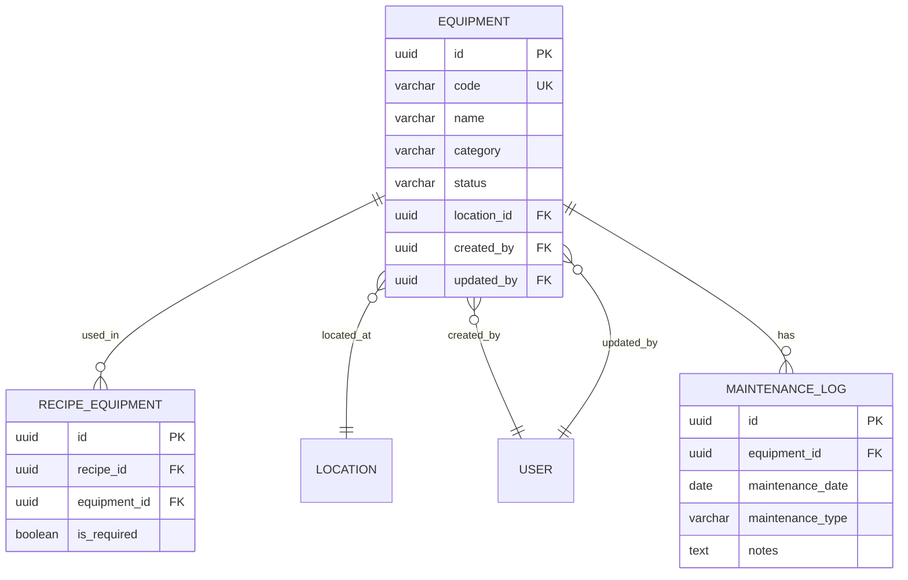

# Recipe Equipment - Data Dictionary (DD)

## Document Information
- **Document Type**: Data Dictionary Document
- **Module**: Operational Planning > Recipe Management > Equipment
- **Version**: 1.0.0
- **Last Updated**: 2025-01-16

## Document History

| Version | Date | Author | Changes |
|---------|------|--------|---------|
| 1.0.0 | 2025-01-16 | Development Team | Initial documentation based on actual implementation |

---

## 1. Overview

This document provides the complete data dictionary for the Equipment Management submodule, including database schema, TypeScript interfaces, and enum definitions.

---

## 2. Database Schema

### 2.1 Equipment Table

```sql
CREATE TABLE equipment (
    -- Primary Key
    id UUID PRIMARY KEY DEFAULT gen_random_uuid(),

    -- Identification
    code VARCHAR(50) NOT NULL UNIQUE,
    name VARCHAR(200) NOT NULL,
    description TEXT,

    -- Classification
    category VARCHAR(20) NOT NULL,

    -- Physical Details
    brand VARCHAR(100),
    model VARCHAR(100),
    serial_number VARCHAR(100),

    -- Specifications
    capacity VARCHAR(100),
    power_rating VARCHAR(50),
    dimensions JSONB,

    -- Location
    location_id UUID REFERENCES locations(id),
    station VARCHAR(100),

    -- Operations
    operating_instructions TEXT,
    safety_notes TEXT,
    cleaning_instructions TEXT,

    -- Maintenance
    maintenance_schedule VARCHAR(100),
    last_maintenance_date DATE,
    next_maintenance_date DATE,

    -- Status and Availability
    status VARCHAR(20) NOT NULL DEFAULT 'active',
    is_portable BOOLEAN NOT NULL DEFAULT FALSE,
    available_quantity INTEGER NOT NULL DEFAULT 1,
    total_quantity INTEGER NOT NULL DEFAULT 1,

    -- Usage Tracking
    usage_count INTEGER DEFAULT 0,
    average_usage_time INTEGER,

    -- Media
    image VARCHAR(500),
    manual_url VARCHAR(500),

    -- Display
    display_order INTEGER NOT NULL DEFAULT 0,
    is_active BOOLEAN NOT NULL DEFAULT TRUE,

    -- Audit
    created_at TIMESTAMP WITH TIME ZONE DEFAULT NOW(),
    updated_at TIMESTAMP WITH TIME ZONE DEFAULT NOW(),
    created_by UUID REFERENCES users(id),
    updated_by UUID REFERENCES users(id),

    -- Constraints
    CONSTRAINT equipment_status_check CHECK (status IN ('active', 'inactive', 'maintenance', 'retired')),
    CONSTRAINT equipment_category_check CHECK (category IN ('cooking', 'preparation', 'refrigeration', 'storage', 'serving', 'cleaning', 'small_appliance', 'utensil', 'other')),
    CONSTRAINT equipment_quantity_check CHECK (available_quantity >= 0 AND available_quantity <= total_quantity),
    CONSTRAINT equipment_total_quantity_check CHECK (total_quantity >= 1)
);

-- Indexes
CREATE INDEX idx_equipment_code ON equipment(code);
CREATE INDEX idx_equipment_name ON equipment(name);
CREATE INDEX idx_equipment_category ON equipment(category);
CREATE INDEX idx_equipment_status ON equipment(status);
CREATE INDEX idx_equipment_station ON equipment(station);
CREATE INDEX idx_equipment_is_active ON equipment(is_active);
CREATE INDEX idx_equipment_display_order ON equipment(display_order);
```

### 2.2 Dimensions JSONB Structure

```json
{
  "width": 100,
  "height": 80,
  "depth": 60,
  "unit": "cm"
}
```

---

## 3. TypeScript Interfaces

### 3.1 EquipmentStatus Type

```typescript
/**
 * Equipment status types
 * Source: lib/types/recipe.ts
 */
export type EquipmentStatus = 'active' | 'inactive' | 'maintenance' | 'retired';
```

### 3.2 EquipmentCategory Type

```typescript
/**
 * Equipment category types
 * Source: lib/types/recipe.ts
 */
export type EquipmentCategory =
  | 'cooking'
  | 'preparation'
  | 'refrigeration'
  | 'storage'
  | 'serving'
  | 'cleaning'
  | 'small_appliance'
  | 'utensil'
  | 'other';
```

### 3.3 Equipment Interface

```typescript
/**
 * Kitchen equipment used in recipe preparation
 * Source: lib/types/recipe.ts
 */
export interface Equipment {
  id: string;
  code: string;
  name: string;
  description?: string;
  category: EquipmentCategory;

  // Physical details
  brand?: string;
  model?: string;
  serialNumber?: string;

  // Capacity and specifications
  capacity?: string;           // e.g., "10 liters", "6 burners"
  powerRating?: string;        // e.g., "2000W", "Gas"
  dimensions?: {
    width: number;
    height: number;
    depth: number;
    unit: 'cm' | 'inch';
  };

  // Location and assignment
  locationId?: string;
  station?: string;            // Kitchen station (e.g., "Grill Station", "Prep Area")

  // Operational details
  operatingInstructions?: string;
  safetyNotes?: string;
  cleaningInstructions?: string;

  // Maintenance
  maintenanceSchedule?: string; // e.g., "Weekly", "Monthly"
  lastMaintenanceDate?: Date;
  nextMaintenanceDate?: Date;

  // Status and availability
  status: EquipmentStatus;
  isPortable: boolean;
  availableQuantity: number;
  totalQuantity: number;

  // Usage tracking
  usageCount?: number;
  averageUsageTime?: number;   // minutes per use

  // Media
  image?: string;
  manualUrl?: string;

  // Display
  displayOrder: number;
  isActive: boolean;

  // Audit
  createdAt?: Date;
  updatedAt?: Date;
  createdBy?: string;
  updatedBy?: string;
}
```

### 3.4 EquipmentFormData Interface

```typescript
/**
 * Form data for equipment create/edit
 * Source: app/(main)/operational-planning/recipe-management/equipment/components/equipment-list.tsx
 */
interface EquipmentFormData {
  id: string;
  code: string;
  name: string;
  description: string;
  category: EquipmentCategory;
  brand: string;
  model: string;
  capacity: string;
  powerRating: string;
  station: string;
  status: EquipmentStatus;
  isPortable: boolean;
  availableQuantity: number;
  totalQuantity: number;
  maintenanceSchedule: string;
  isActive: boolean;
}
```

---

## 4. Field Definitions

### 4.1 Core Fields

| Field | Type | Required | Description |
|-------|------|----------|-------------|
| id | UUID | Yes | Unique identifier (auto-generated) |
| code | string | Yes | Unique equipment code (e.g., "OVEN-CONV-01") |
| name | string | Yes | Equipment name (e.g., "Convection Oven") |
| description | string | No | Detailed description of the equipment |
| category | EquipmentCategory | Yes | Equipment classification |

### 4.2 Physical Details Fields

| Field | Type | Required | Description |
|-------|------|----------|-------------|
| brand | string | No | Manufacturer brand name |
| model | string | No | Model number or name |
| serialNumber | string | No | Serial number for tracking |
| capacity | string | No | Capacity description (e.g., "10 trays") |
| powerRating | string | No | Power specification (e.g., "2000W") |
| dimensions | object | No | Physical dimensions with unit |

### 4.3 Location Fields

| Field | Type | Required | Description |
|-------|------|----------|-------------|
| locationId | UUID | No | Reference to location record |
| station | string | No | Kitchen station assignment |

### 4.4 Operational Fields

| Field | Type | Required | Description |
|-------|------|----------|-------------|
| operatingInstructions | string | No | Usage instructions |
| safetyNotes | string | No | Safety precautions |
| cleaningInstructions | string | No | Cleaning procedures |

### 4.5 Maintenance Fields

| Field | Type | Required | Description |
|-------|------|----------|-------------|
| maintenanceSchedule | string | No | Schedule frequency (e.g., "Weekly") |
| lastMaintenanceDate | Date | No | Date of last maintenance |
| nextMaintenanceDate | Date | No | Scheduled next maintenance |

### 4.6 Status and Availability Fields

| Field | Type | Required | Default | Description |
|-------|------|----------|---------|-------------|
| status | EquipmentStatus | Yes | 'active' | Current operational status |
| isPortable | boolean | Yes | false | Whether equipment can be moved |
| availableQuantity | number | Yes | 1 | Currently available units |
| totalQuantity | number | Yes | 1 | Total units owned |

### 4.7 Usage Tracking Fields

| Field | Type | Required | Description |
|-------|------|----------|-------------|
| usageCount | number | No | Number of times used |
| averageUsageTime | number | No | Average usage duration (minutes) |

### 4.8 Media Fields

| Field | Type | Required | Description |
|-------|------|----------|-------------|
| image | string | No | URL to equipment image |
| manualUrl | string | No | URL to equipment manual |

### 4.9 Display and System Fields

| Field | Type | Required | Default | Description |
|-------|------|----------|---------|-------------|
| displayOrder | number | Yes | 0 | Order in lists |
| isActive | boolean | Yes | true | Active/inactive flag |

### 4.10 Audit Fields

| Field | Type | Required | Description |
|-------|------|----------|-------------|
| createdAt | Date | No | Record creation timestamp |
| updatedAt | Date | No | Last update timestamp |
| createdBy | UUID | No | User who created record |
| updatedBy | UUID | No | User who last updated |

---

## 5. Enum Values

### 5.1 Equipment Status Values

| Value | Label | Description |
|-------|-------|-------------|
| active | Active | Equipment is operational |
| inactive | Inactive | Equipment is not in use |
| maintenance | Maintenance | Equipment is under maintenance |
| retired | Retired | Equipment is permanently out of service |

### 5.2 Equipment Category Values

| Value | Label | Description |
|-------|-------|-------------|
| cooking | Cooking | Heat application equipment |
| preparation | Preparation | Food prep equipment |
| refrigeration | Refrigeration | Cooling/freezing equipment |
| storage | Storage | Storage equipment |
| serving | Serving | Serving equipment |
| cleaning | Cleaning | Cleaning equipment |
| small_appliance | Small Appliance | Portable appliances |
| utensil | Utensil | Hand tools |
| other | Other | Miscellaneous |

### 5.3 Dimension Unit Values

| Value | Description |
|-------|-------------|
| cm | Centimeters |
| inch | Inches |

---

## 6. Relationships

### 6.1 Entity Relationships



---

## 7. Sample Data

### 7.1 Equipment Examples

```json
[
  {
    "id": "eq-001",
    "code": "OVEN-CONV-01",
    "name": "Convection Oven",
    "description": "Professional convection oven for baking",
    "category": "cooking",
    "brand": "Rational",
    "model": "SCC WE 101",
    "capacity": "10 trays GN 1/1",
    "powerRating": "18.7 kW",
    "station": "Bakery Station",
    "status": "active",
    "isPortable": false,
    "availableQuantity": 1,
    "totalQuantity": 1,
    "maintenanceSchedule": "Monthly",
    "displayOrder": 1,
    "isActive": true
  },
  {
    "id": "eq-002",
    "code": "MIX-STAND-01",
    "name": "Stand Mixer",
    "description": "Heavy duty stand mixer for dough and batters",
    "category": "preparation",
    "brand": "Hobart",
    "model": "HL200",
    "capacity": "20 quarts",
    "powerRating": "1 HP",
    "station": "Prep Area",
    "status": "active",
    "isPortable": false,
    "availableQuantity": 2,
    "totalQuantity": 2,
    "maintenanceSchedule": "Weekly",
    "displayOrder": 2,
    "isActive": true
  }
]
```

---

## Related Documents

- [BR-equipment.md](./BR-equipment.md) - Business Rules
- [UC-equipment.md](./UC-equipment.md) - Use Cases
- [FD-equipment.md](./FD-equipment.md) - Flow Diagrams
- [TS-equipment.md](./TS-equipment.md) - Technical Specifications
- [VAL-equipment.md](./VAL-equipment.md) - Validation Rules
