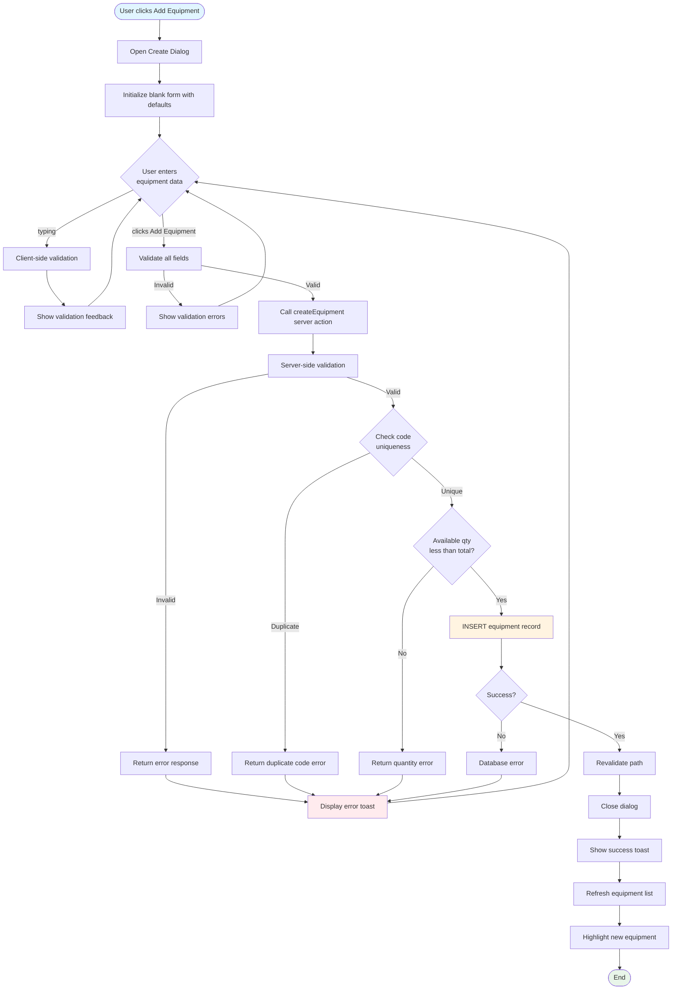
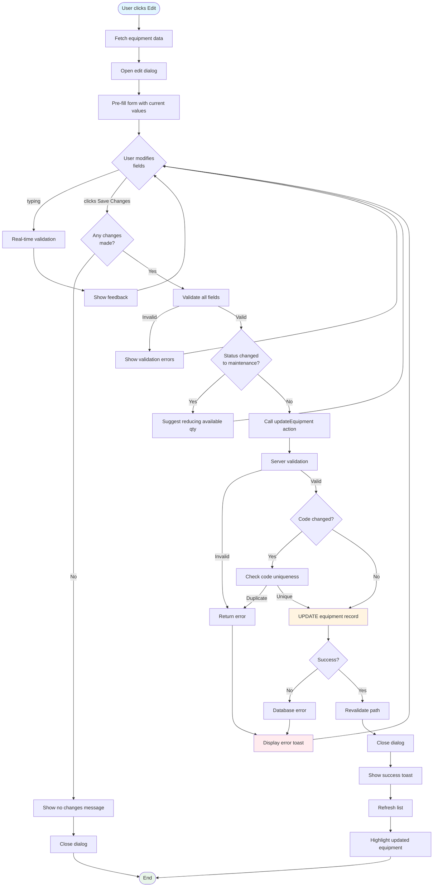
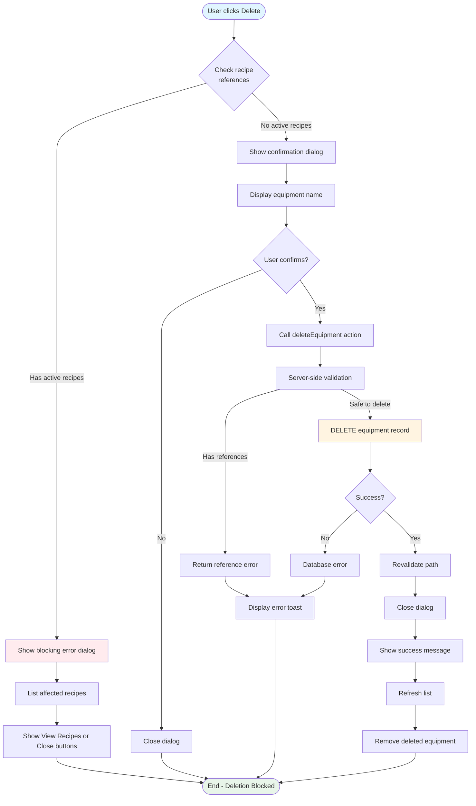
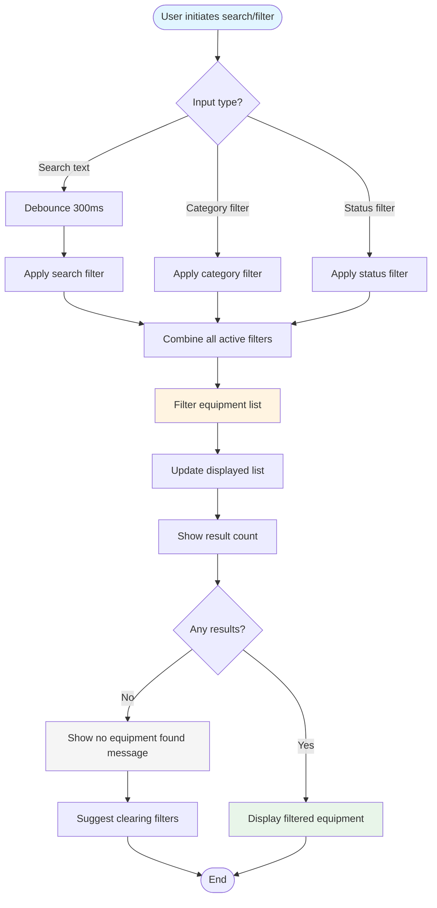
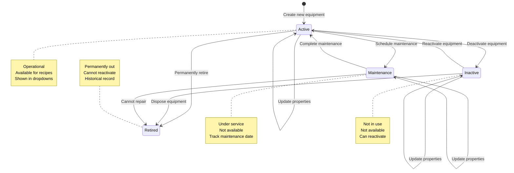
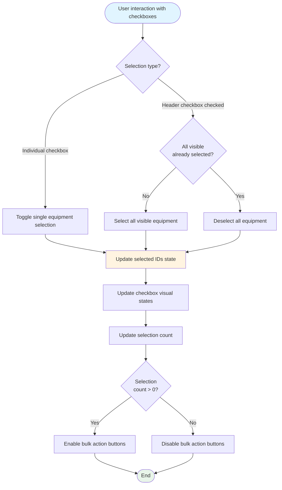
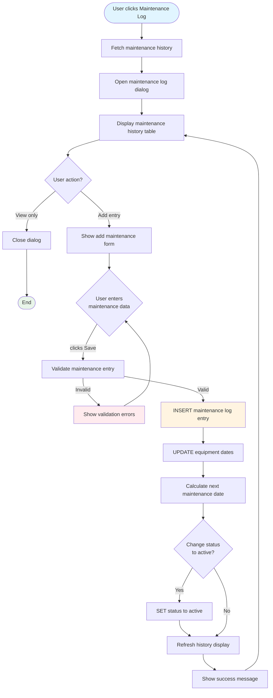
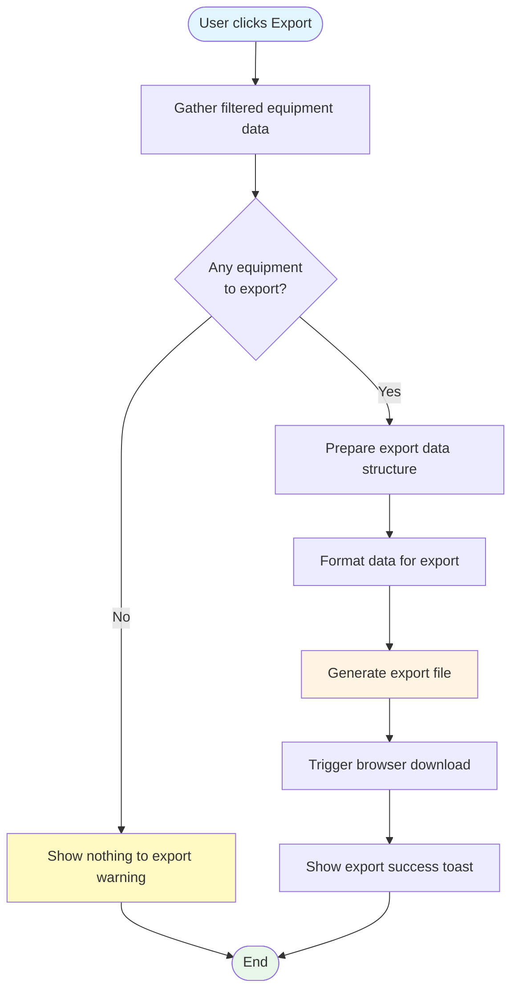
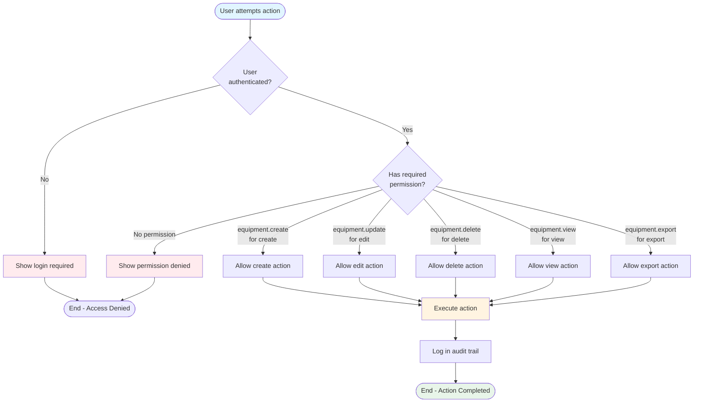
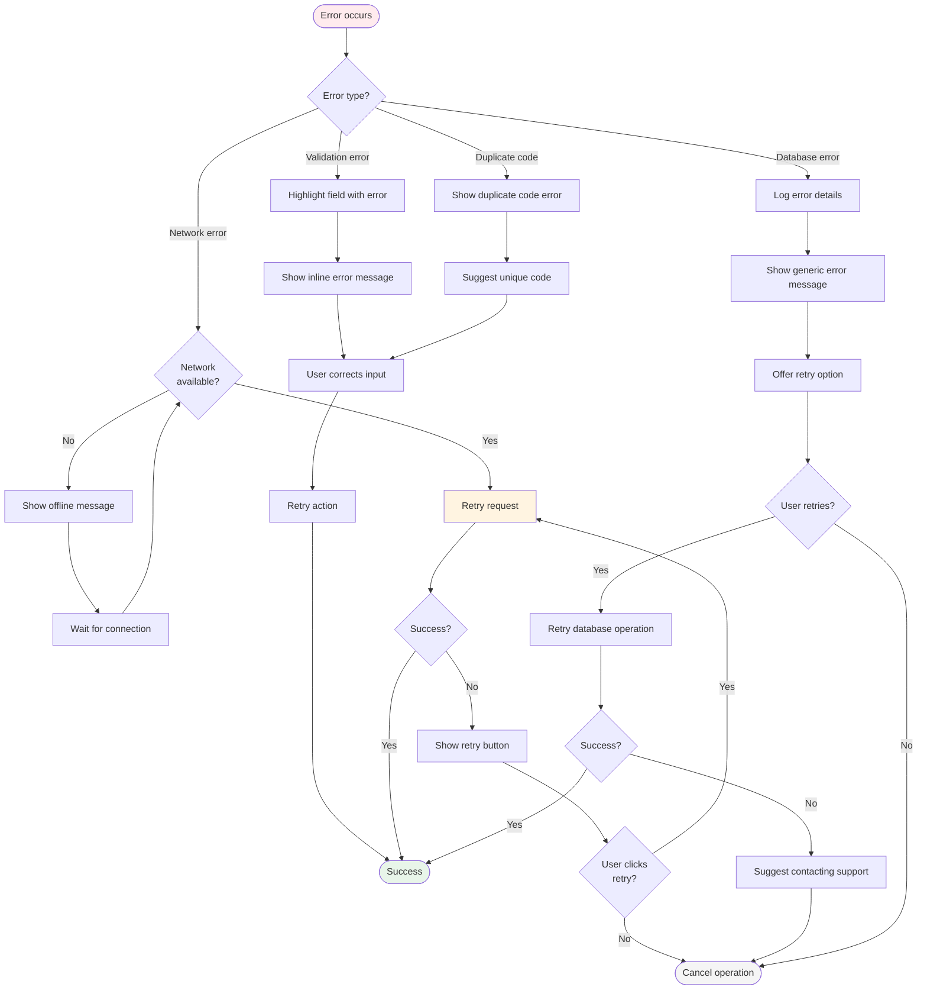

# Recipe Equipment - Flow Diagrams (FD)

## Document Information
- **Document Type**: Flow Diagrams Document
- **Module**: Operational Planning > Recipe Management > Equipment
- **Version**: 1.0.0
- **Last Updated**: 2025-01-16

## Document History

| Version | Date | Author | Changes |
|---------|------|--------|---------|
| 1.0.0 | 2025-01-16 | Development Team | Initial documentation based on actual implementation |

---

## 1. Create Equipment Workflow

---

## 2. Edit Equipment Workflow

---

## 3. Delete Equipment Workflow

---

## 4. Search and Filter Workflow

---

## 5. Equipment Status Lifecycle

---

## 6. Bulk Selection Workflow

---

## 7. Maintenance Log Workflow

---

## 8. Export Equipment Workflow

---

## 9. Permission-Based Action Flow

---

## 10. Error Recovery Flow

---

## Related Documents

- [BR-equipment.md](./BR-equipment.md) - Business Rules
- [UC-equipment.md](./UC-equipment.md) - Use Cases
- [DD-equipment.md](./DD-equipment.md) - Data Dictionary
- [TS-equipment.md](./TS-equipment.md) - Technical Specifications
- [VAL-equipment.md](./VAL-equipment.md) - Validation Rules
