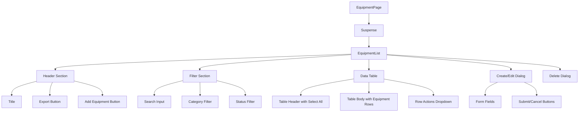

# Recipe Equipment - Technical Specifications (TS)

## Document Information
- **Document Type**: Technical Specifications Document
- **Module**: Operational Planning > Recipe Management > Equipment
- **Version**: 1.0.0
- **Last Updated**: 2025-01-16

## Document History

| Version | Date | Author | Changes |
|---------|------|--------|---------|
| 1.0.0 | 2025-01-16 | Development Team | Initial documentation based on actual implementation |

---

## 1. Overview

This document provides detailed technical specifications for the Equipment Management submodule, including component architecture, state management, API specifications, and implementation details.

---

## 2. Architecture

### 2.1 Component Structure

```
app/(main)/operational-planning/recipe-management/equipment/
  page.tsx                    # Main page with Suspense
  components/
    equipment-list.tsx        # Main list component
```

### 2.2 Component Hierarchy



---

## 3. Component Specifications

### 3.1 EquipmentPage Component

```typescript
// app/(main)/operational-planning/recipe-management/equipment/page.tsx

import { Suspense } from "react"
import { EquipmentList } from "./components/equipment-list"
import { Skeleton } from "@/components/ui/skeleton"

function EquipmentListSkeleton() {
  return (
    <div className="space-y-6">
      {/* Header Skeleton */}
      <div className="flex justify-between items-center">
        <Skeleton className="h-8 w-48" />
        <div className="flex gap-2">
          <Skeleton className="h-10 w-24" />
          <Skeleton className="h-10 w-32" />
        </div>
      </div>
      {/* Search Skeleton */}
      <div className="flex flex-col md:flex-row gap-4">
        <Skeleton className="h-10 w-full" />
      </div>
      {/* Table Skeleton */}
      <div className="border rounded-lg p-4">
        <div className="space-y-4">
          {Array.from({ length: 5 }).map((_, i) => (
            <div key={i} className="flex justify-between items-center">
              <Skeleton className="h-6 w-1/4" />
              <Skeleton className="h-6 w-1/6" />
              <Skeleton className="h-6 w-1/6" />
            </div>
          ))}
        </div>
      </div>
    </div>
  )
}

export default function EquipmentPage() {
  return (
    <div className="h-full flex flex-col gap-4 p-4 md:p-6">
      <Suspense fallback={<EquipmentListSkeleton />}>
        <EquipmentList />
      </Suspense>
    </div>
  )
}
```

### 3.2 EquipmentList Component State

```typescript
// Component state management
const [equipment] = useState<Equipment[]>(mockEquipment)
const [searchTerm, setSearchTerm] = useState("")
const [categoryFilter, setCategoryFilter] = useState<string>("all")
const [statusFilter, setStatusFilter] = useState<string>("all")
const [selectedEquipment, setSelectedEquipment] = useState<string[]>([])
const [isCreateDialogOpen, setIsCreateDialogOpen] = useState(false)
const [isEditDialogOpen, setIsEditDialogOpen] = useState(false)
const [isDeleteDialogOpen, setIsDeleteDialogOpen] = useState(false)
const [currentEquipment, setCurrentEquipment] = useState<Equipment | null>(null)
const [formData, setFormData] = useState<EquipmentFormData>(initialFormData)
```

### 3.3 Filter Implementation

```typescript
const filteredEquipment = useMemo(() => {
  return equipment.filter((item) => {
    const matchesSearch =
      item.name.toLowerCase().includes(searchTerm.toLowerCase()) ||
      item.code.toLowerCase().includes(searchTerm.toLowerCase()) ||
      (item.brand?.toLowerCase().includes(searchTerm.toLowerCase()) ?? false) ||
      (item.station?.toLowerCase().includes(searchTerm.toLowerCase()) ?? false)

    const matchesCategory = categoryFilter === "all" || item.category === categoryFilter
    const matchesStatus = statusFilter === "all" || item.status === statusFilter

    return matchesSearch && matchesCategory && matchesStatus
  })
}, [equipment, searchTerm, categoryFilter, statusFilter])
```

---

## 4. UI Components

### 4.1 Shadcn/UI Components Used

| Component | Purpose |
|-----------|---------|
| Button | Actions (Add, Export, Save, Cancel, Delete) |
| Input | Search and form fields |
| Table | Equipment list display |
| Badge | Status and category indicators |
| Checkbox | Selection and boolean fields |
| DropdownMenu | Row actions menu |
| Dialog | Create, Edit, Delete modals |
| Select | Category and status filters |
| Label | Form field labels |
| Textarea | Description field |

### 4.2 Lucide Icons Used

| Icon | Usage |
|------|-------|
| Wrench | Equipment page header |
| Plus | Add Equipment button |
| FileDown | Export button |
| Search | Search input |
| MoreVertical | Row actions trigger |
| Edit | Edit action |
| Trash2 | Delete action |
| Settings | Maintenance log action |
| CheckCircle2 | Active status badge |
| XCircle | Inactive status badge |
| AlertTriangle | Maintenance status badge |
| Archive | Retired status badge |

### 4.3 Status Badge Implementation

```typescript
function getStatusBadge(status: EquipmentStatus) {
  switch (status) {
    case "active":
      return (
        <Badge className="bg-green-100 text-green-800 hover:bg-green-100">
          <CheckCircle2 className="h-3 w-3 mr-1" />Active
        </Badge>
      )
    case "inactive":
      return (
        <Badge variant="secondary">
          <XCircle className="h-3 w-3 mr-1" />Inactive
        </Badge>
      )
    case "maintenance":
      return (
        <Badge className="bg-yellow-100 text-yellow-800 hover:bg-yellow-100">
          <AlertTriangle className="h-3 w-3 mr-1" />Maintenance
        </Badge>
      )
    case "retired":
      return (
        <Badge variant="outline">
          <Archive className="h-3 w-3 mr-1" />Retired
        </Badge>
      )
    default:
      return <Badge variant="secondary">{status}</Badge>
  }
}
```

---

## 5. Form Specifications

### 5.1 Form Data Structure

```typescript
interface EquipmentFormData {
  id: string
  code: string
  name: string
  description: string
  category: EquipmentCategory
  brand: string
  model: string
  capacity: string
  powerRating: string
  station: string
  status: EquipmentStatus
  isPortable: boolean
  availableQuantity: number
  totalQuantity: number
  maintenanceSchedule: string
  isActive: boolean
}

const initialFormData: EquipmentFormData = {
  id: "",
  code: "",
  name: "",
  description: "",
  category: "cooking",
  brand: "",
  model: "",
  capacity: "",
  powerRating: "",
  station: "",
  status: "active",
  isPortable: false,
  availableQuantity: 1,
  totalQuantity: 1,
  maintenanceSchedule: "",
  isActive: true,
}
```

### 5.2 Form Field Layout

| Row | Fields |
|-----|--------|
| 1 | Equipment Code, Name |
| 2 | Description (full width) |
| 3 | Category, Kitchen Station |
| 4 | Brand, Model |
| 5 | Capacity, Power Rating |
| 6 | Status, Total Quantity, Available |
| 7 | Maintenance Schedule |
| 8 | Is Portable, Active (checkboxes) |

---

## 6. Table Specifications

### 6.1 Table Columns

| Column | Field | Width | Sortable |
|--------|-------|-------|----------|
| Select | checkbox | 50px | No |
| Code | code | auto | Yes |
| Name | name, capacity | auto | Yes |
| Category | category | auto | Yes |
| Station | station | auto | Yes |
| Brand/Model | brand, model | auto | Yes |
| Qty | availableQuantity/totalQuantity | center | Yes |
| Status | status | auto | Yes |
| Actions | menu | 50px | No |

### 6.2 Row Actions

| Action | Icon | Description |
|--------|------|-------------|
| Edit | Edit | Open edit dialog |
| Maintenance Log | Settings | Open maintenance log |
| Delete | Trash2 | Open delete confirmation |

---

## 7. API Specifications

### 7.1 Server Actions (Future Implementation)

```typescript
// actions/equipment.ts

'use server'

import { revalidatePath } from 'next/cache'

export async function createEquipment(data: EquipmentFormData) {
  // Validate data
  // Check code uniqueness
  // Insert record
  // Revalidate path
  revalidatePath('/operational-planning/recipe-management/equipment')
  return { success: true, id: newId }
}

export async function updateEquipment(id: string, data: EquipmentFormData) {
  // Validate data
  // Check code uniqueness (excluding current)
  // Update record
  // Revalidate path
  revalidatePath('/operational-planning/recipe-management/equipment')
  return { success: true }
}

export async function deleteEquipment(id: string) {
  // Check references
  // Delete record
  // Revalidate path
  revalidatePath('/operational-planning/recipe-management/equipment')
  return { success: true }
}

export async function getEquipment(filters?: EquipmentFilters) {
  // Fetch from database
  // Apply filters
  // Return equipment list
  return equipment
}
```

### 7.2 Expected Response Formats

```typescript
// Success response
{
  success: true,
  data: Equipment | Equipment[],
  message?: string
}

// Error response
{
  success: false,
  error: string,
  code?: string,
  field?: string
}
```

---

## 8. Constants and Configuration

### 8.1 Equipment Categories

```typescript
const EQUIPMENT_CATEGORIES: { label: string; value: EquipmentCategory }[] = [
  { label: "Cooking", value: "cooking" },
  { label: "Preparation", value: "preparation" },
  { label: "Refrigeration", value: "refrigeration" },
  { label: "Storage", value: "storage" },
  { label: "Serving", value: "serving" },
  { label: "Cleaning", value: "cleaning" },
  { label: "Small Appliance", value: "small_appliance" },
  { label: "Utensil", value: "utensil" },
  { label: "Other", value: "other" },
]
```

### 8.2 Equipment Statuses

```typescript
const EQUIPMENT_STATUSES: { label: string; value: EquipmentStatus }[] = [
  { label: "Active", value: "active" },
  { label: "Inactive", value: "inactive" },
  { label: "Maintenance", value: "maintenance" },
  { label: "Retired", value: "retired" },
]
```

---

## 9. Styling Specifications

### 9.1 Status Badge Colors

| Status | Background | Text |
|--------|------------|------|
| active | green-100 | green-800 |
| inactive | secondary | secondary |
| maintenance | yellow-100 | yellow-800 |
| retired | outline | default |

### 9.2 Quantity Display

```typescript
// Highlight when available < total
<span className={cn(
  "font-medium",
  item.availableQuantity < item.totalQuantity && "text-yellow-600"
)}>
  {item.availableQuantity}
</span>
<span className="text-muted-foreground">/{item.totalQuantity}</span>
```

---

## 10. Performance Considerations

### 10.1 Optimization Techniques

| Technique | Implementation |
|-----------|----------------|
| Memoization | useMemo for filtered list |
| Suspense | Loading skeleton while data loads |
| Client-side filtering | No server round-trips for filter changes |
| Debounced search | 300ms debounce on search input |

### 10.2 Bundle Size Optimization

- Import only required Lucide icons
- Use Shadcn component tree-shaking
- Lazy load dialog content

---

## 11. Accessibility

### 11.1 Keyboard Navigation

| Key | Action |
|-----|--------|
| Tab | Navigate through interactive elements |
| Enter | Activate buttons and links |
| Space | Toggle checkboxes |
| Escape | Close dialogs |
| Arrow keys | Navigate dropdown menus |

### 11.2 Screen Reader Support

- Proper ARIA labels on buttons
- Table headers associated with cells
- Dialog titles and descriptions
- Status announcements for actions

---

## 12. Testing Specifications

### 12.1 Unit Tests

```typescript
describe('EquipmentList', () => {
  it('renders equipment list correctly')
  it('filters by search term')
  it('filters by category')
  it('filters by status')
  it('combines multiple filters')
  it('handles select all checkbox')
  it('handles individual selection')
  it('opens create dialog')
  it('opens edit dialog with data')
  it('opens delete confirmation')
})
```

### 12.2 Integration Tests

```typescript
describe('Equipment CRUD', () => {
  it('creates new equipment successfully')
  it('prevents duplicate codes')
  it('updates equipment successfully')
  it('deletes equipment with confirmation')
  it('handles network errors gracefully')
})
```

---

## Related Documents

- [BR-equipment.md](./BR-equipment.md) - Business Rules
- [UC-equipment.md](./UC-equipment.md) - Use Cases
- [DD-equipment.md](./DD-equipment.md) - Data Dictionary
- [FD-equipment.md](./FD-equipment.md) - Flow Diagrams
- [VAL-equipment.md](./VAL-equipment.md) - Validation Rules
