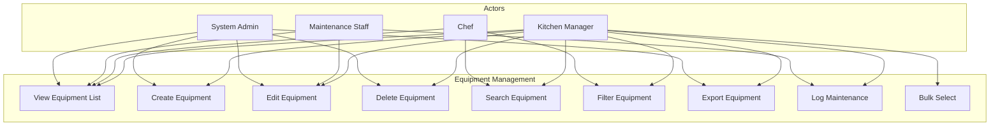

# Recipe Equipment - Use Cases (UC)

## Document Information
- **Document Type**: Use Cases Document
- **Module**: Operational Planning > Recipe Management > Equipment
- **Version**: 1.0.0
- **Last Updated**: 2025-01-16

## Document History

| Version | Date | Author | Changes |
|---------|------|--------|---------|
| 1.0.0 | 2025-01-16 | Development Team | Initial documentation based on actual implementation |

---

## 1. Overview

This document describes the use cases for the Equipment Management submodule within Recipe Management. Equipment represents kitchen tools and appliances used in recipe preparation.

### 1.1 Actors

| Actor | Description |
|-------|-------------|
| Kitchen Manager | Primary user responsible for equipment inventory |
| Chef | Uses equipment information for recipe planning |
| Maintenance Staff | Updates equipment maintenance status |
| System Administrator | Manages system configuration |

---

## 2. Use Case Diagram

---

## 3. Use Case Specifications

### 3.1 UC-EQ-001: View Equipment List

| Attribute | Description |
|-----------|-------------|
| **Use Case ID** | UC-EQ-001 |
| **Name** | View Equipment List |
| **Actor** | Kitchen Manager, Chef, Maintenance Staff |
| **Description** | View the list of all equipment with key information |
| **Preconditions** | User has equipment.view permission |
| **Trigger** | User navigates to Equipment page |

**Main Flow:**
1. System displays equipment list in table format
2. Table shows: Code, Name, Category, Station, Brand/Model, Quantity, Status
3. Results are paginated with item count displayed
4. User can sort by clicking column headers

**Alternative Flows:**
- A1: No equipment found - Display "No equipment found" message

**Postconditions:**
- Equipment list is displayed with current data

---

### 3.2 UC-EQ-002: Create Equipment

| Attribute | Description |
|-----------|-------------|
| **Use Case ID** | UC-EQ-002 |
| **Name** | Create Equipment |
| **Actor** | Kitchen Manager, System Administrator |
| **Description** | Add new equipment to the inventory |
| **Preconditions** | User has equipment.create permission |
| **Trigger** | User clicks "Add Equipment" button |

**Main Flow:**
1. User clicks "Add Equipment" button
2. System opens create dialog with blank form
3. User enters required fields:
   - Equipment Code (unique identifier)
   - Name (descriptive name)
   - Category (from dropdown)
   - Status (defaults to "active")
   - Total Quantity (defaults to 1)
   - Available Quantity (defaults to 1)
4. User enters optional fields:
   - Description
   - Brand and Model
   - Capacity and Power Rating
   - Kitchen Station
   - Maintenance Schedule
   - Is Portable checkbox
5. User clicks "Add Equipment" button
6. System validates all fields
7. System creates equipment record
8. System closes dialog and refreshes list
9. System displays success toast

**Alternative Flows:**
- A1: Duplicate code - Display "Equipment code already exists" error
- A2: Validation error - Highlight invalid fields with error messages
- A3: User cancels - Close dialog without saving

**Postconditions:**
- New equipment record is created
- Equipment list includes new item

---

### 3.3 UC-EQ-003: Edit Equipment

| Attribute | Description |
|-----------|-------------|
| **Use Case ID** | UC-EQ-003 |
| **Name** | Edit Equipment |
| **Actor** | Kitchen Manager, Maintenance Staff |
| **Description** | Modify existing equipment details |
| **Preconditions** | User has equipment.update permission |
| **Trigger** | User clicks Edit from equipment row menu |

**Main Flow:**
1. User clicks the actions menu (three dots) on equipment row
2. User selects "Edit" option
3. System opens edit dialog with current values pre-filled
4. User modifies desired fields
5. User clicks "Save Changes" button
6. System validates all fields
7. System updates equipment record
8. System closes dialog and refreshes list
9. System displays success toast

**Alternative Flows:**
- A1: No changes made - Inform user no changes detected
- A2: Code changed to duplicate - Display error message
- A3: Status changed with dependencies - Show warning about affected recipes

**Postconditions:**
- Equipment record is updated
- Changes are reflected in the list

---

### 3.4 UC-EQ-004: Delete Equipment

| Attribute | Description |
|-----------|-------------|
| **Use Case ID** | UC-EQ-004 |
| **Name** | Delete Equipment |
| **Actor** | Kitchen Manager, System Administrator |
| **Description** | Remove equipment from inventory |
| **Preconditions** | User has equipment.delete permission |
| **Trigger** | User clicks Delete from equipment row menu |

**Main Flow:**
1. User clicks the actions menu on equipment row
2. User selects "Delete" option
3. System opens confirmation dialog
4. Dialog shows equipment name and deletion warning
5. User clicks "Delete" button to confirm
6. System deletes equipment record
7. System closes dialog and refreshes list
8. System displays success toast

**Alternative Flows:**
- A1: User cancels - Close dialog without deleting
- A2: Equipment used in recipes - Show warning about recipe references

**Postconditions:**
- Equipment record is deleted
- Equipment no longer appears in list

---

### 3.5 UC-EQ-005: Search Equipment

| Attribute | Description |
|-----------|-------------|
| **Use Case ID** | UC-EQ-005 |
| **Name** | Search Equipment |
| **Actor** | All users with view permission |
| **Description** | Find equipment by text search |
| **Preconditions** | User is on Equipment page |
| **Trigger** | User types in search box |

**Main Flow:**
1. User enters search text in search box
2. System debounces input (300ms)
3. System filters equipment matching:
   - Name (contains)
   - Code (contains)
   - Brand (contains)
   - Station (contains)
4. System updates displayed list
5. System shows result count

**Alternative Flows:**
- A1: No matches found - Display "No equipment found matching your criteria"

**Postconditions:**
- List shows only matching equipment
- Search term remains in search box

---

### 3.6 UC-EQ-006: Filter Equipment

| Attribute | Description |
|-----------|-------------|
| **Use Case ID** | UC-EQ-006 |
| **Name** | Filter Equipment |
| **Actor** | All users with view permission |
| **Description** | Filter equipment by category or status |
| **Preconditions** | User is on Equipment page |
| **Trigger** | User selects filter value |

**Main Flow:**
1. User selects category from dropdown:
   - All Categories (default)
   - Cooking, Preparation, Refrigeration, Storage, Serving, Cleaning, Small Appliance, Utensil, Other
2. User selects status from dropdown:
   - All Status (default)
   - Active, Inactive, Maintenance, Retired
3. System applies combined filters with any active search
4. System updates displayed list
5. System shows filtered result count

**Postconditions:**
- List shows filtered equipment
- Filter selections are visible

---

### 3.7 UC-EQ-007: Export Equipment

| Attribute | Description |
|-----------|-------------|
| **Use Case ID** | UC-EQ-007 |
| **Name** | Export Equipment |
| **Actor** | Kitchen Manager, System Administrator |
| **Description** | Export equipment list to file |
| **Preconditions** | User has equipment.export permission |
| **Trigger** | User clicks "Export" button |

**Main Flow:**
1. User clicks "Export" button
2. System generates export file with current filtered data
3. System downloads file to user's device
4. System displays success message

**Postconditions:**
- Export file is downloaded
- File contains equipment data

---

### 3.8 UC-EQ-008: Log Maintenance

| Attribute | Description |
|-----------|-------------|
| **Use Case ID** | UC-EQ-008 |
| **Name** | Log Maintenance |
| **Actor** | Kitchen Manager, Maintenance Staff |
| **Description** | Record maintenance activity for equipment |
| **Preconditions** | User has equipment.update permission |
| **Trigger** | User clicks "Maintenance Log" from row menu |

**Main Flow:**
1. User clicks the actions menu on equipment row
2. User selects "Maintenance Log" option
3. System opens maintenance log view/dialog
4. User can view maintenance history
5. User can add new maintenance entry
6. System updates last maintenance date
7. System calculates next maintenance date based on schedule

**Postconditions:**
- Maintenance record is logged
- Equipment dates are updated

---

### 3.9 UC-EQ-009: Bulk Select Equipment

| Attribute | Description |
|-----------|-------------|
| **Use Case ID** | UC-EQ-009 |
| **Name** | Bulk Select Equipment |
| **Actor** | Kitchen Manager |
| **Description** | Select multiple equipment items for bulk actions |
| **Preconditions** | User is on Equipment page |
| **Trigger** | User clicks checkboxes |

**Main Flow:**
1. User clicks checkbox on individual equipment rows
2. OR User clicks header checkbox to select all visible
3. System tracks selected equipment IDs
4. User can perform bulk actions on selection (future enhancement)

**Alternative Flows:**
- A1: Uncheck header - Deselect all equipment
- A2: Filter changes - Selection persists for matching items

**Postconditions:**
- Selected equipment IDs are tracked
- Visual indication shows selected rows

---

## 4. Non-Functional Requirements

### 4.1 Performance

| Requirement | Target |
|-------------|--------|
| List load time | Under 2 seconds |
| Search response | Under 500ms (after debounce) |
| Filter application | Immediate (client-side) |
| Create/Edit save | Under 3 seconds |

### 4.2 Usability

| Requirement | Description |
|-------------|-------------|
| Responsive Design | Works on desktop and tablet |
| Keyboard Navigation | Tab through form fields |
| Clear Feedback | Toast messages for all actions |
| Error Handling | Inline validation messages |

---

## Related Documents

- [BR-equipment.md](./BR-equipment.md) - Business Rules
- [DD-equipment.md](./DD-equipment.md) - Data Dictionary
- [FD-equipment.md](./FD-equipment.md) - Flow Diagrams
- [TS-equipment.md](./TS-equipment.md) - Technical Specifications
- [VAL-equipment.md](./VAL-equipment.md) - Validation Rules
