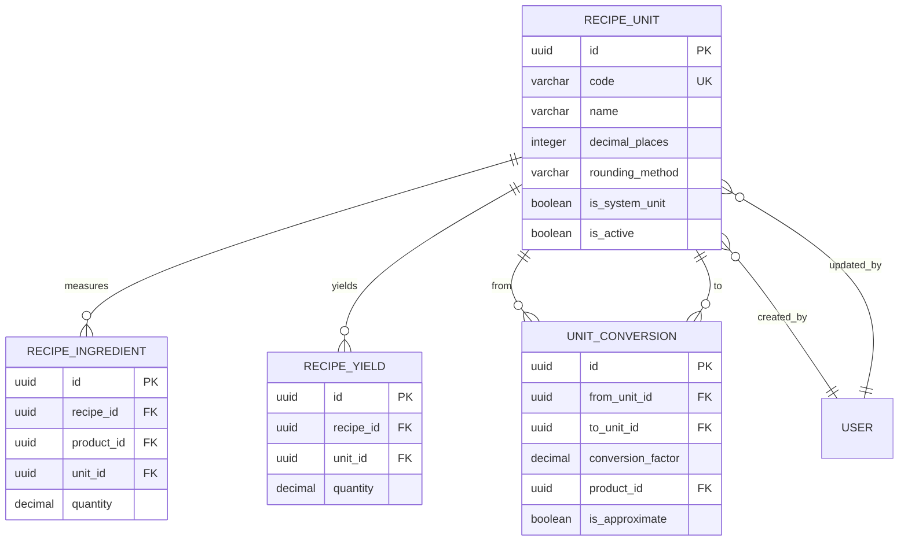

# Recipe Units - Data Dictionary (DD)

## Document Information
- **Document Type**: Data Dictionary Document
- **Module**: Operational Planning > Recipe Management > Units
- **Version**: 1.0.0
- **Last Updated**: 2025-01-16

## Document History

| Version | Date | Author | Changes |
|---------|------|--------|---------|
| 1.0.0 | 2025-01-16 | Development Team | Initial documentation based on actual implementation |

---

## 1. Overview

This document provides the complete data dictionary for the Recipe Units submodule, including database schema, TypeScript interfaces, and related unit conversion definitions.

---

## 2. Database Schema

### 2.1 Recipe Units Table

```sql
CREATE TABLE recipe_units (
    -- Primary Key
    id UUID PRIMARY KEY DEFAULT gen_random_uuid(),

    -- Identification
    code VARCHAR(20) NOT NULL UNIQUE,
    name VARCHAR(100) NOT NULL,
    plural_name VARCHAR(100),

    -- Display
    display_order INTEGER NOT NULL DEFAULT 0,
    show_in_dropdown BOOLEAN NOT NULL DEFAULT TRUE,

    -- Precision
    decimal_places INTEGER NOT NULL DEFAULT 2,
    rounding_method VARCHAR(10) NOT NULL DEFAULT 'round',

    -- Status
    is_active BOOLEAN NOT NULL DEFAULT TRUE,
    is_system_unit BOOLEAN NOT NULL DEFAULT FALSE,

    -- User guidance
    example VARCHAR(200),
    notes TEXT,

    -- Audit
    created_at TIMESTAMP WITH TIME ZONE DEFAULT NOW(),
    updated_at TIMESTAMP WITH TIME ZONE DEFAULT NOW(),
    created_by UUID REFERENCES users(id),
    updated_by UUID REFERENCES users(id),

    -- Constraints
    CONSTRAINT recipe_units_decimal_places_check CHECK (decimal_places >= 0 AND decimal_places <= 6),
    CONSTRAINT recipe_units_rounding_method_check CHECK (rounding_method IN ('round', 'floor', 'ceil'))
);

-- Indexes
CREATE INDEX idx_recipe_units_code ON recipe_units(code);
CREATE INDEX idx_recipe_units_name ON recipe_units(name);
CREATE INDEX idx_recipe_units_is_active ON recipe_units(is_active);
CREATE INDEX idx_recipe_units_is_system_unit ON recipe_units(is_system_unit);
CREATE INDEX idx_recipe_units_display_order ON recipe_units(display_order);
```

### 2.2 Unit Conversions Table

```sql
CREATE TABLE unit_conversions (
    -- Primary Key
    id UUID PRIMARY KEY DEFAULT gen_random_uuid(),

    -- Conversion relationship
    from_unit_id UUID NOT NULL REFERENCES recipe_units(id),
    from_unit_code VARCHAR(20) NOT NULL,
    to_unit_id UUID NOT NULL REFERENCES recipe_units(id),
    to_unit_code VARCHAR(20) NOT NULL,
    conversion_factor DECIMAL(15, 6) NOT NULL,

    -- Context-specific conversions
    product_id UUID REFERENCES products(id),
    category_id UUID REFERENCES categories(id),

    -- Metadata
    is_approximate BOOLEAN NOT NULL DEFAULT FALSE,
    notes TEXT,
    is_active BOOLEAN NOT NULL DEFAULT TRUE,

    -- Audit
    created_at TIMESTAMP WITH TIME ZONE DEFAULT NOW(),
    updated_at TIMESTAMP WITH TIME ZONE DEFAULT NOW(),

    -- Constraints
    CONSTRAINT unit_conversions_positive_factor CHECK (conversion_factor > 0),
    CONSTRAINT unit_conversions_unique UNIQUE (from_unit_id, to_unit_id, product_id, category_id)
);

-- Indexes
CREATE INDEX idx_unit_conversions_from_unit ON unit_conversions(from_unit_id);
CREATE INDEX idx_unit_conversions_to_unit ON unit_conversions(to_unit_id);
CREATE INDEX idx_unit_conversions_product ON unit_conversions(product_id);
```

---

## 3. TypeScript Interfaces

### 3.1 RecipeUnit Interface

```typescript
/**
 * Recipe unit of measure for ingredients and yields
 * Source: lib/types/recipe.ts
 */
export interface RecipeUnit {
  id: string;
  code: string;                    // e.g., "kg", "ml", "pcs", "tbsp"
  name: string;                    // e.g., "Kilogram", "Milliliter", "Pieces", "Tablespoon"
  pluralName?: string;             // e.g., "Kilograms", "Milliliters"

  // Display
  displayOrder: number;
  showInDropdown: boolean;

  // Precision
  decimalPlaces: number;           // How many decimal places to display
  roundingMethod: 'round' | 'floor' | 'ceil';

  // Status
  isActive: boolean;
  isSystemUnit: boolean;           // System-defined vs user-created

  // Examples for user guidance
  example?: string;                // e.g., "1 tbsp = 15ml"
  notes?: string;

  // Audit
  createdAt?: Date;
  updatedAt?: Date;
  createdBy?: string;
  updatedBy?: string;
}
```

### 3.2 UnitConversion Interface

```typescript
/**
 * Unit conversion definition
 * Source: lib/types/recipe.ts
 */
export interface UnitConversion {
  id: string;
  fromUnitId: string;
  fromUnitCode: string;
  toUnitId: string;
  toUnitCode: string;
  conversionFactor: number;        // fromUnit * factor = toUnit

  // Context-specific conversions
  productId?: string;              // For product-specific conversions (e.g., 1 egg = 50g)
  categoryId?: string;             // For category-specific conversions

  isApproximate: boolean;          // Whether conversion is approximate
  notes?: string;
  isActive: boolean;
}
```

### 3.3 RecipeUnitFormData Interface

```typescript
/**
 * Form data for unit create/edit
 * Source: app/(main)/operational-planning/recipe-management/units/components/recipe-unit-list.tsx
 */
interface RecipeUnitFormData {
  id: string;
  code: string;
  name: string;
  pluralName: string;
  displayOrder: number;
  showInDropdown: boolean;
  decimalPlaces: number;
  roundingMethod: 'round' | 'floor' | 'ceil';
  isActive: boolean;
  isSystemUnit: boolean;
  example: string;
  notes: string;
}
```

---

## 4. Field Definitions

### 4.1 Core Fields

| Field | Type | Required | Description |
|-------|------|----------|-------------|
| id | UUID | Yes | Unique identifier (auto-generated) |
| code | string | Yes | Unique abbreviation (e.g., "kg", "ml") |
| name | string | Yes | Full name (e.g., "Kilogram") |
| pluralName | string | No | Plural form (e.g., "Kilograms") |

### 4.2 Display Fields

| Field | Type | Required | Default | Description |
|-------|------|----------|---------|-------------|
| displayOrder | number | Yes | 0 | Order in lists and dropdowns |
| showInDropdown | boolean | Yes | true | Show in recipe form dropdowns |

### 4.3 Precision Fields

| Field | Type | Required | Default | Description |
|-------|------|----------|---------|-------------|
| decimalPlaces | number | Yes | 2 | Decimal precision (0-6) |
| roundingMethod | enum | Yes | 'round' | Rounding: round, floor, ceil |

### 4.4 Status Fields

| Field | Type | Required | Default | Description |
|-------|------|----------|---------|-------------|
| isActive | boolean | Yes | true | Active/inactive status |
| isSystemUnit | boolean | Yes | false | Protected system unit flag |

### 4.5 Guidance Fields

| Field | Type | Required | Description |
|-------|------|----------|-------------|
| example | string | No | Usage example (e.g., "1 tbsp = 15ml") |
| notes | string | No | Additional notes about the unit |

### 4.6 Audit Fields

| Field | Type | Required | Description |
|-------|------|----------|-------------|
| createdAt | Date | No | Record creation timestamp |
| updatedAt | Date | No | Last update timestamp |
| createdBy | UUID | No | User who created record |
| updatedBy | UUID | No | User who last updated |

---

## 5. Enum Values

### 5.1 Rounding Method Values

| Value | Description | Example (2.567 to 2 places) |
|-------|-------------|----------------------------|
| round | Standard mathematical rounding | 2.57 |
| floor | Always round down | 2.56 |
| ceil | Always round up | 2.57 |

---

## 6. Relationships

### 6.1 Entity Relationships



---

## 7. Sample Data

### 7.1 System Units Examples

```json
[
  {
    "id": "unit-001",
    "code": "kg",
    "name": "Kilogram",
    "pluralName": "Kilograms",
    "displayOrder": 1,
    "showInDropdown": true,
    "decimalPlaces": 3,
    "roundingMethod": "round",
    "isActive": true,
    "isSystemUnit": true,
    "example": "1 kg = 1000 g"
  },
  {
    "id": "unit-002",
    "code": "g",
    "name": "Gram",
    "pluralName": "Grams",
    "displayOrder": 2,
    "showInDropdown": true,
    "decimalPlaces": 1,
    "roundingMethod": "round",
    "isActive": true,
    "isSystemUnit": true,
    "example": "1000 g = 1 kg"
  },
  {
    "id": "unit-003",
    "code": "ml",
    "name": "Milliliter",
    "pluralName": "Milliliters",
    "displayOrder": 10,
    "showInDropdown": true,
    "decimalPlaces": 0,
    "roundingMethod": "round",
    "isActive": true,
    "isSystemUnit": true,
    "example": "1000 ml = 1 liter"
  },
  {
    "id": "unit-004",
    "code": "pcs",
    "name": "Piece",
    "pluralName": "Pieces",
    "displayOrder": 20,
    "showInDropdown": true,
    "decimalPlaces": 0,
    "roundingMethod": "ceil",
    "isActive": true,
    "isSystemUnit": true,
    "example": "Individual items"
  },
  {
    "id": "unit-005",
    "code": "tbsp",
    "name": "Tablespoon",
    "pluralName": "Tablespoons",
    "displayOrder": 30,
    "showInDropdown": true,
    "decimalPlaces": 1,
    "roundingMethod": "round",
    "isActive": true,
    "isSystemUnit": true,
    "example": "1 tbsp = 15 ml"
  }
]
```

### 7.2 Custom Units Examples

```json
[
  {
    "id": "unit-custom-001",
    "code": "portion",
    "name": "Portion",
    "pluralName": "Portions",
    "displayOrder": 100,
    "showInDropdown": true,
    "decimalPlaces": 0,
    "roundingMethod": "ceil",
    "isActive": true,
    "isSystemUnit": false,
    "example": "Standard serving size",
    "notes": "Use for plated dishes"
  },
  {
    "id": "unit-custom-002",
    "code": "bunch",
    "name": "Bunch",
    "pluralName": "Bunches",
    "displayOrder": 101,
    "showInDropdown": true,
    "decimalPlaces": 0,
    "roundingMethod": "ceil",
    "isActive": true,
    "isSystemUnit": false,
    "example": "Bunch of herbs or vegetables"
  }
]
```

### 7.3 Unit Conversion Examples

```json
[
  {
    "id": "conv-001",
    "fromUnitId": "unit-001",
    "fromUnitCode": "kg",
    "toUnitId": "unit-002",
    "toUnitCode": "g",
    "conversionFactor": 1000,
    "isApproximate": false,
    "isActive": true
  },
  {
    "id": "conv-002",
    "fromUnitId": "unit-005",
    "fromUnitCode": "tbsp",
    "toUnitId": "unit-003",
    "toUnitCode": "ml",
    "conversionFactor": 15,
    "isApproximate": false,
    "isActive": true
  },
  {
    "id": "conv-003",
    "fromUnitId": "unit-004",
    "fromUnitCode": "pcs",
    "toUnitId": "unit-002",
    "toUnitCode": "g",
    "conversionFactor": 50,
    "productId": "product-egg",
    "isApproximate": true,
    "notes": "Average large egg weight",
    "isActive": true
  }
]
```

---

## Related Documents

- [BR-units.md](./BR-units.md) - Business Rules
- [UC-units.md](./UC-units.md) - Use Cases
- [FD-units.md](./FD-units.md) - Flow Diagrams
- [TS-units.md](./TS-units.md) - Technical Specifications
- [VAL-units.md](./VAL-units.md) - Validation Rules
