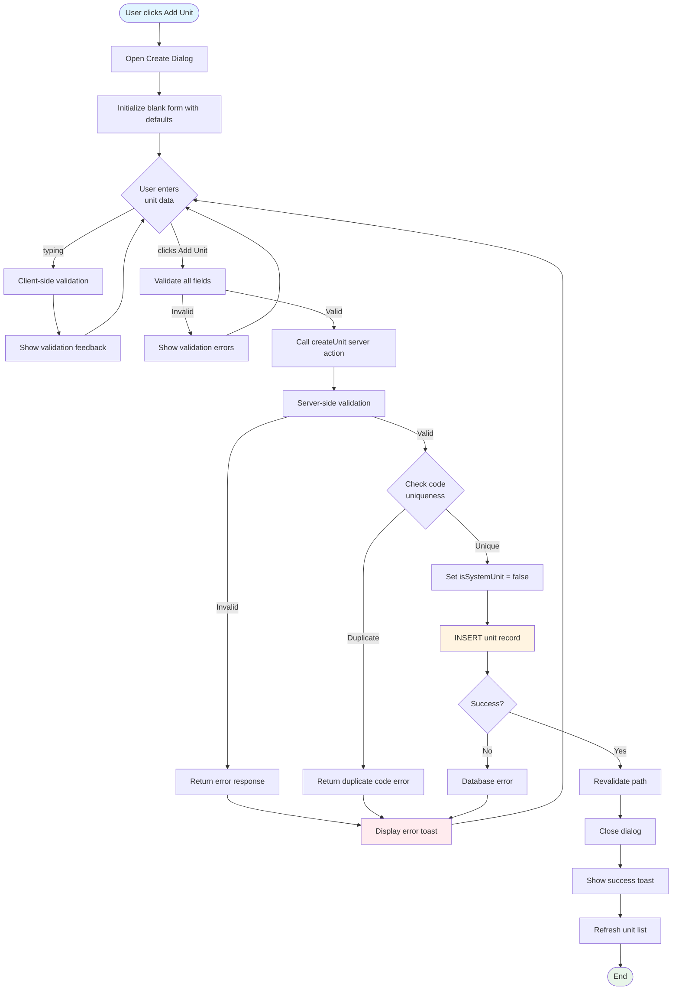
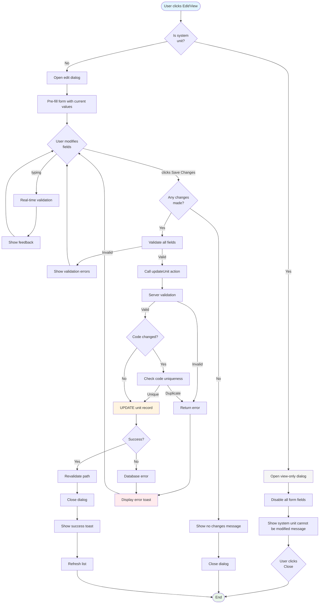
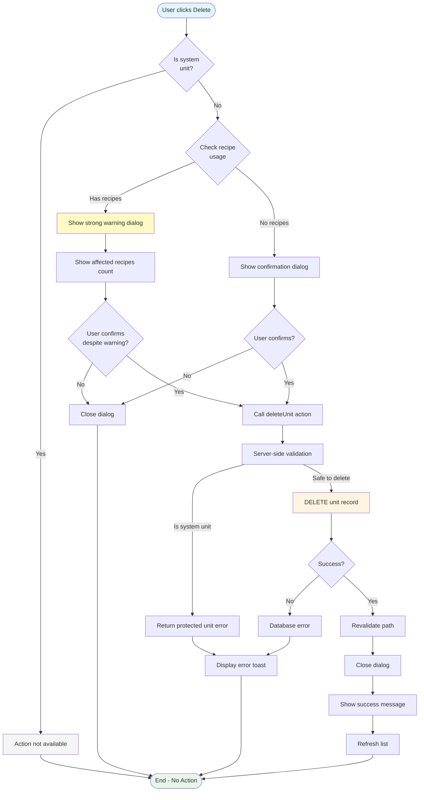
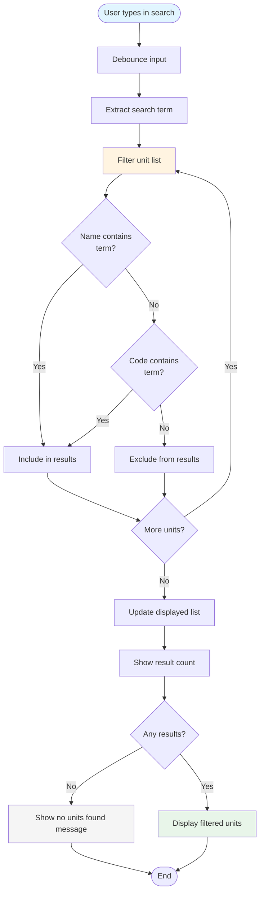
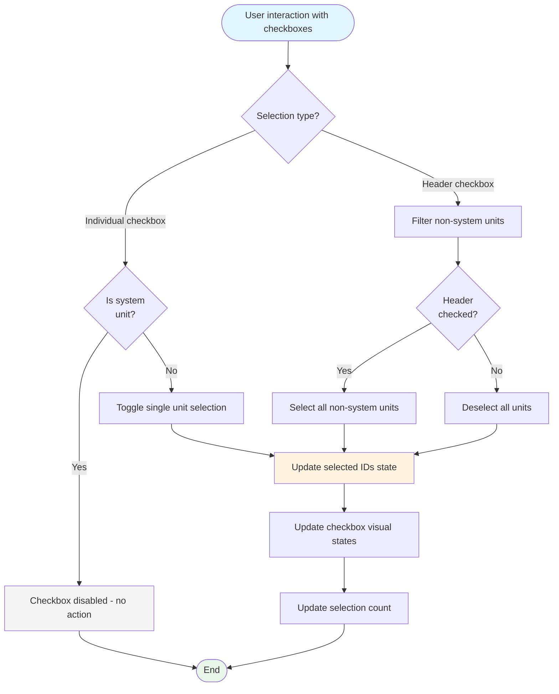
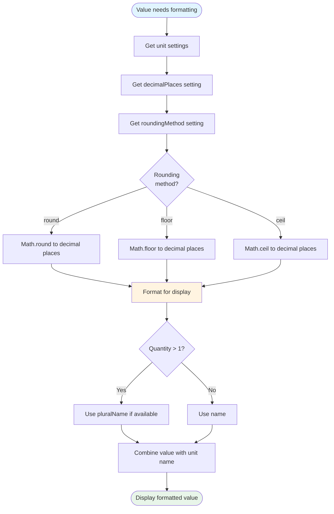
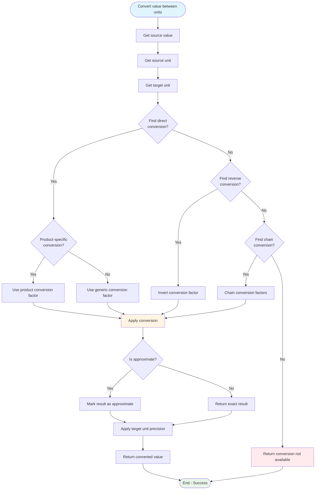
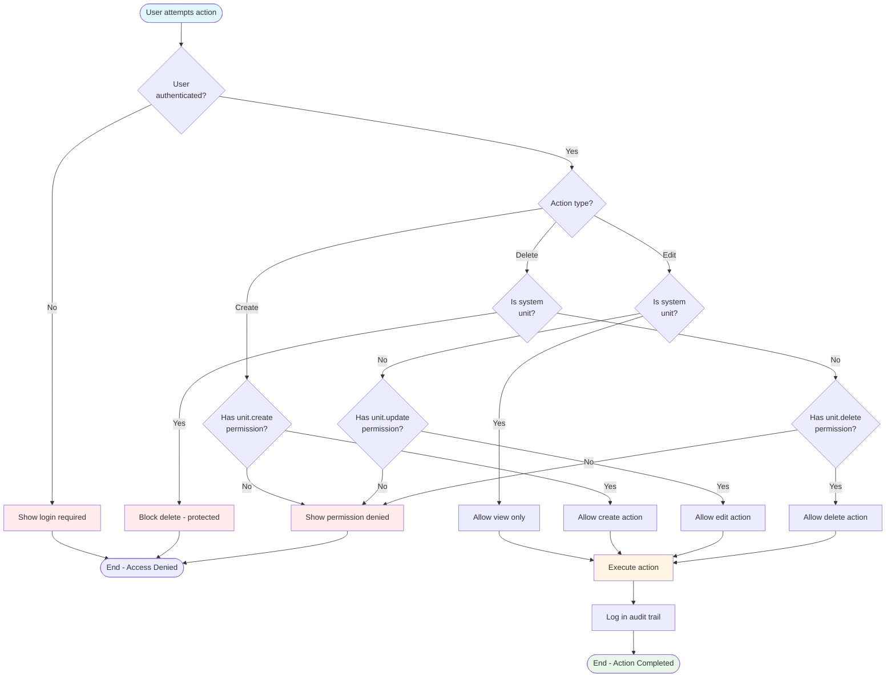
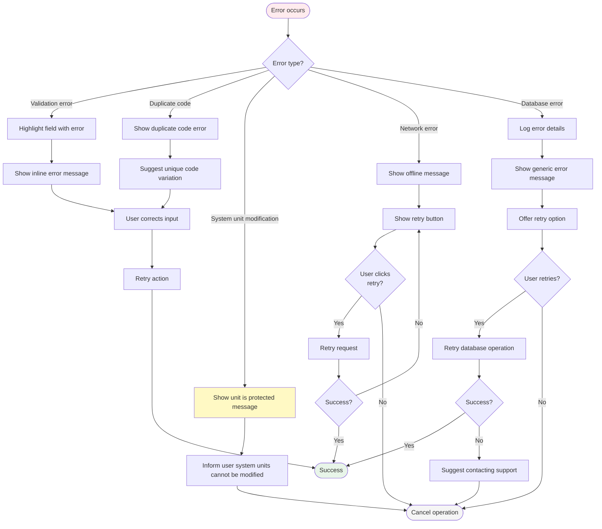

# Recipe Units - Flow Diagrams (FD)

## Document Information
- **Document Type**: Flow Diagrams Document
- **Module**: Operational Planning > Recipe Management > Units
- **Version**: 1.0.0
- **Last Updated**: 2025-01-16

## Document History

| Version | Date | Author | Changes |
|---------|------|--------|---------|
| 1.0.0 | 2025-01-16 | Development Team | Initial documentation based on actual implementation |

---

## 1. Create Custom Unit Workflow

---

## 2. Edit Unit Workflow

---

## 3. Delete Unit Workflow

---

## 4. Search Workflow

---

## 5. Bulk Selection Workflow

---

## 6. Unit Precision Application Flow

---

## 7. Unit Conversion Flow

---

## 8. Permission-Based Action Flow

---

## 9. Error Recovery Flow

---

## Related Documents

- [BR-units.md](./BR-units.md) - Business Rules
- [UC-units.md](./UC-units.md) - Use Cases
- [DD-units.md](./DD-units.md) - Data Dictionary
- [TS-units.md](./TS-units.md) - Technical Specifications
- [VAL-units.md](./VAL-units.md) - Validation Rules
