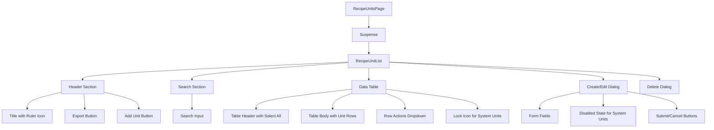

# Recipe Units - Technical Specifications (TS)

## Document Information
- **Document Type**: Technical Specifications Document
- **Module**: Operational Planning > Recipe Management > Units
- **Version**: 1.0.0
- **Last Updated**: 2025-01-16

## Document History

| Version | Date | Author | Changes |
|---------|------|--------|---------|
| 1.0.0 | 2025-01-16 | Development Team | Initial documentation based on actual implementation |

---

## 1. Overview

This document provides detailed technical specifications for the Recipe Units submodule, including component architecture, state management, and implementation details.

---

## 2. Architecture

### 2.1 Component Structure

```
app/(main)/operational-planning/recipe-management/units/
  page.tsx                       # Main page with Suspense
  components/
    recipe-unit-list.tsx         # Main list component
```

### 2.2 Component Hierarchy



---

## 3. Component Specifications

### 3.1 RecipeUnitsPage Component

```typescript
// app/(main)/operational-planning/recipe-management/units/page.tsx

import { Suspense } from "react"
import { RecipeUnitList } from "./components/recipe-unit-list"
import { Skeleton } from "@/components/ui/skeleton"

function RecipeUnitListSkeleton() {
  return (
    <div className="space-y-6">
      {/* Header Skeleton */}
      <div className="flex justify-between items-center">
        <Skeleton className="h-8 w-48" />
        <div className="flex gap-2">
          <Skeleton className="h-10 w-24" />
          <Skeleton className="h-10 w-32" />
        </div>
      </div>
      {/* Search Skeleton */}
      <div className="flex flex-col md:flex-row gap-4">
        <Skeleton className="h-10 w-full" />
      </div>
      {/* Table Skeleton */}
      <div className="border rounded-lg p-4">
        <div className="space-y-4">
          {Array.from({ length: 5 }).map((_, i) => (
            <div key={i} className="flex justify-between items-center">
              <Skeleton className="h-6 w-1/4" />
              <Skeleton className="h-6 w-1/6" />
              <Skeleton className="h-6 w-1/6" />
            </div>
          ))}
        </div>
      </div>
    </div>
  )
}

export default function RecipeUnitsPage() {
  return (
    <div className="h-full flex flex-col gap-4 p-4 md:p-6">
      <Suspense fallback={<RecipeUnitListSkeleton />}>
        <RecipeUnitList />
      </Suspense>
    </div>
  )
}
```

### 3.2 RecipeUnitList Component State

```typescript
// Component state management
const [units] = useState<RecipeUnit[]>(mockRecipeUnits)
const [searchTerm, setSearchTerm] = useState("")
const [selectedUnits, setSelectedUnits] = useState<string[]>([])
const [isCreateDialogOpen, setIsCreateDialogOpen] = useState(false)
const [isEditDialogOpen, setIsEditDialogOpen] = useState(false)
const [isDeleteDialogOpen, setIsDeleteDialogOpen] = useState(false)
const [currentUnit, setCurrentUnit] = useState<RecipeUnit | null>(null)
const [formData, setFormData] = useState<RecipeUnitFormData>(initialFormData)
```

### 3.3 Filter Implementation

```typescript
const filteredUnits = useMemo(() => {
  return units.filter((unit) => {
    const matchesSearch =
      unit.name.toLowerCase().includes(searchTerm.toLowerCase()) ||
      unit.code.toLowerCase().includes(searchTerm.toLowerCase())

    return matchesSearch
  })
}, [units, searchTerm])
```

### 3.4 System Unit Protection

```typescript
// Select all excludes system units
const handleSelectAll = (checked: boolean) => {
  if (checked) {
    setSelectedUnits(filteredUnits.filter(u => !u.isSystemUnit).map((unit) => unit.id))
  } else {
    setSelectedUnits([])
  }
}

// Checkbox disabled for system units
<Checkbox
  checked={selectedUnits.includes(unit.id)}
  onCheckedChange={(checked) => handleSelect(unit.id, checked as boolean)}
  disabled={unit.isSystemUnit}
/>

// Delete blocked for system units
const handleDelete = (unit: RecipeUnit) => {
  if (unit.isSystemUnit) return
  setCurrentUnit(unit)
  setIsDeleteDialogOpen(true)
}
```

---

## 4. UI Components

### 4.1 Shadcn/UI Components Used

| Component | Purpose |
|-----------|---------|
| Button | Actions (Add, Export, Save, Cancel, Delete) |
| Input | Search and form fields |
| Table | Unit list display |
| Badge | Status indicators |
| Checkbox | Selection and boolean fields |
| DropdownMenu | Row actions menu |
| Dialog | Create, Edit, Delete modals |
| Select | Rounding method dropdown |
| Label | Form field labels |
| Textarea | Notes field |

### 4.2 Lucide Icons Used

| Icon | Usage |
|------|-------|
| Ruler | Unit page header |
| Plus | Add Unit button |
| FileDown | Export button |
| Search | Search input |
| MoreVertical | Row actions trigger |
| Edit | Edit/View action |
| Trash2 | Delete action |
| CheckCircle2 | Active status badge |
| XCircle | Inactive status badge |
| Lock | System unit indicator |

### 4.3 Status Badge Implementation

```typescript
// Status display with system unit indicator
<div className="flex items-center gap-2">
  {unit.isActive ? (
    <Badge className="bg-green-100 text-green-800 hover:bg-green-100">
      <CheckCircle2 className="h-3 w-3 mr-1" />
      Active
    </Badge>
  ) : (
    <Badge variant="secondary">
      <XCircle className="h-3 w-3 mr-1" />
      Inactive
    </Badge>
  )}
  {unit.isSystemUnit && (
    <span title="System unit">
      <Lock className="h-3 w-3 text-muted-foreground" />
    </span>
  )}
</div>
```

---

## 5. Form Specifications

### 5.1 Form Data Structure

```typescript
interface RecipeUnitFormData {
  id: string
  code: string
  name: string
  pluralName: string
  displayOrder: number
  showInDropdown: boolean
  decimalPlaces: number
  roundingMethod: 'round' | 'floor' | 'ceil'
  isActive: boolean
  isSystemUnit: boolean
  example: string
  notes: string
}

const initialFormData: RecipeUnitFormData = {
  id: "",
  code: "",
  name: "",
  pluralName: "",
  displayOrder: 0,
  showInDropdown: true,
  decimalPlaces: 2,
  roundingMethod: "round",
  isActive: true,
  isSystemUnit: false,
  example: "",
  notes: "",
}
```

### 5.2 Form Field Layout

| Row | Fields |
|-----|--------|
| 1 | Code, Name |
| 2 | Plural Name, Display Order |
| 3 | Decimal Places, Rounding Method |
| 4 | Example (full width) |
| 5 | Notes (full width, textarea) |
| 6 | Show in Dropdown, Active (checkboxes) |

### 5.3 System Unit Form Behavior

```typescript
// All fields disabled for system units
<Input
  id="code"
  value={formData.code}
  onChange={(e) => setFormData({ ...formData, code: e.target.value })}
  placeholder="e.g., kg, ml, pcs"
  disabled={currentUnit?.isSystemUnit}
/>

// Dialog description changes for system units
<DialogDescription>
  {isEditDialogOpen
    ? currentUnit?.isSystemUnit
      ? "System units cannot be modified."
      : "Update the unit details below."
    : "Fill in the details to add a new unit of measure."}
</DialogDescription>

// Only show save button for non-system units
{!currentUnit?.isSystemUnit && (
  <Button onClick={handleSave}>
    {isEditDialogOpen ? "Save Changes" : "Add Unit"}
  </Button>
)}
```

---

## 6. Table Specifications

### 6.1 Table Columns

| Column | Field | Width | Sortable |
|--------|-------|-------|----------|
| Select | checkbox | 50px | No |
| Code | code | auto | Yes |
| Name | name, pluralName | auto | Yes |
| Status | isActive, isSystemUnit | auto | Yes |
| Actions | menu | 50px | No |

### 6.2 Row Actions

| Action | Icon | Condition | Description |
|--------|------|-----------|-------------|
| Edit/View | Edit | Always | Edit custom, View system |
| Delete | Trash2 | !isSystemUnit | Delete custom unit only |

---

## 7. API Specifications

### 7.1 Server Actions (Future Implementation)

```typescript
// actions/recipe-units.ts

'use server'

import { revalidatePath } from 'next/cache'

export async function createUnit(data: RecipeUnitFormData) {
  // Force isSystemUnit = false for user-created units
  const unitData = { ...data, isSystemUnit: false }

  // Validate data
  // Check code uniqueness
  // Insert record
  // Revalidate path
  revalidatePath('/operational-planning/recipe-management/units')
  return { success: true, id: newId }
}

export async function updateUnit(id: string, data: RecipeUnitFormData) {
  // Check if system unit (block modification)
  const existing = await db.recipeUnits.findUnique({ where: { id } })
  if (existing?.isSystemUnit) {
    return { success: false, error: 'System units cannot be modified' }
  }

  // Validate data
  // Check code uniqueness (excluding current)
  // Update record
  // Revalidate path
  revalidatePath('/operational-planning/recipe-management/units')
  return { success: true }
}

export async function deleteUnit(id: string) {
  // Check if system unit (block deletion)
  const existing = await db.recipeUnits.findUnique({ where: { id } })
  if (existing?.isSystemUnit) {
    return { success: false, error: 'System units cannot be deleted' }
  }

  // Check recipe references
  // Delete record
  // Revalidate path
  revalidatePath('/operational-planning/recipe-management/units')
  return { success: true }
}

export async function getUnits(filters?: UnitFilters) {
  // Fetch from database
  // Apply filters
  // Return unit list
  return units
}
```

### 7.2 Expected Response Formats

```typescript
// Success response
{
  success: true,
  data: RecipeUnit | RecipeUnit[],
  message?: string
}

// Error response
{
  success: false,
  error: string,
  code?: string,
  field?: string
}
```

---

## 8. Utility Functions

### 8.1 Value Formatting

```typescript
/**
 * Format a value according to unit precision settings
 */
function formatUnitValue(
  value: number,
  unit: RecipeUnit
): string {
  const multiplier = Math.pow(10, unit.decimalPlaces)

  let rounded: number
  switch (unit.roundingMethod) {
    case 'floor':
      rounded = Math.floor(value * multiplier) / multiplier
      break
    case 'ceil':
      rounded = Math.ceil(value * multiplier) / multiplier
      break
    default:
      rounded = Math.round(value * multiplier) / multiplier
  }

  return rounded.toFixed(unit.decimalPlaces)
}
```

### 8.2 Plural Name Selection

```typescript
/**
 * Get appropriate unit name based on quantity
 */
function getUnitName(
  quantity: number,
  unit: RecipeUnit
): string {
  if (quantity === 1 || !unit.pluralName) {
    return unit.name
  }
  return unit.pluralName
}
```

### 8.3 Unit Conversion

```typescript
/**
 * Convert value from one unit to another
 */
async function convertUnit(
  value: number,
  fromUnitId: string,
  toUnitId: string,
  productId?: string
): Promise<{ value: number; isApproximate: boolean } | null> {
  // Find conversion (product-specific first, then generic)
  const conversion = await db.unitConversions.findFirst({
    where: {
      fromUnitId,
      toUnitId,
      isActive: true,
      OR: [
        { productId },
        { productId: null }
      ]
    },
    orderBy: { productId: 'desc' } // Product-specific first
  })

  if (!conversion) {
    // Try reverse conversion
    const reverse = await db.unitConversions.findFirst({
      where: { fromUnitId: toUnitId, toUnitId: fromUnitId, isActive: true }
    })
    if (reverse) {
      return {
        value: value / reverse.conversionFactor,
        isApproximate: reverse.isApproximate
      }
    }
    return null
  }

  return {
    value: value * conversion.conversionFactor,
    isApproximate: conversion.isApproximate
  }
}
```

---

## 9. Performance Considerations

### 9.1 Optimization Techniques

| Technique | Implementation |
|-----------|----------------|
| Memoization | useMemo for filtered list |
| Suspense | Loading skeleton while data loads |
| Client-side filtering | No server round-trips for search |

### 9.2 Bundle Size Optimization

- Import only required Lucide icons
- Use Shadcn component tree-shaking
- Lazy load dialog content

---

## 10. Accessibility

### 10.1 Keyboard Navigation

| Key | Action |
|-----|--------|
| Tab | Navigate through interactive elements |
| Enter | Activate buttons and links |
| Space | Toggle checkboxes |
| Escape | Close dialogs |
| Arrow keys | Navigate dropdown menus |

### 10.2 Screen Reader Support

- Proper ARIA labels on buttons
- Lock icon has title attribute for system units
- Table headers associated with cells
- Dialog titles and descriptions

---

## 11. Testing Specifications

### 11.1 Unit Tests

```typescript
describe('RecipeUnitList', () => {
  it('renders unit list correctly')
  it('filters by search term')
  it('shows lock icon for system units')
  it('disables checkbox for system units')
  it('excludes system units from select all')
  it('opens view-only dialog for system units')
  it('allows edit for custom units')
  it('blocks delete for system units')
})
```

### 11.2 Integration Tests

```typescript
describe('Recipe Unit CRUD', () => {
  it('creates new custom unit successfully')
  it('prevents duplicate codes')
  it('updates custom unit successfully')
  it('blocks system unit modification')
  it('deletes custom unit with confirmation')
  it('shows warning for units used in recipes')
})
```

---

## Related Documents

- [BR-units.md](./BR-units.md) - Business Rules
- [UC-units.md](./UC-units.md) - Use Cases
- [DD-units.md](./DD-units.md) - Data Dictionary
- [FD-units.md](./FD-units.md) - Flow Diagrams
- [VAL-units.md](./VAL-units.md) - Validation Rules
