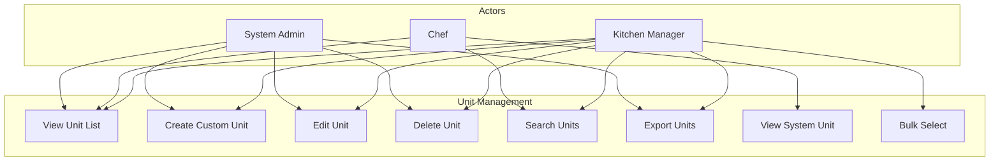

# Recipe Units - Use Cases (UC)

## Document Information
- **Document Type**: Use Cases Document
- **Module**: Operational Planning > Recipe Management > Units
- **Version**: 1.0.0
- **Last Updated**: 2025-01-16

## Document History

| Version | Date | Author | Changes |
|---------|------|--------|---------|
| 1.0.0 | 2025-01-16 | Development Team | Initial documentation based on actual implementation |

---

## 1. Overview

This document describes the use cases for the Recipe Units submodule within Recipe Management. Units of measure are essential for defining ingredient quantities and recipe yields.

### 1.1 Actors

| Actor | Description |
|-------|-------------|
| Kitchen Manager | Creates and manages custom units |
| Chef | Uses units when creating recipes |
| System Administrator | Manages system configuration |

---

## 2. Use Case Diagram

---

## 3. Use Case Specifications

### 3.1 UC-UN-001: View Unit List

| Attribute | Description |
|-----------|-------------|
| **Use Case ID** | UC-UN-001 |
| **Name** | View Unit List |
| **Actor** | Kitchen Manager, Chef, System Administrator |
| **Description** | View the list of all units with key information |
| **Preconditions** | User has unit.view permission |
| **Trigger** | User navigates to Recipe Units page |

**Main Flow:**
1. System displays unit list in table format
2. Table shows: Code, Name (with plural), Status
3. System units display lock icon indicator
4. Results count is displayed

**Alternative Flows:**
- A1: No units found - Display "No units found" message

**Postconditions:**
- Unit list is displayed with current data

---

### 3.2 UC-UN-002: Create Custom Unit

| Attribute | Description |
|-----------|-------------|
| **Use Case ID** | UC-UN-002 |
| **Name** | Create Custom Unit |
| **Actor** | Kitchen Manager, System Administrator |
| **Description** | Add a new custom unit of measure |
| **Preconditions** | User has unit.create permission |
| **Trigger** | User clicks "Add Unit" button |

**Main Flow:**
1. User clicks "Add Unit" button
2. System opens create dialog with blank form
3. User enters required fields:
   - Code (unique abbreviation)
   - Name (full name)
   - Decimal Places (default 2)
   - Rounding Method (default round)
4. User enters optional fields:
   - Plural Name
   - Display Order
   - Example text
   - Notes
   - Show in Dropdown checkbox
   - Active checkbox
5. User clicks "Add Unit" button
6. System validates all fields
7. System creates unit record (isSystemUnit = false)
8. System closes dialog and refreshes list
9. System displays success toast

**Alternative Flows:**
- A1: Duplicate code - Display "Unit code already exists" error
- A2: Validation error - Highlight invalid fields
- A3: User cancels - Close dialog without saving

**Postconditions:**
- New custom unit is created
- Unit appears in list and recipe dropdowns

---

### 3.3 UC-UN-003: Edit Unit

| Attribute | Description |
|-----------|-------------|
| **Use Case ID** | UC-UN-003 |
| **Name** | Edit Unit |
| **Actor** | Kitchen Manager |
| **Description** | Modify an existing custom unit |
| **Preconditions** | User has unit.update permission, unit is not a system unit |
| **Trigger** | User clicks Edit from unit row menu |

**Main Flow:**
1. User clicks the actions menu on unit row
2. User selects "Edit" option
3. System opens edit dialog with current values
4. User modifies desired fields
5. User clicks "Save Changes" button
6. System validates all fields
7. System updates unit record
8. System closes dialog and refreshes list
9. System displays success toast

**Alternative Flows:**
- A1: System unit - Fields are disabled, only "Close" button available
- A2: No changes made - Inform user no changes detected
- A3: Code changed to duplicate - Display error message

**Postconditions:**
- Unit record is updated
- Changes reflected in recipes using this unit

---

### 3.4 UC-UN-004: Delete Unit

| Attribute | Description |
|-----------|-------------|
| **Use Case ID** | UC-UN-004 |
| **Name** | Delete Unit |
| **Actor** | Kitchen Manager, System Administrator |
| **Description** | Remove a custom unit |
| **Preconditions** | User has unit.delete permission, unit is not a system unit |
| **Trigger** | User clicks Delete from unit row menu |

**Main Flow:**
1. User clicks the actions menu on unit row
2. User selects "Delete" option (not available for system units)
3. System opens confirmation dialog
4. Dialog shows unit name and warning about recipe impact
5. User clicks "Delete" button to confirm
6. System deletes unit record
7. System closes dialog and refreshes list
8. System displays success toast

**Alternative Flows:**
- A1: User cancels - Close dialog without deleting
- A2: Unit used in recipes - Show strong warning about impact

**Postconditions:**
- Unit record is deleted
- Recipes using this unit may need updates

---

### 3.5 UC-UN-005: Search Units

| Attribute | Description |
|-----------|-------------|
| **Use Case ID** | UC-UN-005 |
| **Name** | Search Units |
| **Actor** | All users with view permission |
| **Description** | Find units by text search |
| **Preconditions** | User is on Recipe Units page |
| **Trigger** | User types in search box |

**Main Flow:**
1. User enters search text in search box
2. System filters units matching:
   - Name (contains)
   - Code (contains)
3. System updates displayed list
4. System shows result count

**Alternative Flows:**
- A1: No matches found - Display "No units found matching your criteria"

**Postconditions:**
- List shows only matching units

---

### 3.6 UC-UN-006: Export Units

| Attribute | Description |
|-----------|-------------|
| **Use Case ID** | UC-UN-006 |
| **Name** | Export Units |
| **Actor** | Kitchen Manager, System Administrator |
| **Description** | Export unit list to file |
| **Preconditions** | User has unit.export permission |
| **Trigger** | User clicks "Export" button |

**Main Flow:**
1. User clicks "Export" button
2. System generates export file with current data
3. System downloads file to user's device
4. System displays success message

**Postconditions:**
- Export file is downloaded

---

### 3.7 UC-UN-007: View System Unit

| Attribute | Description |
|-----------|-------------|
| **Use Case ID** | UC-UN-007 |
| **Name** | View System Unit |
| **Actor** | All users with view permission |
| **Description** | View details of a system-defined unit |
| **Preconditions** | User is on Recipe Units page |
| **Trigger** | User clicks View from system unit row menu |

**Main Flow:**
1. User clicks the actions menu on system unit row
2. User selects "View" option
3. System opens dialog with unit details
4. All fields are disabled (read-only)
5. Dialog shows "System units cannot be modified" message
6. User clicks "Close" button

**Postconditions:**
- User has viewed system unit details

---

### 3.8 UC-UN-008: Bulk Select Units

| Attribute | Description |
|-----------|-------------|
| **Use Case ID** | UC-UN-008 |
| **Name** | Bulk Select Units |
| **Actor** | Kitchen Manager |
| **Description** | Select multiple custom units |
| **Preconditions** | User is on Recipe Units page |
| **Trigger** | User clicks checkboxes |

**Main Flow:**
1. User clicks checkbox on individual unit rows
2. System only allows selection of non-system units
3. System unit checkboxes are disabled
4. User clicks header checkbox to select all non-system units
5. System tracks selected unit IDs

**Alternative Flows:**
- A1: Click on disabled checkbox - No action (system unit protected)
- A2: Uncheck header - Deselect all units

**Postconditions:**
- Selected custom unit IDs are tracked
- System units remain unselected

---

## 4. Non-Functional Requirements

### 4.1 Performance

| Requirement | Target |
|-------------|--------|
| List load time | Under 2 seconds |
| Search response | Immediate (client-side) |
| Create/Edit save | Under 3 seconds |

### 4.2 Usability

| Requirement | Description |
|-------------|-------------|
| System unit protection | Visual lock icon and disabled controls |
| Clear distinction | System vs custom units clearly marked |
| Inline help | Example field shows usage hints |

---

## Related Documents

- [BR-units.md](./BR-units.md) - Business Rules
- [DD-units.md](./DD-units.md) - Data Dictionary
- [FD-units.md](./FD-units.md) - Flow Diagrams
- [TS-units.md](./TS-units.md) - Technical Specifications
- [VAL-units.md](./VAL-units.md) - Validation Rules
