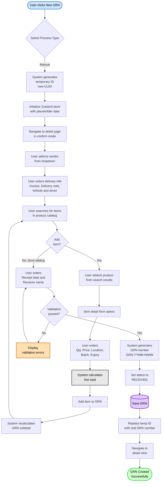
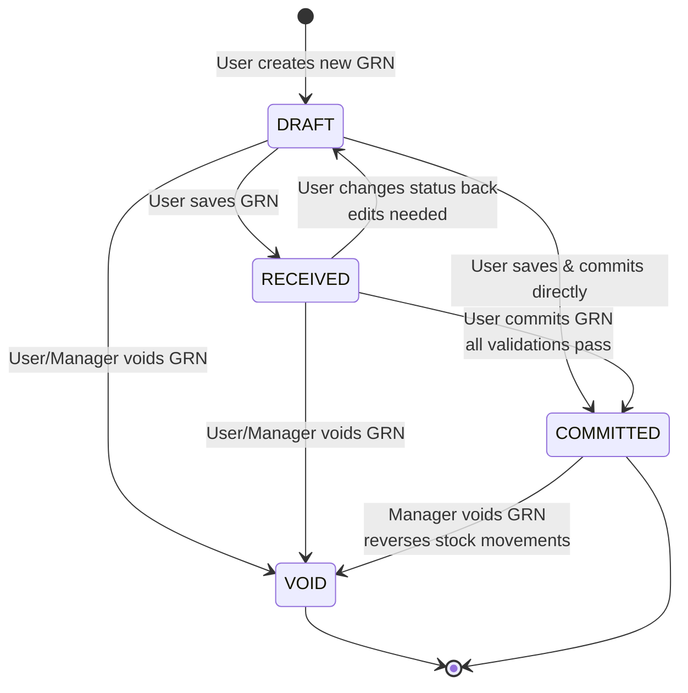
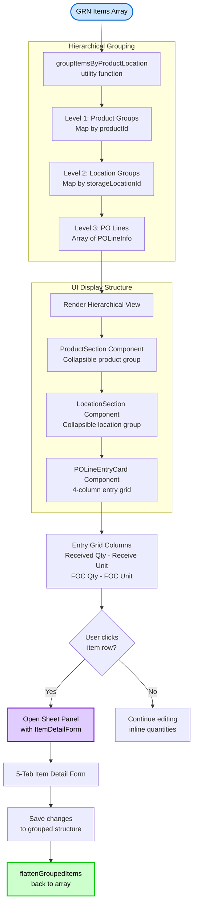
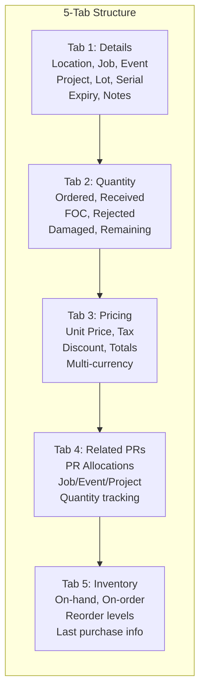
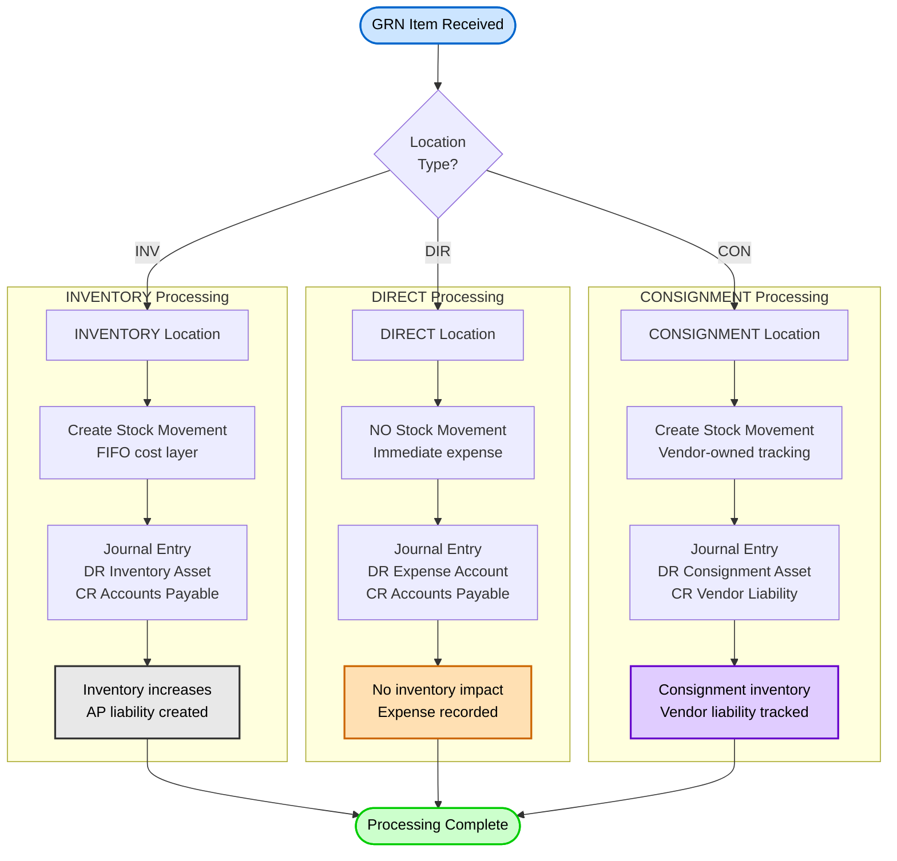
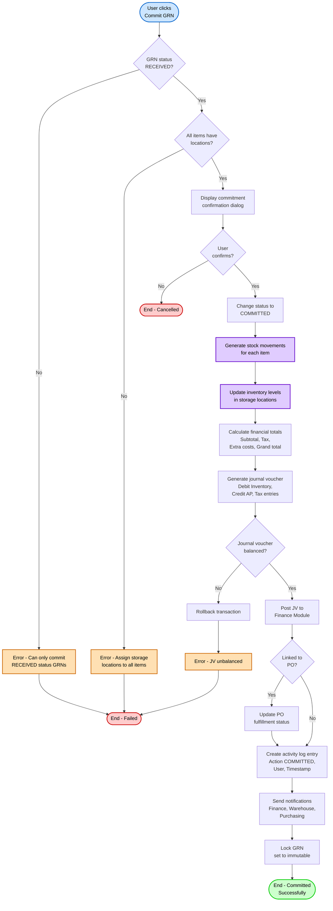
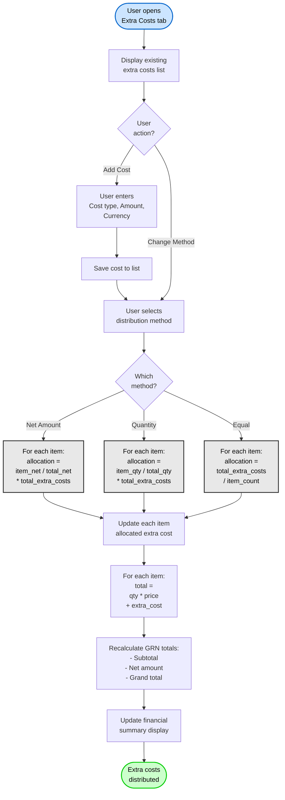
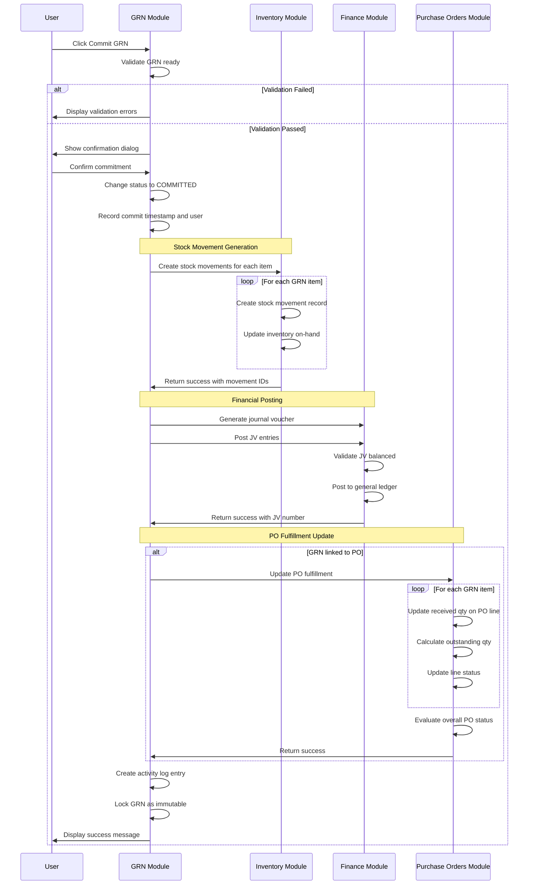

# Flow Diagrams: Goods Received Note

## Module Information
- **Module**: Procurement
- **Sub-Module**: Goods Received Note (GRN)
- **Version**: 1.0.5
- **Last Updated**: 2025-12-03
- **Owner**: Procurement Team
- **Status**: Approved

## Document History
| Version | Date | Author | Changes |
|---------|------|--------|---------|
| 2.0.0 | 2026-01-15 | Documentation Team | Major update: Added 3-step wizard flow, hierarchical items view, item detail form 5-tab structure, location type processing, tax tab, related PO list |
| 1.1.0 | 2025-12-10 | Documentation Team | Standardized reference number format (XXX-YYMM-NNNN) |
| 1.0.5 | 2025-12-03 | Documentation Team | Added costing method context (FIFO or Periodic Average configurable at system level) |
| 1.0.4 | 2025-12-03 | Documentation Team | Mermaid 8.8.2 compatibility: Removed colons, equals signs, and parentheses from flowchart node labels in Diagrams 1, 2, 4, 5 |
| 1.0.3 | 2025-12-03 | Documentation Team | Mermaid 8.8.2 compatibility: Removed parentheses from sequenceDiagram messages, replaced special characters in flowcharts |
| 1.0.2 | 2025-12-03 | Documentation Team | Mermaid 8.8.2 compatibility: Removed unsupported note syntax from state diagram, converted to table format |
| 1.0.1 | 2025-12-03 | Documentation Team | Verified coverage against BR requirements (FR-GRN-001 to FR-GRN-017) |
| 1.0.0 | 2025-01-11 | Documentation Team | Initial version from workflow analysis |

---

## Overview

This document provides visual representations of the key workflows, data flows, and state transitions in the Goods Received Note module. The diagrams illustrate two primary creation workflows (PO-based and manual), GRN lifecycle state transitions, item management processes, commitment workflows, and system integrations discovered in the actual codebase.

**Related Documents**:
- [Business Requirements](./BR-goods-received-note.md)
- [Use Cases](./UC-goods-received-note.md)
- [Technical Specification](./TS-goods-received-note.md)
- [Data Definition](./DD-goods-received-note.md)
- [Validations](./VAL-goods-received-note.md)

---

## Diagram Index

| Diagram | Type | Purpose | Complexity |
|---------|------|---------|------------|
| [PO-Based GRN Creation](#po-based-grn-creation-flow) | Process | Create GRN from purchase order (3-step wizard) | High |
| [Manual GRN Creation](#manual-grn-creation-flow) | Process | Create standalone GRN | Medium |
| [GRN State Transitions](#grn-state-transition-diagram) | State | Status lifecycle management | Medium |
| [Hierarchical Items View](#hierarchical-items-view-flow) | UI | Product to Location to PO grouping | Medium |
| [Item Detail Form 5-Tab](#item-detail-form-flow) | UI | Comprehensive item editing interface | Medium |
| [Location Type Processing](#location-type-processing-flow) | Process | INV, DIR, CON location handling | Medium |
| [GRN Commitment](#grn-commitment-workflow) | Workflow | Finalize GRN and update inventory | High |
| [Extra Cost Distribution](#extra-cost-distribution-flow) | Process | Allocate additional costs to items | Medium |
| [System Integration](#system-integration-flow) | Integration | Module integrations on commitment | High |

---

## PO-Based GRN Creation Flow

**Purpose**: Document the complete 3-step wizard workflow for creating a Goods Received Note from existing Purchase Orders

**Multi-PO Support**: A single GRN can receive items from multiple POs. Each line item stores its own PO reference (purchaseOrderId, purchaseOrderItemId) rather than a single PO at header level.

**Actors**: Receiving Clerk, Purchasing Staff, System

**Trigger**: User clicks "New GRN" button and selects "From PO" option

**Source Files**:
- `app/(main)/procurement/goods-received-note/page.tsx` (Entry point)
- `app/(main)/procurement/goods-received-note/new/vendor-selection/page.tsx` (Step 1)
- `app/(main)/procurement/goods-received-note/new/po-selection/page.tsx` (Step 2)
- `app/(main)/procurement/goods-received-note/new/item-location-selection/page.tsx` (Step 3)
- `lib/store/grn-creation.store.ts` (Zustand store for wizard state)

```mermaid
flowchart TD
    Start([User clicks New GRN]) --> Select{Select Process Type}
    Select -->|From PO| Step1[Step 1: Vendor Selection<br>vendor-selection page]

    subgraph Step1Flow[Step 1 - Vendor Selection]
        Step1 --> SearchVendor[User searches vendors<br>by name or code]
        SearchVendor --> SelectVendor[User selects vendor<br>from list]
        SelectVendor --> StoreVendor[Store vendor in<br>Zustand store]
    end

    StoreVendor --> Step2[Step 2: PO Selection<br>po-selection page]

    subgraph Step2Flow[Step 2 - PO Selection]
        Step2 --> LoadPOs[System loads POs<br>status OPEN or PARTIAL]
        LoadPOs --> DisplayPOs[Display PO list<br>with inline items]
        DisplayPOs --> MultiSelect[User multi-selects<br>POs with checkboxes]
        MultiSelect --> StorePOs[Store selected POs<br>in Zustand store]
    end

    StorePOs --> Step3[Step 3: Item and Location<br>item-location-selection page]

    subgraph Step3Flow[Step 3 - Item Location Selection]
        Step3 --> FlattenItems[System flattens<br>PO items list]
        FlattenItems --> ShowLocTypes[Display location type<br>badges INV DIR CON]
        ShowLocTypes --> SelectItems[User selects items<br>to receive]
        SelectItems --> SetLocations[Assign storage<br>locations per item]
        SetLocations --> CheckDirect{Any DIRECT<br>locations?}
        CheckDirect -->|Yes| ShowAlert[Show Direct Expense<br>alert warning]
        CheckDirect -->|No| CreateItems
        ShowAlert --> CreateItems[Create GRN items<br>with PO references]
    end

    CreateItems --> NavConfirm[Navigate to detail<br>page mode confirm]
    NavConfirm --> ReviewGRN[User reviews GRN<br>in confirm mode]
    ReviewGRN --> SaveGRN[(Save GRN)]
    SaveGRN --> Success([GRN Created<br>Successfully])

    style Start fill:#cce5ff,stroke:#0066cc,stroke-width:2px,color:#000
    style Success fill:#ccffcc,stroke:#00cc00,stroke-width:2px,color:#000
    style ShowAlert fill:#ffe0b3,stroke:#cc6600,stroke-width:2px,color:#000
    style SaveGRN fill:#e0ccff,stroke:#6600cc,stroke-width:2px,color:#000
```

**Flow Steps**:

**Step 1 - Vendor Selection** (`/goods-received-note/new/vendor-selection`):
1. User navigates from GRN list by clicking "New GRN" → "From PO"
2. System displays searchable vendor list (active vendors only)
3. User searches by vendor name or registration number
4. User selects vendor from search results
5. System stores selected vendor in Zustand store (`setSelectedVendor`)
6. System navigates to Step 2

**Step 2 - PO Selection** (`/goods-received-note/new/po-selection`):
7. System loads POs for selected vendor with status OPEN or PARTIAL
8. Display PO list with expandable rows showing PO items
9. User multi-selects POs using checkboxes (can select from multiple POs)
10. For each selected PO, display: PO number, date, total amount, items count
11. System stores selected POs in Zustand store (`setSelectedPOs`)
12. System navigates to Step 3

**Step 3 - Item & Location Selection** (`/goods-received-note/new/item-location-selection`):
13. System flattens all items from selected POs into consolidated list
14. Display items with columns: Item, PO #, Location, Ordered, Remaining, Receiving Qty/Unit
15. Location type badges displayed with icons:
    - **INV (Package icon)**: Inventory - standard stock-in
    - **DIR (DollarSign icon)**: Direct - immediate expense (no stock movement)
    - **CON (Truck icon)**: Consignment - vendor-owned inventory
16. If DIRECT locations detected, system shows alert warning
17. User selects items to receive using checkboxes (Select All available)
18. User enters receiving quantities and assigns storage locations
19. System calculates base quantity and amount for each item
20. System creates GRN items array with PO references (purchaseOrderId, purchaseOrderItemId)
21. System navigates to detail page with `?mode=confirm`

**Confirmation & Save**:
22. User reviews GRN data in confirm mode on detail page
23. User can edit quantities, add extra costs, enter invoice details
24. User saves GRN (or cancels to discard)
25. System generates GRN number (GRN-YYMM-NNNN)
26. System sets status to RECEIVED
27. GRN created and ready for commitment

**Exception Handling**:
- No pending POs for vendor: Display message, suggest manual GRN creation
- Validation failures: Inline error messages at each step, prevent navigation
- PO already fully received: PO not shown in list (status not OPEN or PARTIAL)
- Direct expense items: Alert shown to inform user items won't create stock movements

---

## Manual GRN Creation Flow

**Purpose**: Document the workflow for creating a standalone GRN without a purchase order reference

**Actors**: Receiving Clerk, Purchasing Staff, System

**Trigger**: User clicks "New GRN" button and selects "Manual" option

**Flow Steps**:

1. **Start**: User clicks "New GRN" button from list page
2. **Select Process Type**: Dialog with "From PO" or "Manual" options
3. **User selects "Manual"**: Routes to manual creation workflow
4. **Generate Temporary ID**: System creates temporary ID like "new-123e4567-e89b-12d3..."
5. **Initialize Store**: Zustand store initialized with placeholder GRN data
6. **Navigate**: Route to `/goods-received-note/[tempId]?mode=confirm`
7. **Select Vendor**: User picks vendor from dropdown (not pre-populated)
8. **Enter Delivery Info**: User manually enters invoice details, delivery note, vehicle, driver
9. **Search Items**: User searches product catalog by name, code, or description
10. **Add Item Loop**: User repeatedly adds items until all received goods documented
11. **Select Product**: User picks product from search results
12. **Item Form**: Item detail dialog opens for detailed entry
13. **Enter Item Details**: User enters quantities, price, location, traceability info
14. **Calculate Line**: System computes item total = quantity × price
15. **Add to List**: Item added to GRN items array
16. **Update Total**: GRN subtotal recalculated as sum of all item totals
17. **Done Adding**: User finished adding all items
18. **Enter Receipt Info**: User enters receipt date and receiver name
19. **Validation**: System validates required fields, business rules
    - At least one item required
    - All items must have storage locations
    - Quantities must be > 0
20. **Generate GRN Number**: Assign real GRN number
21. **Set Status**: Status set to RECEIVED
22. **Save**: Data persisted (currently: Zustand store, future: database)
23. **Update ID**: Temp ID replaced with real GRN number
24. **Navigate**: Route to detail page with real GRN ID
25. **Success**: Manual GRN created successfully

**Exception Handling**:
- Item not in catalog: User must contact admin to add product first
- Missing required fields: Inline validation errors with field highlighting
- No items added: Prevent save with error "At least one item required"

---

## GRN State Transition Diagram

**Purpose**: Document the valid status transitions and rules governing GRN lifecycle

**Status Properties**:

| Status | Editable | Deletable | Inventory Impact | Stock Movements | Journal Voucher |
|--------|----------|-----------|------------------|-----------------|-----------------|
| DRAFT | Yes | Yes | None | None | - |
| RECEIVED | Yes | No (can void) | None | None | - |
| COMMITTED | No (Immutable) | No (can void) | Yes | Generated | Posted |
| VOID | No (Read-only) | No (Preserved) | None | Reversing entries if was committed | - |

**Status Descriptions**:

**DRAFT**:
- Initial state when GRN first created
- Fully editable - all fields can be modified
- Can be deleted without restriction
- No impact on inventory or finances
- Common for work-in-progress receiving

**RECEIVED**:
- Goods physically received and documented
- Still editable for corrections
- Cannot be deleted (must void instead)
- No inventory or financial impact yet
- Awaiting final review and commitment

**COMMITTED**:
- GRN finalized and locked
- Immutable - no edits allowed
- Stock movements generated and inventory updated
- Journal voucher posted to finance
- Can only be voided (with reversals)
- Permanent record of goods receipt

**VOID**:
- Cancelled GRN preserved for audit
- Read-only - cannot edit or delete
- No inventory or financial impact
- If previously COMMITTED, reversing entries created
- Reason for void recorded in notes/activity log

**Transition Rules**:
- DRAFT → RECEIVED: Basic validation (vendor, items, quantities)
- DRAFT/RECEIVED → COMMITTED: Full validation (locations assigned)
- Any → VOID: Manager permission required (except DRAFT)
- COMMITTED → VOID: Generates reversing stock movements and journal entries
- No transitions allowed FROM VOID or COMMITTED except VOID

---

## Hierarchical Items View Flow

**Purpose**: Document the Product → Location → PO Line grouping structure used in GRN items display

**Source Files**:
- `app/(main)/procurement/goods-received-note/components/tabs/GRNItemsHierarchical.tsx`
- `app/(main)/procurement/goods-received-note/lib/groupItems.ts`

**Grouping Structure**:

| Level | Key | Contains | Component |
|-------|-----|----------|-----------|
| 1 | Product ID | ProductGroup with locations Map | ProductSection |
| 2 | Location ID | LocationGroup with PO lines array | LocationSection |
| 3 | PO Reference | POLineInfo with GRN item | POLineEntryCard |

**Key Features**:
- **Expand/Collapse**: Products and locations are collapsible sections
- **Expand All/Collapse All**: Bulk toggle for all groups
- **4-Column Entry Grid**: Received Qty, Receive Unit, FOC Qty, FOC Unit
- **Detail Panel**: Right-side Sheet component opens ItemDetailForm
- **Selection**: Checkbox selection for bulk actions across hierarchy

---

## Item Detail Form Flow

**Purpose**: Document the 5-tab item detail form structure for comprehensive item editing

**Source File**: `app/(main)/procurement/goods-received-note/components/tabs/itemDetailForm.tsx`

**Tab 1 - Details**:
- Item name and description
- Storage location and delivery point
- Job code, event, project, market segment
- Lot/batch number and serial number
- Expiry date
- Line item notes

**Tab 2 - Quantity**:
- Ordered quantity and unit (from PO)
- Received quantity and unit
- FOC (Free of Charge) quantity and unit
- Base quantity calculations with conversion rates
- Rejected and damaged quantities
- Remaining quantity to receive

**Tab 3 - Pricing**:
- Unit price (transaction currency)
- Tax rate and tax system (GST/VAT)
- Tax inclusive/exclusive toggle
- Discount rate and amount
- Calculated totals: subtotal, net, tax, total
- Exchange rate and base currency amounts
- Extra cost allocation display

**Tab 4 - Related PRs** (RelatedPRAllocation interface):
- List of linked Purchase Requests
- PR number, line number, PR line item ID
- Business context: job code, event, project, market segment
- Requester name and department
- Quantity tracking: requested, previously received, this GRN, remaining
- Add/Edit/Delete PR allocations

**Tab 5 - Inventory** (Read-only reference):
- Current on-hand quantity
- On-order quantity
- Reorder threshold and restock level
- Last purchase price, date, and vendor

---

## Location Type Processing Flow

**Purpose**: Document how different location types affect GRN processing and GL entries

**Source Files**:
- `app/(main)/procurement/goods-received-note/components/goods-receive-note.tsx` (documentation comments)
- `app/(main)/procurement/goods-received-note/new/item-location-selection/page.tsx` (getLocationTypeIcon function)

**Location Type Details**:

| Type | Icon | Stock Movement | GL Treatment | Use Case |
|------|------|----------------|--------------|----------|
| **INV** (Inventory) | Package | Yes - FIFO cost layer | DR Inventory Asset, CR AP | Standard inventory items |
| **DIR** (Direct) | DollarSign | No - immediate expense | DR Expense Account, CR AP | Operating supplies, consumables |
| **CON** (Consignment) | Truck | Yes - vendor-owned | DR Consignment Asset, CR Vendor Liability | Vendor-owned stock on premises |

**Key Behaviors**:
1. **INVENTORY**: Full inventory tracking with cost layers for FIFO/Average costing
2. **DIRECT**: Bypasses inventory - items expensed immediately on receipt
3. **CONSIGNMENT**: Special tracking for vendor-owned inventory, payment due when goods sold/used

**UI Indicators**:
- Location type badges shown in item-location-selection step
- Alert warning displayed when DIRECT locations selected
- Tooltip on consignment checkbox explains vendor-owned inventory concept

---

## GRN Commitment Workflow

**Purpose**: Document the workflow for finalizing a GRN, including validations, stock movements, and financial postings

**Actors**: Warehouse Staff, Procurement Manager, Inventory System, Finance System

**Trigger**: User clicks "Commit GRN" button on RECEIVED status GRN

**Flow Steps**:

1. **Start**: User clicks "Commit GRN" button
2. **Check Status**: Verify GRN status is RECEIVED
3. **Check Locations**: Verify all items have storage locations assigned
4. **Confirmation**: Display dialog with commitment impact summary
5. **User Confirms**: User reviews and confirms commitment
6. **Change Status**: Update GRN status to COMMITTED
7. **Generate Stock Movements**: Create stock movement record for each item
    - Movement type: RECEIPT
    - From: Receiving area
    - To: Assigned storage location
    - Quantity: Received quantity
    - Cost: Unit price + allocated extra cost
8. **Update Inventory**: Increment on-hand quantities in storage locations; create inventory layers with unit cost for valuation (used by system-configured costing method: FIFO or Periodic Average, set in System Administration → Inventory Settings)
9. **Calculate Finance**: Compute all financial totals with tax and extra costs
10. **Generate JV**: Create journal voucher with balanced entries
11. **Validate JV**: Ensure total debits = total credits
12. **Post JV**: Submit journal voucher to Finance Module
13. **Update PO**: If linked to PO, update fulfillment quantities and status
14. **Log Activity**: Record commitment event in activity log
15. **Notify**: Send notifications to finance, warehouse, purchasing teams
16. **Lock GRN**: Set GRN to immutable state
17. **Success**: Commitment complete, GRN now read-only

**Rollback Scenarios**:
- Stock movement generation fails: Rollback status change
- Inventory update fails: Rollback stock movements and status
- Journal voucher unbalanced: Rollback all changes
- Finance posting fails: Rollback all changes

---

## Extra Cost Distribution Flow

**Purpose**: Document how extra costs (freight, handling, insurance) are allocated across received items

**Actors**: Purchasing Staff, System

**Trigger**: User adds extra cost or changes distribution method

**Distribution Methods**:

**By Net Amount** (Proportional to item value):
- Formula: `item_allocation = (item_net_amount ÷ total_net_amount) × total_extra_costs`
- Use case: Distributes costs proportional to item value
- Example: Item worth $1000 gets more freight allocation than item worth $100

**By Quantity** (Proportional to item quantity):
- Formula: `item_allocation = (item_quantity ÷ total_quantity) × total_extra_costs`
- Use case: Distributes costs proportional to quantity received
- Example: 50 units gets more allocation than 10 units

**Equal Distribution** (Same for all items):
- Formula: `item_allocation = total_extra_costs ÷ item_count`
- Use case: Each item gets equal share regardless of value or quantity
- Example: 3 items split $300 freight = $100 each

---

## System Integration Flow

**Purpose**: Document the system-to-system integrations triggered when GRN is committed

**Actors**: GRN Module, Inventory Module, Finance Module, PO Module

**Trigger**: GRN status changes to COMMITTED

**Integration Points**:

**1. Inventory Module Integration**:
- **Trigger**: GRN committed
- **Data Sent**: Item ID, quantity, location, cost, lot/batch numbers
- **Actions**: Generate stock movements, update on-hand quantities
- **Response**: Stock movement IDs, updated inventory levels
- **Rollback**: If fails, revert GRN status

**2. Finance Module Integration**:
- **Trigger**: GRN committed
- **Data Sent**: Financial totals, GL account codes, tax amounts, departments
- **Actions**: Create journal voucher, post to GL, update AP
- **Response**: Journal voucher number, posting confirmation
- **Rollback**: If fails, reverse stock movements, revert GRN status

**3. Purchase Orders Module Integration**:
- **Trigger**: GRN committed (only for PO-based GRNs)
- **Data Sent**: PO ID, PO line IDs, received quantities
- **Actions**: Update PO line fulfillment, calculate outstanding quantities, update PO status
- **Response**: Updated PO status (Partially/Fully Received)
- **Rollback**: Non-critical - if fails, log warning but allow GRN commitment

---

## Appendix

### Diagram Color Coding

- **Blue**: Start/trigger points
- **Green**: Success/completion points
- **Red**: Failure/error end points
- **Orange**: Error handling/warnings
- **Gray**: Standard processing steps
- **Purple**: Database/persistence operations

### Related Documents
- [Business Requirements](./BR-goods-received-note.md)
- [Use Cases](./UC-goods-received-note.md)
- [Technical Specification](./TS-goods-received-note.md)
- [Data Definition](./DD-goods-received-note.md)
- [Validations](./VAL-goods-received-note.md)

---

**Document End**

> 📝 **Note to Reviewers**:
> - All workflows documented from actual code analysis
> - Mermaid diagrams represent implemented flows
> - No fictional workflows added
> - Review diagrams against actual user journeys
