# Purchase Request Screenshots Index

## Overview
This document provides an index of all screenshots captured for the Purchase Request module documentation. All screenshots were captured with the left sidebar hidden for cleaner, more focused documentation.

**Last Updated:** 2025-11-20 11:17:00 +07:00

---

## List Page Screenshots

### Main Views
| Screenshot | Filename | Description |
|------------|----------|-------------|
| 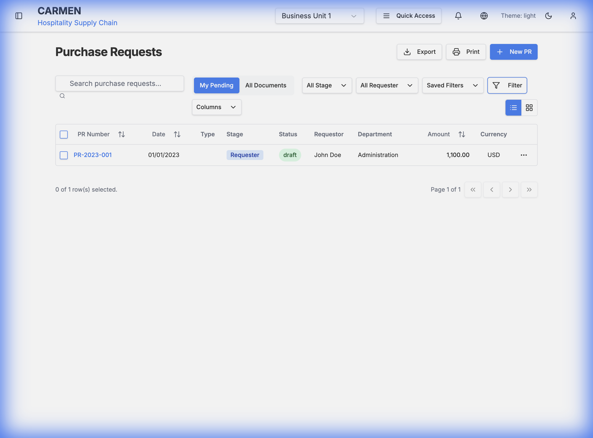 | `pr_list_full_view_1763611677269.png` | Full list view with sidebar hidden |
| 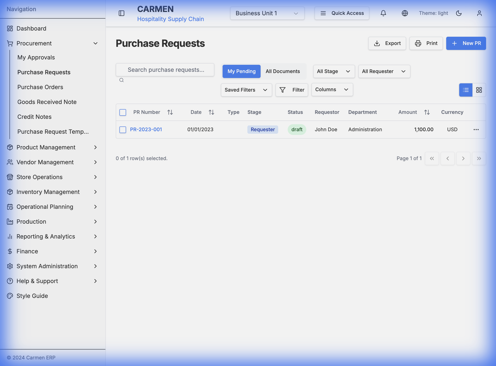 | `pr_list_final_view_1763611971598.png` | Alternative full list view |

### Interactive States
| Screenshot | Filename | Description |
|------------|----------|-------------|
| 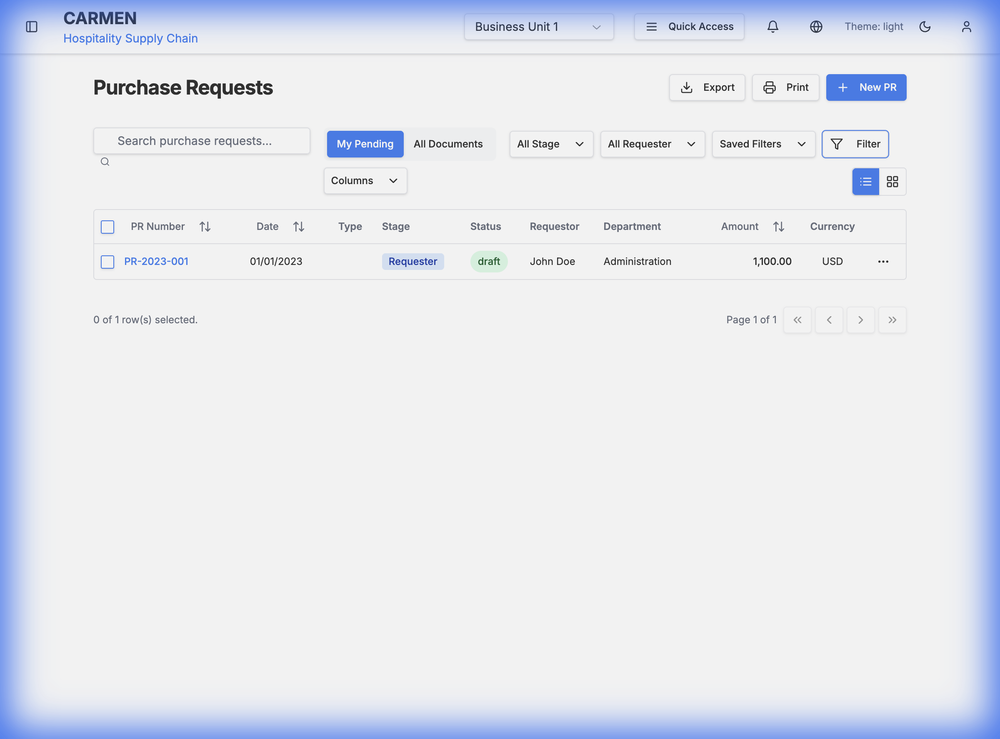 | `pr_row_hover_state_1763611691316.png` | Row hover state showing highlight effect |
|  | `pr_row_actions_menu_1763611692818.png` | Row actions dropdown menu |
| 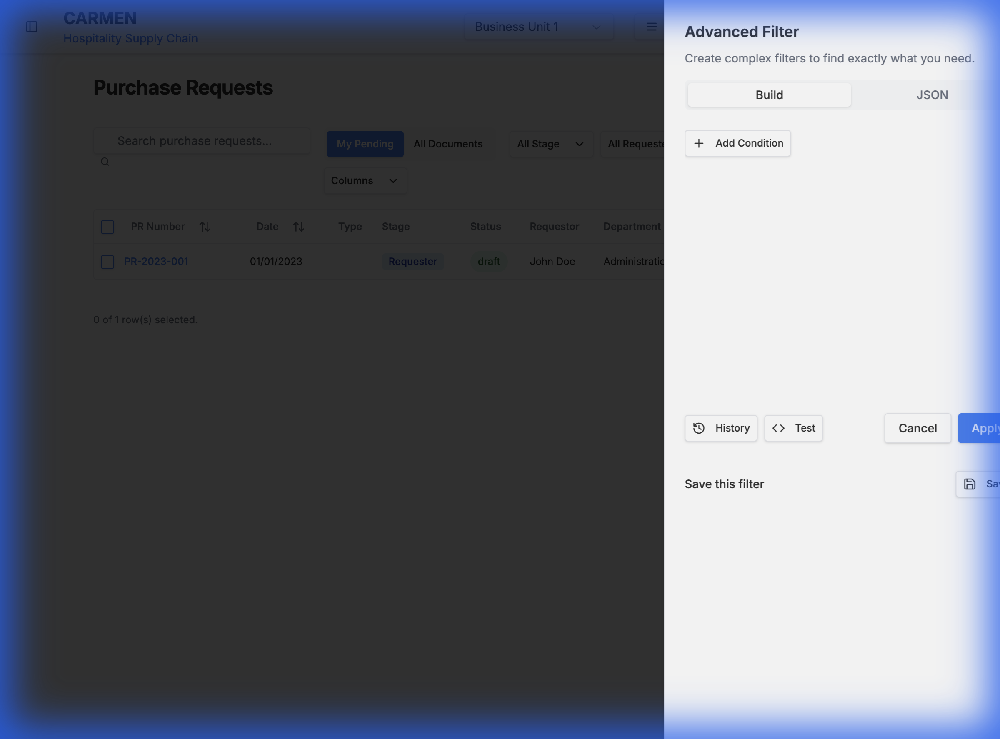 | `pr_filters_expanded_1763611688148.png` | Filter panel expanded with all options |
| 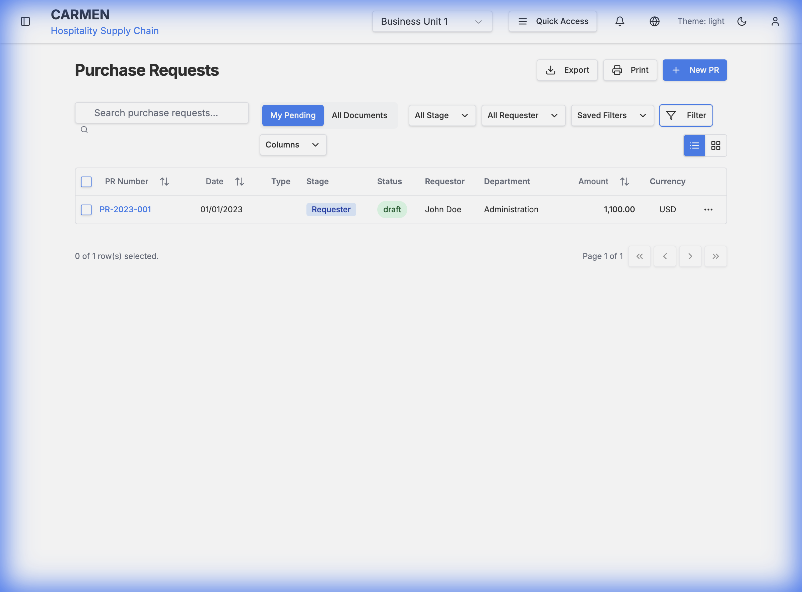 | `pr_new_dropdown_menu_1763611690820.png` | New PR dropdown menu with templates |

---

## Detail Page Screenshots

### Overview and Tabs
| Screenshot | Filename | Description |
|------------|----------|-------------|
| 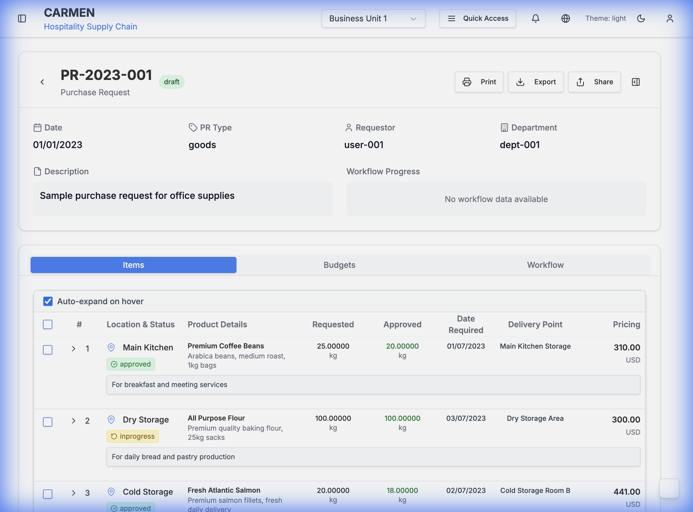 | `pr_detail_overview_1763611892985.png` | PR detail page overview with header |
| 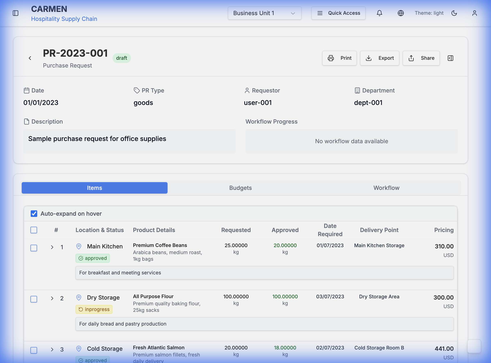 | `pr_items_tab_full_view_1763612289485.png` | Items tab - full view with table header ✨ |
| 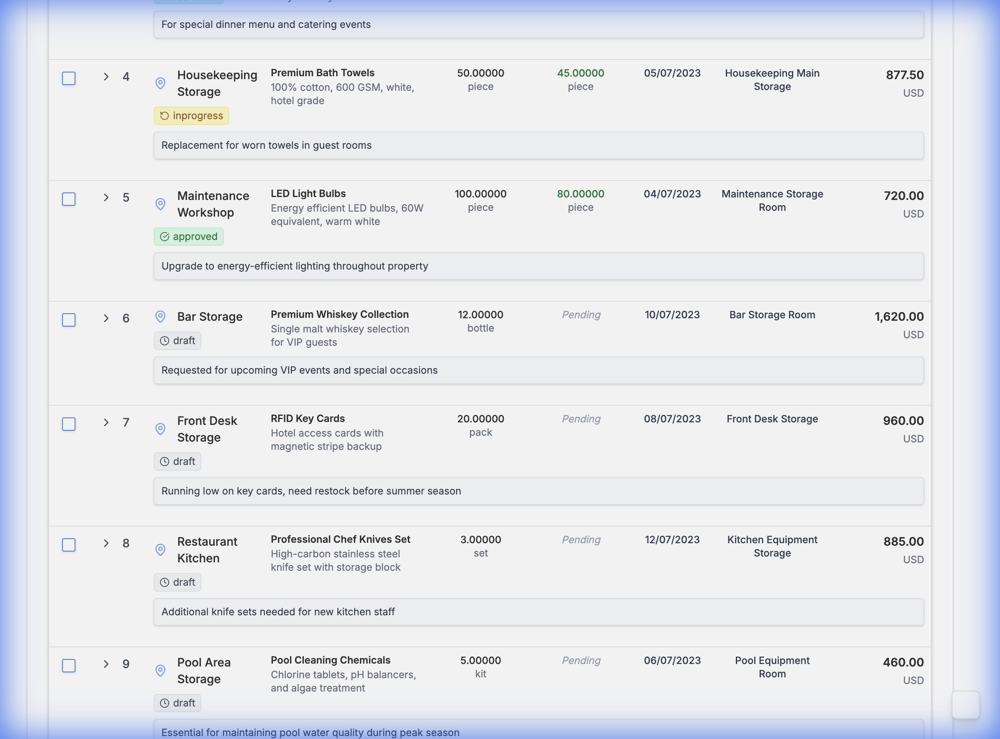 | `pr_items_tab_scrolled_1763612290829.png` | Items tab - scrolled view showing more items ✨ |
| 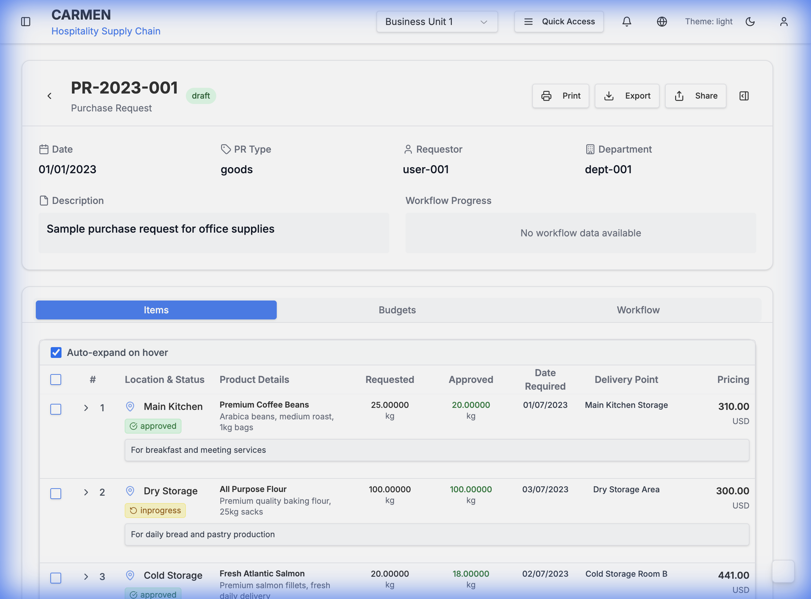 | `pr_budgets_tab_view_1763611897036.png` | Budgets tab showing allocations |
|  | `pr_workflow_tab_view_1763611898633.png` | Workflow tab with timeline |

### Item Interactions
| Screenshot | Filename | Description |
|------------|----------|-------------|
| 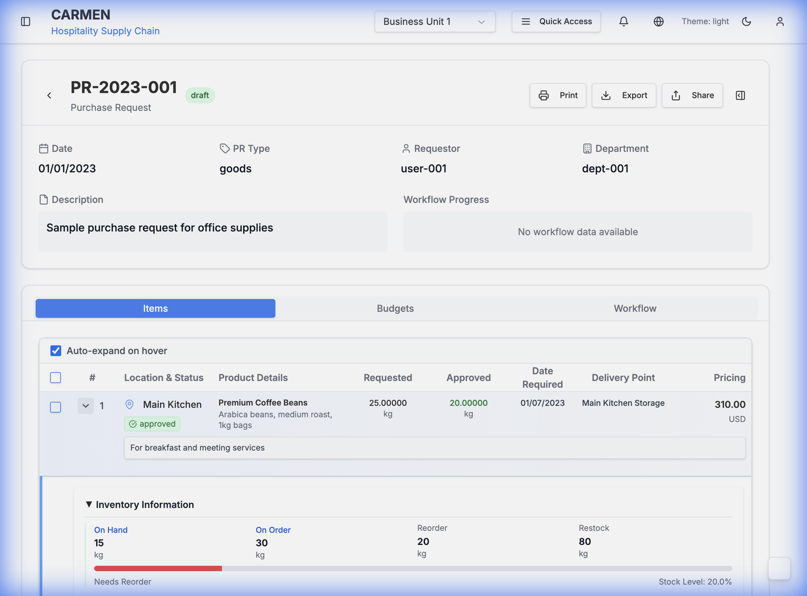 | `pr_item_hover_state_1763611900316.png` | Item row hover state |
| 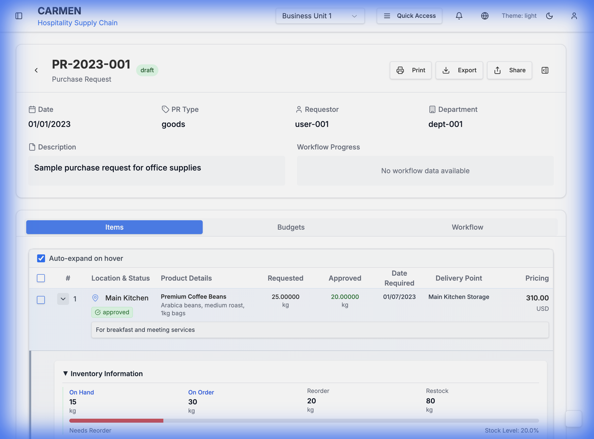 | `pr_item_actions_menu_1763611910647.png` | Item actions dropdown menu |
| 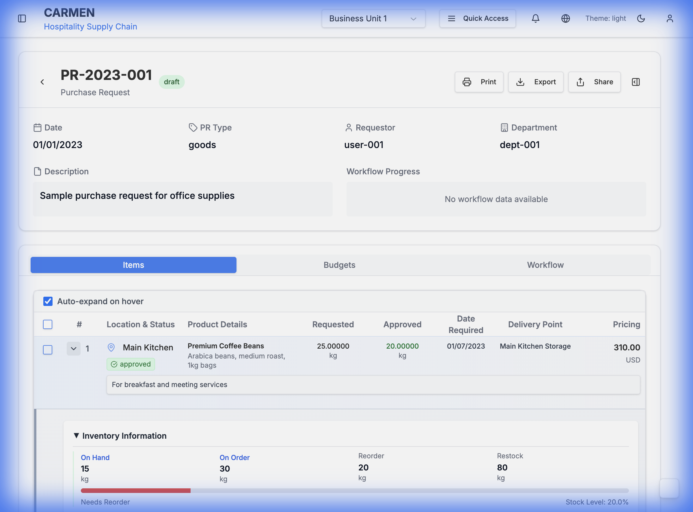 | `pr_item_name_clicked_1763611941685.png` | Product detail panel after clicking item name |

---

## Legacy Screenshots (With Sidebar)

The following screenshots were captured before hiding the sidebar and are kept for reference:

### List Page (Legacy)
- `pr_list_top_1763609876525.png` - Original list view
- `pr_list_filter_open_1763609928438.png` - Original filter view
- `pr_list_full_view_1763611539985.png` - Earlier capture with sidebar
- `pr_row_hover_state_1763611560886.png` - Earlier hover state
- `pr_row_actions_menu_1763611562418.png` - Earlier actions menu
- `pr_new_dropdown_menu_1763611550517.png` - Earlier dropdown menu
- `pr_filters_expanded_1763611547868.png` - Earlier filter panel

### Detail Page (Legacy)
- `pr_detail_default_tab_1763610021839.png` - Original detail view
- `pr_detail_items_tab_1763610050627.png` - Original items tab
- `pr_detail_budgets_tab_1763610064144.png` - Original budgets tab
- `pr_detail_workflow_tab_1763610077273.png` - Original workflow tab
- `pr_detail_edit_mode_1763610153861.png` - Edit mode view
- `pr_detail_overview_1763611357006.png` - Earlier overview (error page)
- `pr_detail_overview_1763611366052.png` - Earlier overview capture
- `pr_budgets_tab_view_1763611382908.png` - Earlier budgets tab
- `pr_workflow_tab_view_1763611384441.png` - Earlier workflow tab
- `pr_item_hover_state_1763611394936.png` - Earlier item hover
- `pr_item_actions_menu_1763611396522.png` - Earlier item actions
- `pr_items_full_table_1763611358428.png` - Earlier items table (error page)
- `pr_items_full_table_1763611367504.png` - Earlier items table
- `pr_items_full_table_1763611894430.png` - Earlier items table (blank/small)

### Dialogs and Modals (Legacy)
- `pr_creation_dialog_1763609975574.png` - PR creation dialog
- `pr_add_item_dialog_1763610169420.png` - Add item dialog
- `pr_item_row_clicked_1763610122293.png` - Item row clicked state
- `pr_item_name_clicked_1763610138409.png` - Earlier item name click
- `pr_item_name_clicked_edit_mode_1763610256220.png` - Item name in edit mode
- `pr_item_row_action_menu_1763610218487.png` - Earlier item action menu
- `pr_item_inventory_info_1763610237102.png` - Inventory info panel
- `pr_create_blank_dialog_1763611595067.png` - Create blank PR dialog
- `pr_list_final_view_1763611956567.png` - Earlier final view (error page)

---

## Screenshot Naming Convention

All new screenshots follow this naming pattern:
```
pr_[section]_[description]_[timestamp].png
```

Where:
- `pr_` - Prefix for Purchase Request
- `[section]` - list, detail, item, budgets, workflow, etc.
- `[description]` - Brief description of what's shown
- `[timestamp]` - Unix timestamp for uniqueness

---

## Usage in Documentation

All current screenshots (with hidden sidebar) are referenced in:
- `purchase-request-screens-documentation.md` - Main documentation file

Legacy screenshots are preserved in the `screenshots/` directory but not actively used in the current documentation.

---

## Capture Settings

All screenshots were captured with:
- **Browser:** Chrome (via Antigravity Browser Extension)
- **Viewport:** Default desktop size
- **Sidebar:** Hidden (collapsed)
- **Theme:** Default light theme
- **Server:** http://localhost:3001
- **Sample Data:** Mock purchase request data

---

## Future Screenshot Needs

Potential additional screenshots to capture:
- [ ] Mobile responsive views
- [ ] Dark mode theme
- [ ] Edit mode interactions
- [ ] Approval dialog flows
- [ ] Rejection dialog flows
- [ ] Email notification previews
- [ ] Print preview layouts
- [ ] Export format examples
- [ ] Bulk operations UI
- [ ] Advanced filter presets
