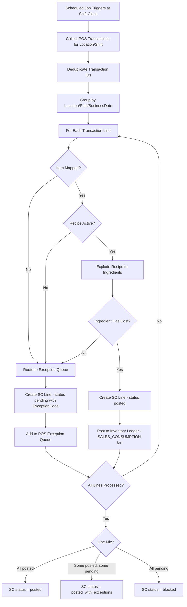
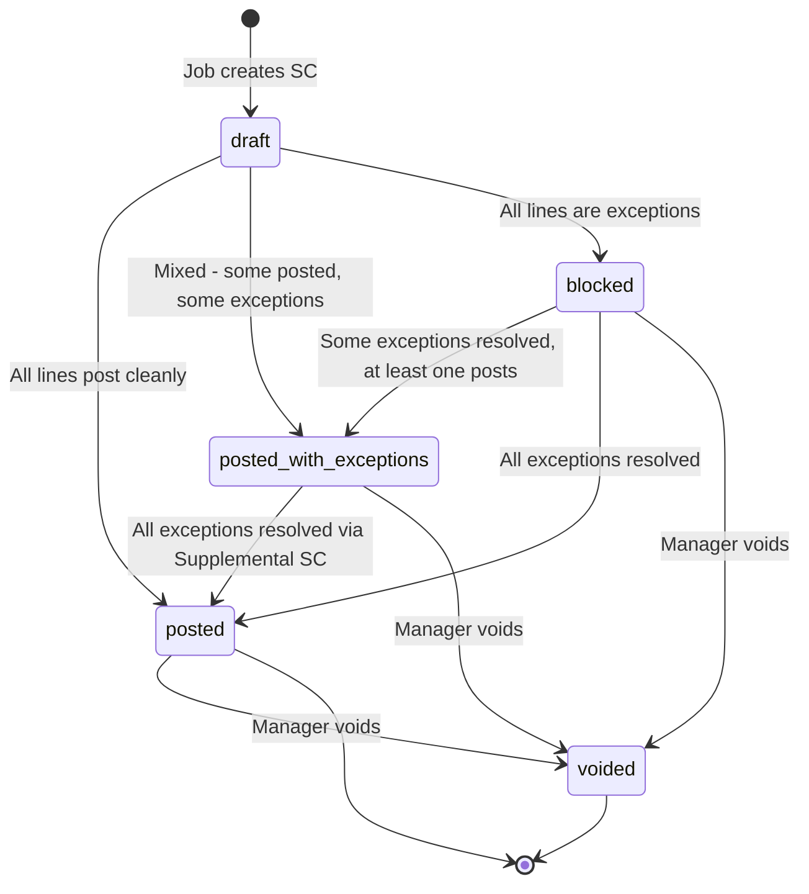
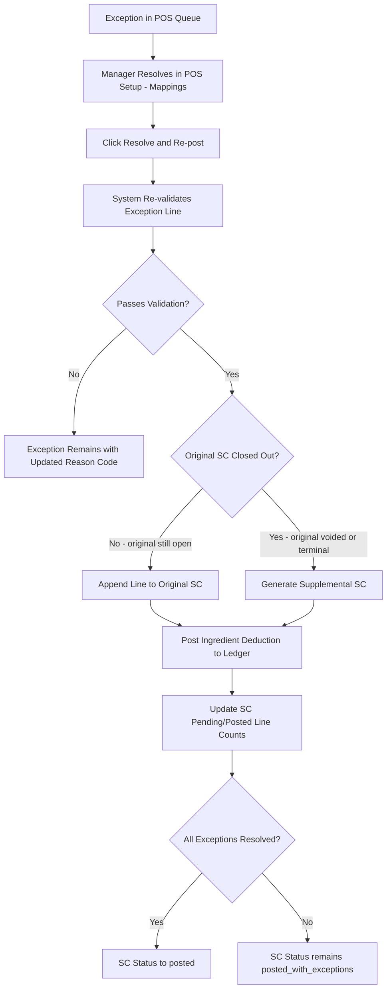
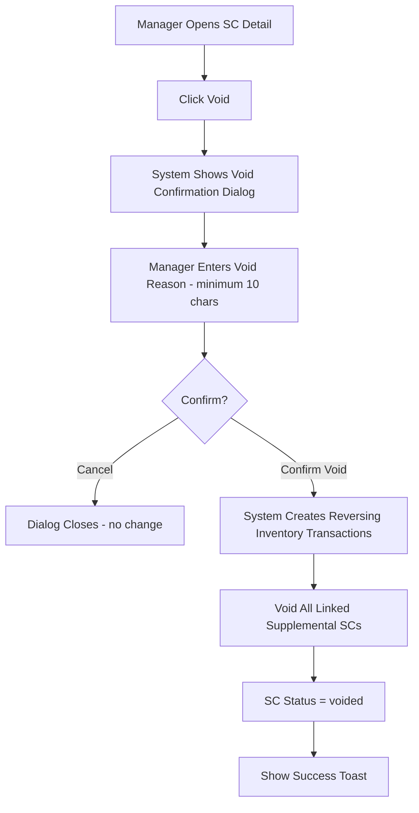
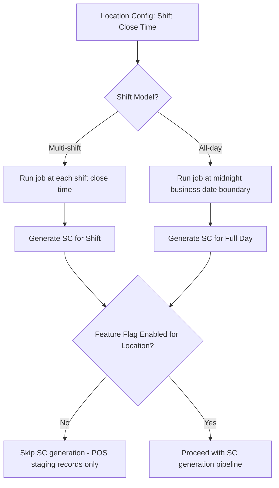
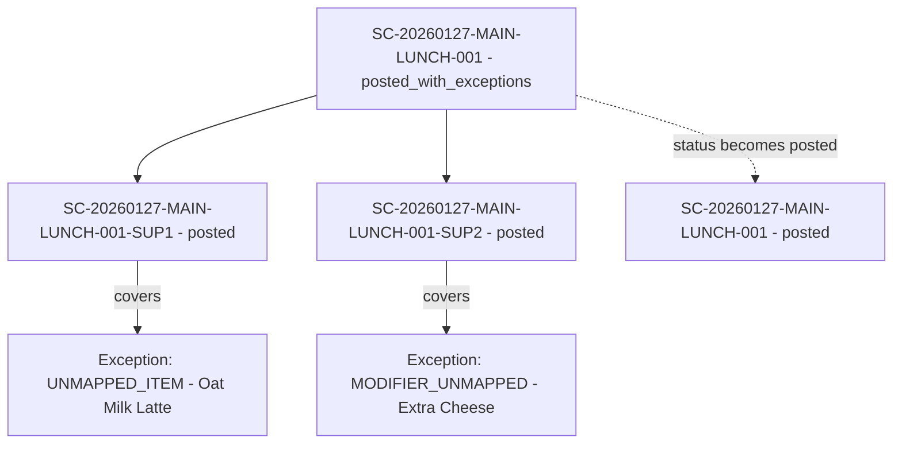
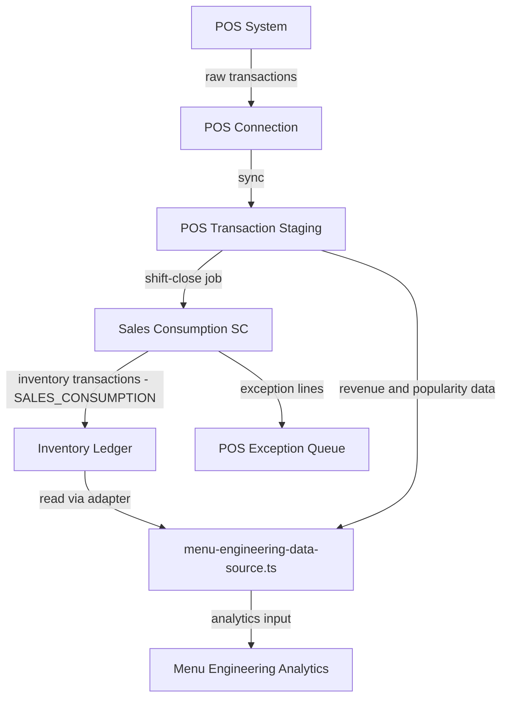

# Flow Diagrams: Sales Consumption

## Module Information
- **Module**: Store Operations
- **Sub-Module**: Sales Consumption
- **Version**: 1.0.0
- **Last Updated**: 2026-01-27

---

## SC Generation Pipeline (Shift Close)

---

## SC Status Transitions

---

## Exception Resolution Flow (POS to Supplemental SC)

---

## Void Flow

---

## Auto-Generation Schedule (per Location)

---

## Supplemental SC Relationship

---

## Data Flow: POS to Menu Engineering

---

**Document End**
