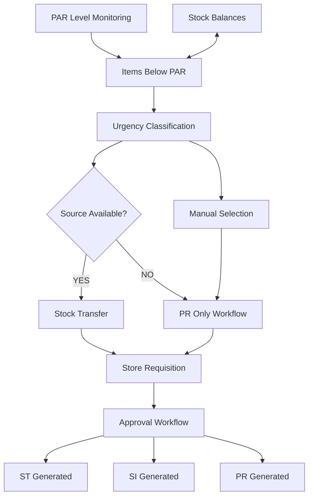
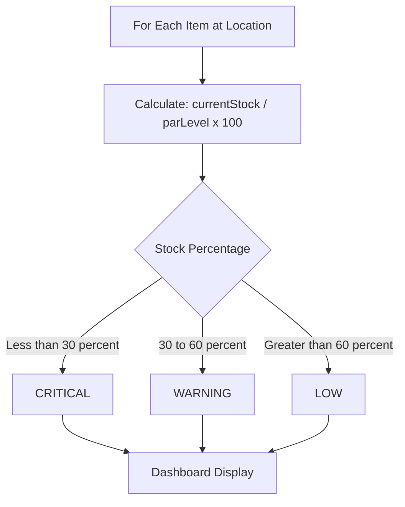
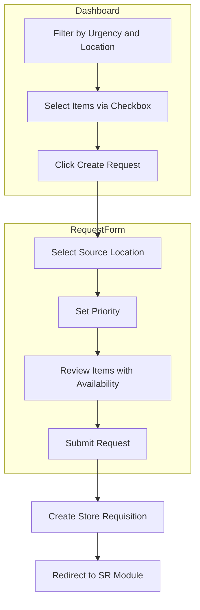
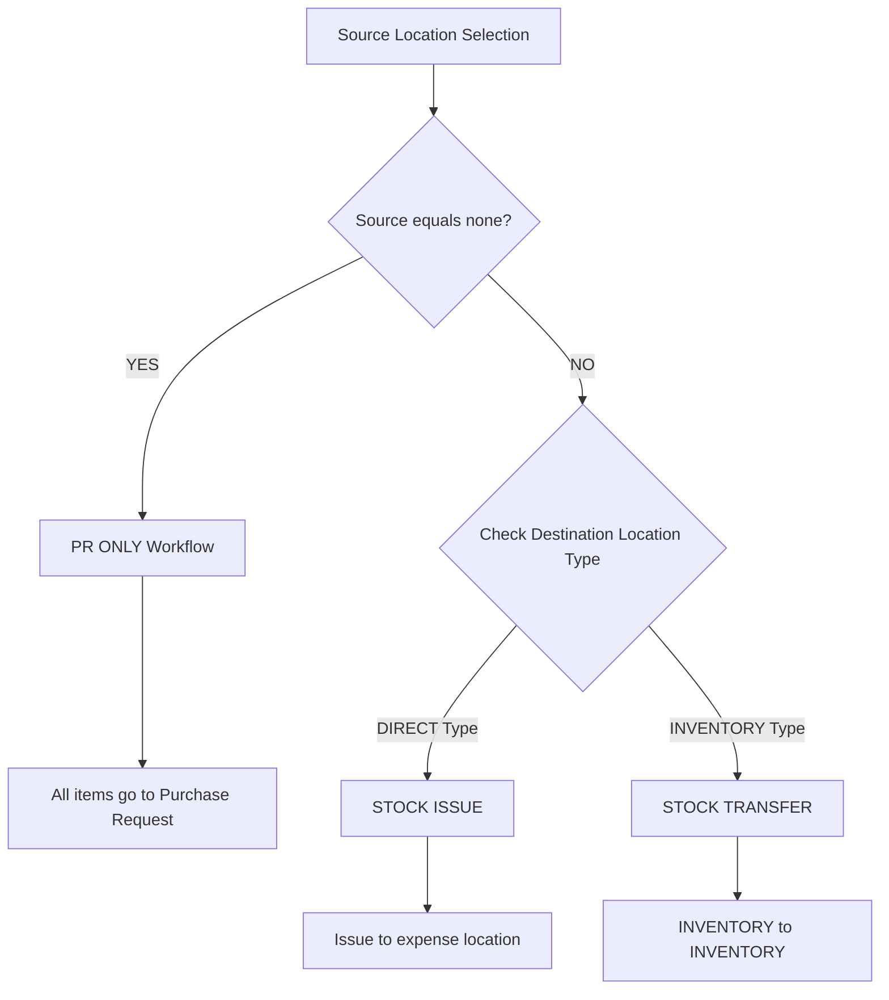
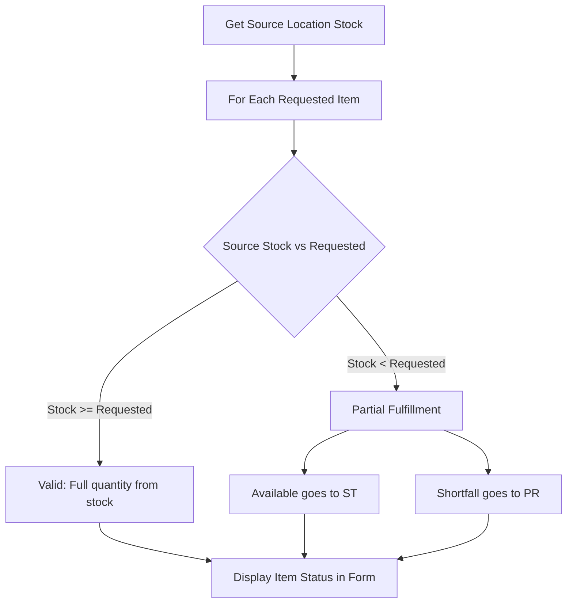
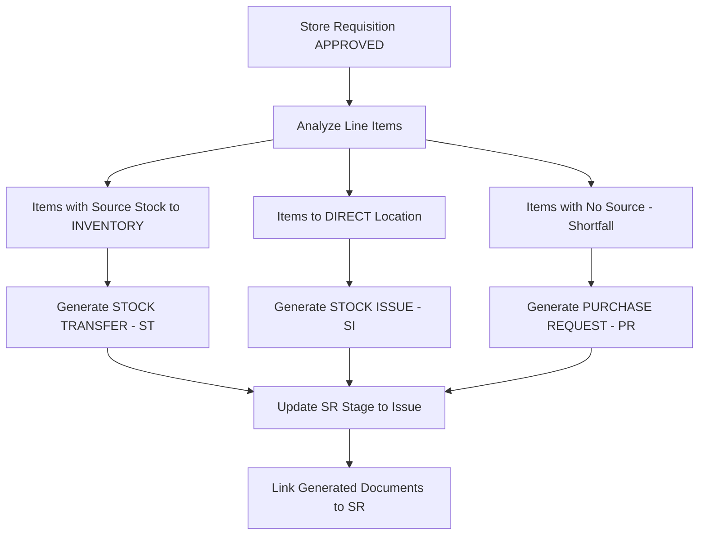
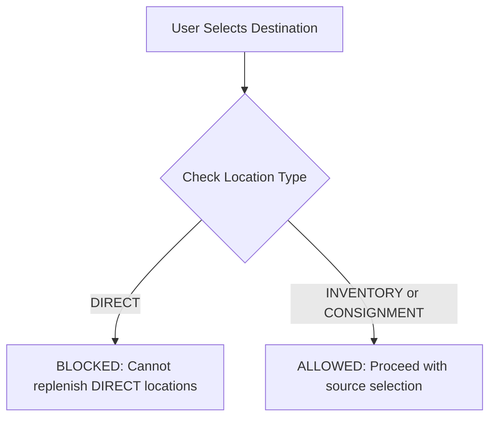
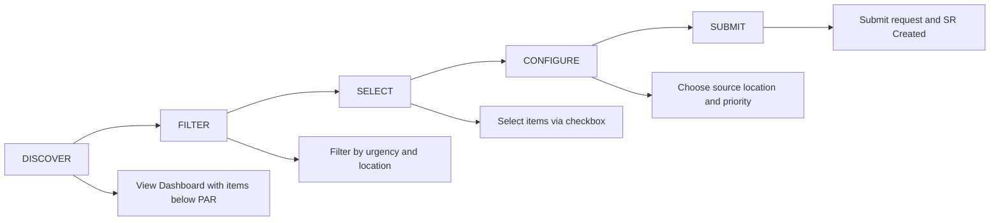
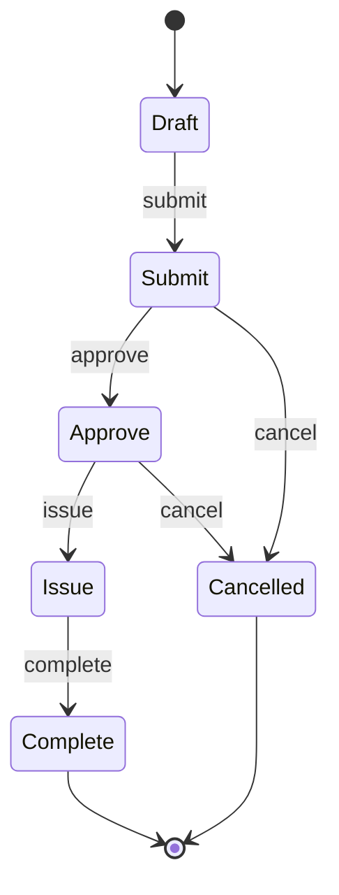

# Flow Diagrams: Stock Replenishment Module

## 1. High-Level System Flow

## 2. Urgency Classification Flow

## 3. Replenishment Request Creation Flow

## 4. Workflow Type Determination Flow

## 5. Source Availability Check Flow

## 6. Document Generation Flow

## 7. Location Type Validation Flow

### Source Location Validation

| Location Type | Can Be Source? | Reason |
|---------------|----------------|--------|
| INVENTORY | YES | Has stock balance to transfer |
| DIRECT | NO | No inventory exists |
| CONSIGNMENT | YES with warning | Requires vendor notification |
| none | SPECIAL | PR-only workflow |

### Destination Location Validation

| Location Type | Can Receive? | Reason |
|---------------|--------------|--------|
| INVENTORY | YES | Has PAR levels, tracks stock |
| DIRECT | NO | No PAR levels, immediate expense |
| CONSIGNMENT | YES | Has PAR levels |

## 8. User Journey Flow

## 9. State Transition Diagram

### Stage to Status Mapping

| Stage | Status |
|-------|--------|
| Draft | Draft |
| Submit | InProgress |
| Approve | InProgress |
| Issue | InProgress |
| Complete | Completed |

### Status Values (5)

| Status | Description |
|--------|-------------|
| Draft | Initial state |
| InProgress | Being processed (Submit, Approve, Issue stages) |
| Completed | Fully processed |
| Cancelled | Cancelled by user |
| Voided | Voided after completion |

---

## Version History

| Version | Date | Author | Changes |
|---------|------|--------|---------|
| 1.0.0 | 2024-12-01 | System | Initial creation with ASCII art diagrams |
| 1.1.0 | 2025-01-15 | Claude | Updated State Transition Diagram to Stage-based workflow model |
| 1.2.0 | 2025-01-15 | Claude | Converted all diagrams to Mermaid 8.8.2 compatible syntax |
| 1.2.1 | 2025-01-15 | Claude | Fixed stateDiagram-v2 rendering by removing unsupported note syntax |
