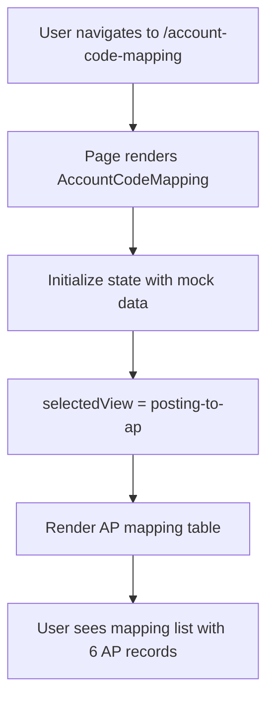
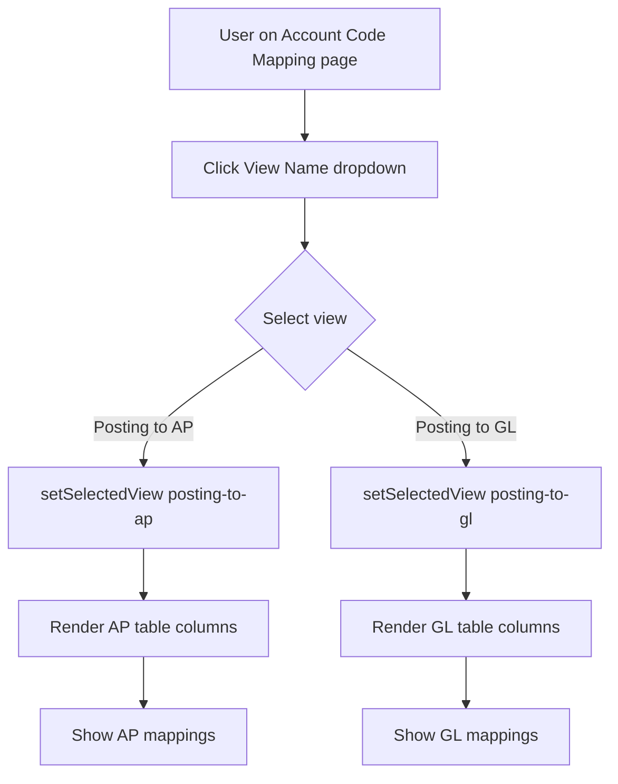
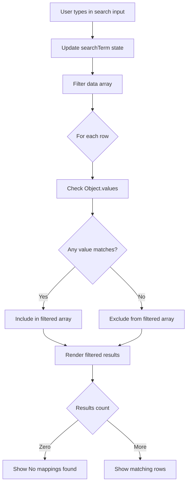
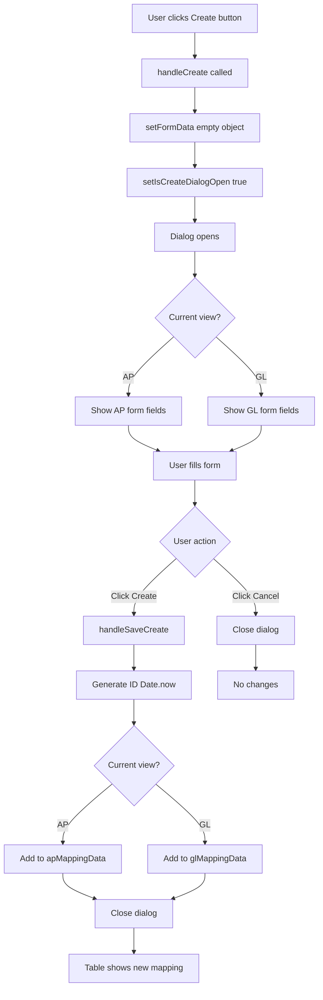
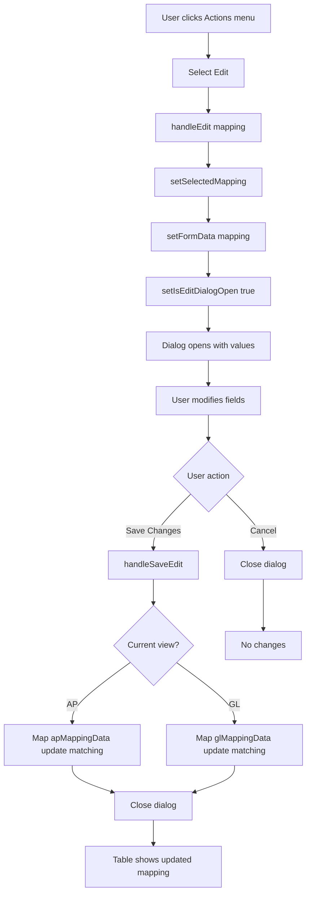
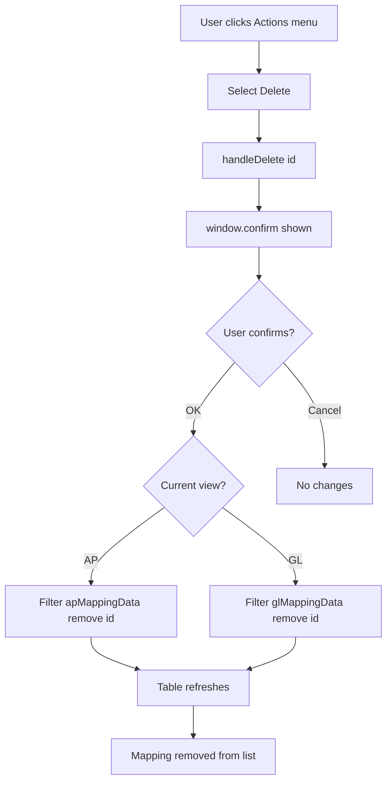
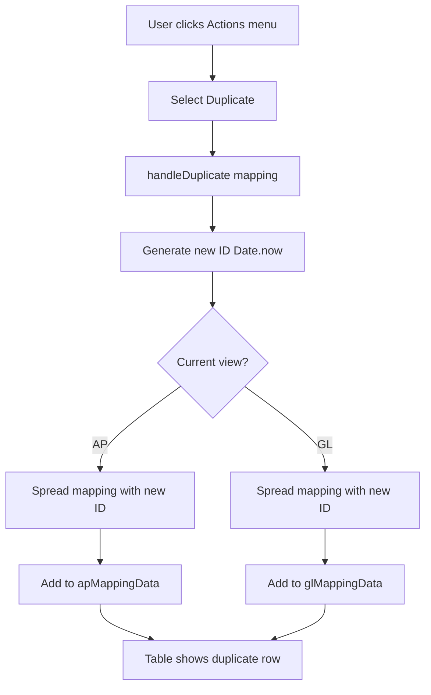
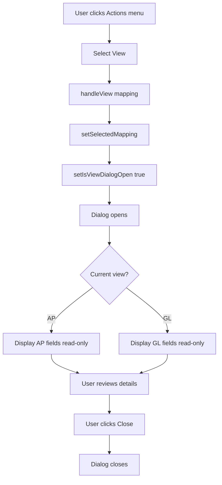
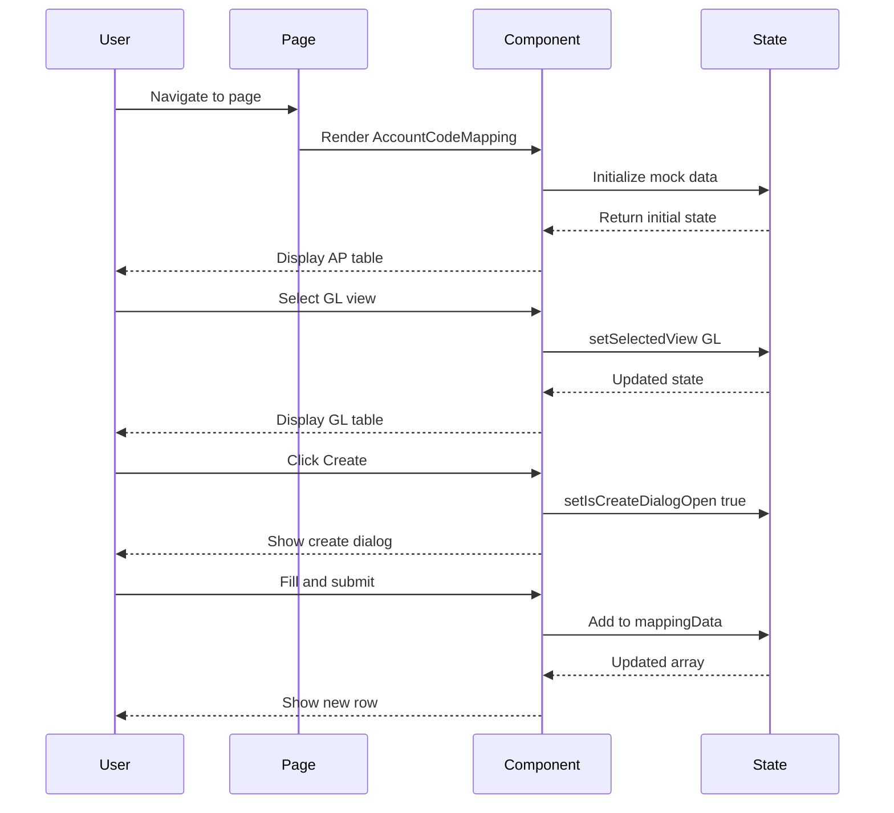

# Flow Diagrams: Account Code Mapping

## Module Information
- **Module**: System Administration
- **Sub-Module**: Account Code Mapping
- **Route**: `/system-administration/account-code-mapping`
- **Version**: 1.0.0
- **Last Updated**: 2026-01-17
- **Owner**: Finance Team
- **Status**: Active

## Document History

| Version | Date | Author | Changes |
|---------|------|--------|---------|
| 1.0.0 | 2026-01-17 | Documentation Team | Initial version |

---

## Overview

This document provides visual representations of the Account Code Mapping module workflows.

**Related Documents**:
- [Business Requirements](./BR-account-code-mapping.md)
- [Use Cases](./UC-account-code-mapping.md)
- [Data Dictionary](./DD-account-code-mapping.md)
- [Technical Specification](./TS-account-code-mapping.md)
- [Validation Rules](./VAL-account-code-mapping.md)

---

## Page Load Flow



---

## View Switching Flow



---

## Search Flow



---

## Create Mapping Flow



---

## Edit Mapping Flow



---

## Delete Mapping Flow



---

## Duplicate Mapping Flow



---

## View Details Flow



---

## Component Interaction



---

## Data Flow Summary

```
User Actions              State Updates              UI Updates
-----------              -------------              ----------
Select view         -->  setSelectedView       -->  Switch table
Type in search      -->  setSearchTerm         -->  Filter rows
Click Create        -->  setIsCreateDialogOpen -->  Show dialog
Submit create       -->  setMappingData        -->  Add row
Click Edit          -->  setSelectedMapping    -->  Show dialog
Submit edit         -->  setMappingData        -->  Update row
Click Delete        -->  confirm then filter   -->  Remove row
Click Duplicate     -->  setMappingData        -->  Add row
Click View          -->  setSelectedMapping    -->  Show dialog
Click Print         -->  window.print          -->  Print dialog
```

---

**Document End**
