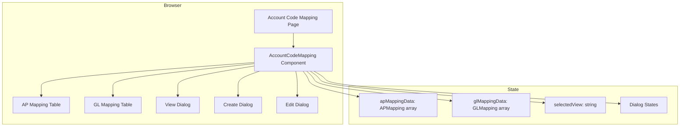
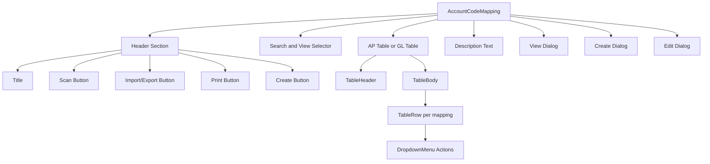
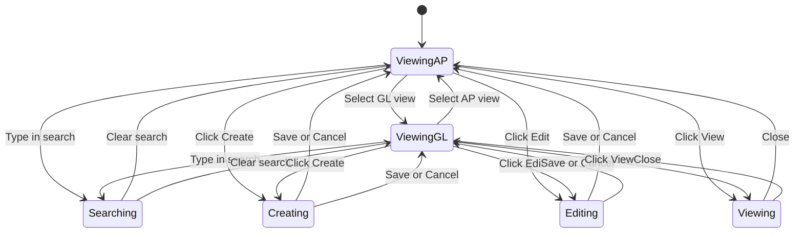

# Technical Specification: Account Code Mapping

## Module Information
- **Module**: System Administration
- **Sub-Module**: Account Code Mapping
- **Route**: `/system-administration/account-code-mapping`
- **Version**: 1.0.0
- **Last Updated**: 2026-01-17
- **Owner**: Finance Team
- **Status**: Active

## Document History

| Version | Date | Author | Changes |
|---------|------|--------|---------|
| 1.0.0 | 2026-01-17 | Documentation Team | Initial version |

---

## Overview

The Account Code Mapping module provides a single-page interface for managing financial posting configurations. The implementation uses a React client component with local state management.

**Related Documents**:
- [Business Requirements](./BR-account-code-mapping.md)
- [Use Cases](./UC-account-code-mapping.md)
- [Data Dictionary](./DD-account-code-mapping.md)
- [Flow Diagrams](./FD-account-code-mapping.md)
- [Validation Rules](./VAL-account-code-mapping.md)

---

## Architecture

### System Architecture



### Technology Stack

| Layer | Technology | Purpose |
|-------|------------|---------|
| Framework | Next.js 14 (App Router) | Page routing |
| Language | TypeScript | Type safety |
| UI Library | shadcn/ui | UI components |
| Styling | Tailwind CSS | Component styling |
| State | React useState | Local state management |
| Icons | Lucide React | UI icons |

---

## Module Structure

### File Organization

```
app/(main)/system-administration/account-code-mapping/
└── page.tsx                           # Route page (5 lines)

components/
└── account-code-mapping.tsx           # Main component (837 lines)
```

### Page Component

**File**: `app/(main)/system-administration/account-code-mapping/page.tsx`

**Purpose**: Route entry point that renders the AccountCodeMapping component.

---

## Component Architecture

### AccountCodeMapping

**File**: `components/account-code-mapping.tsx`

**Type**: Client Component ('use client')

**Responsibilities**:
- Display AP and GL mapping tables
- Handle view switching
- Manage CRUD dialogs
- Process search filtering
- Handle mapping operations

### Component Hierarchy



---

## State Management

### State Variables

| State | Type | Purpose |
|-------|------|---------|
| selectedView | string | Current view type (posting-to-ap or posting-to-gl) |
| searchTerm | string | Search filter value |
| isCreateDialogOpen | boolean | Create dialog visibility |
| isEditDialogOpen | boolean | Edit dialog visibility |
| isViewDialogOpen | boolean | View dialog visibility |
| selectedMapping | APMapping or GLMapping or null | Selected mapping for view/edit |
| apMappingData | APMapping[] | AP mapping records |
| glMappingData | GLMapping[] | GL mapping records |
| formData | Partial<APMapping or GLMapping> | Form input values |

### State Flow



---

## UI Components Used

### shadcn/ui Components

| Component | Usage |
|-----------|-------|
| Button | Action buttons |
| Input | Search input, form fields |
| Table, TableHeader, TableBody, TableRow, TableHead, TableCell | Mapping tables |
| Select, SelectContent, SelectItem, SelectTrigger, SelectValue | View selector |
| Dialog, DialogContent, DialogHeader, DialogTitle, DialogDescription, DialogFooter, DialogClose | CRUD dialogs |
| DropdownMenu, DropdownMenuContent, DropdownMenuItem, DropdownMenuTrigger | Row actions |
| Label | Form field labels |

### Lucide Icons

| Icon | Usage |
|------|-------|
| ScanIcon | Scan button |
| DownloadIcon | Import/Export button |
| PrinterIcon | Print button |
| Plus | Create button |
| MoreHorizontal | Actions menu trigger |
| Eye | View action |
| Edit | Edit action |
| Copy | Duplicate action |
| Trash2 | Delete action |

---

## Event Handlers

### Handler Functions

| Function | Trigger | Action |
|----------|---------|--------|
| handleCreate | Click Create button | Opens create dialog with empty form |
| handleView | Click View in dropdown | Opens view dialog with selected mapping |
| handleEdit | Click Edit in dropdown | Opens edit dialog with current values |
| handleDelete | Click Delete in dropdown | Shows confirm, removes mapping |
| handleDuplicate | Click Duplicate in dropdown | Copies mapping with new ID |
| handleSaveCreate | Click Create in dialog | Adds mapping to state array |
| handleSaveEdit | Click Save Changes in dialog | Updates mapping in state array |
| handleScan | Click Scan button | Shows placeholder alert |
| handleImportExport | Click Import/Export button | Shows placeholder alert |
| handlePrint | Click Print button | Calls window.print() |

---

## Routing

| Route | Page | Component |
|-------|------|-----------|
| `/system-administration/account-code-mapping` | page.tsx | AccountCodeMapping |

### Navigation

- No sub-routes (single page module)
- No dynamic routes
- Part of System Administration navigation

---

## Integration Points

### Current Integrations

| Integration | Type | Description |
|-------------|------|-------------|
| None | - | Standalone module with mock data |

### Planned Integrations

| Module | Integration Type | Purpose |
|--------|-----------------|---------|
| Procurement | Consumer | AP posting configuration |
| Inventory | Consumer | GL posting configuration |
| Chart of Accounts | Reference | Account code validation |

---

## Future Enhancements

| Phase | Enhancement | Technical Approach |
|-------|-------------|-------------------|
| Phase 2 | Database Integration | Prisma ORM with PostgreSQL |
| Phase 2 | Scan Feature | Query for unmapped combinations |
| Phase 2 | Import/Export CSV | File upload with Papa Parse |
| Phase 3 | Account Validation | Validate codes against COA |
| Phase 3 | Audit Trail | Track mapping changes |

---

## Performance Considerations

### Current Implementation

- **Rendering**: Table re-renders on state change
- **Filtering**: Client-side filtering
- **Data Size**: Mock data with 6 AP and 5 GL mappings

### Optimization Opportunities

- Add useMemo for filtered data
- Implement virtual scrolling for large datasets
- Add debounce to search input

---

**Document End**
