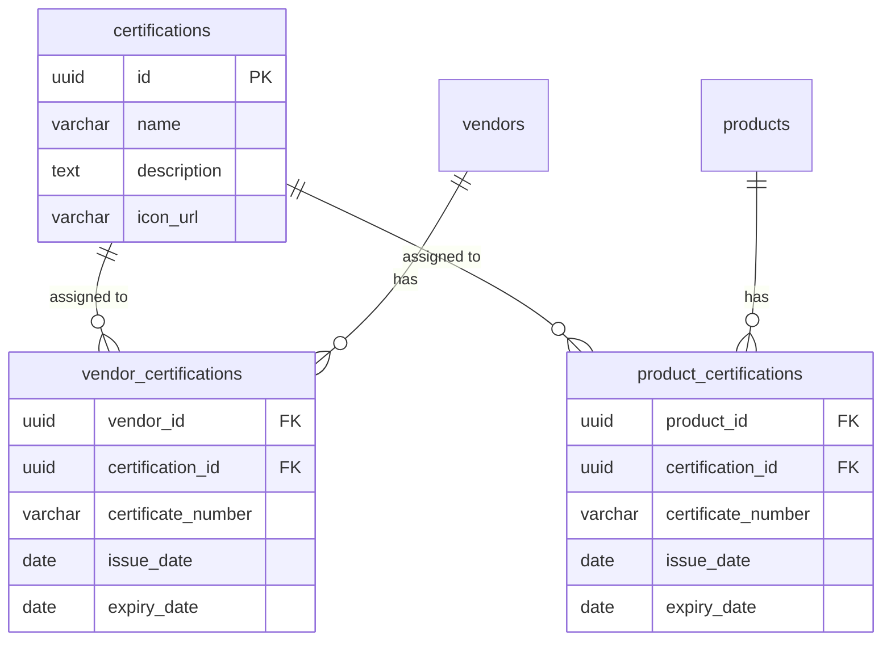

# Data Dictionary: Certifications

## Module Information
- **Module**: System Administration
- **Sub-Module**: Certifications
- **Route**: `/system-administration/certifications`
- **Version**: 1.0.0
- **Last Updated**: 2026-01-17
- **Owner**: System Administration Team
- **Status**: Active

## Document History

| Version | Date | Author | Changes |
|---------|------|--------|---------|
| 1.0.0 | 2026-01-17 | Documentation Team | Initial version |

---

## Overview

This document defines the data structures for the Certifications module. The implementation uses Zod schemas for validation and server actions for database operations.

**Related Documents**:
- [Business Requirements](./BR-certifications.md)
- [Use Cases](./UC-certifications.md)
- [Technical Specification](./TS-certifications.md)
- [Flow Diagrams](./FD-certifications.md)
- [Validation Rules](./VAL-certifications.md)

---

## Data Structures

### CertificationSchema (Zod)

**Location**: `actions/certification-actions.ts`

```typescript
const CertificationSchema = z.object({
  id: z.string(),
  name: z.string(),
  description: z.string().optional(),
  icon_url: z.string().optional(),
})
```

### Field Definitions

| Field | Type | Required | Description |
|-------|------|----------|-------------|
| id | string | Yes | Unique identifier (UUID) |
| name | string | Yes | Certification name |
| description | string | No | Certification description |
| icon_url | string | No | URL to certification icon |

### Extended Fields (Edit Form)

| Field | Type | Required | Description |
|-------|------|----------|-------------|
| issuer | string | No | Issuing organization |
| validityPeriod | string | No | Typical validity period |
| requiredDocuments | string | No | Documents needed for certification |

---

## Assignment Schemas

### VendorCertificationSchema

**Location**: `actions/certification-actions.ts`

```typescript
z.object({
  certificate_number: z.string().optional(),
  issue_date: z.string().optional(),
  expiry_date: z.string().optional(),
  document_url: z.string().optional(),
})
```

### ProductCertificationSchema

**Location**: `actions/certification-actions.ts`

```typescript
z.object({
  certificate_number: z.string().optional(),
  issue_date: z.string().optional(),
  expiry_date: z.string().optional(),
  document_url: z.string().optional(),
})
```

### Assignment Field Definitions

| Field | Type | Required | Description |
|-------|------|----------|-------------|
| certificate_number | string | No | Certificate reference number |
| issue_date | string | No | Date certificate was issued |
| expiry_date | string | No | Certificate expiration date |
| document_url | string | No | URL to certificate document |

---

## Database Tables (Planned)

### certifications

| Column | Type | Constraints | Description |
|--------|------|-------------|-------------|
| id | UUID | PRIMARY KEY | Unique identifier |
| name | VARCHAR(255) | NOT NULL | Certification name |
| description | TEXT | NULL | Certification description |
| icon_url | VARCHAR(500) | NULL | URL to icon |
| issuer | VARCHAR(255) | NULL | Issuing organization |
| validity_period | VARCHAR(100) | NULL | Typical validity |
| required_documents | TEXT | NULL | Required documents |
| created_at | TIMESTAMP | DEFAULT NOW() | Record creation time |
| updated_at | TIMESTAMP | NULL | Last update time |

### vendor_certifications

| Column | Type | Constraints | Description |
|--------|------|-------------|-------------|
| vendor_id | UUID | FOREIGN KEY | Reference to vendors |
| certification_id | UUID | FOREIGN KEY | Reference to certifications |
| certificate_number | VARCHAR(100) | NULL | Certificate reference |
| issue_date | DATE | NULL | Issue date |
| expiry_date | DATE | NULL | Expiration date |
| document_url | VARCHAR(500) | NULL | Certificate document URL |
| PRIMARY KEY | (vendor_id, certification_id) | | Composite key |

### product_certifications

| Column | Type | Constraints | Description |
|--------|------|-------------|-------------|
| product_id | UUID | FOREIGN KEY | Reference to products |
| certification_id | UUID | FOREIGN KEY | Reference to certifications |
| certificate_number | VARCHAR(100) | NULL | Certificate reference |
| issue_date | DATE | NULL | Issue date |
| expiry_date | DATE | NULL | Expiration date |
| document_url | VARCHAR(500) | NULL | Certificate document URL |
| PRIMARY KEY | (product_id, certification_id) | | Composite key |

---

## Data Operations

### fetchCertifications

**Location**: `app/lib/data.ts`
**Purpose**: Retrieves all certifications from database.
**Returns**: `Certification[]`

### fetchCertificationById

**Location**: `app/lib/data.ts`
**Purpose**: Retrieves a single certification by ID.
**Parameters**: `id: string`
**Returns**: `Certification | null`

### createCertification

**Location**: `actions/certification-actions.ts`
**Purpose**: Creates a new certification record.
**Input**: FormData with name, description, icon_url
**Side Effects**: Revalidates path, redirects to list

### updateCertification

**Location**: `actions/certification-actions.ts`
**Purpose**: Updates an existing certification.
**Input**: id: string, FormData
**Side Effects**: Revalidates path, redirects to list

### deleteCertification

**Location**: `actions/certification-actions.ts`
**Purpose**: Removes a certification record.
**Input**: id: string
**Side Effects**: Revalidates path

### addCertificationToVendor

**Location**: `actions/certification-actions.ts`
**Purpose**: Assigns certification to a vendor.
**Input**: vendorId, certificationId, FormData
**Side Effects**: Revalidates vendor page

### removeCertificationFromVendor

**Location**: `actions/certification-actions.ts`
**Purpose**: Removes certification from a vendor.
**Input**: vendorId, certificationId
**Side Effects**: Revalidates vendor page

### addCertificationToProduct

**Location**: `actions/certification-actions.ts`
**Purpose**: Assigns certification to a product.
**Input**: productId, certificationId, FormData
**Side Effects**: Revalidates product page

### removeCertificationFromProduct

**Location**: `actions/certification-actions.ts`
**Purpose**: Removes certification from a product.
**Input**: productId, certificationId
**Side Effects**: Revalidates product page

---

## Sample Data

### Example Certifications

| Name | Description |
|------|-------------|
| Halal | Halal certification for food products |
| Organic | Certified organic product |
| ISO 9001 | Quality management system certification |
| HACCP | Hazard Analysis Critical Control Points |
| Fair Trade | Fair trade certified products |

---

## Data Relationships



---

**Document End**
