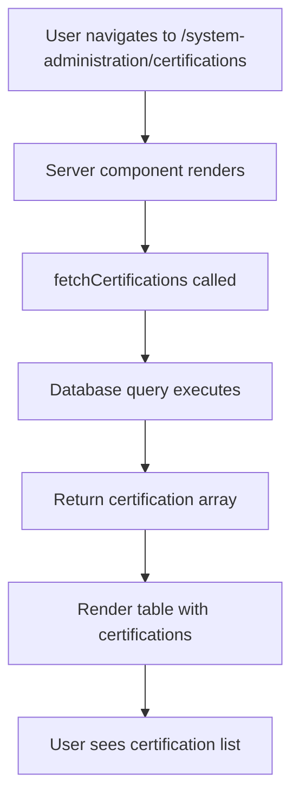
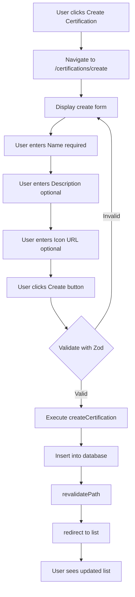
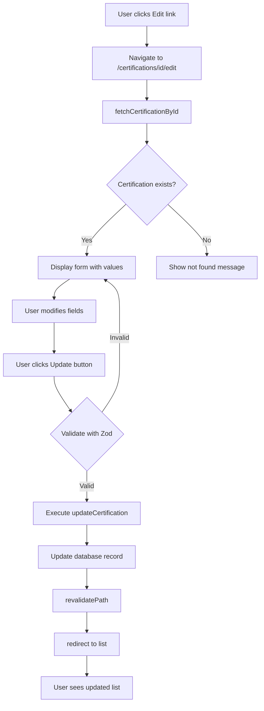
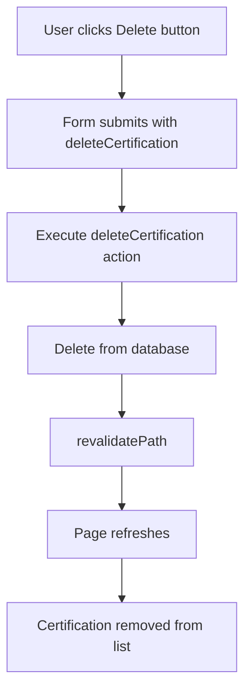
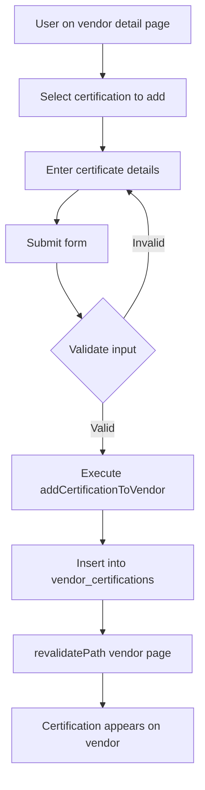
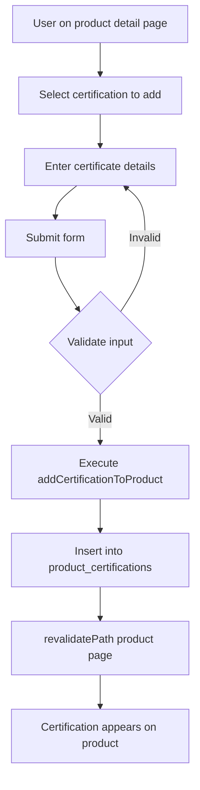
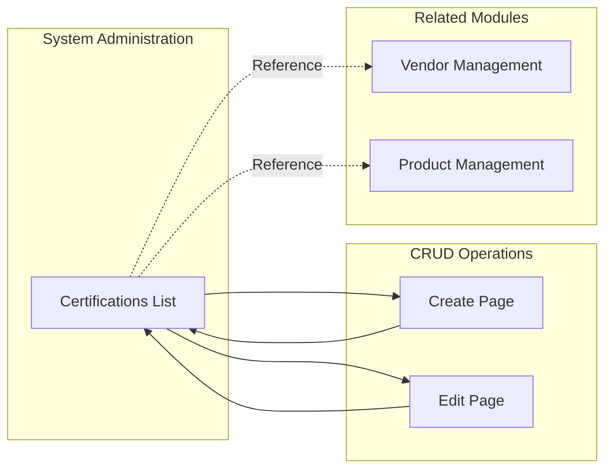
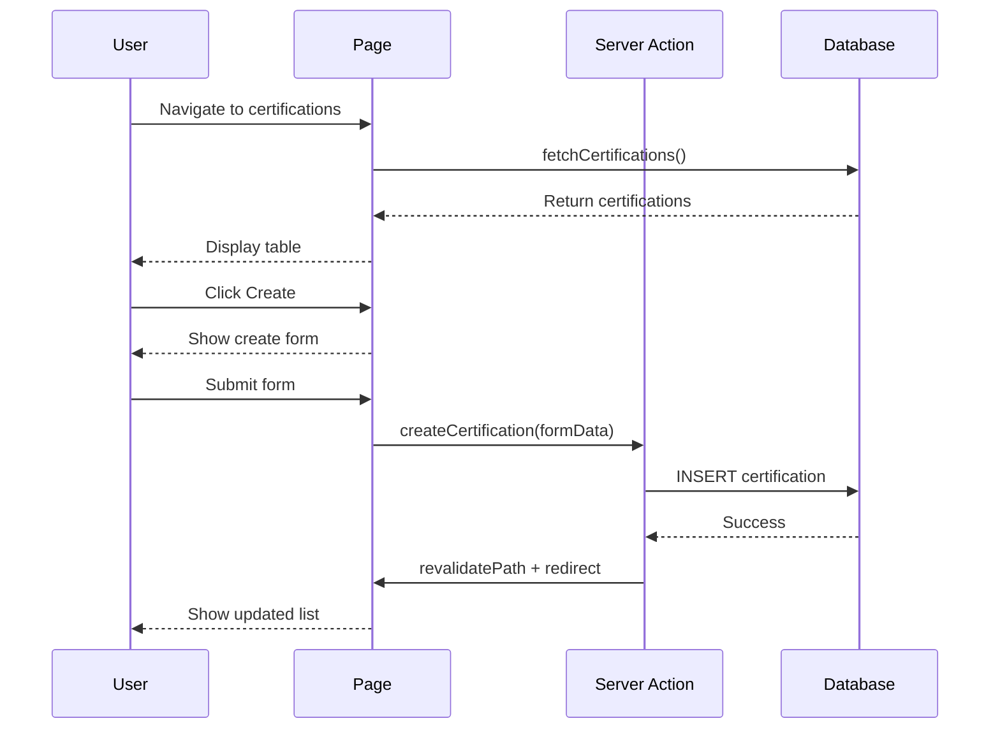

# Flow Diagrams: Certifications

## Module Information
- **Module**: System Administration
- **Sub-Module**: Certifications
- **Route**: `/system-administration/certifications`
- **Version**: 1.0.0
- **Last Updated**: 2026-01-17
- **Owner**: System Administration Team
- **Status**: Active

## Document History

| Version | Date | Author | Changes |
|---------|------|--------|---------|
| 1.0.0 | 2026-01-17 | Documentation Team | Initial version |

---

## Overview

This document provides visual representations of the Certifications module workflows.

**Related Documents**:
- [Business Requirements](./BR-certifications.md)
- [Use Cases](./UC-certifications.md)
- [Data Dictionary](./DD-certifications.md)
- [Technical Specification](./TS-certifications.md)
- [Validation Rules](./VAL-certifications.md)

---

## Page Load Flow



---

## Create Certification Flow



---

## Edit Certification Flow



---

## Delete Certification Flow



---

## Assign to Vendor Flow



---

## Assign to Product Flow



---

## Navigation Flow



---

## Component Interaction



---

## Data Flow Summary

```
User Actions              Server Processing         Database
-----------              -----------------         --------
View list           -->  fetchCertifications  -->  SELECT * FROM certifications
Click Create        -->  Navigate to form
Submit create       -->  createCertification  -->  INSERT INTO certifications
Click Edit          -->  fetchCertificationById -> SELECT WHERE id = ?
Submit edit         -->  updateCertification  -->  UPDATE WHERE id = ?
Click Delete        -->  deleteCertification  -->  DELETE WHERE id = ?
Assign to vendor    -->  addCertificationToVendor -> INSERT INTO vendor_certifications
Assign to product   -->  addCertificationToProduct -> INSERT INTO product_certifications
```

---

**Document End**
