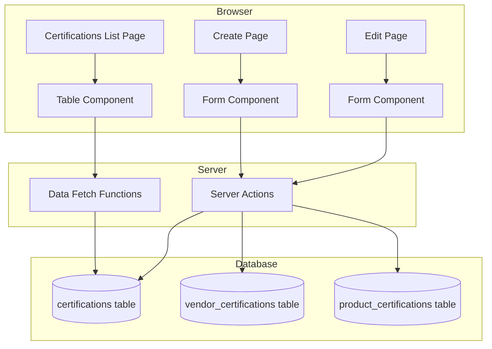
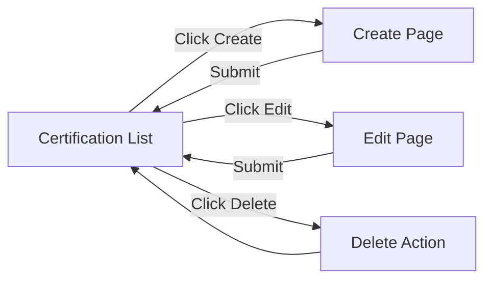

# Technical Specification: Certifications

## Module Information
- **Module**: System Administration
- **Sub-Module**: Certifications
- **Route**: `/system-administration/certifications`
- **Version**: 1.0.0
- **Last Updated**: 2026-01-17
- **Owner**: System Administration Team
- **Status**: Active

## Document History

| Version | Date | Author | Changes |
|---------|------|--------|---------|
| 1.0.0 | 2026-01-17 | Documentation Team | Initial version |

---

## Overview

The Certifications module provides CRUD operations for certification type management and assignment to vendors and products. The implementation uses Next.js server components with server actions for data operations.

**Related Documents**:
- [Business Requirements](./BR-certifications.md)
- [Use Cases](./UC-certifications.md)
- [Data Dictionary](./DD-certifications.md)
- [Flow Diagrams](./FD-certifications.md)
- [Validation Rules](./VAL-certifications.md)

---

## Architecture

### System Architecture



### Technology Stack

| Layer | Technology | Purpose |
|-------|------------|---------|
| Framework | Next.js 14 (App Router) | Page routing and server components |
| Language | TypeScript | Type safety |
| UI Library | shadcn/ui | UI components |
| Styling | Tailwind CSS | Component styling |
| Validation | Zod | Schema validation |
| Data | Server Actions | Database operations |

---

## Module Structure

### File Organization

```
app/(main)/system-administration/certifications/
├── page.tsx                     # List page (server component)
├── create/
│   └── page.tsx                 # Create certification page
└── [id]/
    └── edit/
        └── page.tsx             # Edit certification page

actions/
└── certification-actions.ts     # Server actions for CRUD

app/lib/
└── data.ts                      # Data fetching functions
```

---

## Page Components

### List Page

**File**: `app/(main)/system-administration/certifications/page.tsx`

**Type**: Server Component

**Responsibilities**:
- Fetch all certifications using fetchCertifications()
- Display certifications in table format
- Provide Edit links and Delete buttons per row
- Show mobile-responsive card view

**Route**: `/system-administration/certifications`

### Create Page

**File**: `app/(main)/system-administration/certifications/create/page.tsx`

**Type**: Server Component with form

**Responsibilities**:
- Display create form with Name, Description, Icon URL fields
- Submit form to createCertification server action
- Validate required name field

**Route**: `/system-administration/certifications/create`

### Edit Page

**File**: `app/(main)/system-administration/certifications/[id]/edit/page.tsx`

**Type**: Server Component with form

**Responsibilities**:
- Fetch certification by ID using fetchCertificationById()
- Display edit form with current values
- Submit form to updateCertification server action
- Handle certification not found case

**Route**: `/system-administration/certifications/[id]/edit`

---

## Server Actions

### createCertification

**File**: `actions/certification-actions.ts`

**Purpose**: Creates a new certification record.

**Input**: FormData containing name, description, icon_url

**Process**:
1. Parse FormData with Zod schema (excluding id)
2. Execute database INSERT
3. Revalidate certifications path
4. Redirect to certification list

### updateCertification

**File**: `actions/certification-actions.ts`

**Purpose**: Updates an existing certification.

**Input**: id (string), FormData

**Process**:
1. Parse FormData with Zod schema
2. Execute database UPDATE with WHERE id = ?
3. Revalidate certifications path
4. Redirect to certification list

### deleteCertification

**File**: `actions/certification-actions.ts`

**Purpose**: Removes a certification record.

**Input**: id (string)

**Process**:
1. Execute database DELETE with WHERE id = ?
2. Revalidate certifications path

### addCertificationToVendor

**File**: `actions/certification-actions.ts`

**Purpose**: Assigns certification to a vendor.

**Input**: vendorId, certificationId, FormData

**Process**:
1. Parse FormData for certificate details
2. Execute INSERT into vendor_certifications
3. Revalidate vendor page path

### removeCertificationFromVendor

**File**: `actions/certification-actions.ts`

**Purpose**: Removes certification from a vendor.

**Input**: vendorId, certificationId

**Process**:
1. Execute DELETE from vendor_certifications
2. Revalidate vendor page path

### addCertificationToProduct

**File**: `actions/certification-actions.ts`

**Purpose**: Assigns certification to a product.

**Input**: productId, certificationId, FormData

**Process**:
1. Parse FormData for certificate details
2. Execute INSERT into product_certifications
3. Revalidate product page path

### removeCertificationFromProduct

**File**: `actions/certification-actions.ts`

**Purpose**: Removes certification from a product.

**Input**: productId, certificationId

**Process**:
1. Execute DELETE from product_certifications
2. Revalidate product page path

---

## Navigation Flow



---

## UI Components Used

### shadcn/ui Components

| Component | Usage |
|-----------|-------|
| Button | Action buttons |
| Input | Text input fields |
| Textarea | Multi-line text fields |

### Heroicons

| Icon | Usage |
|------|-------|
| PlusIcon | Create Certification button |

---

## Routing

| Route | Page | Purpose |
|-------|------|---------|
| `/system-administration/certifications` | page.tsx | List all certifications |
| `/system-administration/certifications/create` | create/page.tsx | Create new certification |
| `/system-administration/certifications/[id]/edit` | [id]/edit/page.tsx | Edit certification |

---

## Data Fetching

### fetchCertifications

**Location**: `app/lib/data.ts`

**Type**: Async function

**Returns**: Array of certification objects

**Caching**: Uses Next.js data cache with revalidation

### fetchCertificationById

**Location**: `app/lib/data.ts`

**Type**: Async function

**Parameters**: id (string)

**Returns**: Single certification object or null

---

## Integration Points

### Vendor Management

- Vendor detail page can display assigned certifications
- addCertificationToVendor links certification to vendor
- removeCertificationFromVendor removes the link

### Product Management

- Product detail page can display assigned certifications
- addCertificationToProduct links certification to product
- removeCertificationFromProduct removes the link

---

## Future Enhancements

| Phase | Enhancement | Technical Approach |
|-------|-------------|-------------------|
| Phase 2 | Database Integration | Replace SQL comments with actual queries |
| Phase 2 | Expiry Notifications | Scheduled job to check expiry dates |
| Phase 3 | File Upload | Document upload for certificates |
| Phase 3 | Search and Filter | Add search and filtering to list |

---

**Document End**
