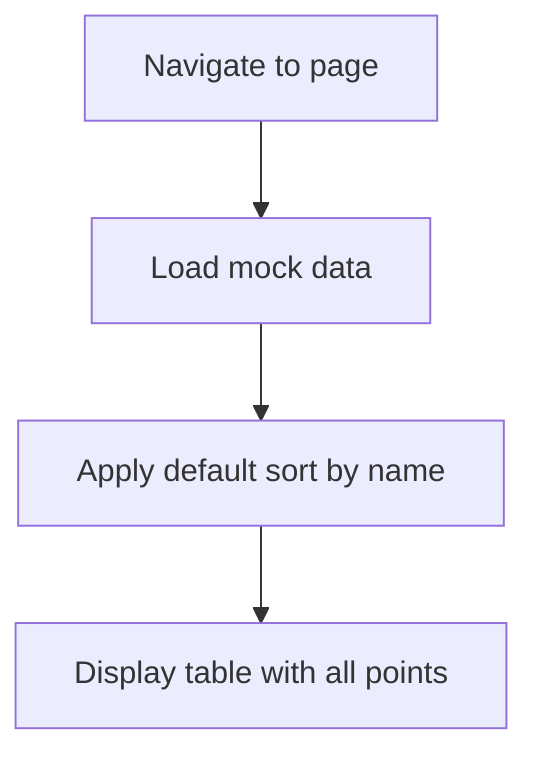
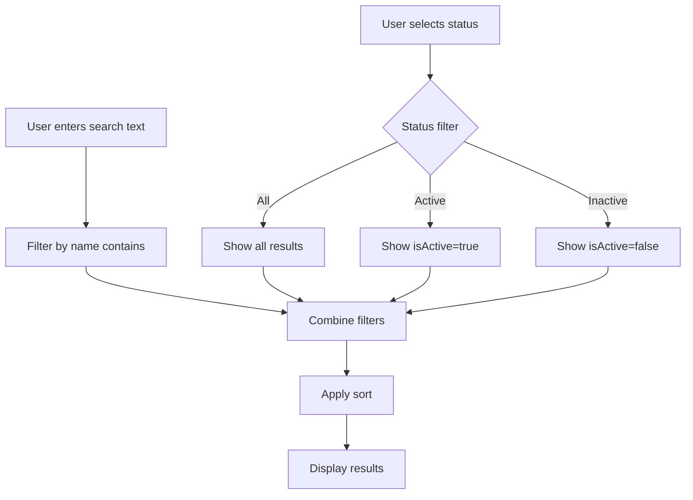
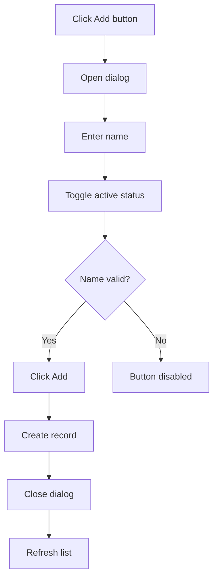
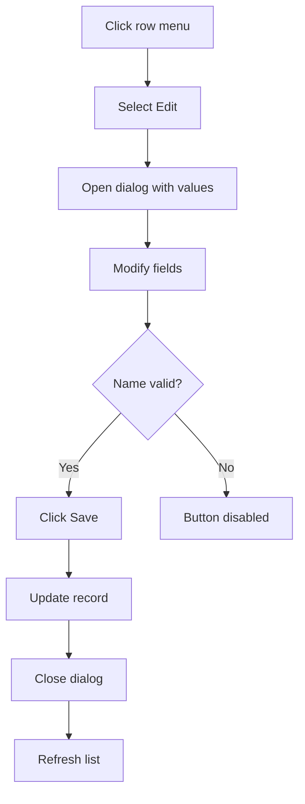
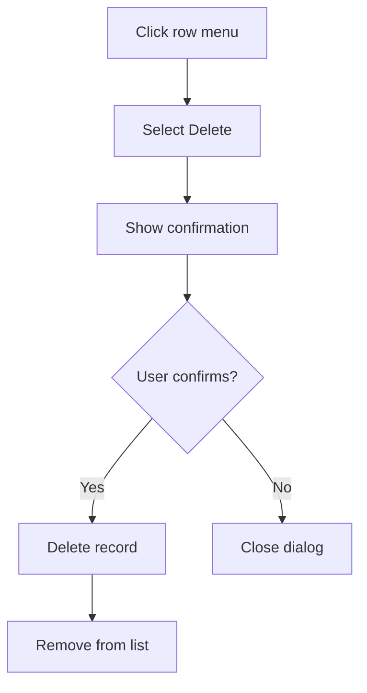
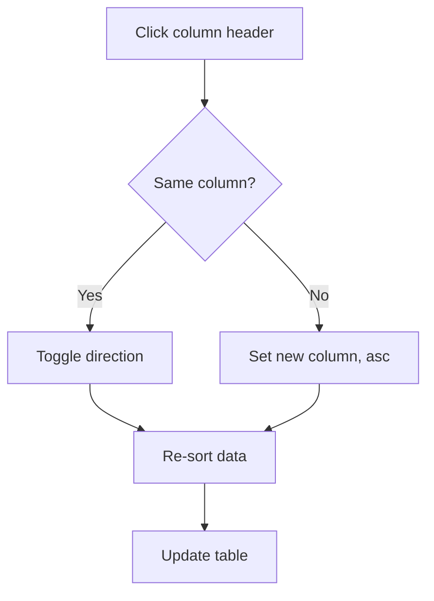

# Flow Diagrams: Delivery Points

## Module Information
- **Module**: System Administration
- **Sub-Module**: Delivery Points
- **Route**: `/system-administration/delivery-points`
- **Version**: 1.0.0
- **Last Updated**: 2026-01-17

---

## Page Load Flow

---

## Search and Filter Flow

---

## Create Flow

---

## Edit Flow

---

## Delete Flow

---

## Sort Flow

---

**Document End**
