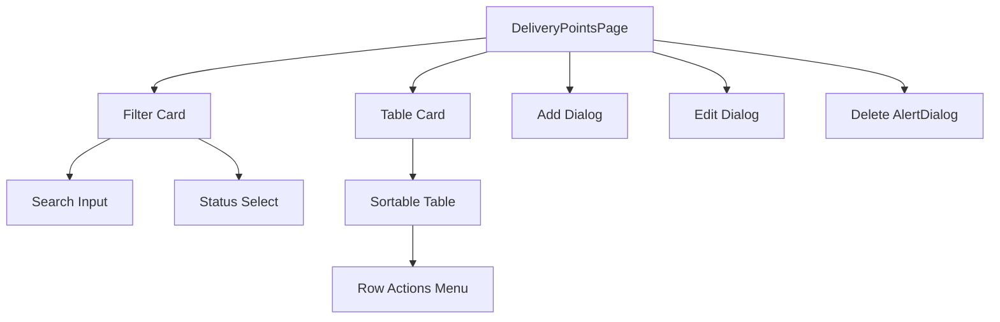

# Technical Specification: Delivery Points

## Module Information
- **Module**: System Administration
- **Sub-Module**: Delivery Points
- **Route**: `/system-administration/delivery-points`
- **Version**: 1.0.0
- **Last Updated**: 2026-01-17

---

## Architecture



---

## Technology Stack

| Layer | Technology |
|-------|------------|
| Framework | Next.js 14 |
| UI | shadcn/ui |
| Icons | Lucide React |
| Styling | Tailwind CSS |

---

## File Structure

```
app/(main)/system-administration/delivery-points/
└── page.tsx    # DeliveryPointsPage (509 lines)

lib/types/
└── location-management.ts    # DeliveryPoint interface

lib/mock-data/
└── inventory-locations.ts    # getAllDeliveryPoints()
```

---

## Component Overview

### DeliveryPointsPage
- **Type**: Client Component ('use client')
- **State**: Search, filter, sort, dialog visibility, form data
- **Data**: Mock data via useMemo

### UI Components Used
| Component | Source | Purpose |
|-----------|--------|---------|
| Card | shadcn/ui | Container for filters and table |
| Table | shadcn/ui | Delivery points list |
| Dialog | shadcn/ui | Add/Edit forms |
| AlertDialog | shadcn/ui | Delete confirmation |
| Input | shadcn/ui | Name field, search |
| Select | shadcn/ui | Status filter |
| Switch | shadcn/ui | Active toggle |
| Badge | shadcn/ui | Status display |
| Button | shadcn/ui | Actions |
| DropdownMenu | shadcn/ui | Row actions |

---

## Event Handlers

| Handler | Trigger | Action |
|---------|---------|--------|
| handleSort | Column header click | Toggle sort field/direction |
| handleOpenAddDialog | Add button click | Reset form, open dialog |
| handleOpenEditDialog | Edit menu click | Populate form, open dialog |
| handleAddDeliveryPoint | Form submit | Log data, close dialog |
| handleEditDeliveryPoint | Form submit | Log data, close dialog |
| handleDeleteDeliveryPoint | Confirm delete | Log deletion, close dialog |

---

## Dependencies

| Dependency | Purpose |
|------------|---------|
| Location Management | Locations reference delivery points |

---

## Future Enhancements

| Feature | Description |
|---------|-------------|
| API Integration | Replace console.log with server actions |
| Reference Check | Prevent delete if used by locations |
| Audit Trail | Display created/updated info |

---

**Document End**
