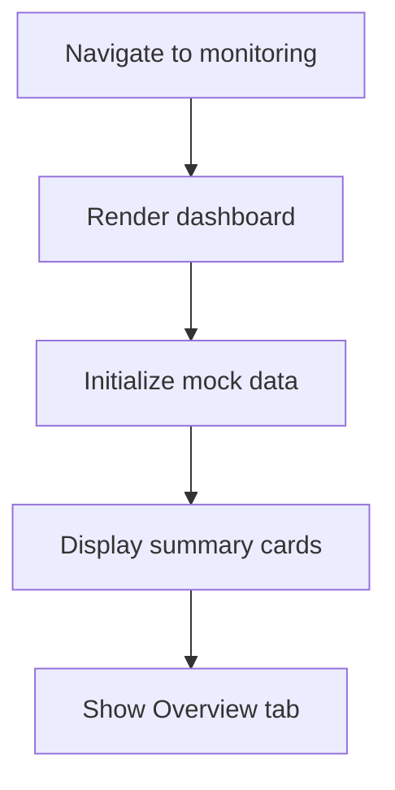
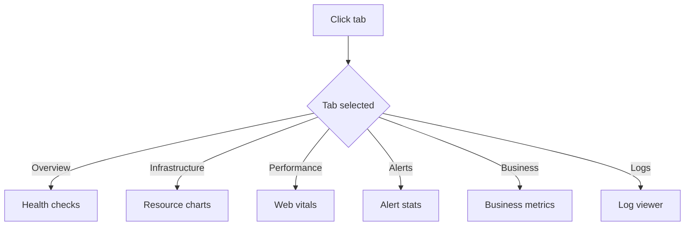
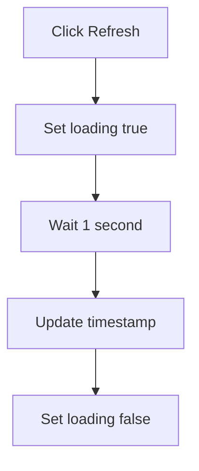
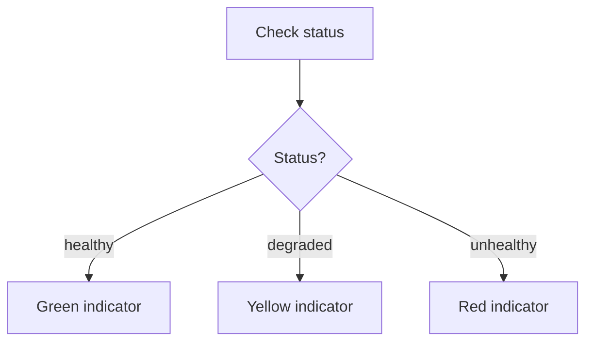

# Flow Diagrams: System Monitoring

## Module Information
- **Module**: System Administration
- **Sub-Module**: System Monitoring
- **Route**: `/system-administration/monitoring`
- **Version**: 1.0.0
- **Last Updated**: 2026-01-17

---

## Page Load Flow

---

## Tab Navigation

---

## Refresh Flow

---

## Health Status Flow

---

**Document End**
